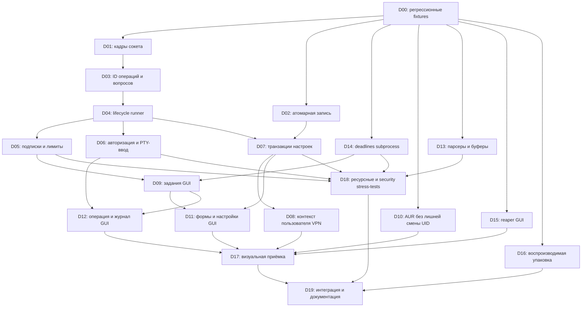

# Аудит upd 0.2.7 и DAG исправлений для Luna 6

Дата: 2026-09-29. База: `31d3b7c95a4ca76b1e2f2e1685ecb93dd1d3b8ae`.

> Historical baseline. Текущее выполнение и решение о снятии обязательной VM-приёмки:
> [PROGRESS](AUDIT-LUNA6-PROGRESS.md), [F01–F20](AUDIT-LUNA6-FINDINGS.md).
> probe.rs относится к API/protocol исходной базы, не к текущей версии.

Это план реализации, а не отчёт о выполненных исправлениях. В рамках аудита код приложения не изменялся. Добавлены этот документ и отдельная диагностическая программа [probe.rs](audit-2026-09-29/probe.rs).

Главный вывод: наиболее срочные проблемы находятся на границе **COSMIC → root-helper → PTY** и в конкурентной записи настроек. Наличие Rust и проходящих unit-тестов не защищает от удержания потоков/дескрипторов, неограниченных очередей, потери событий и гонок авторизации. Сначала исправить этот фундамент, затем поведение GUI и его внешний вид.

## 1. Объём и достоверность

Просмотрены основные пути CLI/TUI, общий запуск процессов и сохранение файлов, backend пакетных менеджеров, зеркала, VPN, helper, COSMIC, сборка и упаковка. Более подробно проверены новый helper и GUI. Архив `docs/BUGLIST.md` описывает закрытые B01–B25: эти записи не переписаны здесь как новые открытые дефекты.

Обозначения:

- **R** — воспроизведено диагностической программой на текущем коде.
- **S** — установлено чтением конкретного пути исполнения; полный пользовательский сценарий не запускался.
- **H** — условный риск, для которого нужен отдельный эксперимент; не считать доказанной эксплуатацией.
- **P1** — безопасность/доступность, повреждение данных или сломанный основной сценарий; **P2** — ограниченная деградация, UX, сопровождаемость. Доказанного P0/RCE этот аудит не установил.

Ссылки ниже указывают файл и исходные номера строк. После изменений искать также по имени функции, а не полагаться на номера строк.

Не проводились: обновление реальной системы, установка/удаление пакетов, изменение системных зеркал, запуск реального VPN, нагрузочная атака на установленную root-службу, полный анализ всех сторонних зависимостей по актуальной базе CVE. Нельзя трактовать аудит как доказательство отсутствия других уязвимостей или измерение всех утечек heap.

## 2. Результаты проверок

### Штатные тесты

- `cargo test --locked --offline`, корень проекта: **109 library + 31 CLI/TUI = 140 успешных тестов** при разрешённых Unix-сокетах/PTY.
- Первый запуск в ограниченной песочнице: 107 library-тестов успешны, два socket-теста вернули `Operation not permitted`. После разрешения локального IPC оба прошли; это не дефекты приложения.
- COSMIC нужно тестировать из `cosmic/` либо с явным `--target x86_64-unknown-linux-gnu`. Запуск из корня только с `--manifest-path cosmic/Cargo.toml` наследует корневой musl target и не читает вложенный `.cargo/config.toml`; такой первоначальный запуск остановился на cross-compilation `pkg-config`. Это ошибка команды проверки, не доказательство поломки `build.sh`.
- Из `cosmic/`: `cargo test --locked --offline` — **2/2 успешно** (один из них `snapshots` без заданного каталога является no-op).
- Отдельно из `cosmic/`: `UPD_SNAPSHOTS=/tmp/upd-audit-screenshots cargo test --locked --offline snapshots -- --nocapture` — успешно, создано **13 PNG**. Визуально просмотрены popup RU/AR, окно VPN, настройки и экран операции. Это headless fixture-рендер, не интерактивная проверка под Wayland; подробности в §7.

### Изолированные воспроизведения

`probe.rs` использует публичные API текущего `upd`, mock Unix-сокет, отдельный helper с запросами только `Attach` и уникальный временный каталог. Он не вызывает пакетный менеджер и VPN. Получено:

```text
framing: expected 2 events, received 0
term: partial bytes after 2 MiB without newline = 2097152
utf8: expected replacement + hello as a complete line, got [], partial "�"
atomic: 3 errors, 5 files with missing/wrong content out of 16
closed attaches: before (1, 4), after (21, 24) (threads, fds); attach errors 0
```

Число ошибок конкурентной записи зависит от планировщика. Сам факт нескольких потоков, использующих один временный путь, от планировщика не зависит. Замеры потоков/FD относятся к изолированному helper, не ко всей машине. 2 MiB — демонстрация отсутствия лимита строки, не общий замер RSS.

Повторить на Linux после сборки библиотеки; выбрать именно свежий `libupd-*.rlib`, если в `target` лежит несколько вариантов:

```bash
cargo build --lib --locked --offline
rg --files target/x86_64-unknown-linux-musl/debug/deps -g 'libupd-*.rlib'
rustc --edition=2024 --target x86_64-unknown-linux-musl \
  docs/audit-2026-09-29/probe.rs \
  --extern upd=target/x86_64-unknown-linux-musl/debug/deps/libupd-67ca83cb7e3351ca.rlib \
  -L dependency=target/x86_64-unknown-linux-musl/debug/deps \
  -L dependency=target/debug/deps -o /tmp/upd-audit-probe
/tmp/upd-audit-probe
```

Хэш rlib выше относится к проверенной сборке, на другой машине его нужно заменить. Для запуска нужны локальные Unix-сокеты. Проба специально печатает фактическое поведение, а не является набором утверждений об уже исправленном приложении. В D00/D19 превратить сценарии в регрессионные тесты с `assert` и конечными таймаутами.

## 3. Реестр открытых проблем

### F01 · P1 · R — потеря событий сразу после подключения

**Где:** `src/helper.rs:839–879`, `connect`, `attach_events`.

`connect` создаёт временный `BufReader<&UnixStream>`, читает одну JSON-строку и уничтожает reader. Если одновременно пришли `Reply`, `Reset`, `Prompt` или `Exit`, reader уже забрал следующие строки в свой буфер. Новый reader в `attach_events` их не увидит. Проба отправила reply + два события одним write: получено ноль событий.

**Последствие:** пустой журнал, пропущенный вопрос, неправильное состояние кнопок, бесконечное «выполняется» после завершения. Штатный end-to-end тест этого не гарантирует: исход зависит от упаковки байтов в чтения.

**Исправление:** единственный reader на весь срок соединения; явные ошибки кадрирования и лимиты строк. **Узел: D01.**

### F02 · P1 · R/S — закрытый клиент не освобождает helper

**Где:** `src/helper.rs:721–764` (`attach`), `785–830` (`serve`); `cosmic/src/op.rs:81–103` (`events`).

Helper ждёт `rx.recv()`, не наблюдая закрытие клиентского сокета, пока нет новых событий. Sender хранится в `State.subs`, поэтому канал сам не закроется. Поток и FD остаются, `clients > 0` мешает idle-exit. Двадцать подключений с немедленным закрытием дали +20 потоков и +20 FD.

В GUI есть симметричный путь: отмена async-stream не будит OS-thread, заблокированный в чтении сокета. Это установлено статически, отдельно не измерено.

**Исправление:** явный lifecycle подписки, обнаружение disconnect без нового вывода, отменяемое чтение клиента и RAII для счётчиков. **Узлы: D04, D05.**

### F03 · P1 · R/S — память и подключения не ограничены

**Где:** `src/helper.rs:140–204`, `348–350`, `721–755`, `814–829`; `cosmic/src/op.rs:81–100`.

`MAX_LINES` ограничивает количество строк, но не `Term.partial` и байты журнала. `mpsc::channel()` на сервере и `unbounded_channel()` в GUI допускают накопление событий; каждое `Partial` копирует всё содержимое незавершённой строки. На каждое соединение создаётся поток до авторизации, глобальной/UID-квоты нет.

**Последствия:** рост памяти при длинном/быстром выводе или медленном клиенте; локальное истощение root-helper через множество соединений. Открытый `0666` сокет сам по себе допустим для polkit, но требует ограничений до polkit. Массовая атака не запускалась. Проба подтверждает строку в 2 MiB без ограничения.

**Исправление:** лимиты в байтах, bounded queues, coalescing `Partial`, квоты соединений и срок получения полного запроса. Нельзя просто блокировать `send` под общим mutex. **Узел: D05.**

### F04 · P1 · S/H — ответ/отмена не привязаны к операции и вопросу

**Где:** `src/helper.rs:62–80`, `623–674`; `cosmic/src/window.rs:445–457`.

`Input` и `Cancel` не содержат `operation_id`; `Input` не содержит `prompt_id`. Проверка права владельца берёт mutex, отпускает его, а применение запроса позднее повторно выбирает текущую `st.op`. Между ними операция может смениться. Проверка наличия ожидающего вопроса отсутствует: достаточно активного процесса и `input`.

**Последствие:** задержанный ответ либо повторный клик может попасть в следующую операцию/следующий вопрос. Межпользовательская гонка потенциально позволяет применить разрешение владельца предыдущей операции к чужой новой; exploit не воспроизводился и не объявляется доказанным повышением привилегий.

**Исправление:** идентификаторы операции/вопроса, повторная проверка конкретной операции и владельца под той же блокировкой, одноразовый ответ. **Узлы: D03, D06.**

### F05 · P1 · S — старые reader-потоки и ошибки запуска ломают состояние операции

**Где:** `src/helper.rs:500–592`, `start_command`, `start_inproc`.

Reader обращается к общей «текущей» операции без поколения. `helper-wait` после `wait()` спит 300 ms, ставит `done` и вызывает `finish`, но не дожидается reader. Reader проверяет `done` только при таймауте `poll`; если потомок постоянно пишет, он продолжит работу. После начала следующей операции старый вывод может попасть в новый журнал.

Кроме того, результат создания `helper-read`/`helper-wait` игнорируется; ошибка `master.try_clone()` после `begin` не завершает состояние; ошибка spawn в `start_inproc` оставляет `running`. Между reaping child и `finish` хранится старый PGID; безопасность сигнала при повторном использовании ID требует отдельной проверки.

**Исправление:** runner с явным владением child/readers, rollback запуска, идентификатор во всех callback, гарантированное завершение reader перед заменой операции, безопасная сигнализация. **Узлы: D03, D04.**

### F06 · P1 · S — ввод в PTY может заблокировать весь helper

**Где:** `src/helper.rs:647–659`, `Request::Input`.

Блокирующий `write_all` выполняется под глобальным `Mutex<State>`. Если процесс не читает stdin, PTY заполнен или эхо заблокировано, остановятся и status, и cancel, и reader, которому нужен тот же mutex. Размер JSON-запроса до 64 KiB сам по себе не гарантирует неблокирующую запись.

**Исправление:** ограниченный ввод передаётся владельцу конкретного PTY через bounded queue; запись с deadline вне state mutex; отмена остаётся доступной. Нельзя просто клонировать FD и потерять связь с operation_id. **Узел: D06.**

### F07 · P1 · R — `atomic_write` использует общий временный файл

**Где:** `src/common.rs:489–500`; потребители `Config::save`, `save_json`, VPN.

Имя `.upd.<pid>.tmp` одинаково для всех файлов одного каталога внутри процесса. Многопоточный helper делает этот сценарий реальным. Конкурирующие записи обрезают и переименовывают один файл, могут возвращать ошибки и смешивать содержимое даже разных целевых файлов. Проба: 5 из 16 файлов отсутствовали/имели неверное содержимое.

Дополнительно `File::create` не обеспечивает exclusive create, следует по symlink, а права назначаются после записи. Произвольная запись root через этот путь не доказана: стандартные системные каталоги не доступны обычному пользователю для записи. Тем не менее примитив должен создавать уникальный файл с нужными правами сразу и синхронизировать родительский каталог после rename.

**Узел: D02.** Уникальные temp-файлы не решают отдельную гонку read-modify-write из F08.

### F08 · P1 · S — настройки не сериализованы и сохраняются до проверки применимости

**Где:** `src/helper.rs:598–620`, `ConfigSet`/`VpnAdd` в `handle`; `src/common.rs:283–299`; `src/main.rs:226` и места CLI/TUI сохранения конфигурации.

`apply_setting` читает конфиг, меняет поле и сохраняет весь файл без блокировки read-modify-write. Параллельные запросы теряют изменения друг друга. Это отдельная ошибка даже после исправления F07. `ConfigSet` не проходит через запрет второй активной операции и может перезапустить VPN параллельно другой работе; `start_inproc` блокирует только операции helper, но не внешние CLI/таймеры.

Сначала вызывается `c.save()`, затем `write_config`/`apply`. Например, `vpn_port=1053` сохраняется, хотя далее `check_port` отвергнет конфликт со своим DNS. При отсутствии подписки изменение VPN-настройки тоже может сохраниться и закончиться ошибкой применения. Ответ API не различает «не сохранено» и «сохранено, не применено».

**Исправление:** межпроцессная дисциплина блокировок, валидация до commit, явный результат persistence/runtime, согласованность CLI/TUI/helper. **Узел: D07.**

### F09 · P1 · S — повторные фоновые запросы и устаревшие ответы в COSMIC

**Где:** `cosmic/src/window.rs:353–376`, `475–524`, `671–695`; `cosmic/src/applet.rs:156–172`.

Каждый tick может запускать новый `load_op`/`load_vpn` до окончания предыдущего; AUR-поиск, проверка AUR и refresh также не имеют single-flight. `AurResults` не несёт запрос/поколение: медленный ответ на A способен заменить более свежий ответ B. Аналогично устаревший VPN snapshot перезаписывает новый.

`spawn_blocking` не даёт автоматической отмены уже выполняющейся блокирующей функции. Helper-клиент допускает ожидание до 300 секунд; за это время tick породит много запросов. Просто добавить timeout к ожиданию future недостаточно.

**Исправление:** состояние задания отдельно на каждый тип, максимум одна текущая и одна отложенная работа, generation/request ID, реальные deadlines транспорта/подпроцессов. **Узлы: D09, D14.**

### F10 · P1/P2 · S — часть тяжёлой работы выполняется вне blocking worker

**Где:** `cosmic/src/window.rs:214–218`, `313`, `364`, `389`, `673–677`.

Вызовы `blocking(|| (), |_| load_summary())` и аналогичный `load_mirrors()` выносят в `spawn_blocking` пустую функцию, а реальную работу выполняют в callback на async executor. В `reload_page(Page::Vpn)` есть прямой `model::load_summary()` на пути обработки UI. Сводка вызывает systemctl/обход конфигов через backend, поэтому это не только дешёвое чтение поля.

**Исправление:** `blocking(load_summary, |m| m)` и аналогичные формы; из update/view убрать тяжёлое I/O, stale-проверки объединить с D09. Не утверждать, что каждый async callback обязательно является главным UI-потоком; доказанный факт — неверная граница blocking и прямой синхронный вызов. **Узел: D09.**

### F11 · P1 · S — кнопка проверки AUR запускает `runuser` от обычного пользователя

**Где:** `cosmic/src/window.rs:480–488`; `src/extras.rs:197–210`.

GUI работает без root, но `aur_updates(current_user)` всегда строит `runuser -u USER -- paru/yay -Qua`, если `runuser` есть. `runuser` разрешён только root. На этой машине безопасная команда `runuser -u somovas -- true` возвращает `may not be used by non-root users`. Полный AUR-сценарий с установленным paru не запускался; ошибка пути следует из кода. Fallback на sudo тоже не нужен для проверки своего AUR и с `stdin=null` способен завершиться ошибкой пароля.

**Исправление:** для текущего непривилегированного UID запускать helper AUR напрямую; смена UID только для root, сохранять запрет сборки AUR от root. **Узел: D10.**

### F12 · P2 · S — GUI показывает несохранённые значения и теряет форму

**Где:** `cosmic/src/window.rs:461–468`, `528–541`, `558–569`, `1235–1283`.

`Message::Set` оптимистически меняет локальный Config. После отказа polkit `Done(Err)` устанавливает error, но не перечитывает и не откатывает config; комментарий обещает поведение, которого нет. Числовые controls и язык остаются активными при `pending`, в отличие от части toggles. Общий `pending` сбрасывается и несвязанными `Done`/`Mirrors`.

`AddSub` очищает URL/название до успешного `Started`: отмена авторизации или busy лишает пользователя введённых данных. Диапазоны `number_range` продублированы и расходятся с `Config::set_number` (например, часы, количество зеркал, место).

**Исправление:** отдельное состояние mutation, committed/draft значения, откат и reconciliation, сохранение формы при отказе запуска, единые метаданные ограничений. Секретный URL хранить только в памяти формы, не в журнале/истории. **Узел: D11.**

### F13 · P2 · S — журнал невозможно спокойно читать; статусы операции вводят в заблуждение

**Где:** `cosmic/src/window.rs:380–390`, `721–821`; `cosmic/src/op.rs:10–77`.

На каждое событие вызывается `snap_to_end`: пользователь прокручивает журнал вверх, следующий progress возвращает его вниз. Хранится до 5000 строк, отображаются только последние 400 без явной границы. `Vec::drain` при каждом переполнении сдвигает накопленный журнал. `progress()` возвращает 100% и для ошибки. До `Reset` уже открыт экран операции, но при пустом command он пишет «Операций пока не было». Prompt-кнопки не блокируются после отправки, cancellation помечается отправленной до результата API.

**Исправление:** follow-tail только когда пользователь у конца, явная кнопка возврата, честное описание ограниченного журнала, состояния Starting/Authorizing/Running/Waiting/Failed/Disconnected, отдельный pending ответа. **Узел: D12.**

### F14 · P1/P2 · R — парсер вывода задерживает/теряет хвост после плохого UTF-8

**Где:** `src/helper.rs:151–160`, `Term::feed`.

Обрабатывается только валидный префикс плюс одна ошибочная последовательность; остальной уже полученный буфер остаётся до следующего `feed`. Для `b"\xffhello\n"` без следующего чанка строка `hello` не появляется вообще. При непрерывных ошибочных байтах накопление остатка тоже может расти. Вопрос в хвосте не будет распознан.

**Исправление:** разбирать весь доступный буфер за вызов, сохранять только неполную завершающую UTF-8 последовательность; явный flush при EOF. **Узел: D13.**

### F15 · P2 · S — два обхода ограничений памяти в TUI

**Где:** `src/tui/process.rs:438–446`.

Обычные символы ограничены 16 KiB, но `\t` добавляет четыре пробела без проверки лимита. `stages.push` на каждую распознанную строку не ограничен, хотя `lines` и `raw` ограничены. Длинный поток табуляций или повторяющихся `[1/6] ...` продолжает накапливать память.

**Исправление:** единая проверка байтов для всех append, фиксированное/ограниченное представление этапов. **Узел: D13.**

### F16 · P2 · S — дочерние GUI-процессы запускаются без reaping

**Где:** `cosmic/src/model.rs:101–146`, `open_window`, `open_terminal`, `open_url`.

Возвращённый `Child` сразу выбрасывается без `wait`/`try_wait`. Для долгоживущего апплета короткие запуски `xdg-open` и secondary instance окна могут оставлять zombie-процессы. Особенности SIGCHLD целого приложения динамически не исследовались, поэтому фактическое число zombies не заявляется. Ошибки открытия URL/окна также скрыты.

**Исправление:** общий reaper с ограниченными ресурсами, результат запуска в UI, проверка на много коротких дочерних процессов. Не делать блокирующий `wait()` в update. **Узел: D15.**

### F17 · P1/P2 · S — inline VPN-настройки теряют пользователя

**Где:** `src/helper.rs:500–509`, `598–620`, ветки `ConfigSet`/`VpnAdd`; `src/vpn.rs:1787–1790` (`sysproxy`); `src/common.rs:676` (`invoking_user`).

`Start` передаёт дочерней команде `SUDO_USER`/`SUDO_UID` из peer. Inline `ConfigSet`/`VpnAdd` исполняются в системном daemon без этого контекста. `vpn::apply` вызывает `sysproxy`, который при отсутствии invoking user просто возвращает управление. Переключение TUN/порта через GUI способно обновить ядро, но оставить пользовательский proxy прежним.

**Исправление:** явно передавать доверенный user context из SO_PEERCRED. Не менять глобальные env vars внутри многопоточного root-helper. **Узел: D08.**

### F18 · P2 · S — упаковка может использовать старый GUI-бинарник

**Где:** `build.sh:10–14`, `package.sh:39–42`.

Сначала собрать GUI, затем запустить `UPD_NO_GUI=1 ./package.sh` либо собирать без GUI-библиотек: `build.sh` пропустит GUI, но старый `dist/upd-cosmic-linux-amd64` останется; `package.sh` проверяет только существование и упакует его с текущим VERSION. Логи сборки целиком скрыты перенаправлением в `/dev/null`.

**Исправление:** manifest результатов именно текущей сборки или уникальный staging, явная выбранная архитектура, `--locked`, видимый лог при ошибке. Не удалять произвольно все пользовательские `dist/`. **Узел: D16.**

### F19 · P1/P2 · S — у фонового capture нет deadline и управляемой группы

**Где:** `src/common.rs:566–595`, `capture`.

Лимит stdout есть, временного лимита нет. `read_to_end`, `child.wait()` и `stderr_reader.join()` могут ждать бесконечно. Убийство лидера при overflow не гарантирует закрытия stdout/stderr у потомков. Это удерживает worker даже после потери интереса со стороны GUI и усиливает F09. Возможность потомка удержать pipe следует из владения FD; полный процессный сценарий надо закрепить fixture-тестом.

**Исправление:** deadlines и cancellation для фоновых read-only probes, корректный drain/reap дерева процессов. Не навешивать короткий общий timeout на установку пакетов, сборку AUR и операции, ожидающие пользователя. **Узел: D14.**

### F20 · P2 · R/S — нижние действия popup обрезаются при ограниченной высоте

**Где:** `cosmic/src/applet.rs:349–499`, `popup_view`; `cosmic/src/snapshots.rs`, fixture 360×820.

На штатном [русском снимке](audit-2026-09-29/popup-ru-dark.png) при открытых серверах, новости и предупреждениях не видны нижние «Открыть upd…» и «Настройки…». На [арабском](audit-2026-09-29/popup-ar-dark.png) видна первая из этих строк, последняя обрезана. `popup_view` возвращает Column без Scrollable. Используемый `popup_container` libcosmic ограничивает высоту 1000 px, но сам прокрутку не добавляет.

**Граница вывода:** fixture рисует content напрямую и задаёт высоту 820 px; реальное popup может автоувеличиться на большом экране. Не утверждается, что нижние кнопки исчезают на любом дисплее. Подтверждено отсутствие адаптации содержимого к заданной меньшей высоте; сценарий низкого экрана/масштаба/длинного текста требует compositor-проверки.

**Исправление:** ограниченная доступной рабочей областью scrollable-середина и доступные нижние действия; длинные новости/ошибки не должны вытеснять навигацию без возможности прокрутить. **Узел: D17.**

## 4. DAG работ

Узел = ограниченная задача для одной сессии Luna 6. Сначала завершить все `depends_on`; затем выполнять узел. Ветки логически независимы, но это **не инструкция запускать агентов параллельно**: многие задачи редактируют один `src/helper.rs` или `window.rs`. Для одного исполнителя допустим приведённый ниже топологический порядок.



Топологический порядок для последовательной работы: **D00 → D01 → D02 → D03 → D04 → D05 → D06 → D07 → D08 → D14 → D09 → D10 → D11 → D12 → D13 → D15 → D16 → D17 → D18 → D19**.

Машиночитаемый список непосредственных зависимостей; он является источником истины для запуска узлов:

```yaml
D00: []
D01: [D00]
D02: [D00]
D03: [D01]
D04: [D03]
D05: [D04]
D06: [D04]
D07: [D02, D04]
D08: [D07]
D09: [D05, D14]
D10: [D00]
D11: [D07, D09]
D12: [D06, D09]
D13: [D00]
D14: [D00]
D15: [D00]
D16: [D00]
D17: [D08, D10, D11, D12, D15]
D18: [D05, D06, D07, D13, D14]
D19: [D16, D17, D18]
```

## 5. Карточки задач Luna 6

### D00 — зафиксировать базу и создать безопасные fixtures

**Зависимости:** нет. **Файлы:** tests рядом с `helper`, `common`, `tui/process`; новые `tests/support` при необходимости. **Закрывает:** основа для проверки всех F.

1. Сверить HEAD и рабочее дерево. Прочитать этот план и существующие contract fixtures; использовать общую изоляцию env, а не второй независимый mutex.
2. Создать mock helper transport, fake child program, внедряемые clock/authorizer/thread spawner там, где они нужны для детерминированного воспроизведения гонок.
3. Перенести пять сценариев `probe.rs` в регрессионные fixtures с конечным временем ожидания. Старый код должен демонстрировать дефект; итоговый исправленный код — удовлетворять контракту.
4. Защитить временные env/каталоги RAII даже при panic, дочерние helper-процессы завершать и пожинать. Ни один тест не должен обращаться к установленному helper или запускать реальное обновление.

**Готово:** штатные тесты повторены, есть воспроизводимый сценарий каждой из пяти R-находок, определены границы будущих тестов. Не коммитить бесконечно зависающие либо скрыто игнорируемые регрессии; fixture и активный regression assert можно включать вместе с соответствующим исправлением.

### D01 — исправить framing клиента helper

**Зависимости:** D00. **Файлы:** `src/helper.rs::connect/call/attach_events`. **F01.**

1. Соединение владеет одним `BufReader<UnixStream>`; после чтения reply передать его в iterator, не выбрасывая read-ahead bytes.
2. Сделать запись запросов fallible; не игнорировать ошибку `send` там, где от неё зависит результат.
3. Ввести byte limit для reply/event frame и понятный transport/protocol error. Не скрывать malformed event через `filter_map` как будто его не было.
4. Сохранить корректную обработку timeout/EOF и диагностический текст без URL подписки.

**Проверки:** reply + 2 события одним write; побайтовая фрагментация; границы ровно лимит/лимит+1; EOF посреди JSON; malformed JSON. **Готово:** 2 из 2 событий доставляются в исходном порядке; нет бесконечного ожидания при повреждённом кадре.

### D02 — безопасный конкурентный atomic write

**Зависимости:** D00. **Файлы:** `src/common.rs::atomic_write`, потребители; сравнить специализированный writer в `backend.rs`. **F07.**

1. Создавать уникальный temp в том же каталоге через `create_new(true)`, назначать mode при создании; обработать коллизию без перезаписи чужого файла.
2. Записать, `sync_all` файла, rename, синхронизировать каталог; cleanup temp через guard на каждом выходе.
3. Явно определить поведение при symlink назначения и сохранение ownership/mode для каждого существующего потребителя. Не разрушить более строгие гарантии APT writer.
4. Сохранить старый целевой файл при отказе до rename; после rename не обещать rollback при ошибке fsync каталога, возвращать точную стадию ошибки.

**Проверки:** 16 writers в разные файлы одного каталога; writers в один файл дают одну целую версию, не смесь; temp-symlink fixture; права 0600; ошибки записи/rename; нет оставшихся temp. **Готово:** ни один reader не видит смешанные байты.

### D03 — идентифицировать операции, события и вопросы

**Зависимости:** D01. **Файлы:** protocol/Op в `helper.rs`, `summary::OpStatus`, `cosmic/src/op.rs`, handlers окна. **F04/F05.**

1. Ввести `OperationId`, уникальный также после перезапуска helper (например, boot-instance nonce + counter), и `PromptId` внутри операции.
2. Включить ID в start reply/status/events/input/cancel; привязать все async результаты к операции. Ввести protocol version и явный отказ несовместимости старого GUI/нового helper.
3. Не принимать старые mutation-запросы без ID «для совместимости». Read-only совместимость допустима только с явно определённым контрактом.
4. GUI хранит operation_id отдельно от поколения подписки; повторный attach к той же операции не должен случайно терять набираемый ответ/позицию чтения.

**Проверки:** два запуска одной команды в одну секунду имеют разные ID; старый ответ после нового запуска отклонён; события старого ID не меняют текущий журнал; несовместимые версии дают понятную ошибку. **Готово:** callback больше не ссылается неявно на «текущую операцию».

### D04 — управляемый lifecycle child/reader/операции

**Зависимости:** D03. **Файлы:** `helper.rs::start_command/start_inproc/begin/finish`, internal runner. **F02/F05.**

1. Описать состояния Starting → Running/Waiting → Draining → Finished; ошибка любой стадии завершается ровно одним терминальным событием.
2. Владелец runner хранит child, reader join handle и cancellation/wakeup. Убрать sleep(300 ms) как способ синхронизации.
3. Останавливать чтение по отмене даже при непрерывном выводе потомка; не ждать EOF бесконечно. Перед release операции завершить controlled drain и readers.
4. При ошибке clone/spawn восстановить состояние и прибрать child/FD. Для inline-операции иметь корректное завершение при spawn failure; cancellation отражать как поддерживаемую/неподдерживаемую явно.
5. Сигнализировать только подтверждённой группе конкретной операции; убрать окно stale PGID после reaping. Не обещать, что pidfd лидера автоматически решает сигнализацию всей группы.

**Проверки:** лидер вышел, потомок держит PTY; потомок постоянно пишет; отказ запуска каждого worker; ошибка clone через injection; быстрая смена операций; late callback. **Готово:** нет старого вывода в новой операции, нет вечного Running после неудачного запуска, каждый child пожат.

### D05 — lifecycle подписок и конечные ресурсные бюджеты

**Зависимости:** D04. **Файлы:** `helper.rs::serve/attach/broadcast/Term`, `cosmic/src/op.rs::events`. **F02/F03.**

1. Helper обнаруживает disconnect без появления следующего события. Счётчики клиентов и registry подписчиков освобождаются guard-ом, включая отказ spawn и panic-path.
2. Клиентский stream имеет drop/cancel guard, будящий блокирующее чтение (`shutdown`/poll wakeup либо async socket); завершение stream освобождает reader.
3. Ограничить подключения до создания worker, отдельно на UID и глобально; абсолютный deadline на полный request, а не только timeout каждого read. Добавить write timeout до первой reply-записи.
4. Bounded queue на обеих сторонах. `Partial` допустимо заменять последним значением; `Reset/Prompt/Exit` нельзя молча терять. При переполнении закрывать/ресинхронизировать подписку с явным gap, а не блокировать producer под state mutex.
5. Предлагаемые стартовые бюджеты: 32 connections глобально/8 на UID; 256 events и отдельный byte budget на subscriber; 16 KiB на строку; 4 MiB на replay; frame budget согласовать с максимально допустимым snapshot. Числа утвердить тестом реального большого списка, а не копировать слепо.

**Проверки:** 100 циклов connect/drop без операций возвращают FD/threads к baseline; slowloris и slow reader ограничены; fast producer + slow GUI не наращивают очередь; helper idle-exit после последнего клиента. **Готово:** все очереди, буферы, соединения имеют измеримый предел; закрытие окна не отменяет установку.

### D06 — безопасный ответ и отмена без глобального I/O lock

**Зависимости:** D04. **Файлы:** `helper.rs::handle`, runner input queue, GUI handlers. **F04/F06.**

1. Получить результат polkit для конкретного запроса, затем под state mutex повторно сверить operation_id/owner/prompt_id. Никогда не держать mutex во время polkit.
2. Ответ потребляет текущий prompt один раз; повторный клик получает typed stale/already-answered result. Чужая операция требует соответствующей авторизации и совпадающего ID.
3. Передать короткую валидированную строку runner-у; limit для пользовательского ответа отдельно от JSON request; не выполнять `write_all` под mutex. Поддержать deadline/ошибку записи без потери возможности отмены.
4. Cancel подтверждать только после принятия runner-ом; возвращать реальную ошибку `killpg`, состояние unsupported для inline-операции, если отмена пока невозможна.
5. Пароли/ответы не включать в отладочный лог запроса. Учесть эхо PTY и доступность replay другим разрешённым наблюдателям; тестовый секрет не должен попадать в application diagnostics.

**Проверки:** барьер между authorization и применением + смена owner; повтор ответа; stale prompt; ребёнок не читает stdin; status/cancel остаются отзывчивыми. **Готово:** запрос применим только к той операции/вопросу, для которых создан.

### D07 — транзакции конфигурации и дисциплина блокировок

**Зависимости:** D02, D04. **Файлы:** `Config`, `helper::apply_setting/start_inproc`, CLI/TUI места записи, `vpn::apply`. **F08.**

1. Зафиксировать таблицу ресурсов и lock order для конфигурации, общей операции и подписок. Провести по всем путям CLI/TUI/helper/таймеров. Не захватывать один flock повторно через вложенные функции.
2. Read-modify-write конфига выполняется под межпроцессной блокировкой и перечитывает последнюю версию после её получения. Локальный Mutex daemon недостаточен.
3. Проверять candidate config до сохранения: порт/DNS, допустимость ключа/значения, доступные prerequisites. Возможность настроить VPN до добавления подписки определить явно: настройка должна либо сохраниться как pending без ложной ошибки, либо быть отклонена до записи.
4. Для runtime apply зафиксировать контракт: rollback либо `saved_but_not_applied` с причиной и повтором. Ответ содержит реально сохранённую конфигурацию/revision и runtime status.
5. Runtime-changing ConfigSet/VpnAdd сериализовать с конфликтующими операциями; статус/отмена не должны ждать длительного file/network lock. Не держать глобальный state mutex во время системных команд.

**Проверки:** два разных поля из двух клиентов/процессов сохраняются оба; VPN port 1053 не оставляет неожиданный broken config; ошибка apply соответствует ответу и диску; конкурентные CLI/helper действия не смешивают YAML. **Готово:** user-visible error однозначно говорит, что сохранено и что применено.

### D08 — явный пользователь для VPN sysproxy

**Зависимости:** D07. **Файлы:** `helper.rs`, `vpn::apply/sysproxy`, `common::invoking_user` callers. **F17.**

1. Ввести явный user context (UID, имя через NSS, runtime dir) из peer; одинаково передавать в subprocess и inline path.
2. `sysproxy` принимает контекст параметром, возвращает результат, а не молча пропускает настройку из daemon.
3. Сохранить поведение фонового auto без интерактивного пользователя; не выбирать произвольно первого вошедшего пользователя.
4. Ошибки пользовательского proxy отличать от успешного применения ядра; обеспечить сообщение для повторного применения.

**Проверки:** mock gsettings/runuser фиксирует один и тот же UID для CLI и ConfigSet; два peer UID не пересекаются; глобальная среда не меняется. **Готово:** порт/режим ядра и proxy пользователя согласованы или UI явно показывает частичный результат.

### D09 — single-flight задания и правильный blocking boundary GUI

**Зависимости:** D05, D14. **Файлы:** `cosmic/src/window.rs`, `applet.rs`, `model.rs`; взять идеи `src/tui.rs::Job`, не импортировать TUI в GUI. **F09/F10.**

1. Отдельное состояние `Idle/Loading/Ready/Error` для summary/op/VPN/AUR/news/maintenance; максимум одна работа и один последний отложенный запрос каждого типа.
2. Ответ несёт job generation и query/страницу, где это важно. Поздний результат A не заменяет B; закрытая страница не порождает ненужные повторные запросы.
3. Перенести I/O в фактическую `spawn_blocking` closure. Убрать прямой summary gather из `reload_page` и дорогое I/O из update/view.
4. Разделить connection timeout, короткие read-only deadlines и ожидание интерактивного polkit; retry с backoff, без перекрывающихся запросов. Error отображать явно, старые данные помечать устаревшими.
5. Учитывать, что отмена await не убивает blocking call: cancellation доходит до socket/process или single-flight держится до его завершения.

**Проверки:** искусственная задержка 30 секунд + 100 ticks/кликов не создаёт 100 workers; A медленнее B; ошибка не показывает прошлый результат как новый; heartbeat UI не блокируется. **Готово:** верхняя граница конкурентности доказана счётчиком fixture.

### D10 — исправить запуск read-only AUR для текущего UID

**Зависимости:** D00. **Файлы:** `src/extras.rs::as_user/aur_updates`, COSMIC AUR handler. **F11.**

1. Разделить запуск от текущего user и смену UID из root. Текущему непривилегированному пользователю разрешить прямой `paru/yay -Qua`.
2. Сохранить root→invoking user для установки и фоновых проверок; явно отклонить запрос чужого UID из non-root.
3. Не сломать код выхода 1 «нет обновлений» и диагностику helper-а; PATH/args тестировать подставными исполняемыми файлами.

**Проверки:** текущий UID — ни runuser, ни sudo не вызываются; root branch формирует смену UID; root AUR build не допускается. **Готово:** кнопка «Проверить AUR» работает без root/polkit на Arch с paru/yay; ручную проверку провести в VM.

### D11 — корректные формы и сохранение настроек

**Зависимости:** D07, D09. **Файлы:** COSMIC `window.rs`, общие setting metadata в `common.rs`, переводы. **F12.**

1. Разделить draft и committed значения; отдельный request ID на mutation; установить busy для всех controls этой mutation, включая spin/dropdown.
2. На отказ polkit восстановить committed значение; на saved-but-not-applied показать сохранённое значение и отдельную ошибку применения. Несвязанный `Mirrors` не сбрасывает mutation pending.
3. URL/название подписки очищать после принятия успешного запроса; на отказ запуска сохранять форму. Секрет не писать в prefs, logs или telemetry.
4. Вынести min/max/step/единицы в единый setting schema либо явно документировать более узкий GUI-range и корректно отображать существующие значения вне него.

**Проверки:** отказ/закрытие polkit; два быстрых изменения; ошибка apply; отказ AddSub из-за busy; загрузка config с большим допустимым числом. **Готово:** UI, файл и runtime различаются только в явно обозначенном pending/error состоянии.

### D12 — usable экран операции и журнал

**Зависимости:** D06, D09. **Файлы:** `cosmic/src/op.rs`, `window.rs::op_view/update`, переводы. **F13.**

1. Обновить state machine экрана: ожидается авторизация/запуск, running, prompt, ответ отправляется, cancel принят/отклонён, disconnected, завершение с кодом.
2. Автопрокрутка только при follow-tail; при ручном scroll показать «К новым строкам» и число/индикатор новых сообщений.
3. `VecDeque`/ring buffer и byte budget; показать, что ранняя часть удалена. Кнопку копирования назвать согласно реально доступному журналу, не обещать полный вывод при truncation.
4. Не показывать success-like 100% для ошибки; текст/значок результата обязательны. Повторные Yes/No/Submit заблокированы до результата; ошибку отправки можно исправить и повторить.
5. Full-screen интерактивность AUR/редакторов проверить отдельно: не притворяться, что line-based prompt GUI заменяет терминал. Если сценарий не поддержан, предложить заранее ясный запуск в терминале, не второй параллельный запуск пакетов.

**Проверки:** continuous output + ручной scroll; 5000+ строк; start waiting polkit; разрыв/reattach с prompt; двойной клик Yes; cancel failure; ошибочный exit. **Готово:** пользователь может прочитать историю и однозначно понять, что происходит.

### D13 — устойчивые терминальные парсеры и лимиты TUI

**Зависимости:** D00. **Файлы:** `helper.rs::Term`, `tui/process.rs`. **F14/F15.**

1. Исправить обработку UTF-8 циклом до последней полной последовательности; неполный хвост ≤3 байт, invalid byte заменяется без потери последующего текста; flush на EOF.
2. Применять byte limit ко всем символам, включая tab expansion; обрезать только по границе Unicode.
3. Хранить текущие/последние этапы в ограниченной структуре; повтор `[1/6]` обновляет состояние, а не бесконечный список.
4. Не объединять парсеры helper и TUI механически: у TUI есть alternate-screen/ANSI-поведение, которое нужно сохранить.

**Проверки:** invalid byte + валидный prompt в одном чанке; все границы UTF-8; EOF посреди символа; 1 MiB tabs; 100000 строк этапов; CR/ANSI/OSC regressions. **Готово:** хвост не теряется, структуры остаются в своих лимитах.

### D14 — bounded subprocess для фоновых probes

**Зависимости:** D00. **Файлы:** `common.rs::capture/out_limited`, read-only callers. **F19, поддержка F09.**

1. Добавить явную policy: deadline/cancellation/output budget и ownership процесса. Отделить read-only background от интерактивного installation runner.
2. Читать stdout/stderr без взаимной блокировки; корректно обрабатывать spawn stderr-reader failure.
3. При timeout/overflow завершать только собственную группу, пожинать child и освобождать readers, даже если потомок держит pipes. Не убивать группу самого GUI.
4. Возвращать typed timeout/overflow/cancelled вместо пустого списка или неопределённого кода.

**Проверки:** child спит; бесконечно пишет stderr; лидер вышел, потомок держит pipe; stdout overflow; отказ reader thread. **Готово:** read-only запрос имеет конечное время выполнения и после ошибки не оставляет background work.

### D15 — reaper и ошибки запуска внешних приложений

**Зависимости:** D00. **Файлы:** `cosmic/src/model.rs`, handlers окна/апплета. **F16.**

1. Общий launch API возвращает spawn-result и передаёт Child управляемому reaper; не создавать бесконечно по потоку на долгоживущее окно.
2. Отображать неудачу запуска окна/терминала/URL; выбирать fallback терминала только при обоснованном отказе запуска.
3. Для URL-раздела валидировать разрешённые web schemes до xdg-open, поскольку ссылки приходят из внешних данных; не считать такую валидацию доказательством найденной RCE.

**Проверки:** 100 коротких child-процессов пожаты, запуск долгого child не блокирует UI, несуществующий launcher даёт сообщение. **Готово:** управляемые subprocess не остаются zombies после exit.

### D16 — артефакты только текущей сборки

**Зависимости:** D00. **Файлы:** `build.sh`, `package.sh`, packaging metadata при необходимости. **F18.**

1. Передавать packaging явный manifest свежих артефактов/текущий staging; не выбирать GUI по существованию старого файла.
2. `UPD_NO_GUI=1` исключает GUI-пакет даже при старом бинарнике. Версия и архитектура берутся из результата сборки.
3. Добавить `--locked`; сохранять build log и показывать его при неуспехе. Не менять версии зависимостей без отдельного обоснования.

**Проверки:** stub cargo/pkg-config/nfpm и старый dist; GUI enabled/disabled/missing-libs; failure build; путь с пробелами. Реальная установка пакета для этих тестов не нужна. **Готово:** невозможно выпустить старый GUI под новой версией только из-за оставшегося файла.

### D17 — визуальная и интерактивная приёмка

**Зависимости:** D08, D10, D11, D12, D15. **Файлы:** `cosmic/src/snapshots.rs`, view/layout, `src/tui.rs` по выявленным дефектам. **F12/F13/F20.**

1. Генерировать screenshot fixtures для loading/error/empty/many-items, helper unavailable, denied polkit, длинных имён/URL/ошибок, старых данных, disconnected operation. Проверять реальный размер поверхности, не только высокие страницы 900×1500.
2. Матрица COSMIC: popup 320/360 px, окно 640×480 и 900×700, масштаб 100/200%, тёмная/светлая тема, RU/EN/AR; остальные локали — smoke на длинных переводах.
3. Проверить доступность footer/подтверждений при большом тексте, перенос, контраст, фокус и клавиатурный порядок; RTL для смешанных латинских серверов и арабского текста.
4. TUI: 80×24 и 60×18, resize при операции, Ctrl+C/возврат терминала, UTF-8 и раскрытые ошибки. Исправлять конкретный дефект из screenshot/сценария, не делать произвольный полный redesign.
5. Snapshot-тест обязан падать при отсутствии renderer/ошибке PNG-конвертера/пустом файле; сейчас отсутствие `UPD_SNAPSHOTS` делает его no-op, а не визуальным покрытием.

**Готово:** сохранены проверенные before/after снимки и список ручных проверок; кнопки основных действий доступны при минимальном размере; нет скрытых предупреждений и непрочитываемого журнала. Красивые screenshots не заменяют keyboard/IPC-тесты.

### D18 — ресурсные и security regression gates

**Зависимости:** D05, D06, D07, D13, D14. **Файлы:** integration tests/fixtures и минимальные runtime metrics для них. **F01–F09/F14/F15/F19.**

1. На mock helper: ≥100 attach/drop, slow reader, partial requests, burst output, повторный start/cancel, поток A→B с задержанными callbacks.
2. Считать `/proc/<pid>/task`, `/proc/<pid>/fd`, дочерние процессы и peak RSS; прогреть аллокатор перед сравнением. Для FD/threads нужен возврат к baseline в заданный deadline, для RSS — плато, а не требование вернуть каждый байт allocator cache ОС.
3. Auth-тесты: чужой UID, delayed authorization, stale operation/prompt, replay, burst connections до авторизации. Unit fake-authorizer не считать полноценной проверкой установленной polkit policy.
4. File concurrency: CLI/helper одновременно меняют разные поля; разные state-файлы не смешиваются; ошибки apply не создают ложный успех.
5. Реальный polkit/systemd и пакетные менеджеры — только disposable VM с snapshot, без реальных VPN-секретов. Проверить restart helper во время операции: результат должен быть честно «связь потеряна/операция вне helper», не ложное «готово».

**Готово:** ресурсы ограничены при перегрузке, авторизация относится к нужной операции, тесты имеют конечное время и не зависят от sleep-races.

### D19 — финальная интеграция и документация

**Зависимости:** D16, D17, D18. **Файлы:** документация, тестовые команды/CI, затронутые модули. **Все F.**

1. Запустить core suite и отдельный COSMIC suite с правильными targets, targeted regressions, headless visual suite; не считать no-op `snapshots` проверкой картинок.
2. На disposable VM: open/reopen GUI при работе, отказ polkit, ответ на вопросы, отказ VPN apply, внешний CLI параллельно GUI, AUR read-only от user, packaging fresh/stale.
3. Проверить обновление пары старый GUI/new helper и наоборот: понятная несовместимость, без небезопасного fallback протокола.
4. Обновить `ARCHITECTURE.md`, `COSMIC-UI-UX.md`, configuration docs и отдельный реестр F01–F20. Старый архив B01–B25 не затирать.
5. Для каждой F записать patch/tests/result и закрывать только после выполнения её критериев. Пробу аудита оставить с пометкой historical baseline либо адаптировать на новую версию API.

**Готово:** нет открытых P1 из этого плана; оставшиеся P2 перечислены явно и не названы исправленными; build/test команды воспроизводимы, GUI и helper совместимы.

## 6. Инструкция для отдельной сессии Luna 6

```text
Работай в проекте upd. План: docs/AUDIT-LUNA6-DAG.md.
Текущий узел: Dxx. Выполняй только его и минимально необходимые изменения контрактов.

1. Прочитай карточку Dxx, связанные Fxx и убедись, что depends_on завершены.
2. Сверь текущий код: номера строк из аудита могут устареть.
3. Покажи/добавь конечный fixture-тест на указанную ошибку. Не используй реальную
   установку пакетов, VPN и системные файлы в тестах.
4. Сделай минимальное законченное исправление. Не подменяй ошибку пустым списком,
   success, ignored test, suppress warning или sleep вместо синхронизации.
5. Запусти целевые проверки, затем нужный crate suite. COSMIC: рабочий каталог cosmic/
   или явный GNU target; core по умолчанию musl.
6. Отчитайся: изменённые файлы, причина, проверенные сценарии, результаты,
   ограничения, какие критерии узла выполнены. Не заявляй измерения, которых не делал.
7. Не начинай следующий узел до зелёных обязательных проверок текущего.

Границы решения:
- Root-helper не доверяет GUI: UID берётся из SO_PEERCRED, команды — из allowlist.
- Нельзя ослаблять polkit, запускать весь GUI root или добавлять shell-eval команд.
- Секреты VPN/пароли не попадают в аргументы, public state и журналы.
- Закрытие окна не прерывает установку; drop подписки освобождает только наблюдателя.
- Блокирующее I/O не выполняется под глобальным state mutex или в UI update/view.
- Таймаут ожидания future сам по себе не отменяет OS thread/child.
- Лимиты считаются в байтах и количестве элементов, без тихой потери важных событий.
- Atomic file replacement не заменяет lock вокруг read-modify-write.
- Если выбранное исправление требует нового API, обнови обе стороны и тест версии.
```

Практический размер работы: D03–D07 и D09 требуют нескольких небольших проверяемых изменений. Не объединять весь helper, протокол, GUI и дизайн в один большой патч. После D06 уже должна быть рабочая совместимая пара клиента/сервера, которую можно независимо проверить до продолжения настройки и визуальной части.

## 7. Визуальная база и ограничения приёмки

Сохранены fixture-снимки текущей версии:

- [Popup RU, 360×820](audit-2026-09-29/popup-ru-dark.png): F20, нижняя навигация за пределами поверхности.
- [Popup AR, 360×820](audit-2026-09-29/popup-ar-dark.png): F20, последняя строка не помещается; базовое зеркалирование строк присутствует.
- [Операция, 900×700](audit-2026-09-29/window-operation.png): вопросы и footer в данном коротком сценарии помещаются. F13 об автопрокрутке установлен по коду, статичная картинка его не доказывает.

Полный набор из 13 PNG остался в `/tmp/upd-audit-screenshots` для этой сессии; постоянные ссылки выше ведут на три выбранных артефакта в проекте. Оконные fixtures вызывают `demo_view`, то есть не рисуют весь shell/навигацию/внешние отступы реального окна. Отсутствие наружного padding на этих PNG не объявляется дефектом боевого окна. Длинные страницы настроек и VPN имеют scrollable — сама необходимость прокрутки не ошибка.

Не измерялись screen-reader, контраст формальным инструментом, реальное поведение Wayland при нехватке места и UI latency в миллисекундах. Эти проверки перечислены в D17, а не представлены как уже пройденные. DAG проверен программно: **20 узлов, 33 ребра, циклов нет; Mermaid и YAML описывают одинаковые зависимости**.
