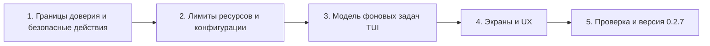

# План исправлений и выпуска upd 0.2.7

Исходная версия — `0.2.6` (`Cargo.toml`, `Cargo.lock`). Цель выпуска `0.2.7` — закрыть [B01–B25](BUGLIST.md) и привести TUI к критериям [U01–U08](TUI-UI-UX.md#6-реестр-задач-uiux-для-027). Этот документ задавал работу; исправления выполнены, версия повышена до `0.2.7`. Итог и то, что проверить на этой машине не удалось, — в разделе [«Итог выполнения»](#итог-выполнения).

Повторная сверка с исходниками изменила способ исправления B01, B02, B04–B07, B13, B14, B15 и B22. Направление у этих записей прежнее, но реализация «как сказано в первой формулировке» для B02, B04, B06 и B14 была бы неверной. Новые записи сверки — B23, B24, B25. Ниже в таблицах уже стоит уточнённое действие.

## Аудит, на котором основан план

| Проход | Баглист | TUI | Результат |
|---|---|---|---|
| Проверка 1 | Условия и фактические ветки B01–B19 в `vpn`, `common`, `mirrors`, `extras`, `backend`, `main`. | `Screen`, меню, маршруты клавиш и вызовы CLI. | Исходные записи сохранены; предполагаемое поведение отделено от кода. |
| Проверка 2 | Входящие и исходящие цепочки, unit-файл VPN, конфигурация и границы памяти. | Источники данных, фоновые receiver, PTY и отрисовка страниц. | Уточнён охват B12: локальный API mihomo и список зеркал Ubuntu тоже читаются без лимита. |
| Поиск 1 | Дополнительные пути ресурсоёмких чтений и сетевых ответов. | Работа `draw_mirrors` и `draw_vpn` при повторном кадре. | Добавлен B20; B17 оставлен отдельно для VPN. |
| Поиск 2 | Отказы фоновых задач и изменение данных между выбором и действием. | `try_recv`, повторные запросы, подтверждение удаления подписки. | Добавлены B21 и B22; остальные эффекты отнесены к B04/B05/B16/B18. |
| Формализация 1 | Для каждой записи: условие, ожидание, факт, место и обе цепочки зависимостей. | Текущее поведение отделено от целевой концепции. | Убрано смешение дефекта с пожеланием к макету. |
| Формализация 2 | Приоритеты P0/P1/P2 и критерии закрытия ниже. | Реестр U01–U08 и ссылки на B-коды в контексте экранов. | Составлен порядок исправления с проверяемыми результатами. |
| Сверка 1 | B01, B02, B07, B22 и генерация unit-файла против `build_config`, `api`, `confirm`, `delete_sub`/`use_sub`. | Подтверждение удаления и активации, публичный `SubPub`. | Allowlist шире, чем один ключ `listeners`. Unix-сокет mihomo не проверяет Bearer. У активации та же гонка, что у удаления. |
| Сверка 2 | B03, B08–B15, лимиты `read_limited` и разбор `subscription-userinfo`. | — | Лимит распаковки брать из уже существующего приёма `max+1`. Часы и счётчик трафика считаются отдельными переполнениями. B14 нельзя закрыть увеличением `TimeoutStartSec`. |
| Сверка 3 | B04–B06, B16, B17, B18, B20, B21: все `thread::spawn` и `try_recv`. | Повтор `r`, поиск AUR, PTY, кадр VPN и зеркал. | Поток с блокирующим I/O не отменяется. `poll_aur_updates` уже обрабатывает `Disconnected`. `Drop` после `try_wait` не должен убивать процесс по старому pid. |
| Сверка 4 | Гонка индекса, сборка конфига без блокировки подписок, интервал из заголовка. | Подтверждение `x`/`x` и Enter на подписке. | В `SubPub` нет `id`. Имя после санитизации неуникально. |
| Сверка 5 | Отказ `prepare`: FlClash, загрузка ядра, геофайлы, таймаут systemd. | Предупреждение FlClash на каждом кадре VPN. | `comm == FlClashCore` достаточно, чтобы непривилегированный процесс остановил службу. Добавлены B23–B25. |
| Сверка 6 | Каждое предложенное действие сверено с вызывающим кодом и с документацией mihomo по external controller. | Критерии U01–U08 не подменяют собой исправление B-кодов. | Итог внесён в таблицы этой редакции. Поведение на живой системе по-прежнему не измерялось. |

Проверка была статической, включая сверку. Сценарии с гонками, отказом worker, большим выводом и поведением mihomo требуют воспроизведения при реализации; аудит не объявляет их динамически проверенными.

## Очерёдность и зависимости

### 1. Границы доверия и безопасные действия — P0, рядом B23 и B24

B23 и B24 по приоритету P1, но чинятся здесь: бюджет YAML нужен до фильтрации ключей, а ложный FlClash останавливает ту же службу, чьи права сужает B01.

| Записи | Изменение | Критерий закрытия |
|---|---|---|
| B01, B23 | Разрешённый профиль собирать после разбора с бюджетом. Из подписки оставлять только узлы, группы, правила и сетевые provider-ы; `listeners`, `dns`, `skip-auth-prefixes`, `external-controller-cors`, `hosts`, `sniffer`, `iptables`, `ebpf`, `authentication` не переносятся. `type: file` и `path` вне каталога профиля отклоняются. При выключенном `vpn_dns` ключ `dns` удаляется, а не остаётся из подписки. `bind-address` при `allow-lan = 0` — `127.0.0.1`. `geo-auto-update` выключить: геофайлы обновляет только `geo_update` после `validate_geo_file`. Бюджет YAML применяется в `classify_sub` и `build_config` до использования дерева: предел узлов, глубины и алиасов; лимит 32 МБ сырого тела его не заменяет. Права службы сужать отдельно и только после проверки TUN: `NoNewPrivileges`, `CapabilityBoundingSet`/`AmbientCapabilities` для `CAP_NET_ADMIN`, `CAP_NET_RAW`, `CAP_NET_BIND_SERVICE`, `ProtectSystem=strict`, запись только в каталог VPN. Не переводить службу на пользователя без этих capabilities: TUN и автомаршрут перестанут подниматься. | Профиль с `listeners`, открытым DNS, `skip-auth-prefixes` или файловым provider вне каталога не открывает порт и не читает чужой путь. Штатные подписка, TUN и proxy запускаются. Документ с алиасами сверх бюджета отвергается до запуска mihomo. Служба не имеет лишних capabilities; проверка сделана с включённым TUN. |
| B02 | Не добавлять Unix-сокет рядом с TCP. Убрать `external-controller` и оставить `external-controller-unix` внутри `/var/lib/upd/vpn` (каталог уже `0700`). У mihomo запрос через этот сокет не проверяет Bearer: защита — каталог и `UMask=0077`, а не заголовок. Клиент — HTTP поверх `UnixStream`, не ureq на `127.0.0.1`. Перед отправкой запроса проверить, что сокет принадлежит root и не доступен группе/остальным, а `SO_PEERCRED` показывает uid службы. Поддержку ключа проверить на том ядре, которое ставит upd; при отказе `mihomo -t` не возвращаться на TCP. | При остановленном mihomo другой пользователь не может принять секрет и не может подключиться к сокету. После перезапуска `status`/`select`/`reload` работают. В итоговом YAML нет TCP-контроллера. |
| B07 | Исправить саму `confirm`: EOF и ошибка чтения возвращают отказ при любом `default_yes`. Пустой Enter остаётся ответом по умолчанию, как сейчас делает `yes_no`. Отдельный `--yes` не добавлять: неинтерактивный путь уже есть, это `upd auto`, и он `confirm` не вызывает. | Закрытый stdin не проходит ни один вопрос с ответом по умолчанию «да»: новости, снапшот, установка, перезапуск служб, AUR-помощник, алиас. Явный `y`/`n` и пустой Enter в TTY сохраняют прежний смысл. |
| B22 | Добавить `id` в `SubPub`. Подтверждение хранит этот id и показанное имя. `delete_sub` и `use_sub` под `subscriptions_lock` ищут id и ничего не делают, если его уже нет. TUI вызывает `vpn del`/`vpn use` с id. Числовой номер в CLI можно оставить для одноразовой команды: он разрешается уже внутри блокировки. Имя ключом не является. | Если между двумя нажатиями удалена предшествующая запись, ни удаление, ни активация не попадают в другую подписку. Удаление последней подписки останавливает VPN только когда удалён именно подтверждённый id. |
| B24 | `prepare`/`start`/`restart` считают конфликтом чужой TUN или слушатель на порту прокси либо DNS, а не любое `comm == FlClashCore`. Процесс без TUN и без такого порта не мешает запуску. Запасной прокси по-прежнему только к настоящему слушателю, а не к процессу с подменённым именем. | `prctl` или копия `sleep` с именем `FlClashCore` не останавливает `upd-vpn.service`. Реальный второй TUN или занятый порт прокси по-прежнему блокирует запуск. |

### 2. Ограничения данных, процессов и времени — P1/P2

| Записи | Изменение | Критерий закрытия |
|---|---|---|
| B03 | Распаковывать gzip тем же приёмом, что `read_limited`: читать не больше предела плюс один байт и считать превышение ошибкой. Предел готового бинарника задать отдельно от предела архива (ориентир — десятки мегабайт, не размер официального файла «как получится»). Не вызывать `atomic_write` и `mihomo -v`, если предел достигнут. | Сверхлимитный архив с подходящим SHA-256 не разворачивается в память и не запускается. Прежнее ядро остаётся на месте. |
| B08, B09, B10, B25 | Верхние границы ставить в `Config::load` и ещё раз в месте использования. Ресурсные поля сжимать к диапазону и оставлять загрузку конфига успешной: отказ всего `Config::load` остановил бы и обновление пакетов. Часовые поля и `profile-update-interval` ограничить так, чтобы `часы * 3600` считалось через `checked_mul`. Потоки создавать через `Builder::spawn`, а не `thread::spawn`. Уникальность зеркал — множество с сохранением порядка, с пределом числа кандидатов до дедупликации. Повторно измерять только временные ошибки (таймаут, обрыв, 429, 5xx), небольшим пулом и с общим бюджетом времени; 404 и ошибка формата не повторяются. Тест `net02_retries_pinned_after_all_fail` оставить зелёным для таймаута закреплённого зеркала и дополнить случаем постоянной ошибки. | Экстремальные числа не плодят потоки и не паникуют на умножении. Уникальный список строится без квадратичного поиска. Серия HTTP 404 не складывается в последовательные таймауты. Большой `profile-update-interval` не обрывает `upd auto`. |
| B11, B12 | Вынести уже существующий предел тела в общий помощник и применить его к `out`, тихому `run`, AUR, RSS, GitHub API, спискам зеркал Arch/Ubuntu и ответам API mihomo, включая `/proxies` и `/connections`. У каждого вызова свой потолок. Превышение — отдельная ошибка. Обрезанный stdout пакетного менеджера нельзя разбирать как полный список обновлений. | Источник выше лимита останавливается с ошибкой. Память не растёт пропорционально непрочитанному остатку. Проверка обновлений при обрезке завершается ошибкой, а не частичным списком. |
| B13 | После B02 порт `9097` больше не зарезервирован под контроллер. Конфликт проверять в `build_config`: `vpn_port` не совпадает с DNS `1053`, пока включён `vpn_dns`, и не совпадает с TCP-контроллером, если тот ещё существует. Тот же диапазон, что уже проверяет TUI: 1024–65535. Ошибку показывать при сборке VPN-конфига, а не отказом читать весь `/etc/upd.conf`. | `vpn_port=1053` при своём DNS не попадает в YAML. Обычный порт по-прежнему работает. Остальные команды upd читают конфиг и без годного порта VPN. |
| B14 | Загрузку ядра и геофайлов убрать из `ExecStartPre`. `prepare` только проверяет отсутствие реального конфликта B24, собирает конфиг и запускает `mihomo -t`. Если ядра нет, служба сразу завершается с просьбой выполнить `upd vpn core update`. Интерактивный `upd vpn start` уже качает недостающее до `systemctl start`; этот путь сохранить. `TimeoutStartSec` не увеличивать: в `prepare` сейчас умещаются загрузка до 600 с и до четырёх геофайлов по 300 с, и запас сверх 5 минут всё равно их не покрывает. | Медленная загрузка не идёт внутри старта службы. `systemctl start` при готовом ядре не упирается в `TimeoutStartSec`. При отсутствии ядра в журнале видна короткая ошибка, старое ядро не затирается. |
| B15 | `subscription-userinfo` читать десятичными целыми, без `f64`. Долю 90% и сумму для `fmt_bytes` считать в `u128` и в статусе, и в уведомлении. Нецелые и отрицательные значения не превращать в `u64::MAX`. | Значение около 2^53 не меняет объём из-за мантиссы. `u64::MAX` не паникует и не даёт ложную долю. |

### 3. Жизненный цикл задач и отзывчивость TUI — P1

| Записи | Изменение | Критерий закрытия |
|---|---|---|
| B04, B05 | Одна активная задача на тип и поколение результата. Повтор не создаёт второй поток: ставится один флаг «сделать ещё раз», и после ответа стартует не больше одного следующего сбора. Устаревший ответ отбрасывается. Так закрываются `reload` (клавиша `r`, конец Process, внешняя команда, смена языка), `aur_start` и `start_aur_updates`. Блокирующий `gather_status`, HTTP и `pacman` изнутри не отменяются: убийство потока не используется. | Серия `r` или поисков держит не больше одного выполняющегося сбора и одного отложенного повтора. Поздний ответ предыдущего поколения не затирает новый. |
| B06 | При `spawn` запомнить идентификатор группы, по которому её ещё можно опознать после `wait` (`pidfd` либо pid вместе с временем старта из `/proc`). Reader ждать через `poll` по PTY и каналу пробуждения. `Drop` пишет в этот канал и сигналит группу только если это всё ещё та же группа; после `try_wait` не вызывать `kill` по голому pid. Сигнал при закрытии экрана посылать и тогда, когда код выхода уже записан. Секундный обход в `finished()` не оставляет reader заблокированным. | Потомок, удерживающий PTY, не оставляет reader и дескриптор после закрытия Process. Закрытие сессии не посылает сигнал чужому процессу с тем же pid. |
| B17, B20, B24 | Один снимок VPN и один снимок зеркал. Их обновляют вход на экран, явный refresh и интервал VPN около трёх секунд, который уже есть у snapshot API. В снимок VPN входят служба, предупреждение о реальном конфликте FlClash, `vpn.json`, геофайлы и строки настроек. `draw_vpn`, `draw_mirrors` и `key_mirrors` читают готовые строки. Обход `/proc` для B24 не остаётся в отрисовке. | Кадр не запускает `systemctl`, не обходит `/proc`, не читает конфиг и не строит список зеркал. Пока снимок старый, это видно по времени в заголовке. |
| B18 | Снимки, историю, список новых конфигов, применение зеркал, `vpn_apply`, переключатели настроек и `vpn::select` выполнять фоновой задачей или экраном Process. Короткие записи вроде смены языка и `+`/`-` у числа зеркал можно оставить в обработчике. На время долгой операции показывать состояние; повтор той же команды не стартует второй экземпляр (то же правило, что B04). | Пока `systemctl`, API mihomo или `snapper` не вернулись, TUI рисует кадр и принимает отмену или возврат. |
| B21 | В `reload`, `aur_poll`, приёме snapshot и замере задержки различать `Empty` и `Disconnected`. При разрыве сбрасывать receiver, показывать ошибку и снова разрешать запуск. `poll_aur_updates` уже делает это различение; его не заменять другой схемой. | Обрыв snapshot больше не блокирует экран VPN до перезапуска TUI. Повторный поиск и `r` после ошибки worker начинают новую попытку, а не зависают на «ищу» / «загружаю». |

### 4. Актуальность данных и экраны — P1/UX

| Записи | Изменение | Критерий закрытия |
|---|---|---|
| B16, U08 | Связать AUR строки с запросом и поколением; при новом запросе очистить или явно пометить прежние результаты и отключить их установку до нового успеха. | После ошибочного запроса заголовок, таблица и доступность Enter не создают впечатление, что старые пакеты относятся к новому запросу. |
| B19, U02 | Обновлять `Status` при входе на экран и по `r`; показывать время формирования снимка и признак ошибки/загрузки. Pager подписать источником и временем, добавить обновление для изменяемых данных. | Изменение VPN/сети вне TUI можно увидеть на экране состояния без возврата в меню. |
| U01 | Стабилизировать группировку и обозначение действий в меню; сверить показанные подсказки с реально доступными клавишами. | Любой пункт доступен стрелками, его действие однозначно показано; подсказка не обещает неработающий ускоритель. |
| U03, U04, U07 | Компактные таблицы зеркал/подписок, текстовые состояния пустого VPN и задержки, контекстные форматы ввода. | На узком терминале видны выбранное имя и причина ошибки; состояние читаемо без цвета; неверное значение можно исправить в том же поле. |
| U05, U06 | Структурировать этапы Process и итог; показать постоянное подтверждение удаления по имени с явной отменой. | Завершённая операция показывает сделанные/пропущенные шаги; удаление связано с ID и видимым именем до выполнения. |

## Проверка перед выпуском и повышение версии

1. Для каждого B-кода воспроизвести его условие в управляемой среде и проверить критерий закрытия. Для P0 дополнительно проверить отрицательный сценарий: подставной локальный listener, враждебный YAML с `listeners`, `skip-auth-prefixes` и алиасами, EOF на всех вопросах `confirm` с ответом по умолчанию «да», смену списка подписок между подтверждением и удалением, а также между выбором и `use`. Отдельно проверить, что Unix-сокет не оставляет TCP-порт, и что процесс с подменённым `comm` не останавливает службу.
2. Проверить экраны при работающем/выключенном VPN, ошибке сети, пустых ответах, разрыве worker, узком терминале и смене языка; сверить U01–U08. Проверить, что установка, обновление, снапшоты и отмена Process ведут себя по этапам. Серия `r` и повторный поиск AUR не должны увеличивать число потоков `upd`.
3. Выполнить сборку и существующие проверки проекта, включая обновлённый `net02_retries_pinned_after_all_fail`, затем проверить запуск/пакетную установку на поддерживаемых семействах Linux и обновление с 0.2.6. Отдельно измерить память и число потоков для ограниченных входов, чтобы подтвердить B03/B04/B05/B08/B11/B12/B23. Проверить TUN после сужения capabilities и старт службы при уже установленном ядре.
4. После закрытия пунктов изменить `version` на `0.2.7` в `Cargo.toml` и записи пакета в `Cargo.lock`; обновить текущую версию, примеры пакетов и раздел изменений в `README.md`, а также заголовки `docs/ARCHITECTURE.md` и `docs/CONFIGURATION.md`. `package.sh` и `packaging/nfpm.yaml` берут номер из Cargo и окружения, отдельного литерала версии там нет.
5. Собрать артефакты 0.2.7, проверить вывод `upd version`, имена пакетов и документацию. Если критерий любого B/U-пункта не выполнен, зафиксировать блокирующую причину и отложить выпуск до исправления.

## Итог выполнения

Все пункты B01–B25 и U01–U08 реализованы так, как описано в таблицах выше. Проверка шла в три слоя.

**Автотесты** (`cargo test`, 125 тестов, стабильны в трёх прогонах подряд). Для каждого B-кода есть контрактный тест на его критерий:

| Записи | Что проверяет тест |
|---|---|
| B01, B23 | Враждебный профиль: `listeners`, `dns`, `skip-auth-prefixes`, контроллер, `hosts`, `sniffer`, `iptables`, `ebpf`, `authentication` не попадают в YAML; provider вне каталога отвергается. «Миллиард смешков», размножение узлов и байт алиасами, глубина и число алиасов отвергаются до сборки конфига. |
| B02 | Клиент говорит с сокетом по HTTP (Content-Length и chunked), не шлёт `Authorization`; каталог с доступом группы и обычный файл вместо сокета отвергаются. |
| B03 | Сжатые 4 МБ нулей не распаковываются сверх предела. |
| B06 | Потомок, игнорирующий SIGHUP, держит PTY после выхода лидера; закрытие сессии завершает его и поток чтения. Номер группы, занятый чужим процессом, не получает сигнал. Закрытие при `SIGPIPE` по умолчанию не роняет процесс. |
| B07 | EOF — отказ при любом умолчании; пустой Enter — умолчание. |
| B08, B09, B10, B25 | Экстремальные значения конфига сжимаются; 20 000 зеркал дедуплицируются меньше чем за секунду с пределом на источник; потоков замера не больше `MAX_PARALLEL`, бюджет времени соблюдается; 404, HTML, DNS и TLS не повторяются; интервал `i64::MAX` не переполняет срок. |
| B11 | `yes` без предела останавливается на 1 МБ; ровно предел — не ошибка; stderr хранится хвостом. |
| B13, B14, B15 | Порт DNS не попадает в YAML, 9097 свободен; `prepare` без ядра отказывает меньше чем за 2 с; счётчики 2^53+1 и `u64::MAX` точны и не переполняются. |
| B04, B05, B16, B21, B22, B24 | Двадцать запросов — один поток и один повтор; потерянный worker даёт ошибку и повтор; после ошибки AUR прежние строки не показываются и не ставятся; удаление и активация по id не задевают соседнюю запись, в TUI подтверждение снимается при исчезновении записи; подменённое имя без порта и TUN не мешает, занятый порт, DNS-порт и TUN FlClash мешают, свой mihomo — нет. |
| U03–U07 | Узкий экран сохраняет имя и причину ошибки; пять причин пустого списка серверов; словесная задержка; подсказка и ошибка у поля ввода; итог этапов. |

**Моделирование на живом ядре** (без root, `UPD_STATE_DIR`/`UPD_VPN_*` во временном каталоге): `upd vpn core update` скачал mihomo v1.19.31 (61.8 МБ распакованного бинарника — в пределе); враждебный профиль прошёл `mihomo -t`, а запущенное ядро слушало только `127.0.0.1:<vpn_port>`, без портов из `listeners`, `dns` и `external-controller` подписки. Через Unix-сокет работали `status`, `servers`, смена режима, выбор сервера, замер задержки и горячая перезагрузка с переносом порта. Выяснилось, что mihomo ставит сокету права `0666` независимо от `UMask`, поэтому проверка опирается на владельца сокета, закрытый каталог и `SO_PEERCRED`. Процесс с `comm` `FlClashCore` запуск не остановил, занятый порт и DNS-порт работающей службы — остановили. `prepare` прошёл в песочнице `systemd-run` с `ProtectSystem=strict` и записью только в каталог VPN; поэтому из конфига убран секрет — его создание писало бы в `/etc`. TUI проверен в PTY через эмулятор терминала на 118×32 и 60×24: пятнадцать нажатий `r` подряд держали не больше одного потока сбора, после закрытия экрана команды оставался один поток. Моделирование нашло и закрыло дефект: запись в канал пробуждения после выхода потока чтения убивала TUI сигналом `SIGPIPE`.

**Не проверено на этой машине** (нужен root или другие системы): подъём TUN службой с суженными capabilities на живой системе, установка пакетов на deb/rpm-системах и обновление установленной 0.2.6 до 0.2.7 с перезапуском службы (`upd install` делает `systemctl try-restart --no-block upd-vpn.service`). Эти три проверки нужно пройти после установки пакета; при отказе TUN первым кандидатом будет список capabilities в `upd-vpn.service`.
