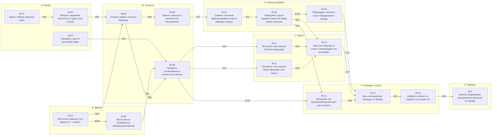

# Направление BI «Личность браузера» — DAG

Дата: 2026-10-08. Источник: [tools/bi_dag.py](tools/bi_dag.py) (правится только он). Механизмы и факты: [ADR-BROWSER-IDENTITY.md](ADR-BROWSER-IDENTITY.md), [I15R-LAB.md](I15R-LAB.md).

Схема:
- **направление** — группа вершин одной темы;
- **вершина** — одна задача (одно предложение);
- **ребро** u → v — контракт: что u гарантирует v, как это проверить и с какими значениями.

Роли:
- **роль 1** (Grok) пишет код всех вершин за один проход — [GROK-BI-CODE.md](GROK-BI-CODE.md);
- **роль 2** пишет тесты и лабораторию по рёбрам следующей итерацией — [TESTS-BI.md](TESTS-BI.md).

Связь с общим планом: рубеж `BI` в [REMAINING-DAG-PLAN](REMAINING-DAG-PLAN-2026-10-06.md).
- BI заменяет прежние I15.T03.a–T04.d и I14.T02.a.
- `BI.Z` нужен для I15.T05.a, `BI.R2` — для I14.T03.a.
- Сейчас направление зависит только от закрытого I15-R.T03.a и может начинаться немедленно.

## Направления

| | Направление | Цель | Вершины |
|---|---|---|---|
| R | Регион | Пресеты страны: часовой пояс, языки, POSIX-локаль — из tzdata, без догадок. | BI.R1, BI.R2, BI.R3 |
| E | Движок | Какой браузер и какой версии запускается; какие версии проверены лабораторией. | BI.E1, BI.E2 |
| M | Личность | Модель, хранилище и валидатор согласованности личности браузера. | BI.M1, BI.M2, BI.M3 |
| L | Запуск | Чистый план запуска (argv, env, файлы) и исполнитель, который ничего не добавляет от себя. | BI.L1, BI.L2, BI.L3 |
| G | Охрана профиля | Профиль принадлежит CM: запуск мимо CM обнаруживается и блокирует личность. | BI.G1, BI.G2, BI.G3 |
| C | Команды и статус | cm identity и оси REGION/APP/STATE/NET без обещаний сверх проверенного. | BI.C1, BI.C2, BI.C3 |
| Z | Приёмка | Лабораторный прогон cm identity на настоящих браузерах. | BI.Z |

## Граф

Сплошная стрелка — ребро с контрактом. Подпись — id ребра.

## Вершины

| Вершина | Задача | Размер | Уровень | Зависит от | Файлы |
|---|---|---|---|---|---|
| `BI.R1` | Задать таблицу пресетов стран. | S | L1 | — | `src/identity/presets.rs` |
| `BI.R2` | Выбрать окружение личности по стране, зоне и языку. | S | L1 | BI.R1 | `src/identity/presets.rs` |
| `BI.R3` | Проверить зону по системной tzdata. | S | L1 | — | `src/identity/tzdata.rs` |
| `BI.E1` | Распознать браузер и его версию по `--version`. | S | L1 | — | `src/identity/engine.rs` |
| `BI.E2` | Вести реестр проверенных лабораторией версий. | S | L1 | BI.E1 | `data/identity-verified.json`, `src/identity/verified.rs` |
| `BI.M1` | Описать модель личности браузера. | M | L1 | BI.R2, BI.E1 | `src/identity/model.rs`, `src/identity/mod.rs`, `src/lib.rs` |
| `BI.M2` | Хранить личности в каталоге CM пользователя. | M | L1 | BI.M1 | `src/identity/store.rs` |
| `BI.M3` | Проверить согласованность личности до запуска. | M | L1 | BI.M1, BI.E2, BI.R3 | `src/identity/validate.rs` |
| `BI.L1` | Построить план запуска Chromium-браузера. | M | L1 | BI.M3 | `src/identity/plan.rs` |
| `BI.L2` | Построить план запуска Gecko-браузера и его user.js. | M | L1 | BI.M3 | `src/identity/plan.rs` |
| `BI.G1` | Снимать отпечаток файлов профиля и вести маркеры запуска. | M | L1 | BI.M2 | `src/identity/guard.rs` |
| `BI.G2` | Обнаружить запуск профиля мимо CM перед новым запуском. | M | L1 | BI.G1 | `src/identity/guard.rs` |
| `BI.G3` | Подтвердить личность после обнаруженного обхода. | S | L1 | BI.G2 | `src/identity/guard.rs` |
| `BI.L3` | Запустить браузер по плану и сопровождать его до выхода. | M | L2 | BI.L1, BI.L2, BI.G2 | `src/identity/launch.rs` |
| `BI.C1` | Вычислить оси REGION/APP/STATE/NET для личности. | S | L1 | BI.M3, BI.G2 | `src/identity/axes.rs` |
| `BI.C2` | Дать пользователю команды cm identity. | M | L1 | BI.L3, BI.G3, BI.C1 | `src/identity/cli.rs`, `src/main.rs`, `src/i18n_table.rs` |
| `BI.C3` | Добавить личность в справку и состояние cm. | S | L1 | BI.C2 | `src/main.rs`, `src/i18n_table.rs` |
| `BI.Z` | Принять направление лабораторным прогоном cm identity. | M | L3 | BI.C3 | `docs/design/cm-network-manager/bi-evidence/<дата>/summary.json` |

## Рёбра: контракт, проверка, значения

### E01 · BI.R1 → BI.R2 (L1)

- **Контракт:** Каждая строка таблицы пригодна для выбора: страна — двухбуквенный код; зоны есть в tzdata `zone.tab` именно для этой страны; у каждого набора языков первый тег совпадает с POSIX-локалью; теги — BCP 47.
- **Как проверить:** `tests/audit_bi_presets.rs`: обход `PRESETS` против `/usr/share/zoneinfo/zone.tab` и файлов зон.
- **Значения:**
  - все 18 стран: AT CA CH DE EE FI FR GB JP LT LV NL PL RU SE SG TR US — ровно этот набор
  - для каждой (country, zone): строка `country<TAB>…<TAB>zone` есть в zone.tab и файл `/usr/share/zoneinfo/<zone>` существует
  - NL.zones == ["Europe/Amsterdam"]; SE.zones == ["Europe/Stockholm"] (не Brussels/Berlin из zone1970.tab)
  - для каждого набора: tags[0] == `ll-RR`, posix == `ll_RR.UTF-8` с теми же ll и RR
  - DE.language_sets[0].tags == [de-DE, de, en-US, en]

### E02 · BI.R2 → BI.M1 (L1)

- **Контракт:** `select` детерминирован: одно и то же (страна, зона, язык) даёт один и тот же `EnvironmentProfile`; ошибки — без входных значений в тексте.
- **Как проверить:** `tests/audit_bi_presets.rs`, табличный тест.
- **Значения:**
  - select("DE", None, Local(0)) → {country DE, timezone Europe/Berlin, languages [de-DE, de, en-US, en], posix_locale de_DE.UTF-8, matches_country true}; accept_language() == "de-DE,de,en-US,en"
  - select("de", None, Local(0)) == select("DE", None, Local(0))
  - select("Germany", None, Local(0)) → Err(UnknownCountry)
  - select("US", Some("America/Chicago"), English) → timezone America/Chicago, languages [en-US, en], posix en_US.UTF-8, matches_country true
  - select("US", Some("Europe/Berlin"), English) → Err(ZoneNotInCountry)
  - select("CH", None, Local(1)) → languages [fr-CH, fr, en-US, en], posix fr_CH.UTF-8
  - select("CH", None, Local(2)) → Err(NoSuchLanguageSet)
  - select("DE", None, English) → languages [en-US, en], matches_country false
  - select("JP", None, Custom("ru-RU")) → languages [ru-RU, ru], posix ru_RU.UTF-8, matches_country false
  - select("JP", None, Custom("ru")) → languages [ru], posix ru_RU.UTF-8
  - select("JP", None, Custom("ru_RU")) и Custom("RU-ru") и Custom("") → Err(BadLanguageTag)
  - текст каждой ошибки не содержит входной строки ("Germany", "Europe/Berlin", "ru_RU")

### E03 · BI.R3 → BI.M3 (L1)

- **Контракт:** `verify_zone` отвечает только по tzdata и не выходит за `tzdir`.
- **Как проверить:** `tests/audit_bi_presets.rs`: системная tzdata и фикстура `TempDirGuard` с собственным `zone.tab`.
- **Значения:**
  - (/usr/share/zoneinfo, DE, Europe/Berlin) → Ok
  - (/usr/share/zoneinfo, DE, Europe/Amsterdam) → Err(ZoneNotInCountry)
  - фикстура: zone.tab со строкой `NL\t+5222+00454\tEurope/Nowhere`, файла зоны нет → Err(ZoneMissing)
  - фикстура без zone.tab → Err(TzdataUnavailable)
  - zone "../../etc/passwd", "/Europe/Berlin", "Europe/Ber lin", 65 символов → Err(BadZoneName)

### E04 · BI.E1 → BI.M1 (L1)

- **Контракт:** `EngineInfo` описывает настоящий браузер по его собственному `--version`; ничего не придумывается.
- **Как проверить:** `tests/audit_bi_engine.rs`: `parse_version` на строках и `detect` на скриптах-фикстурах в `TempDirGuard`.
- **Значения:**
  - "Google Chrome 155.0.8059.39 \n" → Chromium, Chrome, 155, "155.0.8059.39"
  - "Chromium 155.0.7000.1 Arch Linux" → Chromium, Chromium, 155, "155.0.7000.1"
  - "Brave Browser 154.1.96.61" → Chromium, Brave, 154, "154.1.96.61"
  - "Mozilla Firefox 157.0" → Gecko, Firefox, 157, "157.0"
  - "LibreWolf 157.0-1" → Gecko, LibreWolf, 157, "157.0-1"
  - "Opera 100.0" и "" → Err(UnknownEngine)
  - detect("chrome") → Err(NotAbsolute)
  - скрипт `exit 3` → Err(VersionFailed); скрипт `sleep 30` → Err(Timeout) за ≤ 12 с
  - скрипт печатает `env`: в выводе нет переменных родителя кроме PATH

### E04b · BI.E1 → BI.E2 (L1)

- **Контракт:** Реестр сопоставляет строки с `EngineInfo` по brand и major, а не по строке версии.
- **Как проверить:** `tests/audit_bi_engine.rs`.
- **Значения:**
  - EngineInfo{Chrome, 155, "155.0.8059.39"} и {Chrome, 155, "155.0.9999.1"} → одинаковый status
  - brand в JSON: ровно одно из Chrome, Chromium, Brave, Firefox, LibreWolf; неизвестный brand в JSON — ошибка разбора при сборке теста встраивания (тест читает data/identity-verified.json и проверяет каждую строку)

### E05 · BI.E2 → BI.M3 (L1)

- **Контракт:** Реестр отвечает `Verified` только для строк, за которыми стоит evidence того же механизма.
- **Как проверить:** `tests/audit_bi_engine.rs`.
- **Значения:**
  - (Chrome 155, Local) → Verified, evidence "docs/design/cm-network-manager/i15r-evidence/2026-10-08"
  - (Brave 154, Local) → Verified, note содержит "farbling"
  - (Chrome 156, Local), (Chromium 155, Local), (Firefox 157, Local), (LibreWolf 157, Crowd) → Unverified
  - каждая строка JSON: каталог evidence существует в репозитории

### E06 · BI.M1 → BI.M2 (L1)

- **Контракт:** Модель сериализуется без потерь, отвергает чужие поля и неизвестную схему, история ограничена.
- **Как проверить:** `tests/audit_bi_model.rs`.
- **Значения:**
  - validate_id: "work", "a", "a-1", 32 символа → Ok; "Work", "-a", "a/b", "a b", "", 33 символа → Err
  - JSON roundtrip профиля DE local == исходный
  - JSON с лишним полем `"x":1` → Err; schema_version 2 → Err(UnsupportedSchema)
  - 7 вызовов record → generation +7, history.len() == 5, history[0].generation — третья запись
  - format!("{:?}") не содержит значений extra_args

### E07 · BI.M2 → BI.G1 (L1)

- **Контракт:** Хранилище даёт каталог личности, принадлежащий пользователю, с правами 0700/0600 и атомарной записью.
- **Как проверить:** `tests/audit_bi_store.rs` с `CM_IDENTITY_ROOT` в `TempDirGuard`.
- **Значения:**
  - create(work) → <root>/work 0700, identity.json 0600, profile/ 0700
  - create(work) повторно → Err(Exists); load(none) → Err(NotFound)
  - оставленный identity.json.tmp с мусором: load(work) читает прежний identity.json
  - list() при каталогах b, a, c-без-json → [a, b]
  - remove(work, false) → identity.json и state.json удалены, profile/ на месте; remove(work, true) → каталога нет
  - root — симлинк → open → Err(Unsafe)

### E08 · BI.M1 → BI.M3 (L1)

- **Контракт:** Валидатор получает полный профиль; каждое правило таблицы BI.M3 срабатывает ровно на своём условии.
- **Как проверить:** `tests/audit_bi_validate.rs`, табличный тест (одна строка — одно правило), tzdir системный.
- **Значения:**
  - Local + DE + Chrome 155 (профиль и движок совпадают) → errors [], warnings []
  - Crowd + Chrome 155 + environment None → errors [StrategyEngineUnsupported]
  - Crowd + LibreWolf 157 + environment DE → errors [CrowdWithRegion], warnings [UnverifiedVersion]
  - Local + environment None → errors [LocalNeedsEnvironment]
  - Local + DE с timezone "Europe/Amsterdam" (подложено вручную) → errors [ZoneInvalid]
  - extra_args ["--user-agent=x"] → errors [ForbiddenArgument("--user-agent")]; ["--remote-debugging-pipe"], ["--headless=new"], ["--lang=ru"], ["--profile"] — по одному коду каждый
  - extra_args ["--ozone-platform=wayland"] → errors []
  - профиль Chrome 155, движок Chrome 156 → warnings [EngineChanged, UnverifiedVersion]
  - Local + DE + English → warnings [LanguageNotRegional]
  - Local + DE + Brave 154 → warnings [BraveFarblesLanguages]
  - bypass_suspected = true → errors [BypassSuspected]

### E09 · BI.M3 → BI.L1 (L1)

- **Контракт:** План строится только для профиля без errors; план не добавляет ничего, что валидатор запрещает пользователю.
- **Как проверить:** `tests/audit_bi_plan.rs`: точное сравнение argv и env.
- **Значения:**
  - parent_env {DISPLAY=:0, WAYLAND_DISPLAY=wayland-1, XAUTHORITY=/h/.Xauthority, XDG_RUNTIME_DIR=/run/user/1000, DBUS_SESSION_BUS_ADDRESS=unix:path=/run/user/1000/bus, HOME=/h, PATH=/usr/bin, LC_TIME=ru_RU.UTF-8, LANGUAGE=ru, TZ=Europe/Moscow, SECRET_TOKEN=x}
  - chromium_plan(DE local, /r/work/profile, env, None, false).args == ["--user-data-dir=/r/work/profile", "--lang=de-DE", "--accept-lang=de-DE,de,en-US,en", "--no-first-run", "--no-default-browser-check"]
  - env == {DBUS_SESSION_BUS_ADDRESS, DISPLAY, HOME=/h, LANG=de_DE.UTF-8, PATH=/usr/bin, TZ=Europe/Berlin, WAYLAND_DISPLAY, XAUTHORITY, XDG_RUNTIME_DIR} — ровно 9 ключей; нет LC_TIME, LANGUAGE, SECRET_TOKEN
  - parent_env без PATH → PATH=/usr/bin:/bin
  - url "http://127.0.0.1:18765/" — последний аргумент; extra_args ["--ozone-platform=wayland"] — сразу перед url
  - lab=true → после `--no-default-browser-check` идут "--headless=new", "--no-sandbox"
  - в argv нет `--user-agent`, `--remote-debugging-*`, `--enable-automation`; files == []

### E10 · BI.M3 → BI.L2 (L1)

- **Контракт:** user.js целиком задаётся стратегией; UA-prefs не пишутся.
- **Как проверить:** `tests/audit_bi_plan.rs`: точное сравнение user.js, args и env.
- **Значения:**
  - Local + DE: user.js == "// Managed by cm identity. Changes here are overwritten at launch.\nuser_pref(\"intl.accept_languages\", \"de-DE, de, en-US, en\");\nuser_pref(\"intl.locale.requested\", \"de-DE\");\nuser_pref(\"privacy.resistFingerprinting\", false);\n"
  - Crowd: user.js == "// Managed by cm identity. Changes here are overwritten at launch.\nuser_pref(\"intl.accept_languages\", \"en-US, en\");\nuser_pref(\"intl.locale.requested\", \"en-US\");\nuser_pref(\"privacy.resistFingerprinting\", true);\n"
  - Local env: TZ=Europe/Berlin, LANG=de_DE.UTF-8; Crowd env: LANG=en_US.UTF-8 и нет TZ
  - args == ["--profile", "/r/work/profile", "--no-remote"]; lab=true → + "--headless"
  - ни одна строка user.js не содержит "useragent"

### E11 · BI.G1 → BI.G2 (L1)

- **Контракт:** Отпечаток меняется при любой правке ключевого файла и не меняется без правок; маркеры переживают перезапуск процесса CM.
- **Как проверить:** `tests/audit_bi_guard.rs` в `TempDirGuard`.
- **Значения:**
  - пустой профиль Chromium → 2 записи present=false
  - запись `Default/Preferences` = "{}" → present=true, size 2, sha256 44136fa355b3678a1146ad16f7e8649e94fb4fc21fe77e8310c060f61caaff8a
  - два fingerprint без изменений → равны; изменение одного байта → не равны
  - record_launch затем load_state → last_launch == записанное; state.json 0600

### E12 · BI.G2 → BI.L3 (L1)

- **Контракт:** До запуска охрана отвечает однозначно; при обходе состояние сохраняется до подтверждения.
- **Как проверить:** `tests/audit_bi_guard.rs`; `is_alive` подменяется в тесте.
- **Значения:**
  - новая личность без state.json → Ok(FirstLaunch)
  - record_exit, файлы не менялись → Ok(Clean)
  - record_exit, затем Default/Preferences изменён, policy Block → Err(BypassSuspected); bypass_suspected сохранён в identity.json; history последняя запись "bypass-suspected"
  - повторный вызов без изменений → снова Err(BypassSuspected)
  - то же при policy Warn → Ok(Warned), bypass_suspected false, history "bypass-warned"
  - SingletonLock → "host-4242", is_alive(4242) == true → Err(BrowserRunning); is_alive false → проверка продолжается
  - Gecko: `lock` → "127.0.0.1:+4242", is_alive true → Err(BrowserRunning)
  - last_launch есть, last_exit нет (CM упал), policy Block → Err(BypassSuspected)

### E13 · BI.G2 → BI.C1 (L1)

- **Контракт:** Состояние охраны отражается в оси APP.
- **Как проверить:** `tests/audit_bi_axes.rs`.
- **Значения:**
  - bypass_suspected → APP Blocked, reason "профиль открывали мимо CM: нужно cm identity confirm"

### E13b · BI.G2 → BI.G3 (L1)

- **Контракт:** Подтверждению нужен сохранённый признак обхода и тот же формат отпечатка.
- **Как проверить:** `tests/audit_bi_guard.rs`.
- **Значения:**
  - после Err(BypassSuspected) identity.json содержит "bypass_suspected": true — confirm читает его из хранилища, а не из памяти процесса

### E14 · BI.G3 → BI.C2 (L1)

- **Контракт:** Подтверждение снимает блокировку один раз и обновляет эталон отпечатка.
- **Как проверить:** `tests/audit_bi_guard.rs`.
- **Значения:**
  - после BypassSuspected: confirm → bypass_suspected false, history "bypass-confirmed", следующий check_before_launch → Ok(Clean)
  - confirm без подозрения → generation и history не меняются

### E15 · BI.L1 → BI.L3 (L2)

- **Контракт:** Исполнитель передаёт браузеру ровно план: те же argv и env, ничего от родителя.
- **Как проверить:** `tests/audit_bi_launch.rs`: фикстура-«браузер» — скрипт, который на `--version` печатает `Google Chrome 155.0.8059.39`, а иначе пишет argv и `env` в файл и выходит с кодом 0.
- **Значения:**
  - launch(work DE local, None, false) → Ok(0); записанный argv == plan.args; записанный env == plan.env (родитель с SECRET_TOKEN=x — его нет)
  - браузер запущен в новой сессии: getsid(pid) == pid (скрипт пишет `ps -o sid= -p $$`)
  - browser.log создан с правами 0600
  - после выхода state.json содержит last_launch и last_exit

### E16 · BI.L2 → BI.L3 (L2)

- **Контракт:** Для Gecko исполнитель пишет user.js до запуска и не трогает другие файлы профиля.
- **Как проверить:** `tests/audit_bi_launch.rs` с фикстурой `LibreWolf 157.0-1`.
- **Значения:**
  - после launch profile/user.js == строка из E10 (Local DE); права 0600
  - заранее положенный profile/prefs.js не изменён

### E17 · BI.L3 → BI.C2 (L2)

- **Контракт:** Отказы исполнителя различимы по типу и не запускают браузер.
- **Как проверить:** `tests/audit_bi_launch.rs`.
- **Значения:**
  - второй launch той же личности, пока первый ждёт (скрипт `sleep 2`) → Err(AlreadyRunning), второй скрипт не запускался
  - профиль с extra_args ["--user-agent=x"] → Err(Invalid([ForbiddenArgument("--user-agent")])), файл argv не создан
  - фикстура меняет --version на 156 → профиль сохранён с engine 156 и history "engine Chrome 156"
  - euid 0 без test_mode → Err(RunAsRoot) (проверка, если тест запущен от root; иначе тест печатает NOT_APPLICABLE)

### E17b · BI.M3 → BI.C1 (L1)

- **Контракт:** Оси строятся из `Report` валидатора без повторной проверки и без доступа к сети.
- **Как проверить:** `tests/audit_bi_axes.rs`: `axes` вызывается на вручную собранных `Report`.
- **Значения:**
  - Report{errors [], warnings [UnverifiedVersion]} → APP Partial
  - Report{errors [ForbiddenArgument("--user-agent")], warnings []} → APP Blocked «личность не согласована»

### E18 · BI.C1 → BI.C2 (L1)

- **Контракт:** Оси не выдают Verified там, где нет проверки.
- **Как проверить:** `tests/audit_bi_axes.rs`.
- **Значения:**
  - Local DE Chrome 155 без предупреждений → NET Unknown, REGION Partial «страна задана вручную, выход туннеля не проверен», STATE Verified, APP Verified
  - Local DE English → REGION Partial «язык не из пресета страны»
  - Crowd LibreWolf → REGION Partial «crowd: часовой пояс UTC и язык en-US намеренно», APP Partial (UnverifiedVersion)
  - ZoneInvalid → STATE Blocked, APP Blocked
  - ни при каких входах REGION и NET не равны Verified

### E19 · BI.C2 → BI.C3 (L1)

- **Контракт:** Команды стабильны по выводу и кодам выхода; строки переведены на 6 языков.
- **Как проверить:** `tests/audit_bi_cli.rs`: бинарник `cm` с `CM_IDENTITY_ROOT` и `CM_STATE_DIR` (test_mode), фикстуры браузеров из E15.
- **Значения:**
  - create work --browser <fixture chrome> --strategy local --country DE → код 0; identity.json: environment DE, engine Chrome 155
  - create work повторно → код 5; create x --strategy local без --country → код 2
  - create c --browser <fixture chrome> --strategy crowd → код 2, вывод содержит [StrategyEngineUnsupported]
  - check work → код 0, вывод содержит NET, REGION, STATE, APP
  - launch work при изменённом profile/Default/Preferences после прошлого выхода → код 3, [BypassSuspected]; confirm work → 0; launch work → 0
  - launch work --lab без CM_IDENTITY_LAB=1 → код 2
  - create … -- --user-agent=x → код 2, [ForbiddenArgument]
  - для каждого из 6 языков (`CM_CONF` с `lang = auto` и `LC_ALL` = ru_RU.UTF-8, en_US.UTF-8, de_DE.UTF-8, it_IT.UTF-8, zh_CN.UTF-8, ar_EG.UTF-8): справка `cm identity` не содержит кириллицы, кроме ru

### E20 · BI.C3 → BI.Z (L3)

- **Контракт:** Лабораторная приёмка: через `cm identity` браузер ведёт себя ровно как в протоколе I15R-LAB, механизм env-local.
- **Как проверить:** `tools/bi_lab.py` (роль 2, по образцу `tools/i15r_lab.py`): `unshare -rn`, сервер лаборатории на 127.0.0.1:18765, `CM_IDENTITY_ROOT` во временном каталоге, `CM_IDENTITY_LAB=1`, `cm identity create/launch ... --lab`. Два прогона подряд должны совпасть.
- **Значения:**
  - Chrome 155, `create lab --strategy local --country DE`: первый запрос `Accept-Language` начинается с "de-DE,de;q=0.9"; UA без изменений (содержит "Chrome/155", нет "CMLab"); окно, Worker, вкладка: tz "Europe/Berlin", offset −60 (январь), `Intl` locale "de", languages [de-DE, de, en-US, en], webdriver false
  - Brave 154, то же: tz Europe/Berlin, `Intl` de, languages [de-DE], webdriver false
  - LibreWolf 157 crowd: UA содержит "Firefox/157.0"; tz "Atlantic/Reykjavik" или "UTC"; languages [en-US, en]; webdriver false
  - LibreWolf 157 local DE: UA без изменений; tz Europe/Berlin; `Intl` locale "de"; Accept-Language начинается с "de-DE"
  - голый запуск браузера с `--user-data-dir=<profile>` (Chrome) или `--profile` (LibreWolf) мимо CM, затем `cm identity launch lab --lab` → код 3 [BypassSuspected]
  - по результатам: строки в data/identity-verified.json для каждой проверенной пары (brand, major, strategy) со ссылкой на bi-evidence
