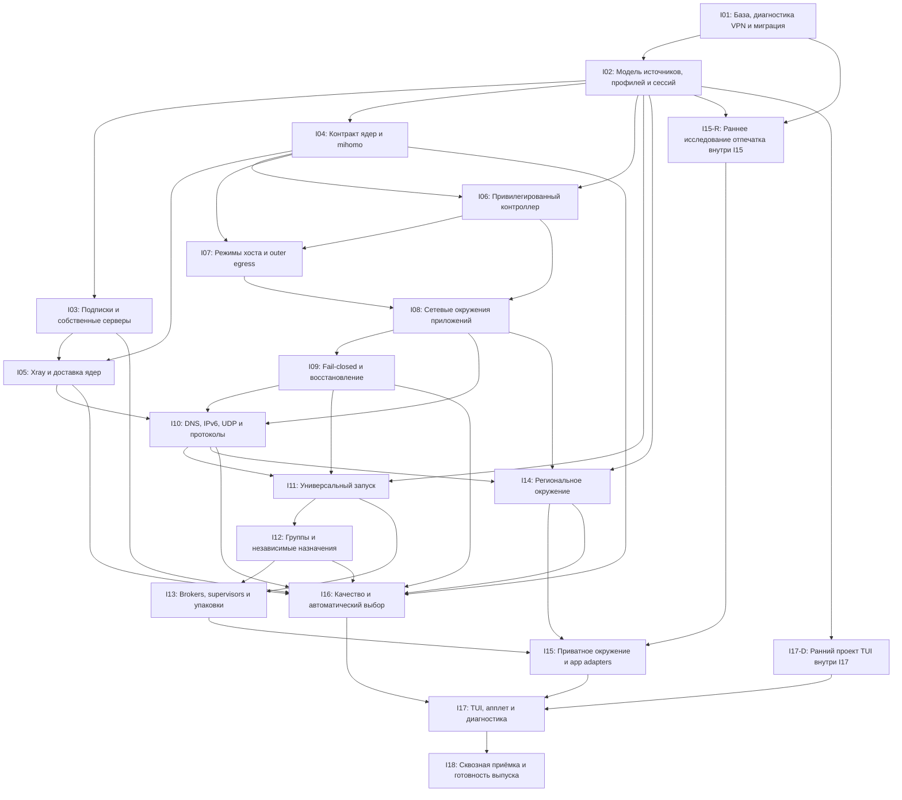

# CM: детальный DAG-план на 18 направлений

Дата: 2026-10-03. База: исходники CM 0.2.8. **Пользователь разрешил начать только I01; статус IN_PROGRESS. Остальные направления PLANNED. Проверки выполняет отдельный исполнитель по [контракту и допускам](I01-TEST-CONTRACT.md). Сборка/установка пакета и изменение действующей сети этим заданием не разрешены.**

[Общий проект](README.md) · [18 направлений](ITERATIONS.md) · [Решения Q01–Q27](QUESTIONS.md) · [Анализ ревью Grok](GROK-THREAD-ANALYSIS-2026-10-03.md) · [Машиночитаемый граф](DAG-PLAN.json) · [Задачи тестировщика](#10-задачи-тестировщика-где-смотреть).

[Схема использования моделей](MODEL-WORKFLOW.md) распределяет ведущие роли и независимое ревью, сохраняя этот DAG. Для I01 работа отдельных исполнителей начата; другие направления не запускаются.

Актуальное поручение пользователя 2026-10-04: выполнить все возможные задачи кодера строго последовательно; реальные проверки отложены до установки собранного binary. После code/build завершения I01.T05 разрешён следующий кодовый этап I02, без объявления runtime acceptance predecessors. Кодовые статусы и deferred acceptance учитываются раздельно. [Результат I01 кодера](I01-CODER-COMPLETION-2026-10-04.md). Указание «только I01» в начале описывает прежний объём.

## 1. Как читать и выполнять план

N остаётся **18**. В графе **20 рубежей и 100 задач**: I15-R — раннее исследование внутри I15; I17-D — раннее проектирование внутри I17. Они не добавляют итерации. ID направления не является номером спринта или разрешением на реализацию.

Стрелка `A → B` означает: для завершения B требуется принятый результат A. В машинном графе это также консервативный порядок начала задач: первая задача B зависит от последней задачи каждого predecessor; внутри рубежа пять задач идут последовательно. Можно заранее изучать документацию и готовить fixtures, но зависимая реализация не считается принятой до закрытия prerequisites. Если работа требует более тонкого параллелизма, сначала уточняется граф задач и повторяется проверка на циклы.

Раннее I15-R зависит только от baseline и модели, а интеграция I15 — от I13, I14 и I15-R. Ранние макеты I17-D зависят только от модели; реальный I17 ждёт интеграции и качества. I10 дополнительно ждёт I05 для окончательной проверки DNS на обоих ядрах; предварительная спецификация и mihomo-пробы могут готовиться раньше, но не закрывают весь рубеж. Это уточнение грубой карты ITERATIONS, а не изменение принятого A+C.

P0 обозначает блокер архитектуры/приёмки, P1 — обязательную функцию целевого scope; длительность из приоритета не выводится. Календарные сроки не назначены без оценки прототипов. Неподдержанные упаковки и свойства перечисляются явно; любое сокращение обязательного пользовательского scope требует отдельного решения.

## 2. Исходная проблема и решения, которые сохраняем

- CM управляет singleton mihomo в текущем коде; независимые app tunnels, Xray adapter и browser identity пока не реализованы.
- Принята A+C: CM владеет Linux routes/firewall, transport workers обслуживают tunnels, apps запускаются в управляемых network environments.
- Host: off/proxy/tunnel. Apps: только tunnel; произвольные launch definitions без списка названий в коде. Возможны отдельные subscriptions/servers и общий tunnel группы.
- DNS: сначала проверка native возможностей закреплённых ядер; локальный forwarder вводится только при доказанном gap. Network isolation необходима независимо от resolver.
- Отпечаток: ранний эксперимент, затем механизм и проверяемые гарантии. Account link, network location, environment и device identity рассматриваются отдельно; желание полной анонимизации не выдаётся за реализованное свойство.

[Исследование](RESEARCH-THREE-DIRECTIONS-2026-10-03.md) и [обезличенное сравнение](VPN-CONFIG-COMPARISON-2026-10-03.json) показывают: из 62 одноимённых узлов UPD/FlClash только один имел одинаковое полное определение. В UPD source/runtime определения совпали; это не доказывает эквивалентности глобальных настроек. Снимки конфигов сделаны позже исследованных ошибок. Поэтому старый WS 502, параметры нового снимка и DNS не связываются причинно без нового доказательства. Стабильность FlClash со слов пользователя — повод для контролируемого сравнения, а не уже установленная причина дефекта CM.

## 3. DAG рубежей

Это граф принятия результатов, а не оценка длительности. Одна из длинных цепочек зависимостей: **I01 → I02 → I04 → I06 → I07 → I08 → I09 → I10 → I11 → I12 → I13 → I15 → I17 → I18**. Дополнительные входы I05, I14, I15-R и I16 также обязательны; «критический путь» по календарю определяется только после оценки работ.

## 4. Очередь по готовности зависимостей

| Волна | Можно начинать после принятия предыдущих входов | Что проверяется на выходе |
|---|---|---|
| 0 | I01 | Baseline, диагностика и сохранность миграции |
| 1 | I02 | Версионированная модель без singleton |
| 2 | I03, I04, I15-R, I17-D | Источники, контракт ядер, ранние fingerprint и UI решения |
| 3 | I05, I06 | Второе ядро и ограниченный root control |
| 4 | I07 | Host modes и outer egress |
| 5 | I08 | Проверенная сеть app под исходным uid |
| 6 | I09 | Fail-closed и recovery |
| 7 | I10 | DNS/IPv6/UDP на обоих ядрах |
| 8 | I11, I14 | Generic launch и региональное окружение |
| 9 | I12 | Separate/shared назначения |
| 10 | I13, I16 | Packaging/executor coverage и качество |
| 11 | I15 | Интеграция только подтверждённого privacy scope |
| 12 | I17 | Реальные UI статусы и диагностика |
| 13 | I18 | Сквозная приёмка; сборка всё ещё запрещена |

Волны — топологические слои, не одинаковые по длительности спринты. Внутри слоя направления независимы по графу; следующий рубеж может стартовать сразу после своих входов, не ждать несвязанное направление. Это не поручение запускать агентов или работы сейчас.

## 5. Детальные задачи и критерии

Каждая задача ниже имеет ID, описание и точные зависимости в DAG-PLAN.json. Для T01 перечислены завершённые входные рубежи; T02–T05 последовательно зависят от предыдущей задачи того же рубежа. Актуальные статусы ведутся в DAG-PLAN.json. Синтез evidence и вердикт G0 записаны в [I01-BASELINE-REPORT.md](I01-BASELINE-REPORT.md). Исторический проект миграции — [I01-MIGRATION-DESIGN.md](I01-MIGRATION-DESIGN.md). Модель и Store I02.T01–T05 кодово реализованы,35 checks prepared ([code completion](I02-CODER-COMPLETION-2026-10-04.md)); нормативная модель — [I02-MODEL.md](I02-MODEL.md); runtime хранения ещё не принят до установки. I01.T01–T05 имеют подготовленные или частично исполненные результаты, но остаются IN_PROGRESS до полной приёмки; подготовка защитного guard и локальных регрессий не закрывает зависимость от полноценной миграции. Результат, приёмка и поведение при провале относятся ко всему рубежу; evidence отдельной задачи прикладывается к [отчёту исполнителя](I01-EXECUTION-REPORT.md).

### I01. База, диагностика VPN и миграция

**Приоритет:** P0. **Входы:** нет. **Вопросы:** Q20, Q21. **Приёмка:** A18, A19.

- **I01.T01** — Инвентаризировать исходники CM 0.2.8 и установленный UPD: версии, digest ядер, units, пути, действующий конфиг, выбранную группу и узел. Записать время и происхождение каждого снимка.
- **I01.T02** — Разобрать текущий отказ по этапам DNS → dial → TLS/REALITY → WS/HTTP → remote service → TUN. Связать журнал с конфигом именно того времени; при отсутствии снимка оставить историческую причину unknown.
- **I01.T03** — Подготовить и, при отдельном задании на испытания, провести сравнение CM/UPD и FlClash на одинаковом полном узле и эффективном конфиге по A/B/A. Различия ядра и глобальных настроек изменять по одному; сохранять capture и классификацию ошибок.
- **I01.T04** — Составить и реализовать миграцию UPD→CM с резервной копией, проверкой владельцев и конфликтов старых/новых каталогов; обеспечить восстановление credentials, units и назначений после прерывания.
- **I01.T05** — Закрыть регрессии обновлений, mirrors, prefetch, снапшотов, helper, TUI и launcher. Выпустить baseline-report: доказанные факты, открытые причины отказов, приоритеты и ссылки на evidence.

**Результат:** Baseline-report; план и evidence миграции; протокол parity; реестр регрессий.

**Готово, когда:** Нет потери данных; факты установленной системы отделены от исходников; несовпадение снимков явно указано. Отчёт с unknown допускает переход к проектированию, но не утверждение «VPN исправлен».

**При провале:** Недоказанная причина отказа остаётся блокером соответствующего заявления о стабильности; потеря данных блокирует дальнейшее применение миграции.

### I02. Модель источников, профилей и сессий

**Приоритет:** P0. **Входы:** I01. **Вопросы:** Q05, Q16. **Приёмка:** A02, A04, A05, A06, A13.

- **I02.T01** — Задать Source, Node, ConnectionProfile, TunnelInstance, ApplicationDefinition, ApplicationGroup, EnvironmentProfile, BrowserIdentityProfile, Session и Verification; описать ссылки и ownership.
- **I02.T02** — Разделить HostPolicy и app policies: host off/proxy/tunnel; apps только tunnel; независимые источники, autostart и stop. Описать примеры одной группы и отдельных туннелей.
- **I02.T03** — Определить stable IDs, schema version и generation pinning. DnsPolicy принадлежит connection profile, DNS cache/fake-IP — поколению tunnel, browser identity — профилю данных приложения.
- **I02.T04** — Реализовать атомарное хранение, обновление и удаление связанных записей: используемый source/node нельзя молча заменить случайным. Credentials отделить от публичного статуса.
- **I02.T05** — Проверить restart, concurrent update, disappeared node и staged removal; выпустить schema examples без секретов и контракт ошибок для следующих направлений.

**Результат:** Версионированная схема; контракты сущностей; примеры назначений; проверки хранилища.

**Готово, когда:** Две подписки и три произвольных приложения представлены без singleton; host stop не означает stop all; ссылка живой сессии сохраняет generation.

**При провале:** Изменение схемы требует согласованной миграции; downstream не принимает несовместимый контракт молча.

### I03. Подписки и собственные серверы

**Приоритет:** P1. **Входы:** I02. **Вопросы:** Q04, Q06, Q24. **Приёмка:** A05, A13.

- **I03.T01** — Закрепить версии и матрицу форматов/протоколов/транспортов. Определить поддержанные URI, YAML, base64 и native config; неизвестные поля диагностировать.
- **I03.T02** — Спроектировать UA negotiation с общим budget, лимитом запросов, HTTP/error mapping и cache выигравшего варианта. Provider endpoints брать из конфигурации, не угадывать секретные URL.
- **I03.T03** — Реализовать сохранение actual accepted UA, формата, времени, локального digest и поколения. Сохранять разрешённые параметры узлов и влияющие глобальные defaults с происхождением.
- **I03.T04** — Добавить ручной собственный сервер и независимые источники для профилей. Ограничить native configs, listeners, remote providers и размеры; исключить облачный converter по умолчанию.
- **I03.T05** — Проверить fixtures валидных и повреждённых ответов, HTML/заглушек, quota, timeout, исчезновения узла и обновления активного source. Плохой import не заменяет рабочее состояние.

**Результат:** Capability matrix; import pipeline; диагностические fixtures; provenance источников.

**Готово, когда:** Совместимость проверяется по конкретному ядру; actual UA отличается от configured UA; неудачный import атомарно отклоняется.

**При провале:** Неподдержанный transport получает unsupported; нельзя имитировать успешную конверсию.

### I04. Контракт ядер и mihomo

**Приоритет:** P0. **Входы:** I02. **Вопросы:** Q02, Q03, Q07. **Приёмка:** A02, A05, A18.

- **I04.T01** — Определить typed CoreAdapter: capabilities, validate, start, stop, reload, health, statistics, errors. Разделить API-ready, route-ready и remote connectivity.
- **I04.T02** — Выделить instance-owned config, socket, порт, cache, service и secret scope; сохранить отдельный legacy host wrapper для прежнего сценария.
- **I04.T03** — Закрепить ответственность A+C: CM владеет routes/firewall, ядро обслуживает транспорт. Исключить конкурирующие auto-route/DNS изменения в app worker.
- **I04.T04** — Реализовать mihomo adapter и сравнить worker на tunnel с несколькими outbounds в одном worker по ресурсам, отказам и независимости управления.
- **I04.T05** — Проверить два независимых instances и legacy host. Использовать parity-протокол I01; revision FlClash core не считать тождественным upstream latest.

**Результат:** CoreAdapter contract; mihomo worker; resource report; legacy compatibility evidence.

**Готово, когда:** Конфиги/API/cache не пересекаются; остановка одного worker не ломает другой; API-ready не выдаётся за рабочий выход.

**При провале:** Без измерений выбор модели worker остаётся ADR с незакрытым экспериментом.

### I05. Xray и доставка ядер

**Приоритет:** P1. **Входы:** I03, I04. **Вопросы:** Q03, Q07. **Приёмка:** A05, A09, A18.

- **I05.T01** — Закрепить источник и версии Xray, архитектуры, проверку бинарника и geo data; составить capability gaps относительно CoreAdapter.
- **I05.T02** — Прототипировать путь TCP/UDP/TUN в A+C. Отдельно проверить native DNS inbound → routing → DNS outbound и qtypes сверх A/AAAA; не добавлять forwarder без выявленного gap.
- **I05.T03** — Реализовать генерацию и validate разрешённого native config, readiness, start/stop/reload и error mapping; отсутствующие операции возвращают unsupported.
- **I05.T04** — Реализовать update/rollback ядра с проверкой кандидата, сохранением предыдущего binary и независимостью работающих профилей; не обещать перенос существующих соединений.
- **I05.T05** — На совместимом тестовом endpoint подтвердить транспорт, DNS и lifecycle. Зафиксировать неэквивалентные конфиги и случаи, где сравнение с mihomo невозможно.

**Результат:** Xray adapter; delivery policy; native DNS report; тесты транспорта и rollback.

**Готово, когда:** Поддержанные пути доказаны на закреплённой версии; invalid binary/config не уничтожает рабочую конфигурацию.

**При провале:** Провал native DNS разрешается явным решением о дополнительном forwarder; произвольный новый компонент не вводится автоматически.

### I06. Привилегированный контроллер

**Приоритет:** P0. **Входы:** I02, I04. **Вопросы:** Q08, Q11, Q16. **Приёмка:** A07, A17.

- **I06.T01** — Выбрать расширение helper или отдельный network service; задать typed protocol, polkit scope и границы root операций.
- **I06.T02** — Определить проверку uid/gid/session, PID start time, namespace/cgroup ownership, paths и FD. AppLaunch возвращает исходного пользователя, не root.
- **I06.T03** — Реализовать allocate/apply/check/stop/reconcile с журналом ownership, транзакцией и compensation для частичного отказа.
- **I06.T04** — Ограничить capabilities, inherited FD, secret passing, ресурсы, число instances, конкурирующие операции и timeout. Диагностика не содержит credentials.
- **I06.T05** — Провести отрицательные проверки чужого uid, PID reuse, argv/path injection, устаревшего запроса и прерывания транзакции.

**Результат:** Privilege ADR; протокол контроллера; ownership journal; negative-test evidence.

**Готово, когда:** Клиент не расширяет root полномочия; приложение работает под своим uid; reconcile затрагивает только ресурсы CM.

**При провале:** Любой обход ownership блокирует сетевые эксперименты с пользовательскими приложениями.

### I07. Режимы хоста и outer egress

**Приоритет:** P0. **Входы:** I04, I06. **Вопросы:** Q02, Q03, Q09. **Приёмка:** A01, A02, A03, A06, A10, A19.

- **I07.T01** — Детализировать принятую A+C: packet-flow TCP/UDP/DNS, таблицы routes, marks, firewall sets и ownership. Чужие таблицы и rules сохранять.
- **I07.T02** — Реализовать отдельный outer egress к endpoint ядра: без случайного chaining через host VPN и рекурсивной маршрутизации.
- **I07.T03** — Реализовать host off/proxy/tunnel как независимую политику. Host proxy не означает полный охват сети хоста.
- **I07.T04** — Согласовать NetworkManager, firewalld, чужие VPN и обновления physical routes; применить изменения транзакционно с rollback.
- **I07.T05** — Проверить смену сети, stop host и сохранение внешней связности app workers; подготовить packet-flow evidence для I08.

**Результат:** Routing ADR; host mode controller; outer transport evidence; coexistence matrix.

**Готово, когда:** Host stop не останавливает apps; endpoint traffic не зацикливается; чужие ресурсы не удаляются.

**При провале:** При конфликте ownership операция отклоняется с причиной, а не переписывает чужой firewall.

### I08. Сетевые окружения приложений

**Приоритет:** P0. **Входы:** I06, I07. **Вопросы:** Q10, Q11. **Приёмка:** A01, A02, A03, A05, A11, A17.

- **I08.T01** — Спроектировать app netns, veth/TUN, cgroup и их связь с tunnel worker; определить единственный разрешённый egress и границы межприложенного доступа.
- **I08.T02** — Реализовать выделение сети через контроллер, разрешённый транспорт к worker и блокировку прямого выхода до запуска приложения.
- **I08.T03** — Подготовить ограниченный тестовый harness для процессов под исходным uid. Он нужен для проверки netns до универсального launcher I11.
- **I08.T04** — Проверить fork/exec, IPv4/IPv6, прямые socket calls и inherited network FD. Доступ GUI/audio/files согласовать с сетевой моделью.
- **I08.T05** — Проверить независимые namespaces на двух tunnels и общий transport без неявного доступа между apps; зафиксировать критерии ownership и cleanup.

**Результат:** App network runtime; test harness; namespace/cgroup trace; network captures.

**Готово, когда:** Приложение не получает host route; потомки охвачены в рамках проверенного способа запуска; нет root у приложения.

**При провале:** Inherited host socket или обход через внешний executor не скрывается; соответствующий запуск блокируется/помечается неподдержанным.

### I09. Fail-closed и восстановление

**Приоритет:** P0. **Входы:** I08. **Вопросы:** Q12, Q13. **Приёмка:** A07, A08, A10.

- **I09.T01** — Определить state machine allocating/blocked/starting/verified/degraded/stopping/reconciling и порядок firewall → worker → launch.
- **I09.T02** — Реализовать постоянную блокировку direct egress независимо от UI/worker; остановка tunnel не снимает защиту с живой app.
- **I09.T03** — Реализовать recover/reconcile после crash, reboot и прерывания reload; не привязывать срок жизни app сети к процессу TUI.
- **I09.T04** — Ввести policy endpoint failure: block или разрешённый резерв с соблюдением constraints. Описать явный stop all и безопасное освобождение ресурсов.
- **I09.T05** — Проверить kill -9 worker/helper/UI, invalid reload, network flap, suspend/resume и ошибки cleanup с capture отрицательных путей.

**Результат:** Lifecycle specification; recovery runtime; fault matrix; leak-negative evidence.

**Готово, когда:** Ни одна проверенная авария не открывает direct egress; неизвестное состояние блокирует новую передачу.

**При провале:** Любая direct утечка — P0: downstream integration и выпуск остановлены до повторной проверки.

### I10. DNS, IPv6, UDP и протоколы

**Приоритет:** P0. **Входы:** I05, I08, I09. **Вопросы:** Q03, Q09, Q14. **Приёмка:** A09, A10.

- **I10.T01** — Задать DnsPolicy для profile и DnsRuntime на поколение tunnel; отделить endpoint bootstrap от app resolution, определить cache/fake-IP invalidation.
- **I10.T02** — Проверить закреплённые native DNS пути mihomo/Xray: UDP/TCP, A/AAAA/TXT/MX/SRV/HTTPS/SVCB, NXDOMAIN и truncation/TCP retry. Local/direct режимы явно ограничить firewall.
- **I10.T03** — По результатам выбрать встроенный resolver или дополнительный локальный forwarder. Описать необходимый gap, ownership, ресурсы, trust и failure policy.
- **I10.T04** — Реализовать per-tunnel resolution, IPv6 pass/block, UDP/STUN/QUIC и app-owned DoH. Произвольный DoH не обязан пользоваться CM DNS, но его транспорт должен оставаться в tunnel либо блокироваться.
- **I10.T05** — Проверить protocol matrix с внешним capture, отказ DNS, смену generation и два tunnel cache. Повторить критические проверки на обоих адаптерах.

**Результат:** DNS ADR; protocol capability matrix; DNS runtime; positive/negative captures.

**Готово, когда:** DNS/IPv6/UDP пути доказаны либо явно blocked; кеш не смешивает tunnels; запрет утечек действует независимо от resolver.

**При провале:** Дополнительный resolver не считается самостоятельным доказательством privacy; неизвестный protocol path блокирует заявление NET.

### I11. Универсальный запуск

**Приоритет:** P1. **Входы:** I02, I09, I10. **Вопросы:** Q10, Q11. **Приёмка:** A11, A12, A16, A17.

- **I11.T01** — Задать ApplicationDefinition без hardcoded product names: executable, argv, cwd, data profile, environment и назначение connection/group.
- **I11.T02** — Реализовать typed launch через контроллер под исходным uid/gid в готовом network environment; argv передавать массивом без shell interpolation.
- **I11.T03** — Описать desktop entry, CLI и пользовательские launch definitions. Проверить имя/путь/аргументы, включая пробелы и специальные символы.
- **I11.T04** — Обработать already-running app, single-instance handoff и descendants. Не присоединять обычный host процесс по имени задним числом.
- **I11.T05** — На произвольных test binaries проверить запуск, ошибки executable/permissions, повторный запуск, фоновые процессы и корректное назначение Session.

**Результат:** Generic launcher; CLI/desktop contract; session tracking; arbitrary-name fixtures.

**Готово, когда:** Добавление app не требует изменения core; несовместимый handoff не выдаётся за защищённый запуск.

**При провале:** Поддержка имени приложения не означает поддержку его IPC/broker упаковки; это отдельно принимает I13.

### I12. Группы и независимые назначения

**Приоритет:** P1. **Входы:** I11. **Вопросы:** Q05, Q12, Q16. **Приёмка:** A02, A04, A05, A06, A13, A14.

- **I12.T01** — Реализовать app → own tunnel и app → shared group; каждый profile выбирает независимый source/server/core.
- **I12.T02** — Задать refcount, ownership и lifetime shared tunnel; отделить условия завершения последней session от host lifecycle.
- **I12.T03** — Реализовать per-session EnvironmentProfile и per-data-profile identity при общем выходе; не объединять private app state.
- **I12.T04** — Реализовать изменение назначения и source generation без случайной переадресации живого соединения; явно описать restart/reconnect.
- **I12.T05** — Проверить закрытие одного из двух apps, две подписки, несколько групп, stop host и исчезновение node во время общей session.

**Результат:** Group runtime; assignment policies; refcount and generation evidence.

**Готово, когда:** Обе модели назначений работают; один app не останавливает остальных; общий tunnel не смешивает state и credentials.

**При провале:** Смена маршрута не обещает бесшовный перенос существующего TCP/UDP stream.

### I13. Brokers, supervisors и упаковки

**Приоритет:** P1. **Входы:** I11, I12. **Вопросы:** Q10, Q11, Q17. **Приёмка:** A11, A12, A16.

- **I13.T01** — Составить матрицу native/terminal/GUI/AppImage/Flatpak и Wayland/X11: фактический network executor, D-Bus, portals и systemd user services.
- **I13.T02** — Проверить single-instance browser, shared supervisor и делегированные network operations на репрезентативных fixtures; product names остаются примерами.
- **I13.T03** — Выбрать generic packaging adapters: отдельный service instance, wrapper, constrained broker либо отказ конкретного защищённого пути.
- **I13.T04** — Реализовать ограничения inherited host sockets, network/geolocation broker access и необходимый GUI/audio/file доступ; побочные эффекты показать пользователю.
- **I13.T05** — Подтвердить actual executor netns/cgroup. Для каждой упаковки записать supported/partial/unsupported, версию, доказательства и границы.

**Результат:** Packaging adapters; executor evidence; compatibility matrix.

**Готово, когда:** Фон и delegated network не выходят через host незаметно; unsupported определяется до зелёного статуса.

**При провале:** Нельзя объявить охват всей упаковки по одному удачному запуску foreground процесса.

### I14. Региональное окружение

**Приоритет:** P1. **Входы:** I02, I08, I10. **Вопросы:** Q01, Q15, Q18. **Приёмка:** A14, A15.

- **I14.T01** — Определить country constraint, sources exit-IP observations, freshness и policy disagreement; имя узла не является геодоказательством.
- **I14.T02** — Задать EnvironmentProfile с IANA timezone, DST, locale и languages; страна допускает несколько корректных комбинаций.
- **I14.T03** — Реализовать per-process TZ, private localtime/locale view и проверку наличия locale. Host timezone и системные часы не изменять.
- **I14.T04** — Проверить значения в libc, пользовательском процессе и поддержанном браузере; две apps на общем tunnel могут иметь разные явные presets.
- **I14.T05** — После failover инвалидировать IP/country observations; перепроверить constraint и согласованность preset. Не перезапускать приложение молча.

**Результат:** Region policy; observation provenance; environment runtime; timezone/DST evidence.

**Готово, когда:** Unknown/stale/mismatch не verified; корректные различные timezone не считаются ошибкой сами по себе.

**При провале:** Выходной IP и timezone не доказывают классификацию страны любым внешним сервисом.

### I15-R. Раннее исследование отпечатка внутри I15

**Приоритет:** P1. **Входы:** I01, I02. **Вопросы:** Q01, Q18, Q26, Q27. **Приёмка:** A12, A14, A20.

- **I15-R.T01** — Определить требуемые наблюдаемые свойства: network location, app environment, device identity, browser state и account link; отделить желание от доказуемого scope.
- **I15-R.T02** — Составить coverage matrix documented controls, extensions, CDP и engine changes: HTTP/JS UA, Client Hints, frames/workers, Canvas/WebGL/fonts/audio/screen, TLS.
- **I15-R.T03** — Провести ограниченный лабораторный эксперимент на отдельном тестовом профиле до большой интеграции: controls до первого запроса, новые tabs/workers и cold restart.
- **I15-R.T04** — Проверить происхождение и правомерность каталога согласованных массовых устройств; оценить согласованность с реальным browser engine. Период 28 дней и история 5 записей остаются гипотезами.
- **I15-R.T05** — Выпустить go/conditional/no-go ADR по каждому свойству и механизму: evidence, цена поддержки, ограничения, критерии регрессии. Неподтверждённое свойство оставить желанием.

**Результат:** Fingerprint coverage matrix; лабораторный отчёт; ADR выбора механизма и каталога.

**Готово, когда:** Проверен конкретный browser/version, доказательства HTTP и JS связаны; универсальная анонимность не заявлена.

**При провале:** No-go блокирует обещание/реализацию этого свойства, но не generic network launcher; безопасность браузера не ждёт периода смены личности.

### I15. Приватное окружение и app adapters

**Приоритет:** P1. **Входы:** I13, I14, I15-R. **Вопросы:** Q01, Q11, Q17, Q18, Q26, Q27. **Приёмка:** A11, A12, A14, A20.

- **I15.T01** — По ADR I15-R определить поддержанный adapter contract и scope. Задать isolated/fresh/existing data state без автоматического удаления HOME и аккаунтов.
- **I15.T02** — Реализовать разрешённые XDG/HOME/files/keyring/SSH-agent/IPC/geolocation boundaries с учётом необходимых функций и подтверждённых packaging adapters.
- **I15.T03** — Реализовать BrowserIdentityProfile на профиль данных: липкая согласованная личность, явная смена устройства, история и version policy после проверки параметров I15-R.
- **I15.T04** — Интегрировать выбранный механизм до первого наблюдаемого запроса и для frames/workers/restarts. Device identity не принадлежит tunnel и не меняется в живом процессе.
- **I15.T05** — Проверить реальные surfaces и сохранение данных/аккаунта; показать частичные и unsupported свойства. Для native apps применять только доказанные generic/app controls.

**Результат:** Environment adapters; identity runtime; surface and state report; unsupported guarantees.

**Готово, когда:** APP evidence относится к конкретной программе/версии; логин не превращается в анонимный аккаунт; неизвестная app не получает APP verified автоматически.

**При провале:** При conditional/no-go scope сужается явно по свойствам, не подменяет пользовательское желание и не вводит обязательную VM без отдельного решения.

### I16. Качество и автоматический выбор

**Приоритет:** P1. **Входы:** I03, I04, I05, I09, I10, I12, I14. **Вопросы:** Q13, Q18, Q19. **Приёмка:** A08, A10, A13, A15.

- **I16.T01** — Определить constraints-before-score: capabilities, source allowlist, country, NET/DNS, provider limits и stable-IP policy.
- **I16.T02** — Задать pinned/failover/adaptive, набор метрик success/latency/TTFB/jitter/обрывы/CPU/RAM, budget probes, freshness и privacy cost.
- **I16.T03** — Провести matched A/B/A pilot на эквивалентных endpoints; 30 проб не считать окончательной статистикой. Размер выборки и допуски вывести из пилота.
- **I16.T04** — Реализовать score, cooldown/hysteresis, session pinning и reconnect/drain policy; не обещать перенос открытого stream на другое ядро/сервер.
- **I16.T05** — Проверить флаппинг, деградацию, unavailable endpoint, metered/battery mode и смену country. Сохранить объяснимую причину каждого выбора.

**Результат:** Selection ADR; benchmark report; adaptive runtime; fault evidence.

**Готово, когда:** Лучший ping не нарушает constraints; отключённые probes не success; смена IP объяснена и имеет явный impact.

**При провале:** При нехватке совместимых candidates приложение остаётся blocked, если policy не разрешила другой проверенный вариант.

### I17-D. Ранний проект TUI внутри I17

**Приоритет:** P1. **Входы:** I02. **Вопросы:** Q01, Q22. **Приёмка:** A20.

- **I17-D.T01** — Подготовить fixtures host off/proxy/tunnel, separate/shared apps, blocked/degraded/unknown и active core/node.
- **I17-D.T02** — Сравнить расширение VPN экрана и отдельную страницу apps/tunnels; задать navigation, keyboard actions, отмену и подтверждения влияния stop.
- **I17-D.T03** — Спроектировать NET/REGION/STATE/APP, возраст evidence и last failure; не сводить их к единой зелёной VPN лампе.
- **I17-D.T04** — Подготовить варианты SVG апплета для host off + app active, partial failure и blocked; сохранить терминальное назначение и поддержку тем.
- **I17-D.T05** — Проверить макеты на 40×12, 60×18, 80×24, 120×32 и локализации; записать provisional поля, ожидающие runtime contracts.

**Результат:** TUI mockups; status contract; icon variants; layout review.

**Готово, когда:** Макеты различают host и apps; simulated fixtures подписаны; UI не обещает неподтверждённую защиту.

**При провале:** Это проектирование, а не готовность runtime I17; ранний макет не закрывает A20.

### I17. TUI, апплет и диагностика

**Приоритет:** P1. **Входы:** I15, I16, I17-D. **Вопросы:** Q01, Q22. **Приёмка:** A20.

- **I17.T01** — Согласовать макеты I17-D с окончательными contracts источников, workers, sessions и verification; добавить назначение own/group tunnel.
- **I17.T02** — Реализовать неблокирующие actions и отдельные host/app статусы, NET/REGION/STATE/APP, freshness, selected core/node и причину block/failover.
- **I17.T03** — Реализовать диагностический экспорт с instance/generation/time и редакцией credentials, полных argv и приватных путей.
- **I17.T04** — Интегрировать апплет и resource monitor: host/app sessions, ошибки, CPU/RAM workers; физический и TUN трафик не суммировать как уникальный.
- **I17.T05** — Проверить реальные states, long actions, локали, темы и terminal sizes; сопоставить snapshots с capture/evidence, проверить секреты в exports.

**Результат:** TUI/app runtime; applet icons; sanitized diagnostics; accessibility evidence.

**Готово, когда:** API/ping не превращается в зелёную защиту; host off не скрывает app tunnels; ошибки видны без блокировки интерфейса.

**При провале:** Экспорт с credentials или ложный verified — blocker приёмки.

### I18. Сквозная приёмка и готовность выпуска

**Приоритет:** P0. **Входы:** I17. **Вопросы:** Q01–Q27 по применимости. **Приёмка:** A01–A20.

- **I18.T01** — Сопоставить W01–W11 с выполненными задачами и evidence; проверить обязательные результаты всех I01–I17 и открытые P0/conditional/no-go.
- **I18.T02** — Пройти A01–A20 на реальных apps/test endpoints с captures, fault injection и actual executor evidence; fixture tests не заменяют сеть.
- **I18.T03** — Повторить необходимые regressions CM, UPD→CM, ownership, core update/rollback, interrupted upgrade, resource ceilings и долгие sessions.
- **I18.T04** — Зафиксировать поддержанные ядра/версии/Linux упаковки, release scope, известные ограничения и rollback/runbooks; отвергнуть неподтверждённые гарантии.
- **I18.T05** — Выпустить acceptance-report и решение ready/blocked. Сборка/установка пакета исключена до отдельного задания, снимающего текущий запрет; готовность не означает публикацию.

**Результат:** Acceptance report; coverage matrix; release blockers; эксплуатационные runbooks.

**Готово, когда:** Все обязательные сценарии доказаны на нужном уровне; открытые P0 блокируют release; unsupported явно видны пользователю.

**При провале:** При провале возвращаться к владельцу дефекта и повторять затронутые downstream проверки; граф новых зависимостей пересматривать без циклов.

## 6. Рубежи принятия решений

| Gate | Где | Условие перехода | Если условие не выполнено |
|---|---|---|---|
| G0: достоверный baseline | I01 → I02 | Версии/время/происхождение известны; исторические gaps явно unknown; нет потери данных | Дополнить baseline; не обещать исправление VPN без evidence |
| G1: архитектура и authority | I02/I04/I06 → I07 | Схема, ownership, core capabilities и typed root protocol согласованы | Не переходить к пользовательским app сетям |
| G2: закрытый выход | I08/I09 → I10/I11 | Crash/reload/network-change не дают direct egress | Исправление P0 и повторная fault matrix |
| G3: протоколы | I05/I10 → I11/I14 | DNS/IPv6/UDP pass или явно block доказаны на обоих ядрах | Unsupported в матрице; не ставить NET verified |
| G4: механизм отпечатка | I15-R → I15 | Coverage и каталог подтверждены для выбранного scope | Conditional/no-go по свойству; сеть продолжается, APP обещание блокируется |
| G5: фактический executor | I13 → I15 | Проверен охват конкретных broker/packaging путей | Ограничить поддержанный способ запуска и показать причину |
| G6: выпуск | I18 | Все обязательные evidence и применимые P0 закрыты | Release blocked; ready не снимает запрет сборки |

Применимые Q01–Q27 разбираются перед своими gates. Технический выбор закрывается ADR/экспериментом; пользовательский компромисс — отдельным решением пользователя, а не предположением команды. Параметры истории личности и периода смены, границы упаковок и политика смены IP не считаются автоматически утверждёнными.

## 7. Evidence и контроль изменений

Для каждой принятой задачи записываются task ID, revision CM, версии/digest ядер, окружение, время UTC, source/config generation, метод проверки, ожидаемый и фактический результат, артефакты и ограничения. Секреты, полные subscription URLs, UUID/keys и пользовательские browser profiles во внешнее ревью не передаются. Digest не заменяет полного локального сравнения конфига; чувствительный оригинал остаётся вне ревью-пакета.

Уровни различаются: source reading → unit/fixture → Linux network harness → real application/executor → end-to-end fault/migration. Приёмка NET требует network evidence, APP — конкретного app adapter и наблюдаемых surfaces. Mock, API readiness и низкий ping не закрывают эти гарантии.

При изменении schema/core/route/DNS/adapter нужно указать затронутые downstream узлы и повторить их существенные проверки. P0 direct leak, privilege bypass или data loss останавливает затронутую ветку до исправления. Reopen задачи — изменение статуса/новая revision evidence, а не обратная стрелка в DAG; причинная цепочка остаётся ацикличной.

Каждый рубеж выпускает короткий ADR: выбранный подход, рассмотренные варианты, эксперимент, ограничения, failure policy и rollback. Пакет проектной документации можно подготовить к ревью сейчас; network/service/profile действия относятся к будущей отдельно заданной реализации.

## 8. Возможные поставки без потери полного плана

1. **Работающий host VPN:** I01 и необходимые части I03/I04, проверенный parity и регрессии. Не означает готовность multi-app.
2. **Туннели приложений:** I01–I12, обязательные для заявленных упаковок части I13, UI и соответствующая сквозная приёмка. Без browser anonymity обещания.
3. **Региональное и приватное окружение:** I14/I15, ранний I15-R и проверки конкретных adapters. Условные результаты исследования отражаются в scope.
4. **Автоматическое качество:** I16, объяснимый выбор и fault evidence, без обхода ограничений страны/сети.

Это варианты staged scope для последующего решения, а не разрешение пропустить I18 или удалить обязательное направление. Полный целевой scope соответствует завершению всех 18 направлений. Сборка, установка и публикация остаются вне текущего задания.

## 9. Первое будущее задание

Начать с **I01.T01–I01.T03**: точный установленный baseline, привязка исторического отказа и воспроизводимое parity-сравнение с FlClash. Не угадывать исправление User-Agent/DNS по одной ошибке. Параллельно с подготовкой диагностических материалов можно читать первичные источники для I15-R; эксперименты и закрытие этого рубежа — после I01/I02.

Перед реализацией уточнить только действительно недостающие условия: доступ к разрешённому test endpoint, выбранный способ исполнения сетевых испытаний и применимый scope. Уже принятые A+C, произвольные apps, independent sources, app-only-tunnel и N=18 повторно на согласование не выносятся.

## 10. Задачи тестировщика: где смотреть

Текущие поручения тестировщику по I01 — волна 0 от 2026-10-04. Опубликованный контракт: [CM волна 0: контракт тестировщика](https://claude.ai/artifact/4fUQWShntcFwDQYkQTsxPG). Исходная версия в репозитории — [WAVE0-REVIEW-AND-TEST-CONTRACT.md](WAVE0-REVIEW-AND-TEST-CONTRACT.md); при расхождении она каноническая.

| Задача | Что исполнить | Права | Статус | Evidence |
|---|---|---|---|---|
| W0-1 (= C17a) | 7 запусков `cm` K0–K6 в user/mount namespace с overlay: не-install команда рядом с legacy-следом | root только внутри своего namespace, без сети | BLOCKED: sandbox запретил NETLINK_ROUTE socket; K0–K6 NOT_RUN | `i01-evidence/w0/w0-1/status.json` |
| W0-2 (= C14r) | Аудит harness и три помфайловых манифеста дерева данных FlClash, атрибуция писателя | только чтение | NOT_RUN | `i01-evidence/w0/w0-2/` |

Перед исполнением прочитать: базовые запреты и статусы — [I01-TEST-CONTRACT.md](I01-TEST-CONTRACT.md); точки кода C17a — [I01-MIGRATION-DESIGN.md](I01-MIGRATION-DESIGN.md) §5; состояние G0 и C14 — [I01-BASELINE-REPORT.md](I01-BASELINE-REPORT.md) §4 и §8; решение D08 — [I01-DECISIONS.md](I01-DECISIONS.md). Тестовый `cm` под root хоста не запускать: хост сейчас в состоянии K1.

Ни один исход волны 0 не принимает I01, не снимает guard и не открывает I02.T04 или I03–I18. Вилка приёмки — в контракте.
