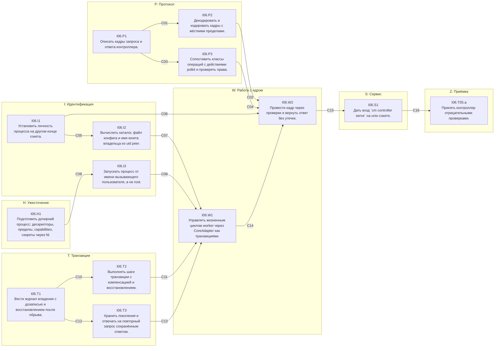

# Рубеж I06 «Привилегированный контроллер» — DAG

Дата: 2026-10-10. Источник: [tools/i06_dag.py](tools/i06_dag.py) (правится только он). Решение Q08: [ADR-CONTROLLER.md](ADR-CONTROLLER.md). Адаптер ядра: [I04-REPORT.md](I04-REPORT.md).

Схема:
- **направление** — группа вершин одной темы;
- **вершина** — одна задача (одно предложение);
- **ребро** u → v — контракт: что u гарантирует v, как это проверить и с какими значениями.

Роли:
- **роль 1** (Grok) пишет код всех вершин за один проход — [GROK-I06-CODE.md](GROK-I06-CODE.md);
- **роль 2** пишет тесты и проверки по рёбрам следующей итерацией — [TESTS-I06.md](TESTS-I06.md).

Связь с общим планом:
- вершины заменяют прежние I06.T01.b–T04.a;
- приёмка сохраняет id `I06.T05.a`, от неё зависят I07.T01.a и I08.T02.a (критический путь).

Что входит: протокол, личность peer, владение по uid, запуск от имени пользователя, транзакции, жизненный цикл worker через `CoreAdapter`, вход `cm controller serve`.

Что не входит:
- содержание операций `net_*` (I07) и `app_launch` (I11): контроллер их принимает, проверяет права и отвечает `unsupported`;
- установка юнита и сокета в систему.

## Направления

| | Направление | Цель | Вершины |
|---|---|---|---|
| P | Протокол | Типизированные кадры с версией, жёсткий декодер, отдельные действия polkit по классам операций. | I06.P1, I06.P2, I06.P3 |
| I | Идентификация | Кто просит: только из сокета и ядра, никогда из тела запроса; чьё это: путь и имя из uid peer. | I06.I1, I06.I2, I06.I3 |
| H | Ужесточение | Дочерний процесс получает только то, что ему положено: uid вызывающего, без capabilities и чужих дескрипторов. | I06.H1 |
| T | Транзакции | Журнал владения, компенсация при частичном отказе, поколения и идемпотентность. | I06.T1, I06.T2, I06.T3 |
| W | Работа с ядром | Жизненный цикл worker только через контроллер и CoreAdapter. | I06.W1, I06.W2 |
| S | Сервис | Вход `cm controller serve` и связка всех частей. | I06.S1 |
| Z | Приёмка | Отрицательные проверки: чужой uid, подмена PID, инъекции, устаревший запрос, обрыв транзакции. | I06.T05.a |

## Граф

Стрелка — ребро с контрактом, подпись — id ребра.

## Вершины

| Вершина | Задача | Размер | Уровень | Зависит от | Файлы |
|---|---|---|---|---|---|
| `I06.P1` | Описать кадры запроса и ответа контроллера. | S | L1 | — | `src/controller/mod.rs`, `src/controller/protocol.rs`, `src/lib.rs` |
| `I06.P2` | Декодировать и кодировать кадры с жёсткими пределами. | M | L1 | I06.P1 | `src/controller/codec.rs` |
| `I06.P3` | Сопоставить классы операций с действиями polkit и проверять права. | M | L1 | I06.P1 | `src/controller/actions.rs`, `src/helper/auth.rs`, `src/main.rs`, `src/i18n_table.rs` |
| `I06.I1` | Установить личность процесса на другом конце сокета. | M | L1 | — | `src/controller/peer.rs` |
| `I06.I2` | Вычислить каталог, файл конфига и имя юнита владельца из uid peer. | M | L1 | I06.I1 | `src/controller/owner.rs`, `src/core/unit.rs` |
| `I06.H1` | Подготовить дочерний процесс: дескрипторы, пределы, capabilities, секреты через fd. | M | L1 | — | `src/controller/harden.rs` |
| `I06.I3` | Запускать процесс от имени вызывающего пользователя, а не root. | M | L2 | I06.H1 | `src/controller/drop.rs`, `src/core/mihomo/lifecycle.rs` |
| `I06.T1` | Вести журнал владения с дозаписью и восстановлением после обрыва. | M | L1 | — | `src/controller/journal.rs` |
| `I06.T2` | Выполнять шаги транзакции с компенсацией и восстановлением. | L | L1 | I06.T1 | `src/controller/txn.rs` |
| `I06.T3` | Хранить поколения и отвечать на повторный запрос сохранённым ответом. | M | L1 | I06.T1 | `src/controller/registry.rs` |
| `I06.W1` | Управлять жизненным циклом worker через CoreAdapter как транзакциями. | L | L2 | I06.T2, I06.T3, I06.I2, I06.I3 | `src/controller/core_ops.rs` |
| `I06.W2` | Провести кадр через проверки и вернуть ответ без утечек. | M | L1 | I06.P2, I06.P3, I06.I1, I06.W1 | `src/controller/dispatch.rs` |
| `I06.S1` | Дать вход `cm controller serve` на unix-сокете. | M | L2 | I06.W2 | `src/controller/server.rs`, `src/main.rs` |
| `I06.T05.a` | Принять контроллер отрицательными проверками. | M | L2 | I06.S1 | `docs/design/cm-network-manager/i06-evidence/<дата>/summary.json` |

## Рёбра: контракт, проверка, значения

### C01 · I06.P1 → I06.P2 (L1)

- **Контракт:** Кадр несёт только версию, ключ и операцию; uid, путей и байтов конфига в схеме нет.
- **Как проверить:** `tests/audit_i06_protocol.rs`: сериализация и разбор образцов.
- **Значения:**
  - `{"v":1,"id":"a1b2c3d4-0001","op":{"type":"worker_start","instance":"browser","generation":7}}` ⇄ Request{v 1, id, WorkerStart{browser, 7}} (roundtrip)
  - классы: WorkerStatus → Status; WorkerStart, WorkerReload, WorkerStop, Reconcile → Worker; NetApply, NetRevert → Net; AppLaunch → App
  - Op::instance(): Reconcile → None, остальные → Some
  - ControlError::code(): BadFrame → "bad_frame", GenerationMismatch → "generation_mismatch", PeerChanged → "peer_changed"; все 18 кодов различны и состоят из [a-z_]
  - Reply::ok("k", Started{generation 7}) → `{"v":1,"id":"k","ok":true,"code":"ok","data":{"type":"started","generation":7}}`
  - Reply::error("k", Denied) → ok false, code "denied", data null

### C02 · I06.P2 → I06.W2 (L1)

- **Контракт:** Декодер отвергает всё, что не является точным кадром версии 1, и не читает больше 64 КиБ.
- **Как проверить:** `tests/audit_i06_protocol.rs`: табличный тест и детерминированная мутация.
- **Значения:**
  - кадр длиной 65537 байт → TooLarge; ровно 65536 байт корректного JSON с длинным id → BadId (не TooLarge)
  - `not json`, `{}`, `[]`, байты 0xFF → BadFrame
  - лишнее поле: `{"v":1,"id":"a1b2c3d4-0001","uid":0,"op":{…}}` → BadFrame; лишнее поле внутри op (`"uid":0`, `"path":"/x"`) → BadFrame
  - неизвестный type `"worker_kill"` → BadFrame
  - v 0 и v 2 → UnsupportedVersion
  - id "short", "UPPER-CASE-1", "a b c d e f g h", 65 символов → BadId
  - instance "", "-x", "A", "a/b", "../x", 33 символа → BadInstance
  - WorkerReload generation 5 next 5 и next 4 → BadArgument; next 6 → Ok
  - AppLaunch program "firefox", "/usr/../bin/sh", с NUL → BadArgument; 65 аргументов → BadArgument; аргумент 4097 байт → BadArgument
  - read_frame: поток «кадр на 70000 байт\n» + корректный кадр → первый TooLarge, второй читается целиком
  - read_frame: пустой поток → Ok(None); «abc» без \n → BadFrame
  - encode(reply) оканчивается одним \n и не содержит \n внутри
  - мутация: 100000 кадров из корректного образца с детерминированным PRNG (xorshift, seed 1) — замена, вставка, удаление байта: decode не паникует и возвращает Ok либо один из кодов BadFrame, TooLarge, UnsupportedVersion, BadId, BadInstance, BadArgument
  - request_digest одинаков для одинаковых op и различен для WorkerStart{browser,7} и WorkerStart{browser,8}; не зависит от id

### C03 · I06.P1 → I06.P3 (L1)

- **Контракт:** У каждого класса операций своё действие polkit; `manage` не используется.
- **Как проверить:** `tests/audit_i06_protocol.rs` и существующий тест политики в `src/main.rs`.
- **Значения:**
  - action_for(Status) == "io.github.cm.status"; Worker → "io.github.cm.worker"; Net → "io.github.cm.net"; App → "io.github.cm.app"
  - сгенерированная политика содержит `<action id="io.github.cm.worker">` с allow_active yes, `io.github.cm.net` с allow_active auth_admin_keep и allow_any auth_admin, `io.github.cm.app` с allow_active yes
  - у каждого нового действия есть message на en и переводы ru, de, it, zh, ar

### C04 · I06.P3 → I06.W2 (L1)

- **Контракт:** Проверка прав получает личность peer целиком и не знает uid из запроса; реализация pkcheck одна.
- **Как проверить:** `tests/audit_i06_protocol.rs` (подменный Authorizer) и `tests/audit_contracts.rs`-подобная проверка исходников.
- **Значения:**
  - PolkitAuthorizer: peer uid 0 → Ok без запуска pkcheck (PATH без pkcheck)
  - test_mode и CM_HELPER_ALLOW=1 → Ok; CM_HELPER_ALLOW=1 без test_mode → pkcheck вызывается (PATH с подставным pkcheck, который пишет аргументы в файл и выходит 1) → Denied
  - подставной pkcheck получает `--action-id io.github.cm.worker --process <pid>,<start>,<uid>` с pid и start_time из PeerIdentity
  - в `src/helper/*.rs` нет строки `Command::new("pkcheck")`; она есть ровно в одном файле — `src/controller/actions.rs`
  - существующие тесты helper (gate) проходят без изменений

### C05 · I06.I1 → I06.I2 (L1)

- **Контракт:** uid, gid и pid берутся только из SO_PEERCRED; подмена PID после захвата обнаруживается.
- **Как проверить:** `tests/audit_i06_peer.rs`: socketpair и дочерние процессы.
- **Значения:**
  - capture на socketpair внутри одного процесса → uid == euid, pid == getpid(), start_time == поле 22 /proc/self/stat
  - parse_start_time("1234 (a b) c) S 1 1 1 0 -1 4194560 1 0 0 0 0 0 0 0 20 0 1 0 987654 0 0") → Some(987654)
  - parse_cgroup("0::/user.slice/user-1000.slice/session-3.scope\n") → Some("/user.slice/user-1000.slice/session-3.scope"); пустой текст → None
  - session_of("/user.slice/user-1000.slice/session-3.scope") → Some("3"); session_of("/user.slice/user-1000.slice/user@1000.service/app.slice/x.scope") → None
  - netns_inode == st_ino /proc/self/ns/net
  - дочерний процесс открывает сокет и завершается; после wait: identity.alive() == false, verify() → Err(PeerChanged)
  - живой дочерний процесс: alive() == true, verify() == Ok
  - format!("{:?}", identity) не содержит пути cgroup

### C06 · I06.I1 → I06.W2 (L1)

- **Контракт:** Диспетчер проверяет личность перед каждой операцией, а не один раз на соединение.
- **Как проверить:** `tests/audit_i06_dispatch.rs`.
- **Значения:**
  - peer завершился между двумя кадрами одного соединения → второй ответ code "peer_changed", фабрика адаптеров не вызвана

### C07 · I06.I2 → I06.W1 (L1)

- **Контракт:** Каталог, конфиг и имя юнита однозначно определяются uid peer и именем экземпляра; чужой файл не читается.
- **Как проверить:** `tests/audit_i06_owner.rs` в `TempDirGuard`.
- **Значения:**
  - owned("/b", 1000, "browser") → root "/b/u1000", unit "cm-core-u1000-browser.service"
  - config_path(7) == "/b/u1000/instances/browser/config/gen-7.json"; journal_path == "/b/u1000/journal.jsonl"
  - owned(base, 1000, "../x") → Err(BadInstance)
  - read_owned_config: обычный файл 0600 владельца → Ok с теми же байтами
  - файл — симлинк на существующий файл → InvalidConfig; каталог config — симлинк → InvalidConfig
  - права 0666 → InvalidConfig; размер MAX_CONFIG_BYTES + 1 → InvalidConfig; файла нет → InvalidConfig
  - владелец файла ≠ owned.uid (owned с uid euid+1 при том же файле) → InvalidConfig
  - render_user_core_unit("/var/lib/cm/users/u1000", 1000, browser, default) содержит строки `User=1000`, `ReadWritePaths=-/var/lib/cm/users/u1000/instances/browser`, `RuntimeDirectory=cm-core-u1000-browser`
  - render_core_unit для того же id не изменился (нет `User=`)

### C08 · I06.H1 → I06.I3 (L1)

- **Контракт:** Дочерний процесс не наследует дескрипторы, capabilities и возможность их вернуть.
- **Как проверить:** `tests/audit_i06_harden.rs`: дочерний `/bin/sh -c` печатает /proc/self/status и список /proc/self/fd.
- **Значения:**
  - родитель открыл файл без O_CLOEXEC (fd ≥ 3): в дочернем /proc/self/fd только 0, 1, 2 и дескриптор самого ls
  - keep_fds [N]: дескриптор N в дочернем открыт, остальные ≥ 3 закрыты
  - в /proc/self/status дочернего: `NoNewPrivs:\t1`, `CapAmb:\t0000000000000000`, `CapBnd:\t0000000000000000`
  - `ulimit -n` в дочернем → 4096; `ulimit -c` → 0
  - secret_fd(b"secret-marker"): чтение даёт те же 13 байт; запись → ошибка EPERM; F_GET_SEALS содержит WRITE, GROW, SHRINK, SEAL
  - secret_fd: флаг FD_CLOEXEC установлен

### C09 · I06.I3 → I06.W1 (L2)

- **Контракт:** Процесс worker и приложения работает под uid, gid и группами вызывающего и не может вернуть root.
- **Как проверить:** `tests/audit_i06_drop.rs`: внутри `unshare --user --map-users` с подчинённым uid, как `tests/audit_i04_tun.rs`.
- **Значения:**
  - spawn_as(RunAs{uid 1, gid 1, groups [1]}, /usr/bin/id, ["-u"]) → вывод "1"; `id -g` → "1"; `id -G` → "1"
  - дочерний `sh -c 'cat /proc/self/status'`: `CapEff:\t0000000000000000`, `NoNewPrivs:\t1`
  - env: передан {A=1} при родителе с SECRET_TOKEN=x → в дочернем `env` только A=1
  - spawn_as с program "id" (не абсолютный) → Err(BadArgument)
  - MihomoWorker без set_run_as: существующий `audit_i04_lifecycle` проходит без изменений
  - MihomoWorker с set_run_as(uid 1): процесс ядра в harness имеет Uid 1 в /proc/<pid>/status (L2, с CM_TEST_MIHOMO)

### C10 · I06.T1 → I06.T2 (L1)

- **Контракт:** Журнал переживает обрыв записи и восстанавливает состояние каждой транзакции.
- **Как проверить:** `tests/audit_i06_journal.rs` в `TempDirGuard`.
- **Значения:**
  - open создаёт файл 0600; путь-симлинк → Err(Failed)
  - Begin → Pending; Begin, Step(a), Commit(reply "R") → Committed, steps_done [a], reply Some("R")
  - Begin, Step(a), Abort → Aborted; Begin, Step(a), Compensated → Aborted; Begin, CompensationFailed → Dirty
  - к файлу дописано `{"txn":"x","ev` без \n: replay возвращает прежние транзакции; после open + append файл состоит только из целых строк
  - две транзакции вперемешку: replay в порядке их Begin
  - compact при файле > 1 МиБ из 5000 Committed и 2 Pending: остаются 2 Pending и 256 последних Committed; размер < 1 МиБ

### C11 · I06.T2 → I06.W1 (L1)

- **Контракт:** При отказе шага выполненное откатывается в обратном порядке; обрыв процесса оставляет след, по которому reconcile завершает откат.
- **Как проверить:** `tests/audit_i06_txn.rs`: шаги-счётчики, записывающие порядок вызовов.
- **Значения:**
  - шаги A, B, C успешны → вызовы [A.apply, B.apply, C.apply], журнал Begin, Step A, Step B, Step C, Commit; результат Ok
  - B.apply → Err(Timeout): вызовы [A.apply, B.apply, A.compensate], журнал Begin, Step A, Abort; результат Err(Timeout)
  - C.apply → Err(Failed): компенсации в порядке [B.compensate, A.compensate]
  - B.apply ошибка и A.compensate ошибка → журнал … CompensationFailed, результат Err(Failed), статус Dirty
  - crash_before("B"): вызовы [A.apply], результат Err(Crashed), журнал Begin, Step A — статус Pending
  - после этого reconcile: вызовы [A.compensate], возвращает 1, статус Aborted; повторный reconcile возвращает 0 и ничего не вызывает
  - crash_before("commit") после трёх шагов → Pending с steps_done [A, B, C]; reconcile вызывает [C.compensate, B.compensate, A.compensate]
  - обрыв на каждом из шагов и на commit (4 точки): после reconcile ни одной Pending

### C12 · I06.T1 → I06.T3 (L1)

- **Контракт:** Повторный запрос с тем же ключом не выполняется второй раз.
- **Как проверить:** `tests/audit_i06_txn.rs`.
- **Значения:**
  - нет транзакции → Fresh
  - Committed с reply "R" и тем же digest → Stored("R")
  - тот же txn, другой digest → Err(Conflict)
  - Pending с тем же digest → Err(Conflict)

### C13 · I06.T3 → I06.W1 (L1)

- **Контракт:** Устаревшее поколение отвергается; поколение хранится атомарно и по uid.
- **Как проверить:** `tests/audit_i06_txn.rs`.
- **Значения:**
  - check_start(None, 1) Ok; check_start(Some(3), 3) Ok; check_start(Some(3), 4) Ok; check_start(Some(3), 2) → GenerationMismatch
  - check_running(None, 1) → NotRunning; check_running(Some(3), 3) Ok; check_running(Some(3), 2) и (Some(3), 4) → GenerationMismatch
  - Generations: set(browser, 7), load заново → current(browser) == Some(7); clear → None; файл 0600
  - оставленный generations.json.tmp с мусором не влияет на load

### C14 · I06.W1 → I06.W2 (L2)

- **Контракт:** Жизненный цикл worker идёт только через контроллер; отказ адаптера не оставляет следов; экземпляры разных uid не видят друг друга.
- **Как проверить:** `tests/audit_i06_core_ops.rs`: `AdapterFactory`, выдающая `core::FakeAdapter`; base в `TempDirGuard`; конфиги `gen-N.json` пишет тест.
- **Значения:**
  - start(browser, gen 1) → Started{1}; status → running true, generation Some(1), api "api_ready"
  - повторный start с тем же txn → тот же ответ, фабрика вызвана 1 раз
  - start(browser, gen 1) с новым txn при работающем → Err(Conflict)
  - start с gen 0 при текущем 1 (после stop и нового start gen 1) → Err(GenerationMismatch)
  - нет файла gen-2.json: start gen 2 → Err(InvalidConfig), фабрика не вызвана
  - reload(gen 1 → 2) → Ok, status generation Some(2); reload(gen 1 → 3) после этого → Err(GenerationMismatch)
  - адаптер отказал в reload (fail_next Reload InvalidConfig) → Err(InvalidConfig), status generation прежнее, generations.json прежний
  - stop(gen 2) → Ok; status → running false, generation None; stop ещё раз (новый txn) → Err(NotRunning)
  - адаптер отказал в start (fail_next Start Failed) → Err(Failed); status running false; generations.json без browser; журнал: транзакция Aborted
  - 17-й экземпляр того же uid → Err(Quota); первый экземпляр другого uid при этом стартует
  - экземпляр browser uid 1000 запущен: status(owned uid 1001, browser) → running false
  - CoreError → ControlError: Unsupported → Unsupported, Busy → Busy, RouteUnavailable → Failed

### C15 · I06.W2 → I06.S1 (L1)

- **Контракт:** Каждый кадр проходит один и тот же порядок проверок; ответ не содержит ничего кроме кода и данных ответа.
- **Как проверить:** `tests/audit_i06_dispatch.rs`: `handle` с подменными Authorizer и фабрикой.
- **Значения:**
  - мусорный кадр → `{"v":1,"id":"","ok":false,"code":"bad_frame","data":null}`
  - Authorizer отказывает → code "denied"; фабрика не вызвана; каталог владельца не создан
  - Authorizer получает действие "io.github.cm.worker" для worker_start и "io.github.cm.status" для worker_status
  - worker_start от peer uid U читает конфиг только из <base>/u<U>/…; файл в <base>/u<U+1>/… с тем же именем не открывается (проверка: его нет в ответе и нет обращения — конфиг U отсутствует → invalid_config)
  - net_apply и app_launch при разрешающем Authorizer → code "unsupported"; при отказывающем → "denied" (права проверяются раньше)
  - MAX_CONCURRENT_OPS: 4 операции заняты (фабрика блокируется на барьере) → пятый кадр code "busy"; после освобождения — проходит
  - ни один ответ не содержит подстрок base-каталога, "gen-", "/proc", имени пользователя
  - reconcile → code "ok", data {type reconciled, compensated N}

### C16 · I06.S1 → I06.T05.a (L2)

- **Контракт:** Сервис на сокете выполняет полный сценарий worker и выдерживает отрицательные проверки.
- **Как проверить:** `tests/audit_i06_server.rs`: бинарник `cm controller serve` в `unshare -U --map-root-user --map-auto -n -m` (в `unshare -r` запрещён `setgroups`, и `worker_start` отвечает `failed`) с `CM_STATE_DIR`, `CM_HELPER_ALLOW=1`, `CM_CORE_BIN=$CM_TEST_MIHOMO`; клиент — unix-сокет из теста.
- **Значения:**
  - worker_start(gen 1) с конфигом из `audit_i04_lifecycle` → ok started; worker_status → running true, api "api_ready"; worker_stop → ok; после stop нет процессов ядра и аренд
  - тот же id повторно → тот же ответ, второй процесс ядра не появился
  - kill -9 контроллера посреди worker_start (точка `CM_CONTROLLER_CRASH_BEFORE=record_generation`, читается только в test_mode) → перезапуск, reconcile → compensated 1, процессов ядра нет, поколение не записано
  - устаревший запрос: worker_stop(gen 1) после reload до gen 2 → generation_mismatch, worker продолжает работать
  - argv/path-инъекция: instance "x;rm -rf", "$(id)", ".." → bad_instance; ни одного нового файла вне base
  - кадр 1 МиБ без \n → too_large и закрытие соединения; сервис продолжает принимать новые соединения
  - 33-е одновременное соединение закрывается сразу; первые 32 работают
  - SIGTERM сервису при работающем worker → код выхода 0, процессов ядра нет, сокет удалён
  - без test_mode и не от root: `cm controller serve --socket X` → код 4
  - чужой uid (L2, `unshare --user --map-users` с двумя uid): клиент uid B не может остановить worker uid A — worker_stop(browser) → not_running, worker A работает; в <base>/u<A> нет файлов, созданных от имени B
  - за весь прогон в выводе сервиса и ответах нет содержимого конфига (маркер `secret-marker-i06` в конфиге)
