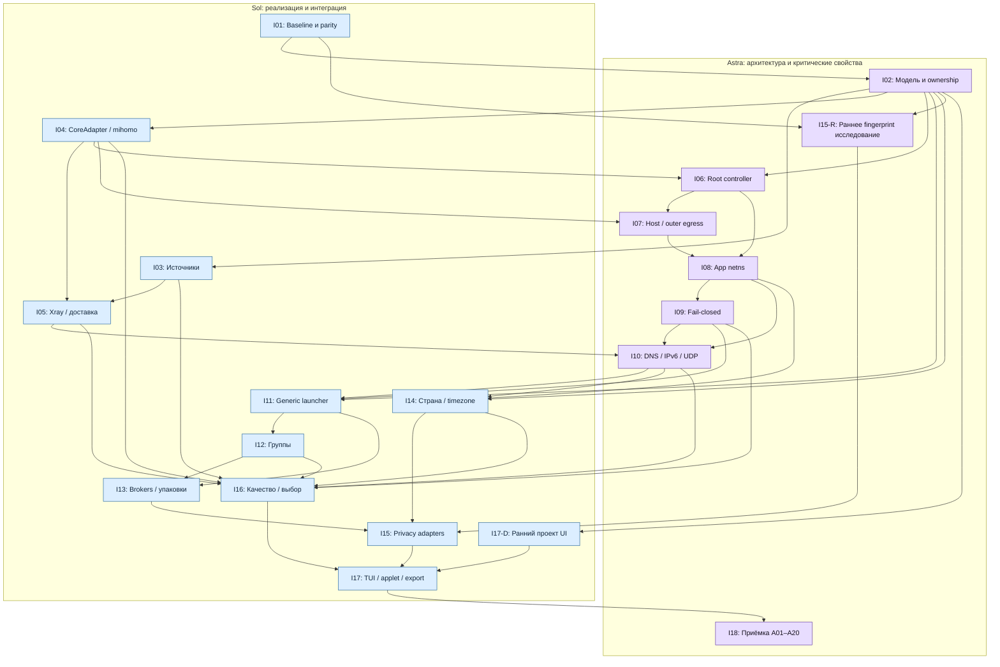
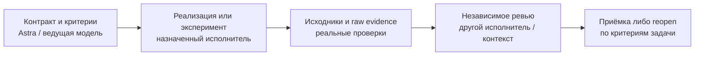

# CM: сводная схема работ и распределение моделей

Дата: 2026-10-03. **Для I01 пользователь разрешил начать работу отдельных исполнителей и ревью; остальные назначения предложены для будущих направлений.** Координатор пишет тестовые контракты и допуски, тесты исполняет другой исполнитель. N=18, 20 внутренних рубежей и 100 задач сохраняются. Пакет не собирается. Это дополнение к [детальному плану](DETAILED-DAG-PLAN.md), а не новый граф исполнения.

[Назначения моделей](MODEL-WORKFLOW.json) · [Mermaid для экспорта](MODEL-WORKFLOW.mmd) · [Канонические зависимости](DAG-PLAN.json).

## 1. Основание выбора

Официальная документация описывает Astra как наиболее сильную модель для сложного анализа, Sol — как вариант для сложных технических работ, Luna — для ограниченных задач. Это исходная рекомендация, которую следует проверять на одинаковых входах. Наша конкретная раскладка по CM — инженерное предложение, а не сравнительный benchmark проекта. [OpenAI: model selection](https://developers.openai.com/api/docs/guides/model-selection).

Для будущего запуска используются доступные в текущей среде IDs `gpt-6-astra`, `gpt-6.1-sol`, `gpt-6-luna`. База — `high` для основных задач и `medium` для вспомогательных. `xhigh` — кандидат для сложной диагностики, security review и fingerprint исследования после сравнения с high; повышение effort без доказанного выигрыша не считается гарантией качества. Реальная доступность и настройки перепроверяются в момент запуска. [OpenAI: reasoning effort](https://developers.openai.com/api/docs/guides/reasoning).

При приоритете максимального качества Astra ведёт архитектуру и наиболее опасные системные изменения; Sol реализует адаптеры, launcher, интеграции и интерфейс. Критический код не ограничивается дешёвым исполнителем: при неоднозначности или повторном провале задача передаётся Astra с воспроизводимым контрпримером. Luna не принимает security/privacy решения и не формулирует итоговый verdict сетевых тестов.

## 2. Точная диаграмма по ведущей модели

Стрелки полностью соответствуют DAG-PLAN.json. Группы показывают ведущую модель рубежа, а не право одной модели самостоятельно принять свою работу. Поддержка Luna и внешний Grok вынесены в роли ниже: их наличие не добавляет зависимостей в DAG.

I15-R и I17-D остаются частями I15/I17. Основная длинная цепочка проходит через I01 → I02 → I04 → I06–I10 → I11–I13 → I15 → I17 → I18; Xray, регион и качество имеют дополнительные обязательные входы. Исследование отпечатка и макеты интерфейса стартуют рано после I02.

## 3. Раскладка по группам задач

| Группа | Направления/рубежи | Ведущая модель | Независимая проверка | Основание приёмки |
|---|---|---|---|---|
| Baseline и текущий VPN | I01 | Sol high; Astra разбирает спорную причинность | Astra по журналам и config provenance | Сопоставимые снимки и parity A/B/A, не догадка по 502 |
| Модель и ownership | I02 | Astra high | Sol проверяет реализуемость контрактов | Schema/generation/migration fixtures |
| Источники и ядра | I03–I05 | Sol high | Astra: capability gaps, defaults, update/rollback | Реальные endpoints и независимость instances |
| Привилегии и Linux сеть | I06–I10 | Astra high | Отдельный Sol review; финальный P0-review в свежем контексте Astra | Negative privilege, crash/reload и protocol capture |
| Generic apps и упаковки | I11–I13 | Sol high | Astra: фактический executor, IPC и handoff | Произвольные launch definitions; netns/cgroup actual executor |
| Региональное окружение | I14 | Sol high | Astra: ограничения наблюдений и locale | libc/app/browser, DST и stale/mismatch |
| Отпечаток: исследование | I15-R | Astra high; сравнение с xhigh при трудной гипотезе | Sol пытается воспроизвести и опровергнуть; Grok по желанию | HTTP/JS surfaces, workers/frames, источник каталога |
| Privacy integration | I15 | Sol high по принятому ADR | Astra: scope, state/account boundaries | Конкретные app/version surfaces и сохранность данных |
| Качество канала | I16 | Sol high | Astra: эксперимент и статистические выводы | Matched pilot, constraints, hysteresis и failure paths |
| TUI и апплет | I17-D, I17 | Sol high | Astra: правдивость статусов; Luna помогает с formatting | Runtime states, snapshots, redaction и локали |
| Сквозная приёмка | I18 | Astra high в отдельном контексте | Sol воспроизводит спорные проверки | A01–A20, P0 blockers и regression evidence |

Для задачи, которую выполняла Astra, Sol проверяет реализацию независимо; окончательное принятие P0 требует также свежего review по raw evidence. Повторная сессия той же модели не гарантирует независимости ошибок, поэтому отрицательные тесты и captures обязательны.

## 4. Цикл одной задачи

При отказе задача возвращается в работу новой revision; обратная связь не добавляет обратную стрелку к графу зависимостей. Downstream принимает только завершённый contract/evidence. Для исследования вместо code diff передаются эксперимент, наблюдения и ограничения; для UI mock не заменяет runtime.

Рецензент получает исходное задание, актуальный контракт, diff и raw evidence до чтения вывода автора. Его задача — найти failure scenario и попытаться опровергнуть результат. Несогласие решается дополнительным экспериментом или уточнением контракта, не голосованием моделей. Grok может дать дополнительную внешнюю критику A+C, DNS, fingerprint и release scope; версия его модели не задана и роль не считается доказанно сильнее других.

## 5. Контекст и организация будущих запусков

- Один координатор хранит DAG, решения Q01–Q27, interfaces и evidence registry; предлагает изменения scope, но не скрывает открытые P0.
- Каждому исполнителю передаются task IDs, завершённые prerequisites, необходимые файлы, ownership области, критерии и формат evidence. Общая история — справочный материал; текущие канонические решения — рабочий контракт.
- Разные исполнители не редактируют общий файл одновременно. Схема, CoreAdapter и root protocol сначала согласуются; интеграция выполняется последовательно по принятым revisions.
- Network fault injection, смена host VPN и запуск изменённого helper на одном реальном хосте сериализуются. Независимость направлений по DAG не делает одновременные сетевые испытания сопоставимыми.
- Допустимы независимые исследования I15-R, макеты I17-D и работа над I03/I04 после их входов. Финальная интеграция сохраняет все зависимости.
- Передача внешнему Grok — только по отдельному поручению и с обезличенными материалами; автоматической отправки в этой работе нет.

Пользователь поручил начать I01 в согласованной схеме. Практическая раскладка для среды с четырьмя слотами: координатор, исполнитель исходного изменения, отдельный исполнитель тестов, рецензент. Это распределение ролей, а не четыре параллельных изменения root/сети; реальные сетевые проверки сериализованы у одного исполнителя.

## 6. Pilot выбора моделей и условия смены роли

Первый контрольный набор: разбор диагностического evidence I01, контракт сущностей I02 и один отрицательный сценарий ownership I06. Astra и Sol получают одинаковые исходные материалы в отдельных контекстах. Оценивать правильность фактов, сохранность требований, найденные контрпримеры, воспроизводимость и число существенных замечаний после ревью; для кода — также реальные проверки.

Выигрыш high/xhigh и точная раскладка подтверждаются этим pilot, а не названием модели. Если модель пропускает P0, не удерживает contract или не воспроизводит эксперимент, задачу передать более сильному/другому исполнителю и повторить затронутую приёмку. При отсутствии Astra её приёмка не объявляется выполненной автоматически: временный reviewer и границы качества фиксируются отдельно.

Машинное описание хранит только предложенные роли. Статусы выполнения и зависимости остаются в DAG-PLAN.json; завершение работы оценивается по evidence, а не факту использования рекомендованной модели.
