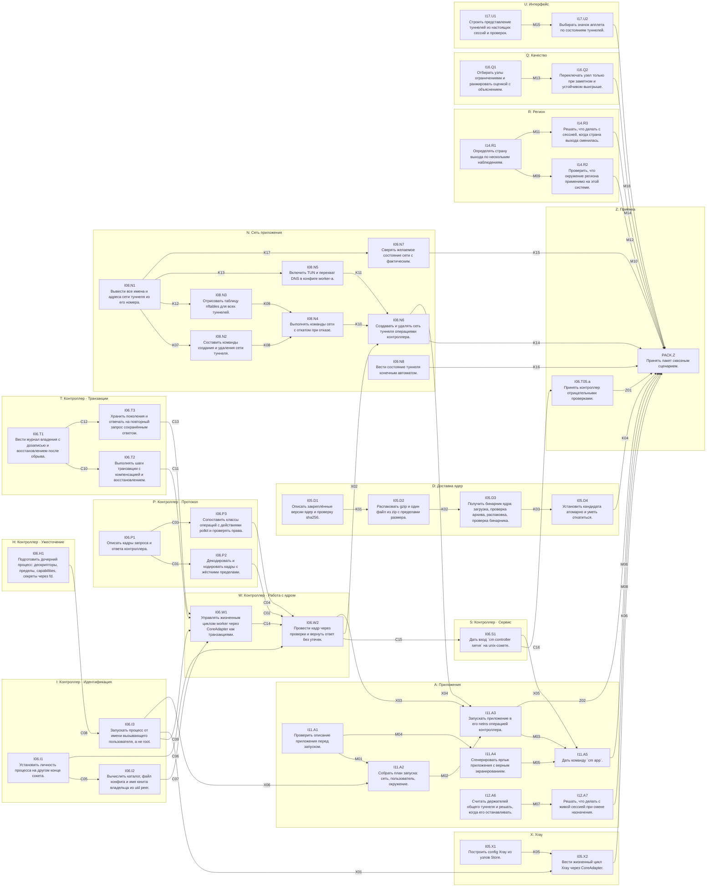

# Единый пакет: контроллер, ядра, сеть приложения, запуск, регион, качество, интерфейс — DAG

Дата: 2026-10-10. Источник: [tools/pack_dag.py](tools/pack_dag.py) (правится только он). Основания: [ADR-CONTROLLER.md](ADR-CONTROLLER.md), [ADR-WORKER-TOPOLOGY.md](ADR-WORKER-TOPOLOGY.md), [ADR-TUN-OWNERSHIP.md](ADR-TUN-OWNERSHIP.md), [I05-GAPS.md](I05-GAPS.md), [ADR-BROWSER-IDENTITY.md](ADR-BROWSER-IDENTITY.md), [ADR-PACKET-FLOW.md](ADR-PACKET-FLOW.md).

Схема:
- **направление** — группа вершин одной темы;
- **вершина** — одна задача (одно предложение);
- **ребро** u → v — контракт: что u гарантирует v, как это проверить и с какими значениями.

Роли:
- **роль 1** (Grok) пишет код всех вершин за один проход — [GROK-PACK-CODE.md](GROK-PACK-CODE.md);
- **роль 2** пишет тесты и проверки по рёбрам следующей итерацией — [TESTS-PACK.md](TESTS-PACK.md).

Пакет собирает всё, что можно закодировать сейчас без новых решений пользователя и без проверок на установленной системе.
Данные пакета — `tools/i06_dag.py`, `tools/pack_core.py`, `tools/pack_apps.py`; этот документ — их объединение.

**Путь данных приложения проверен лабораторией** (`tools/packet_flow_lab.sh`, 2026-10-10, mihomo 1.19.32):
- приложение живёт в своём netns с одним veth; на хосте правило `iif veth → таблица → TUN worker-а`; worker остаётся в сети хоста;
- запрос из netns проходит через TUN (HTTP 200, ядро насчитало трафик);
- после `kill -9` worker-а и после удаления TUN запрос не проходит (тайм-аут): маршрут `blackhole` удерживает блокировку;
- без правил CM прямой путь существует, то есть блокируют именно правила.

**Что в пакет не вошло и почему:**
- режимы хоста и outer egress (I07): CM должен забрать маршруты у нынешнего VPN хоста; нужен отдельный packet-flow для хоста и проверка на установленной системе;
- путь данных Xray для приложений (I05.T02): у Xray нет TUN-режима, проверенного лабораторией; в пакете Xray работает только как прокси на порту;
- исключения для локальных сетей и сервисов приложений (I08.T01.a, Q09): действует строгий вариант — запрещено всё, кроме своего туннеля, включая адреса самого хоста; адресных исключений нет;
- упаковки Flatpak и AppImage (I13), границы HOME и keyring (I15.T02): нужны замеры на настоящих приложениях;
- каталог устройств (I15-R.T04–T05): решения Q26/Q27 за пользователем;
- cgroup-область на сессию и запись `Session` в Store при запуске: нужен делегированный cgroup или `systemd-run`;
- проверки на установке (X), приёмка (I18).

Столбец «Закрывает» в брифе связывает вершину с подзадачей общего плана.

## Направления

| | Направление | Цель | Вершины |
|---|---|---|---|
| P | Контроллер · Протокол | Типизированные кадры с версией, жёсткий декодер, отдельные действия polkit по классам операций. | I06.P1, I06.P2, I06.P3 |
| I | Контроллер · Идентификация | Кто просит: только из сокета и ядра, никогда из тела запроса; чьё это: путь и имя из uid peer. | I06.I1, I06.I2, I06.I3 |
| H | Контроллер · Ужесточение | Дочерний процесс получает только то, что ему положено: uid вызывающего, без capabilities и чужих дескрипторов. | I06.H1 |
| T | Контроллер · Транзакции | Журнал владения, компенсация при частичном отказе, поколения и идемпотентность. | I06.T1, I06.T2, I06.T3 |
| W | Контроллер · Работа с ядром | Жизненный цикл worker только через контроллер и CoreAdapter. | I06.W1, I06.W2 |
| S | Контроллер · Сервис | Вход `cm controller serve` и связка всех частей. | I06.S1 |
| D | Доставка ядер | Скачать закреплённую версию, проверить, распаковать с пределами, установить атомарно с откатом. | I05.D1, I05.D2, I05.D3, I05.D4 |
| X | Xray | Конфиг и жизненный цикл второго ядра через тот же CoreAdapter. | I05.X1, I05.X2 |
| N | Сеть приложения | Свой netns на туннель: veth → правило iif → таблица → TUN worker-а; при сбое трафик блокируется. | I08.N1, I08.N2, I08.N3, I08.N4, I08.N5, I08.N6, I09.N7, I09.N8 |
| A | Приложения | Проверенный запуск приложения в своей сети под своим uid; ярлыки; общий туннель группы. | I11.A1, I11.A2, I11.A3, I11.A4, I11.A5, I12.A6, I12.A7 |
| R | Регион | Страна выхода по нескольким наблюдениям; окружение процесса; что делать, когда страна сменилась. | I14.R1, I14.R2, I14.R3 |
| Q | Качество | Объяснимый выбор узла: сначала ограничения, потом оценка, без дёрганья. | I16.Q1, I16.Q2 |
| U | Интерфейс | Настоящие состояния туннелей вместо макета — в TUI и апплете. | I17.U1, I17.U2 |
| Z | Приёмка | Отрицательные проверки контроллера и сквозной сценарий: приложение в своей сети выходит только через свой туннель. | I06.T05.a, PACK.Z |

## Граф

Стрелка — ребро с контрактом, подпись — id ребра.

## Вершины

| Вершина | Задача | Размер | Уровень | Зависит от | Файлы |
|---|---|---|---|---|---|
| `I06.P1` | Описать кадры запроса и ответа контроллера. | S | L1 | — | `src/controller/mod.rs`, `src/controller/protocol.rs`, `src/lib.rs` |
| `I06.P2` | Декодировать и кодировать кадры с жёсткими пределами. | M | L1 | I06.P1 | `src/controller/codec.rs` |
| `I06.P3` | Сопоставить классы операций с действиями polkit и проверять права. | M | L1 | I06.P1 | `src/controller/actions.rs`, `src/helper/auth.rs`, `src/main.rs`, `src/i18n_table.rs` |
| `I06.I1` | Установить личность процесса на другом конце сокета. | M | L1 | — | `src/controller/peer.rs` |
| `I06.I2` | Вычислить каталог, файл конфига и имя юнита владельца из uid peer. | M | L1 | I06.I1 | `src/controller/owner.rs`, `src/core/unit.rs` |
| `I06.H1` | Подготовить дочерний процесс: дескрипторы, пределы, capabilities, секреты через fd. | M | L1 | — | `src/controller/harden.rs` |
| `I06.I3` | Запускать процесс от имени вызывающего пользователя, а не root. | M | L2 | I06.H1 | `src/controller/drop.rs`, `src/core/mihomo/lifecycle.rs` |
| `I06.T1` | Вести журнал владения с дозаписью и восстановлением после обрыва. | M | L1 | — | `src/controller/journal.rs` |
| `I06.T2` | Выполнять шаги транзакции с компенсацией и восстановлением. | L | L1 | I06.T1 | `src/controller/txn.rs` |
| `I06.T3` | Хранить поколения и отвечать на повторный запрос сохранённым ответом. | M | L1 | I06.T1 | `src/controller/registry.rs` |
| `I06.W1` | Управлять жизненным циклом worker через CoreAdapter как транзакциями. | L | L2 | I06.T2, I06.T3, I06.I2, I06.I3 | `src/controller/core_ops.rs` |
| `I06.W2` | Провести кадр через проверки и вернуть ответ без утечек. | M | L1 | I06.P2, I06.P3, I06.I1, I06.W1 | `src/controller/dispatch.rs` |
| `I06.S1` | Дать вход `cm controller serve` на unix-сокете. | M | L2 | I06.W2 | `src/controller/server.rs`, `src/main.rs` |
| `I06.T05.a` | Принять контроллер отрицательными проверками. | M | L2 | I06.S1 | `docs/design/cm-network-manager/i06-evidence/<дата>/summary.json` |
| `I05.D1` | Описать закреплённые версии ядер и проверку sha256. | S | L1 | — | `src/core/delivery/mod.rs`, `src/core/delivery/pin.rs`, `src/core/mod.rs` |
| `I05.D2` | Распаковать gzip и один файл из zip с пределами размера. | M | L1 | I05.D1 | `src/core/delivery/unpack.rs` |
| `I05.D3` | Получить бинарник ядра: загрузка, проверка архива, распаковка, проверка бинарника. | M | L1 | I05.D2 | `src/core/delivery/fetch.rs` |
| `I05.D4` | Установить кандидата атомарно и уметь откатиться. | M | L1 | I05.D3 | `src/core/delivery/install.rs` |
| `I05.X1` | Построить config Xray из узлов Store. | L | L1 | — | `src/core/xray/mod.rs`, `src/core/xray/config.rs`, `src/core/mod.rs` |
| `I05.X2` | Вести жизненный цикл Xray через CoreAdapter. | L | L2 | I05.X1, I06.I3 | `src/core/xray/lifecycle.rs` |
| `I08.N1` | Вывести все имена и адреса сети туннеля из его номера. | S | L1 | — | `src/net/mod.rs`, `src/net/plan.rs`, `src/lib.rs` |
| `I08.N2` | Составить команды создания и удаления сети туннеля. | M | L1 | I08.N1 | `src/net/commands.rs` |
| `I08.N3` | Отрисовать таблицу nftables для всех туннелей. | S | L1 | I08.N1 | `src/net/firewall.rs` |
| `I08.N4` | Выполнять команды сети с откатом при отказе. | M | L2 | I08.N2, I08.N3 | `src/net/exec.rs` |
| `I08.N5` | Включить TUN и перехват DNS в конфиге worker-а. | M | L2 | I08.N1 | `src/core/mihomo/config.rs` |
| `I08.N6` | Создавать и удалять сеть туннеля операциями контроллера. | L | L2 | I08.N4, I08.N5, I06.W2 | `src/controller/net_ops.rs`, `src/controller/dispatch.rs`, `src/core/leases.rs` |
| `I09.N7` | Сверять желаемое состояние сети с фактическим. | M | L1 | I08.N1 | `src/net/observe.rs` |
| `I09.N8` | Вести состояние туннеля конечным автоматом. | S | L1 | — | `src/net/state.rs` |
| `I11.A1` | Проверить описание приложения перед запуском. | M | L1 | — | `src/app/mod.rs`, `src/app/spec.rs`, `src/lib.rs` |
| `I11.A2` | Собрать план запуска: сеть, пользователь, окружение. | M | L1 | I11.A1, I06.I3 | `src/app/plan.rs`, `src/identity/plan.rs` |
| `I11.A3` | Запускать приложение в его netns операцией контроллера. | L | L2 | I11.A2, I06.W2, I08.N6 | `src/controller/app_ops.rs`, `src/controller/dispatch.rs`, `src/controller/drop.rs` |
| `I11.A4` | Сгенерировать ярлык приложения с верным экранированием. | S | L1 | I11.A1 | `src/app/desktop.rs` |
| `I11.A5` | Дать команду `cm app`. | M | L1 | I11.A3, I11.A4, I06.S1 | `src/app/cli.rs`, `src/main.rs`, `src/i18n_table.rs` |
| `I12.A6` | Считать держателей общего туннеля и решать, когда его останавливать. | M | L1 | — | `src/app/shared.rs` |
| `I12.A7` | Решать, что делать с живой сессией при смене назначения. | S | L1 | I12.A6 | `src/app/reassign.rs` |
| `I14.R1` | Определять страну выхода по нескольким наблюдениям. | M | L1 | — | `src/env/mod.rs`, `src/env/geo.rs`, `src/lib.rs` |
| `I14.R2` | Проверить, что окружение региона применимо на этой системе. | S | L1 | I14.R1 | `src/env/apply.rs` |
| `I14.R3` | Решать, что делать с сессией, когда страна выхода сменилась. | S | L1 | I14.R1 | `src/env/invalidate.rs` |
| `I16.Q1` | Отбирать узлы ограничениями и ранжировать оценкой с объяснением. | M | L1 | — | `src/quality/mod.rs`, `src/quality/score.rs`, `src/lib.rs` |
| `I16.Q2` | Переключать узел только при заметном и устойчивом выигрыше. | S | L1 | I16.Q1 | `src/quality/switch.rs` |
| `I17.U1` | Строить представление туннелей из настоящих сессий и проверок. | M | L1 | — | `src/status/tunnels.rs`, `src/status.rs`, `src/tui/mock_tunnels.rs` |
| `I17.U2` | Выбирать значок апплета по состояниям туннелей. | S | L1 | I17.U1 | `cosmic/src/tunnel_icons.rs` |
| `PACK.Z` | Принять пакет сквозным сценарием. | L | L2 | I06.T05.a, I05.D4, I05.X2, I08.N6, I09.N7, I09.N8, I11.A3, I11.A5, I12.A7, I14.R2, I14.R3, I16.Q2, I17.U2 | `docs/design/cm-network-manager/pack-evidence/<дата>/summary.json` |

## Рёбра: контракт, проверка, значения

### C01 · I06.P1 → I06.P2 (L1)

- **Контракт:** Кадр несёт только версию, ключ и операцию; uid, путей и байтов конфига в схеме нет.
- **Как проверить:** `tests/audit_i06_protocol.rs`: сериализация и разбор образцов.
- **Значения:**
  - `{"v":1,"id":"a1b2c3d4-0001","op":{"type":"worker_start","instance":"browser","generation":7}}` ⇄ Request{v 1, id, WorkerStart{browser, 7}} (roundtrip)
  - классы: WorkerStatus → Status; WorkerStart, WorkerReload, WorkerStop, Reconcile → Worker; NetApply, NetRevert → Net; AppLaunch → App
  - Op::instance(): Reconcile → None, остальные → Some
  - ControlError::code(): BadFrame → "bad_frame", GenerationMismatch → "generation_mismatch", PeerChanged → "peer_changed"; все 18 кодов различны и состоят из [a-z_]
  - Reply::ok("k", Started{generation 7}) → `{"v":1,"id":"k","ok":true,"code":"ok","data":{"type":"started","generation":7}}`
  - Reply::error("k", Denied) → ok false, code "denied", data null

### C02 · I06.P2 → I06.W2 (L1)

- **Контракт:** Декодер отвергает всё, что не является точным кадром версии 1, и не читает больше 64 КиБ.
- **Как проверить:** `tests/audit_i06_protocol.rs`: табличный тест и детерминированная мутация.
- **Значения:**
  - кадр длиной 65537 байт → TooLarge; ровно 65536 байт корректного JSON с длинным id → BadId (не TooLarge)
  - `not json`, `{}`, `[]`, байты 0xFF → BadFrame
  - лишнее поле: `{"v":1,"id":"a1b2c3d4-0001","uid":0,"op":{…}}` → BadFrame; лишнее поле внутри op (`"uid":0`, `"path":"/x"`) → BadFrame
  - неизвестный type `"worker_kill"` → BadFrame
  - v 0 и v 2 → UnsupportedVersion
  - id "short", "UPPER-CASE-1", "a b c d e f g h", 65 символов → BadId
  - instance "", "-x", "A", "a/b", "../x", 33 символа → BadInstance
  - WorkerReload generation 5 next 5 и next 4 → BadArgument; next 6 → Ok
  - AppLaunch program "firefox", "/usr/../bin/sh", с NUL → BadArgument; 65 аргументов → BadArgument; аргумент 4097 байт → BadArgument
  - read_frame: поток «кадр на 70000 байт\n» + корректный кадр → первый TooLarge, второй читается целиком
  - read_frame: пустой поток → Ok(None); «abc» без \n → BadFrame
  - encode(reply) оканчивается одним \n и не содержит \n внутри
  - мутация: 100000 кадров из корректного образца с детерминированным PRNG (xorshift, seed 1) — замена, вставка, удаление байта: decode не паникует и возвращает Ok либо один из кодов BadFrame, TooLarge, UnsupportedVersion, BadId, BadInstance, BadArgument
  - request_digest одинаков для одинаковых op и различен для WorkerStart{browser,7} и WorkerStart{browser,8}; не зависит от id

### C03 · I06.P1 → I06.P3 (L1)

- **Контракт:** У каждого класса операций своё действие polkit; `manage` не используется.
- **Как проверить:** `tests/audit_i06_protocol.rs` и существующий тест политики в `src/main.rs`.
- **Значения:**
  - action_for(Status) == "io.github.cm.status"; Worker → "io.github.cm.worker"; Net → "io.github.cm.net"; App → "io.github.cm.app"
  - сгенерированная политика содержит `<action id="io.github.cm.worker">` с allow_active yes, `io.github.cm.net` с allow_active auth_admin_keep и allow_any auth_admin, `io.github.cm.app` с allow_active yes
  - у каждого нового действия есть message на en и переводы ru, de, it, zh, ar

### C04 · I06.P3 → I06.W2 (L1)

- **Контракт:** Проверка прав получает личность peer целиком и не знает uid из запроса; реализация pkcheck одна.
- **Как проверить:** `tests/audit_i06_protocol.rs` (подменный Authorizer) и `tests/audit_contracts.rs`-подобная проверка исходников.
- **Значения:**
  - PolkitAuthorizer: peer uid 0 → Ok без запуска pkcheck (PATH без pkcheck)
  - test_mode и CM_HELPER_ALLOW=1 → Ok; CM_HELPER_ALLOW=1 без test_mode → pkcheck вызывается (PATH с подставным pkcheck, который пишет аргументы в файл и выходит 1) → Denied
  - подставной pkcheck получает `--action-id io.github.cm.worker --process <pid>,<start>,<uid>` с pid и start_time из PeerIdentity
  - в `src/helper/*.rs` нет строки `Command::new("pkcheck")`; она есть ровно в одном файле — `src/controller/actions.rs`
  - существующие тесты helper (gate) проходят без изменений

### C05 · I06.I1 → I06.I2 (L1)

- **Контракт:** uid, gid и pid берутся только из SO_PEERCRED; подмена PID после захвата обнаруживается.
- **Как проверить:** `tests/audit_i06_peer.rs`: socketpair и дочерние процессы.
- **Значения:**
  - capture на socketpair внутри одного процесса → uid == euid, pid == getpid(), start_time == поле 22 /proc/self/stat
  - parse_start_time("1234 (a b) c) S 1 1 1 0 -1 4194560 1 0 0 0 0 0 0 0 20 0 1 0 987654 0 0") → Some(987654)
  - parse_cgroup("0::/user.slice/user-1000.slice/session-3.scope\n") → Some("/user.slice/user-1000.slice/session-3.scope"); пустой текст → None
  - session_of("/user.slice/user-1000.slice/session-3.scope") → Some("3"); session_of("/user.slice/user-1000.slice/user@1000.service/app.slice/x.scope") → None
  - netns_inode == st_ino /proc/self/ns/net
  - дочерний процесс открывает сокет и завершается; после wait: identity.alive() == false, verify() → Err(PeerChanged)
  - живой дочерний процесс: alive() == true, verify() == Ok
  - format!("{:?}", identity) не содержит пути cgroup

### C06 · I06.I1 → I06.W2 (L1)

- **Контракт:** Диспетчер проверяет личность перед каждой операцией, а не один раз на соединение.
- **Как проверить:** `tests/audit_i06_dispatch.rs`.
- **Значения:**
  - peer завершился между двумя кадрами одного соединения → второй ответ code "peer_changed", фабрика адаптеров не вызвана

### C07 · I06.I2 → I06.W1 (L1)

- **Контракт:** Каталог, конфиг и имя юнита однозначно определяются uid peer и именем экземпляра; чужой файл не читается.
- **Как проверить:** `tests/audit_i06_owner.rs` в `TempDirGuard`.
- **Значения:**
  - owned("/b", 1000, "browser") → root "/b/u1000", unit "cm-core-u1000-browser.service"
  - config_path(7) == "/b/u1000/instances/browser/config/gen-7.json"; journal_path == "/b/u1000/journal.jsonl"
  - owned(base, 1000, "../x") → Err(BadInstance)
  - create_owned(browser, {uid, gid}) под euid == uid: <root>, instances, instances/browser, core, core/check — права 0711; config, cache, run — 0700; повторный вызов не меняет результат
  - create_owned: config — заранее созданный симлинк → Err(UnsafePath), цель симлинка не тронута
  - контроллер и клиент под разными uid (L2, `unshare -U --map-root-user --map-auto`): после instance_prepare каталоги контроллера принадлежат uid 0, config/cache/run — uid клиента; клиент не может создать запись в instances/browser и в core; core/config.json — файл uid клиента 0600; journal.jsonl и core.pid — uid 0, 0600
  - после `kill -9` ядра: worker_status → running false, generation прежний, оси down; worker_stop с этим поколением → ok; затем worker_start → ok
  - read_owned_config: обычный файл 0600 владельца → Ok с теми же байтами
  - файл — симлинк на существующий файл → InvalidConfig; каталог config — симлинк → InvalidConfig
  - права 0666 → InvalidConfig; размер MAX_CONFIG_BYTES + 1 → InvalidConfig; файла нет → InvalidConfig
  - владелец файла ≠ owned.uid (owned с uid euid+1 при том же файле) → InvalidConfig
  - render_user_core_unit("/var/lib/cm/users/u1000", 1000, browser, default) содержит строки `User=1000`, `ReadWritePaths=-/var/lib/cm/users/u1000/instances/browser`, `RuntimeDirectory=cm-core-u1000-browser`
  - render_core_unit для того же id не изменился (нет `User=`)

### C08 · I06.H1 → I06.I3 (L1)

- **Контракт:** Дочерний процесс не наследует дескрипторы, capabilities и возможность их вернуть.
- **Как проверить:** `tests/audit_i06_harden.rs`: дочерний `/bin/sh -c` печатает /proc/self/status и список /proc/self/fd.
- **Значения:**
  - родитель открыл файл без O_CLOEXEC (fd ≥ 3): в дочернем /proc/self/fd только 0, 1, 2 и дескриптор самого ls
  - keep_fds [N]: дескриптор N в дочернем открыт, остальные ≥ 3 закрыты
  - в /proc/self/status дочернего: `NoNewPrivs:\t1`, `CapAmb:\t0000000000000000`, `CapBnd:\t0000000000000000`
  - `ulimit -n` в дочернем → 4096; `ulimit -c` → 0
  - secret_fd(b"secret-marker"): чтение даёт те же 13 байт; запись → ошибка EPERM; F_GET_SEALS содержит WRITE, GROW, SHRINK, SEAL
  - secret_fd: флаг FD_CLOEXEC установлен

### C09 · I06.I3 → I06.W1 (L2)

- **Контракт:** Процесс worker и приложения работает под uid, gid и группами вызывающего и не может вернуть root.
- **Как проверить:** `tests/audit_i06_drop.rs`: внутри `unshare --user --map-users` с подчинённым uid, как `tests/audit_i04_tun.rs`.
- **Значения:**
  - spawn_as(RunAs{uid 1, gid 1, groups [1]}, /usr/bin/id, ["-u"]) → вывод "1"; `id -g` → "1"; `id -G` → "1"
  - дочерний `sh -c 'cat /proc/self/status'`: `CapEff:\t0000000000000000`, `NoNewPrivs:\t1`
  - env: передан {A=1} при родителе с SECRET_TOKEN=x → в дочернем `env` только A=1
  - spawn_as с program "id" (не абсолютный) → Err(BadArgument)
  - MihomoWorker без set_run_as: существующий `audit_i04_lifecycle` проходит без изменений
  - MihomoWorker с set_run_as(uid 1): процесс ядра в harness имеет Uid 1 в /proc/<pid>/status (L2, с CM_TEST_MIHOMO)

### C10 · I06.T1 → I06.T2 (L1)

- **Контракт:** Журнал переживает обрыв записи и восстанавливает состояние каждой транзакции.
- **Как проверить:** `tests/audit_i06_journal.rs` в `TempDirGuard`.
- **Значения:**
  - open создаёт файл 0600; путь-симлинк → Err(Failed)
  - Begin → Pending; Begin, Step(a), Commit(reply "R") → Committed, steps_done [a], reply Some("R")
  - Begin, Step(a), Abort → Aborted; Begin, Step(a), Compensated → Aborted; Begin, CompensationFailed → Dirty
  - к файлу дописано `{"txn":"x","ev` без \n: replay возвращает прежние транзакции; после open + append файл состоит только из целых строк
  - две транзакции вперемешку: replay в порядке их Begin
  - compact при файле > 1 МиБ из 5000 Committed и 2 Pending: остаются 2 Pending и 256 последних Committed; размер < 1 МиБ

### C11 · I06.T2 → I06.W1 (L1)

- **Контракт:** При отказе шага выполненное откатывается в обратном порядке; обрыв процесса оставляет след, по которому reconcile завершает откат.
- **Как проверить:** `tests/audit_i06_txn.rs`: шаги-счётчики, записывающие порядок вызовов.
- **Значения:**
  - шаги A, B, C успешны → вызовы [A.apply, B.apply, C.apply], журнал Begin, Step A, Step B, Step C, Commit; результат Ok
  - B.apply → Err(Timeout): вызовы [A.apply, B.apply, A.compensate], журнал Begin, Step A, Abort; результат Err(Timeout)
  - C.apply → Err(Failed): компенсации в порядке [B.compensate, A.compensate]
  - B.apply ошибка и A.compensate ошибка → журнал … CompensationFailed, результат Err(Failed), статус Dirty
  - crash_before("B"): вызовы [A.apply], результат Err(Crashed), журнал Begin, Step A — статус Pending
  - после этого reconcile: вызовы [A.compensate], возвращает 1, статус Aborted; повторный reconcile возвращает 0 и ничего не вызывает
  - crash_before("commit") после трёх шагов → Pending с steps_done [A, B, C]; reconcile вызывает [C.compensate, B.compensate, A.compensate]
  - обрыв на каждом из шагов и на commit (4 точки): после reconcile ни одной Pending

### C12 · I06.T1 → I06.T3 (L1)

- **Контракт:** Повторный запрос с тем же ключом не выполняется второй раз.
- **Как проверить:** `tests/audit_i06_txn.rs`.
- **Значения:**
  - нет транзакции → Fresh
  - Committed с reply "R" и тем же digest → Stored("R")
  - тот же txn, другой digest → Err(Conflict)
  - Pending с тем же digest → Err(Conflict)

### C13 · I06.T3 → I06.W1 (L1)

- **Контракт:** Устаревшее поколение отвергается; поколение хранится атомарно и по uid.
- **Как проверить:** `tests/audit_i06_txn.rs`.
- **Значения:**
  - check_start(None, 1) Ok; check_start(Some(3), 3) Ok; check_start(Some(3), 4) Ok; check_start(Some(3), 2) → GenerationMismatch
  - check_running(None, 1) → NotRunning; check_running(Some(3), 3) Ok; check_running(Some(3), 2) и (Some(3), 4) → GenerationMismatch
  - Generations: set(browser, 7), load заново → current(browser) == Some(7); clear → None; файл 0600
  - оставленный generations.json.tmp с мусором не влияет на load

### C14 · I06.W1 → I06.W2 (L2)

- **Контракт:** Жизненный цикл worker идёт только через контроллер; отказ адаптера не оставляет следов; экземпляры разных uid не видят друг друга.
- **Как проверить:** `tests/audit_i06_core_ops.rs`: `AdapterFactory`, выдающая `core::FakeAdapter`; base в `TempDirGuard`; конфиги `gen-N.json` пишет тест.
- **Значения:**
  - start(browser, gen 1) → Started{1}; status → running true, generation Some(1), api "api_ready"
  - повторный start с тем же txn → тот же ответ, фабрика вызвана 1 раз
  - start(browser, gen 1) с новым txn при работающем → Err(Conflict)
  - start с gen 0 при текущем 1 (после stop и нового start gen 1) → Err(GenerationMismatch)
  - нет файла gen-2.json: start gen 2 → Err(InvalidConfig), фабрика не вызвана
  - reload(gen 1 → 2) → Ok, status generation Some(2); reload(gen 1 → 3) после этого → Err(GenerationMismatch)
  - адаптер отказал в reload (fail_next Reload InvalidConfig) → Err(InvalidConfig), status generation прежнее, generations.json прежний
  - stop(gen 2) → Ok; status → running false, generation None; stop ещё раз (новый txn) → Err(NotRunning)
  - адаптер отказал в start (fail_next Start Failed) → Err(Failed); status running false; generations.json без browser; журнал: транзакция Aborted
  - 17-й экземпляр того же uid → Err(Quota); первый экземпляр другого uid при этом стартует
  - экземпляр browser uid 1000 запущен: status(owned uid 1001, browser) → running false
  - CoreError → ControlError: Unsupported → Unsupported, Busy → Busy, RouteUnavailable → Failed

### C15 · I06.W2 → I06.S1 (L1)

- **Контракт:** Каждый кадр проходит один и тот же порядок проверок; ответ не содержит ничего кроме кода и данных ответа.
- **Как проверить:** `tests/audit_i06_dispatch.rs`: `handle` с подменными Authorizer и фабрикой.
- **Значения:**
  - мусорный кадр → `{"v":1,"id":"","ok":false,"code":"bad_frame","data":null}`
  - Authorizer отказывает → code "denied"; фабрика не вызвана; каталог владельца не создан
  - Authorizer получает действие "io.github.cm.worker" для worker_start и "io.github.cm.status" для worker_status
  - worker_start от peer uid U читает конфиг только из <base>/u<U>/…; файл в <base>/u<U+1>/… с тем же именем не открывается (проверка: его нет в ответе и нет обращения — конфиг U отсутствует → invalid_config)
  - net_apply и app_launch при разрешающем Authorizer → code "unsupported"; при отказывающем → "denied" (права проверяются раньше)
  - MAX_CONCURRENT_OPS: 4 операции заняты (фабрика блокируется на барьере) → пятый кадр code "busy"; после освобождения — проходит
  - ни один ответ не содержит подстрок base-каталога, "gen-", "/proc", имени пользователя
  - reconcile → code "ok", data {type reconciled, compensated N}

### C16 · I06.S1 → I06.T05.a (L2)

- **Контракт:** Сервис на сокете выполняет полный сценарий worker и выдерживает отрицательные проверки.
- **Как проверить:** `tests/audit_i06_server.rs`: бинарник `cm controller serve` в `unshare -U --map-root-user --map-auto -n -m` (в `unshare -r` запрещён `setgroups`, и `worker_start` отвечает `failed`) с `CM_STATE_DIR`, `CM_HELPER_ALLOW=1`, `CM_CORE_BIN=$CM_TEST_MIHOMO`; клиент — unix-сокет из теста.
- **Значения:**
  - worker_start(gen 1) с конфигом из `audit_i04_lifecycle` → ok started; worker_status → running true, api "api_ready"; worker_stop → ok; после stop нет процессов ядра и аренд
  - тот же id повторно → тот же ответ, второй процесс ядра не появился
  - kill -9 контроллера посреди worker_start (точка `CM_CONTROLLER_CRASH_BEFORE=record_generation`, читается только в test_mode) → перезапуск, reconcile → compensated 1, процессов ядра нет, поколение не записано
  - устаревший запрос: worker_stop(gen 1) после reload до gen 2 → generation_mismatch, worker продолжает работать
  - argv/path-инъекция: instance "x;rm -rf", "$(id)", ".." → bad_instance; ни одного нового файла вне base
  - кадр 1 МиБ без \n → too_large и закрытие соединения; сервис продолжает принимать новые соединения
  - 33-е одновременное соединение закрывается сразу; первые 32 работают
  - SIGTERM сервису при работающем worker → код выхода 0, процессов ядра нет, сокет удалён
  - без test_mode и не от root: `cm controller serve --socket X` → код 4
  - чужой uid (L2, `unshare --user --map-users` с двумя uid): клиент uid B не может остановить worker uid A — worker_stop(browser) → not_running, worker A работает; в <base>/u<A> нет файлов, созданных от имени B
  - за весь прогон в выводе сервиса и ответах нет содержимого конфига (маркер `secret-marker-i06` в конфиге)

### K01 · I05.D1 → I05.D2 (L1)

- **Контракт:** Пины совпадают с I05-PIN.md, а проверка хеша отвергает любое расхождение.
- **Как проверить:** `tests/audit_pack_delivery.rs`.
- **Значения:**
  - pin(Mihomo).archive_sha256 == "ba3ce607747a07f948fc35780e108a4a7c7f552a38b9bd4d115f313ebcb89c20"; binary_sha256 == "7a0d59da2e678d56c899a3db996a2ad8963286c4f3634b0451435db248f13fa1"
  - pin(Xray).archive_sha256 == "23cd9af937744d97776ee35ecad4972cf4b2109d1e0fe6be9930467608f7c8ae"; binary_sha256 == "8255dd939c34cf966cc91517b6324dd3c8d0bcf49ffac8beca049a38c46845ed"; archive == Zip{member "xray"}
  - каждый url начинается с `https://github.com/` и содержит версию пина
  - verify_sha256(b"{}", "44136fa355b3678a1146ad16f7e8649e94fb4fc21fe77e8310c060f61caaff8a") Ok; тот же hex в верхнем регистре Ok; один изменённый символ → HashMismatch; строка 63 символа → HashMismatch
  - с `CM_TEST_MIHOMO`: sha256 файла ядра == pin(Mihomo).binary_sha256; с `CM_TEST_XRAY`: == pin(Xray).binary_sha256 (без переменных — SKIPPED)

### K02 · I05.D2 → I05.D3 (L1)

- **Контракт:** Распаковка не выдаёт больше предела и не паникует на произвольных байтах.
- **Как проверить:** `tests/audit_pack_delivery.rs`: архивы строятся в тесте (`flate2` и ручная сборка zip).
- **Значения:**
  - gzip из 1000 байт, max 1000 → Ok; max 999 → TooLarge; обрезанный на 10 байт → BadArchive
  - gzip-бомба: 64 МиБ нулей, max 1 МиБ → TooLarge, пик памяти теста не растёт до 64 МиБ (чтение через take)
  - zip с членами `LICENSE` и `xray` (deflate): member "xray" → его байты; member "nope" → MemberMissing
  - zip, где у `xray` заявлен размер 10, а в потоке 20 байт → BadArchive; заявлен размер > max → TooLarge
  - zip с неверным CRC → BadArchive; с флагом шифрования → BadArchive; метод 12 (bzip2) → BadArchive
  - member "../xray" и "a/xray" → MemberMissing; запись в архиве с именем `../xray` не выбирается по запросу "xray"
  - zip без EOCD, пустой вход, 22 байта мусора → BadArchive
  - мутация: 20000 вариантов корректного zip (xorshift, seed 1; замена, вставка, удаление байта) — без паник, результат Ok или один из кодов DeliveryError
  - с `CM_TEST_XRAY_ZIP` (скачанный Xray-linux-64.zip): unpack_zip_member("xray") даёт sha256 == pin(Xray).binary_sha256 (без переменной — SKIPPED)

### K03 · I05.D3 → I05.D4 (L1)

- **Контракт:** Наружу выходит только бинарник, прошедший обе проверки хеша.
- **Как проверить:** `tests/audit_pack_delivery.rs`: подменный `Download` и тестовый `Pin`.
- **Значения:**
  - корректный архив → Ok(binary); порядок вызовов: get один раз с max_bytes == pin.max_archive
  - архив с другим содержимым → HashMismatch, распаковка не вызывалась (архив-бомба с неверным хешем не распаковывается)
  - верный хеш архива, но binary_sha256 другой → HashMismatch
  - Download возвращает Fetch → Fetch; TooLarge → TooLarge
  - TransportDownload::get("http://example.invalid/x", 10) → Fetch (не https) без сетевого запроса

### K04 · I05.D4 → PACK.Z (L1)

- **Контракт:** Обрыв на любом шаге установки оставляет рабочий `current`; откат возвращает предыдущую версию.
- **Как проверить:** `tests/audit_pack_delivery.rs` в `TempDirGuard`.
- **Значения:**
  - install v1 → current указывает на versions/v1/mihomo, файл 0755, previous отсутствует
  - install v2 → current → v2, previous → v1; файл v1 на месте
  - probe возвращает строку без version_marker → VersionMismatch; current по-прежнему v2; каталога `.tmp` нет
  - accept возвращает ошибку → ConfigRejected; current по-прежнему v2
  - rollback → current → v1, previous → v2; ещё один rollback → current → v2
  - rollback без previous → NothingToRollBack
  - current — всегда симлинк; после каждого шага `readlink` даёт существующий исполняемый файл

### K05 · I05.X1 → I05.X2 (L1)

- **Контракт:** Каждый поддержанный узел даёт конфиг, который принимает закреплённый Xray; неподдержанное отклоняется явно.
- **Как проверить:** `tests/audit_pack_xray.rs`: точное сравнение JSON и `xray run -test` при `CM_TEST_XRAY`.
- **Значения:**
  - ss {server 203.0.113.8, port 443, cipher aes-128-gcm, password x} → `{"tag":"node","protocol":"shadowsocks","settings":{"servers":[{"address":"203.0.113.8","port":443,"method":"aes-128-gcm","password":"x"}]}}`
  - vless {uuid 11111111-2222-4333-8444-555555555555, tls true, servername example.invalid, network ws, ws-opts {path /p, headers {Host h.example}}} → protocol vless, users[0] {id, encryption none}, streamSettings {network ws, wsSettings {path /p, headers {Host h.example}}, security tls, tlsSettings {serverName example.invalid}}
  - vless с reality-opts {public-key K, short-id S} → security reality, realitySettings {serverName, publicKey K, shortId S, fingerprint chrome}
  - trojan {password x, sni example.invalid} → security tls всегда, tlsSettings.serverName example.invalid
  - vmess без alterId и cipher → alterId 0, security auto
  - ss с полем plugin → Err(Unsupported("field")); vless с полем smux → Err(Unsupported("field")); ws-opts с max-early-data → Err(Unsupported("field")); узел с udp: true и tfo: true → Ok, полей в результате нет; trojan с alpn [h2] → tlsSettings.alpn == ["h2"]
  - type tuic, hysteria2, wireguard, http, socks5 → Err(Unsupported(<type>)); network h2 → Err(Unsupported("network")); dialer-proxy → Err(Unsupported("dialer"))
  - порт 0 или 70000, uuid "x", нет server → Err(InvalidNode); текст ошибки не содержит адреса, пароля, uuid
  - generate_config(&[], 20000) → Empty; generate_config(nodes, 0) → InvalidPort
  - generate_config(ss, 20000): inbounds[0] == {tag cm, listen 127.0.0.1, port 20000, protocol mixed, settings {udp true}}; outbounds теги [node, direct, block]; routing.rules[0] == {type field, inboundTag [cm], outboundTag node}
  - с `CM_TEST_XRAY`: `xray run -test` принимает конфиг для ss, vmess, vless+ws+tls, vless+reality, trojan (без переменной — SKIPPED)

### K06 · I05.X2 → PACK.Z (L2)

- **Контракт:** Xray проходит тот же жизненный цикл, что mihomo, а отсутствие reload видно в capabilities и в коде ошибки.
- **Как проверить:** `tests/audit_pack_xray.rs`: внутри `unshare -rn` с `CM_TEST_XRAY`, upstream — локальный shadowsocks не нужен: outbound `freedom` через узел-заглушку недоступен, проверяется только lifecycle.
- **Значения:**
  - capabilities: core "xray", reload_without_restart false, delay_probe false
  - start → ApiReady, порт 127.0.0.1:<аренда> принимает TCP; config.json 0600 и содержит арендованный порт
  - reload → Err(Unsupported), процесс прежний (тот же pid)
  - restart с корректным конфигом → новый pid, порт принимает; restart с конфигом, который `-test` отвергает → Err(InvalidConfig), прежний pid жив
  - statistics → Err(Unsupported); health после kill -9 → DOWN
  - stop → нет процессов группы, аренды освобождены
  - документ с двумя входящими или listen 0.0.0.0 → start → Err(InvalidConfig), аренда не удержана
  - `audit_i04_lifecycle` (mihomo) проходит без изменений после выноса общего кода в src/core/process.rs

### K07 · I08.N1 → I08.N2 (L1)

- **Контракт:** Имена и адреса туннеля однозначны, не пересекаются между туннелями и укладываются в пределы ядра.
- **Как проверить:** `tests/audit_pack_net.rs`.
- **Значения:**
  - tunnel_net(0, 1000) == {netns cm-0, veth_host cmv0h, veth_ns cmv0n, host_addr 10.213.0.1/30, ns_addr 10.213.0.2/30, gateway 10.213.0.1, tun cmtun0, tun_addr 198.18.0.1/30, dns_addr 198.18.0.2, table 100, rule_priority 1000, mtu 1400, owner_uid 1000}
  - tunnel_net(63, 1000): veth_host cmv63h, host_addr 10.213.63.1/30, tun cmtun63, table 163, rule_priority 1063
  - tunnel_net(64, 1000) → Err(BadIndex)
  - для всех index 0..63: имена интерфейсов ≤ 15 символов; все имена, адреса, таблицы и приоритеты попарно различны

### K08 · I08.N2 → I08.N4 (L1)

- **Контракт:** Порядок команд не оставляет момента, когда трафик veth может уйти в основную таблицу.
- **Как проверить:** `tests/audit_pack_net.rs`: точное сравнение списков.
- **Значения:**
  - create_commands(tunnel_net(0,1000), Block) — ровно 17 команд из спецификации, в том же порядке, аргументы по одному
  - при Ipv6Policy::Pass команды 10 нет (16 команд)
  - индекс команды `route add blackhole default metric 200 table 100` меньше индекса `route add default dev cmtun0 table 100`, а тот меньше индекса `rule add iif cmv0h lookup 100 priority 1000`
  - destroy_commands: [rule del iif cmv0h lookup 100 priority 1000; route flush table 100; link del cmtun0; link del cmv0h; netns del cm-0]
  - ни один аргумент не содержит пробела, `;`, `|`, `$`

### K09 · I08.N3 → I08.N4 (L2)

- **Контракт:** Таблица запрещает интерфейсам CM любой путь, кроме своего TUN, и не трогает чужой трафик.
- **Как проверить:** `tests/audit_pack_net.rs`: точный текст и `nft -c -f -` внутри `unshare -rn`.
- **Значения:**
  - render_table([0, 3]) == текст из спецификации байт в байт
  - render_table([]) содержит оба правила `"cmv*" counter drop` и ни одного accept
  - туннели переданы в порядке [3, 0] → пары всё равно в порядке 0, 3
  - в тексте `policy accept;` и нет слова `fwd`
  - replace_commands: одна команда Nft с args ["-f", "-"], stdin начинается с "table inet cm\ndelete table inet cm\n"
  - внутри `unshare -rn`: `nft -c -f -` принимает stdin replace_commands([0, 3]); повторная загрузка той же таблицы проходит (замена, а не ошибка «уже существует»)

### K10 · I08.N4 → I08.N6 (L1)

- **Контракт:** Отказ любой команды создания сворачивает уже созданное; запреты стоят раньше интерфейсов.
- **Как проверить:** `tests/audit_pack_net.rs` с `RecordingExec`.
- **Значения:**
  - create: первая выполненная команда — Nft (таблица), затем 17 команд create_commands
  - fail_at = k для каждого k из 1..=17: результат Err(CommandFailed); после отказа выполнены все команды destroy_commands
  - destroy: все 5 команд выполняются, даже если первая вернула ошибку; последней идёт Nft с таблицей для remaining
  - SystemExec: программа `Ip` запускается как `/usr/bin/ip`; окружение дочернего процесса пустое (проверка подставным `ip` невозможна — путь фиксирован; проверяется по исходнику: в `src/net/exec.rs` нет `Command::new("ip")` без абсолютного пути)

### K11 · I08.N5 → I08.N6 (L2)

- **Контракт:** Worker в TUN-режиме слушает только свой TUN, перехватывает DNS и не добавляет маршрутов сам.
- **Как проверить:** `tests/audit_pack_net.rs`: точный JSON и `mihomo -t` при `CM_TEST_MIHOMO`.
- **Значения:**
  - attach_tun(doc, tunnel_net(0,1000)).tun == {enable true, device cmtun0, stack gvisor, auto-route false, auto-redirect false, auto-detect-interface false, mtu 1400, inet4-address [198.18.0.1/30], dns-hijack [any:53, tcp://any:53]}
  - в результате нет ключа `listeners`; `dns.enable` true, `dns.enhanced-mode` redir-host
  - входной документ с ключом `tun` или `dns` → Err(Forbidden); с `mixed-port` → Err(Forbidden); с правилом GEOIP → Err(InvalidRule)
  - resolv_conf(tunnel_net(0,1000)) == "nameserver 198.18.0.2\noptions edns0\n"
  - с `CM_TEST_MIHOMO`: `mihomo -t` принимает результат attach_tun + attach_instance_controller

### K12 · I08.N1 → I08.N3 (L1)

- **Контракт:** Отрисовка таблицы использует только имена из TunnelNet.
- **Как проверить:** `tests/audit_pack_net.rs`.
- **Значения:**
  - для index 0..63 каждая строка accept содержит ровно veth_host и tun этого туннеля

### K13 · I08.N1 → I08.N5 (L1)

- **Контракт:** TUN-конфиг и resolv.conf берут адреса из TunnelNet, а не из констант.
- **Как проверить:** `tests/audit_pack_net.rs`.
- **Значения:**
  - attach_tun для index 5: device cmtun5, inet4-address [198.18.5.1/30]; resolv_conf → nameserver 198.18.5.2

### K14 · I08.N6 → PACK.Z (L2)

- **Контракт:** Сеть туннеля создаётся и удаляется только транзакцией контроллера; после обрыва не остаётся половины сети.
- **Как проверить:** `tests/audit_pack_net_ops.rs`: `handle` с `RecordingExec` и подменным Authorizer; base в `TempDirGuard`.
- **Значения:**
  - net_apply(browser, gen 1) → ok, data {type net, index 0, netns cm-0}; аренда Tunnel "0" у держателя u<uid>-browser; файл <base>/etc-netns/cm-0/resolv.conf == "nameserver 198.18.0.2\noptions edns0\n"
  - второй экземпляр → index 1; net_revert(browser) → аренда 0 свободна; следующий net_apply снова получает index 0
  - Authorizer получает действие "io.github.cm.net"; при отказе → denied, RecordingExec пуст
  - RecordingExec отказывает на 5-й команде create → ответ code failed; аренды нет; resolv.conf удалён; журнал: транзакция Aborted
  - обрыв (`crash_before`) перед шагом net_create → после reconcile аренды нет и resolv.conf удалён
  - net_revert без сети → not_running; net_apply с тем же id повторно → тот же ответ, команды не выполняются второй раз
  - 65-й туннель → code quota либо failed с освобождением всего (аренд Tunnel ровно 64)
  - worker_start для экземпляра с сетью: фабрика получает Some(TunnelNet) с тем же index

### K15 · I09.N7 → PACK.Z (L1)

- **Контракт:** Расхождение желаемого и фактического состояния сети обнаруживается и называется; чинится только безопасное.
- **Как проверить:** `tests/audit_pack_net.rs`: фикстуры JSON в `tests/fixtures/pack/` (сняты с `ip -j` в `unshare -rn` после create_commands).
- **Значения:**
  - фикстуры после create для index 0: audit → []
  - из фикстуры маршрутов убран blackhole → [MissingBlackhole(0)]; repair → [ip route add blackhole default metric 200 table 100]
  - убрано правило iif → [MissingRule(0)]; repair → [ip rule add iif cmv0h lookup 100 priority 1000]
  - нет cmtun0 в links → [MissingTunRoute(0), MissingTun(0)] в этом порядке; repair для MissingTun → []
  - лишний интерфейс cmv7h без желаемого туннеля → [OrphanVeth("cmv7h")]; repair → [ip link del cmv7h]
  - правило priority 1042 с iif cmv42h без туннеля → [OrphanRule(1042)], repair → `ip rule del iif cmv42h priority 1042`; правило priority 1042 без iif или с iif eth0 сиротой не считается; правило priority 32766 (main) не считается сиротой
  - parse_rules("not json") → Err(Drift)

### K16 · I09.N8 → PACK.Z (L1)

- **Контракт:** Автомат туннеля не имеет перехода, в котором трафик идёт при неготовом ядре.
- **Как проверить:** `tests/audit_pack_net.rs`: перебор всех 6 × 9 пар.
- **Значения:**
  - Stopped + StartRequested → Starting; Starting + CoreReady → Up; Up + RemoteLost → Degraded; Degraded + RemoteBack → Up
  - Up + CoreDown → Blocked; Degraded + CoreDown → Blocked; Up + DriftFound → Blocked; Starting + DriftFound → Blocked
  - Blocked + CoreReady → Up; Blocked + Repaired → Starting; Failed + StartRequested → Starting
  - любое состояние + StopRequested → Stopped
  - все пары вне таблицы оставляют состояние прежним (например Stopped + CoreReady → Stopped, Starting + NetReady → Starting)
  - passes_traffic истинно только для Up и Degraded
  - net_axis: Up → Verified, Degraded → Partial, Blocked → Blocked, Failed → Error, Stopped → Unknown, Starting → Unknown
  - ни из одного состояния одним событием нельзя попасть в Up, кроме CoreReady и RemoteBack

### K17 · I08.N1 → I09.N7 (L1)

- **Контракт:** Сверка ищет ровно те имена, таблицы и приоритеты, которые выдаёт TunnelNet.
- **Как проверить:** `tests/audit_pack_net.rs`.
- **Значения:**
  - для index 5: audit на пустом Observed → [MissingBlackhole(5), MissingRule(5), MissingTunRoute(5), MissingVeth(5), MissingTun(5), MissingNetns(5)]
  - Observed, собранный из имён tunnel_net(5, 1000) (правило priority 1005 iif cmv5h table 105; маршруты blackhole и dev cmtun5 в таблице 105; интерфейсы cmv5h, cmtun5; netns cm-5) → []

### M01 · I11.A1 → I11.A2 (L1)

- **Контракт:** Описание приложения не может подменить программу, окружение региона или библиотеки.
- **Как проверить:** `tests/audit_pack_app.rs`, табличный тест.
- **Значения:**
  - executable "/usr/bin/firefox", argv ["--new-window"], env [{MOZ_ENABLE_WAYLAND, 1}] → Ok(LaunchSpec{program /usr/bin/firefox, args [--new-window], env {MOZ_ENABLE_WAYLAND: 1}})
  - executable "firefox" → NotAbsolute; "/usr/../bin/sh" → DotDot; с NUL → HasNul
  - 257 аргументов → TooManyArgs; аргумент 8193 байта → ArgTooLong
  - cwd "relative" и "/a/../b" → BadCwd
  - env имя "1A", "A-B", "" → BadEnvName; два раза A → DuplicateEnv
  - env LD_PRELOAD, LD_LIBRARY_PATH, TZ, LANG, LANGUAGE, LC_ALL, LC_TIME, PATH, HOME, DBUS_SESSION_BUS_ADDRESS → ForbiddenEnv с этим именем
  - ForbiddenEnv("TZ") в Display не содержит значения переменной

### M02 · I11.A2 → I11.A3 (L1)

- **Контракт:** Окружение процесса состоит только из allowlist, переменных описания и региона; регион перекрывает всё.
- **Как проверить:** `tests/audit_pack_app.rs`.
- **Значения:**
  - session_env {DISPLAY=:0, HOME=/h, SECRET_TOKEN=x, TZ=Europe/Moscow, LC_TIME=ru_RU.UTF-8}, spec.env {A=1}, preset {timezone Europe/Berlin, locale de_DE.UTF-8} → env == {A=1, DISPLAY=:0, HOME=/h, LANG=de_DE.UTF-8, PATH=/usr/bin:/bin, TZ=Europe/Berlin}
  - в env нет SECRET_TOKEN, LC_TIME
  - plan.netns == переданному; plan.run_as == переданному
  - identity::plan::PARENT_ENV_KEYS — один список на оба плана (в `src/app/plan.rs` нет своей копии имён DISPLAY, WAYLAND_DISPLAY)

### M03 · I11.A3 → I11.A5 (L2)

- **Контракт:** Приложение запускается внутри сети своего туннеля, под uid вызывающего, и только при работающем ядре.
- **Как проверить:** `tests/audit_pack_app_ops.rs`: `unshare -U --map-root-user --map-auto -n -m` (tmpfs на /run для `ip netns`; с `unshare -r` вызов `setgroups` запрещён и `worker_start` отвечает `failed`), в `<base>/netns` — ссылка `cm-0` на `/run/netns/cm-0`, контроллер с `SystemExec` и `CM_TEST_MIHOMO`; приложение — `/bin/sh -c`, пишущее свои `ip -br addr`, `id -u` и `env` в файл.
- **Значения:**
  - app_launch без сети → not_running; с сетью, но без worker → not_running
  - после `kill -9` процесса ядра: app_launch → not_running (запись о worker-е есть, api не отвечает)
  - generation кадра ≠ поколению worker-а → generation_mismatch; после worker_reload на поколение 2 запуск с generation 2 → ok
  - файл приложения: `/etc/resolv.conf` == "nameserver 198.18.0.2\noptions edns0\n"; `/etc/resolv.conf` вне приложения не изменился
  - после 5 запусков число открытых дескрипторов контроллера (`/proc/<pid>/fd`) не выросло
  - env.json — симлинк, файл с записью для группы или длиннее 4096 байт → invalid_config; timezone `../x` → invalid_config
  - после net_apply и worker_start: app_launch → ok, data {type launched, pid N}
  - файл приложения: интерфейсы только lo и cmv0n с адресом 10.213.0.2/30 (нет интерфейсов хоста)
  - env приложения: PATH, HOME, XDG_RUNTIME_DIR и TZ/LANG из config/env.json; нет переменных контроллера
  - кадр с env {WAYLAND_DISPLAY: wayland-7} → приложение видит WAYLAND_DISPLAY=wayland-7; кадр с env {LD_PRELOAD: /x.so} или {PATH: /x} → bad_argument
  - клиент и контроллер под разными uid: ядро и приложение работают под uid клиента (Uid в /proc/<pid>/status), CapEff 0
  - stored_command: без cwd и env → (program, args); с cwd /w и env {A=1} → ("/usr/bin/env", ["--chdir=/w", "A=1", program, args…])
  - приложение с NUL или относительным program в кадре → bad_argument (отсекает декодер)
  - после завершения приложения у контроллера нет зомби-потомков
  - с подчинённым uid (`--map-users`): `id -u` приложения == uid клиента, CapEff 0

### M04 · I11.A1 → I11.A4 (L1)

- **Контракт:** Ярлык не может выполнить ничего, кроме `cm app run <id>`.
- **Как проверить:** `tests/audit_pack_app.rs`.
- **Значения:**
  - desktop_entry("browser", "Браузер", None) == "[Desktop Entry]\nType=Application\nName=Браузер\nExec=cm app run browser\nTerminal=false\nX-CM-Application=browser\n"
  - с icon "firefox" — строка `Icon=firefox` между Exec и Terminal
  - exec_quote("plain") == "plain"; exec_quote("a b") == "\"a b\""; exec_quote("a$b") == "\"a\\$b\""; exec_quote("50%") == "50%%"; exec_quote("a\"b") == "\"a\\\"b\""
  - name с переводом строки → Err; name "a\\b" → строка `Name=a\\\\b`
  - id "../x" или "a b" → Err(BadId)

### M05 · I11.A4 → I11.A5 (L1)

- **Контракт:** Команда печатает ровно текст ярлыка.
- **Как проверить:** `tests/audit_pack_app.rs`: бинарник `cm`.
- **Значения:**
  - `cm app desktop browser Браузер` → stdout == строка из M04, код 0
  - `cm app desktop ../x N` → код 2

### M06 · I11.A5 → PACK.Z (L1)

- **Контракт:** `cm app` различает ошибки использования, отказы контроллера и его недоступность.
- **Как проверить:** `tests/audit_pack_app.rs`: бинарник `cm` с `CM_CONTROLLER_SOCKET` на подставной сервер из теста.
- **Значения:**
  - `cm app` → справка, код 2; справка на en, de, it, zh, ar без кириллицы
  - `cm app check FILE` с корректным описанием → код 0, в выводе нет значений переменных; с LD_PRELOAD → код 2 и [ForbiddenEnv]
  - `cm app run browser -- /usr/bin/true`: клиент шлёт worker_status, затем app_launch с generation из ответа; ответ launched pid 42 → stdout содержит 42, код 0
  - сервер отвечает code not_running → код 3, вывод содержит [not_running]
  - сокета нет → код 4
  - `cm app run browser -- true` (не абсолютный путь) → код 2 без обращения к сокету

### M07 · I12.A6 → I12.A7 (L1)

- **Контракт:** Туннель группы живёт, пока есть хотя бы одна активная сессия; туннель хоста сессиями не управляется.
- **Как проверить:** `tests/audit_pack_app.rs`: сценарии и перебор порядков.
- **Значения:**
  - acquire(t, s1) → StartTunnel(t); acquire(t, s2) → None; holders 2
  - acquire(t, s1) повторно → None; holders 2
  - release(t, s1, Group) → None; release(t, s2, Group) → StopTunnel(t); holders 0
  - release(t, s9, Group) для неизвестной сессии → None; holders не уходит ниже 0
  - release последней сессии с owner Host → None
  - все 24 перестановки операций [acquire s1, acquire s2, release s1, release s2] при корректном порядке внутри сессии дают ровно один StartTunnel и один StopTunnel
  - rebuild: из 3 сессий (2 Active на t, 1 Ended на t) → holders(t) == 2

### M08 · I12.A7 → PACK.Z (L1)

- **Контракт:** Смена назначения никогда не переадресует живую сессию молча.
- **Как проверить:** `tests/audit_pack_app.rs`, табличный тест.
- **Значения:**
  - нет сессии, то же назначение → NoChange; другое → AppliesToNextLaunch
  - сессия на OwnTunnel{t1}, wanted OwnTunnel{t2} → RestartRequired{TunnelChanged}
  - сессия на OwnTunnel{t1}, wanted Group{g} → RestartRequired{TunnelChanged}
  - то же назначение, session.tunnel_generation 3, текущее 4 → RestartRequired{GenerationChanged}
  - node_present false при любом назначении → RestartRequired{NodeGone}
  - то же назначение, то же поколение, узел есть → NoChange

### M09 · I14.R1 → I14.R2 (L1)

- **Контракт:** Страна выхода подтверждается только согласием нескольких свежих источников.
- **Как проверить:** `tests/audit_pack_env.rs`: фикстуры `tests/fixtures/pack/region.json`.
- **Значения:**
  - два источника DE, оба 1 минуту назад → Agreed{DE, 2}
  - DE и NL → Disagree{[DE, NL]}; три источника DE, DE, NL → Disagree{[DE, NL]}
  - один свежий источник → Insufficient{1}; пусто → Insufficient{0}
  - два источника 16 минут назад → Stale; один свежий и один старый → Insufficient{1}
  - один источник дал DE (10 мин назад) и NL (1 мин назад), второй — NL → Agreed{NL, 2} (берётся свежее от источника)
  - страна "Germany", "de", "" и наблюдение из будущего отбрасываются
  - region_axis: Agreed{DE} при пресете DE → Verified; при пресете NL → Blocked; Disagree → Partial; Stale и Insufficient → Unknown

### M10 · I14.R2 → PACK.Z (L1)

- **Контракт:** Проверка окружения называет каждую проблему и ничего не меняет в системе.
- **Как проверить:** `tests/audit_pack_env.rs`: tzdir-фикстура в `TempDirGuard`.
- **Значения:**
  - preset {Europe/Berlin, de_DE.UTF-8, [de-DE, de]}, зона есть, locales [de_DE.utf8, en_US.utf8] → []
  - зоны нет → [ZoneMissing]; timezone "../etc/passwd" → [ZoneMissing]
  - locales [en_US.utf8] → [LocaleNotInstalled]
  - languages [] → [LanguagesEmpty]; locale de_DE.UTF-8 при languages [fr-FR] → [LocaleLanguageMismatch]
  - parse_locale_list("C\nC.utf8\nde_DE.utf8\n") == [C, C.utf8, de_DE.utf8]; normalize_locale("de_DE.UTF-8") == normalize_locale("de_DE.utf8")

### M11 · I14.R1 → I14.R3 (L1)

- **Контракт:** Смена страны выхода меняет только ось REGION; приложение не перезапускается и не переключается.
- **Как проверить:** `tests/audit_pack_env.rs`.
- **Значения:**
  - preset DE, current Agreed{DE} → Keep → Verified
  - current Agreed{NL} → RegionMismatch{expected DE, observed NL} → Blocked
  - current Disagree, Insufficient → RegionUnknown → Unknown
  - previous Agreed{DE}, current Stale → RegionUnknown (подтверждение не продлевается)

### M12 · I14.R3 → PACK.Z (L1)

- **Контракт:** Функции региона чистые: не читают сеть, файлы и часы.
- **Как проверить:** `tests/audit_pack_env.rs` и проверка исходников.
- **Значения:**
  - в `src/env/geo.rs` и `src/env/invalidate.rs` нет `std::fs`, `std::net`, `SystemTime`, `Command`

### M13 · I16.Q1 → I16.Q2 (L1)

- **Контракт:** Ограничения применяются раньше оценки и никогда не ослабляются; ранжирование детерминировано.
- **Как проверить:** `tests/audit_pack_quality.rs`: фикстуры `tests/fixtures/pack/quality.json`.
- **Значения:**
  - score(100, 0) == 100; score(100, 2) == 200; score(80, 1) == 130
  - кандидаты a{120 мс, 0 %}, b{80 мс, 1 %}, c{нет замера} без ограничений → ranked [a(120), b(130)], rejected [(c, NoMeasurement)]
  - countries [DE]: узел NL → CountryNotAllowed; узел без страны → CountryUnknown
  - protocols [vless]: узел ss → ProtocolNotAllowed; max_delay_ms 100: узел 120 мс → TooSlow; loss 21 % → TooLossy, loss 20 % проходит
  - все узлы отвергнуты → ranked пуст (ограничение не снимается)
  - равные score: порядок по имени узла; перестановка входа не меняет ranked

### M14 · I16.Q2 → PACK.Z (L1)

- **Контракт:** Узел не меняется из-за шума измерений и не меняется на произвольный, когда кандидатов нет.
- **Как проверить:** `tests/audit_pack_quality.rs`.
- **Значения:**
  - ranked [] → Stay{NoCandidates}
  - current None → To{ranked[0]}; current отсутствует в ranked → To{ranked[0]} даже при last_switch 1 с назад
  - current == ranked[0] → Stay{AlreadyBest}
  - current score 100, лучший 85 (выигрыш 15 %) → Stay{GainTooSmall}; лучший 80 (20 %) → To
  - выигрыш 50 %, но с прошлого переключения 59 с → Stay{DwellNotElapsed}; 60 с → To

### M15 · I17.U1 → I17.U2 (L1)

- **Контракт:** Представление туннеля строится из проверок текущего поколения и не сводит оси в один «зелёный» статус.
- **Как проверить:** `tests/audit_pack_status.rs` и существующие снимки `mock_tunnels` (не должны измениться).
- **Значения:**
  - host Proxy, туннель owner Application, поколение 4, одна активная сессия, проверки поколения 4: net Verified 40 с назад, region Partial 300 с назад → {host proxy, apps separate, sessions 1, axes {net verified, region partial, state unknown, app unknown}, age_s {net 40, region 300, state None, app None}, condition degraded, failure None}
  - проверка net поколения 3 (Verified) при туннеле поколения 4 не учитывается → net unknown
  - две проверки одной оси: берётся с большим evidence_at
  - любая ось blocked → condition blocked; все verified → condition unknown (значения ok нет)
  - net error → failure api-down; region blocked → failure region-mismatch; оба сразу → api-down
  - owner Group → apps shared; сессии Ended не считаются
  - evidence_at в будущем → age 0
  - 24 снимка `tests/fixtures/i17/snapshots/*.txt` проходят без перезаписи после замены Scenario на TunnelView

### M16 · I17.U2 → PACK.Z (L1)

- **Контракт:** Значок апплета отражает худшее состояние; при отсутствии туннелей апплет не меняется.
- **Как проверить:** тест в `cosmic/src/tunnel_icons.rs` (cargo test в cosmic).
- **Значения:**
  - [] → None
  - [{condition blocked}, {condition degraded}] → Blocked
  - [{condition degraded}] → Partial
  - [{host off, sessions 2, condition unknown}] → HostOffAppActive
  - [{host tunnel, sessions 2, condition unknown}] → None

### X01 · I06.I3 → I05.X2 (L2)

- **Контракт:** Xray запускается под uid вызывающего тем же механизмом, что mihomo.
- **Как проверить:** `tests/audit_pack_xray.rs`: внутри `unshare --user --map-users` с `CM_TEST_XRAY`.
- **Значения:**
  - XrayWorker с set_run_as(uid 1): процесс ядра имеет Uid 1 и CapEff 0 в /proc/<pid>/status
  - без set_run_as поведение прежнее (uid запускающего)

### X02 · I06.W2 → I08.N6 (L1)

- **Контракт:** Операции сети проходят тот же порядок проверок, что операции worker: кадр → личность → права → владелец.
- **Как проверить:** `tests/audit_pack_net_ops.rs`.
- **Значения:**
  - net_apply от peer, завершившегося перед кадром → peer_changed, RecordingExec пуст
  - net_apply с лишним полем `"index":5` в op → bad_frame: номер туннеля нельзя задать из запроса
  - net_apply и net_revert больше не отвечают unsupported

### X03 · I06.W2 → I11.A3 (L1)

- **Контракт:** Запуск приложения — операция класса App со своим действием polkit.
- **Как проверить:** `tests/audit_pack_app_ops.rs`.
- **Значения:**
  - Authorizer получает "io.github.cm.app"; при отказе → denied, процесс не создан
  - app_launch больше не отвечает unsupported

### X04 · I08.N6 → I11.A3 (L2)

- **Контракт:** Приложение получает сеть только того экземпляра, который принадлежит вызывающему.
- **Как проверить:** `tests/audit_pack_app_ops.rs`: два uid (`--map-users`).
- **Значения:**
  - uid B: app_launch(browser), сеть browser создана uid A → not_running; процесс не создан
  - дескриптор netns открывается по номеру из аренды владельца, а не по имени из кадра

### X05 · I06.S1 → I11.A5 (L1)

- **Контракт:** Клиент говорит с контроллером тем же кадром, что описан в протоколе.
- **Как проверить:** `tests/audit_pack_app.rs`.
- **Значения:**
  - controller::client::call шлёт одну строку JSON версии 1 с id из 16 hex-символов и читает одну строку ответа
  - ответ длиннее 64 КиБ или не JSON → ошибка клиента, код выхода `cm app run` 4

### X06 · I06.I3 → I11.A2 (L1)

- **Контракт:** План запуска несёт RunAs вызывающего без изменений.
- **Как проверить:** `tests/audit_pack_app.rs`.
- **Значения:**
  - plan(..., RunAs{uid 1000, gid 1000, groups [1000, 998]}, ...).run_as == тот же RunAs

### Z01 · I06.T05.a → PACK.Z (L2)

- **Контракт:** Контроллер принят: отрицательные проверки I06 пройдены до сквозного сценария.
- **Как проверить:** `i06-evidence/<дата>/summary.json`.
- **Значения:**
  - все рёбра C01–C16 — PASS; обходов нет

### Z02 · I11.A3 → PACK.Z (L2)

- **Контракт:** Сквозной сценарий: приложение в своём netns выходит наружу только через TUN своего worker-а; при гибели worker-а трафик блокируется, а не идёт напрямую.
- **Как проверить:** `tests/audit_pack_e2e.rs`: `unshare -U --map-root-user --map-auto -n -m`, `cm controller serve` с `SystemExec` и `CM_TEST_MIHOMO`; «интернет» — третий netns с HTTP-сервером, как в `tools/packet_flow_lab.sh` (лаборатория координатора, результаты ниже — ожидаемые).
- **Значения:**
  - net_apply → worker_start (mode direct) → app_launch `curl -q -s --noproxy '*' -m 5 http://198.51.100.2:8080/` → HTTP 200
  - счётчик `iifname "cmv0h" oifname "cmtun0"` > 0; счётчики `"cmv*" counter drop` == 0; `/connections` worker-а показывает downloadTotal > 0
  - kill -9 процесса ядра → тот же запрос: тайм-аут (curl rc 28), HTTP-кода нет; на интерфейсе «интернета» нет пакетов с адреса 10.213.0.2
  - удаление cmtun0 (`ip link del`) → запрос по-прежнему не проходит: в таблице 100 остаётся `blackhole default metric 200`
  - контроль: без правила iif и без таблицы cm (и с NAT наружу) тот же запрос даёт 200 — блокируют именно правила CM
  - DNS: `getent hosts example.test` внутри netns уходит на 198.18.0.2 (пакеты на cmtun0, порт 53), на «интернет»-интерфейсе нет DNS-пакетов с адреса 10.213.0.2
  - net_revert → нет cmv0h, cmtun0, netns cm-0, правила priority 1000 и таблицы 100; таблица cm содержит только запреты (два в forward и один в input)
  - curl вызывается с `-q`: `~/.curlrc` пользователя может задавать прокси

## Что закрывает пакет в общем плане

| Вершина | Закрывает подзадачи |
|---|---|
| `I05.D1` | I05.T04.a |
| `I05.D2` | I05.T04.a |
| `I05.D3` | I05.T04.a |
| `I05.D4` | I05.T04.b |
| `I05.X1` | I05.T03.a |
| `I05.X2` | I05.T03.b |
| `I08.N1` | I08.T01.b |
| `I08.N2` | I08.T02.a, I09.T02.a |
| `I08.N3` | I08.T03.a, I09.T02.a |
| `I08.N4` | I08.T02.a |
| `I08.N5` | I10.T01.a, I10.T02.a |
| `I08.N6` | I08.T02.a, I08.T04.a |
| `I09.N7` | I09.T03.a |
| `I09.N8` | I09.T01.a, I09.T04.a |
| `I11.A1` | I11.T01.a |
| `I11.A2` | I11.T01.a, I14.T03.a |
| `I11.A3` | I11.T02.a |
| `I11.A4` | I11.T03.a |
| `I11.A5` | I11.T03.a |
| `I12.A6` | I12.T02.a |
| `I12.A7` | I12.T04.a |
| `I14.R1` | I14.T01.a |
| `I14.R2` | I14.T03.a, I14.T04.a |
| `I14.R3` | I14.T05.a |
| `I16.Q1` | I16.T01.a, I16.T02.a |
| `I16.Q2` | I16.T03.a |
| `I17.U1` | I17.T01.a, I17.T02.a |
| `I17.U2` | I17.T03.a |

Вершины `I06.*` заменяют I06.T01.b–T04.a; `I06.T05.a` — приёмка контроллера.
