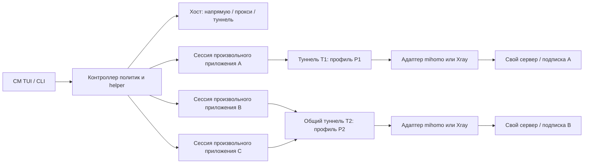

# CM: развитие VPN и туннелей приложений

Дата: 2026-10-03. База: исходники CM / cm-cosmic 0.2.8 в текущем рабочем дереве.
Статус: проект для внешнего ревью, не утверждённая реализация.
Автор требований: пользователь. 2026-10-03 пользователь поддержал A+C как основной сетевой путь, раннее исследование отпечатка внутри I15 и сохранение N=18. Реализация и сетевые гарантии требуют прототипов и приёмки.

Документ описывает весь контекст проекта, а план развития сосредоточен на сетевых функциях, запуске приложений и окружении. Обновление пакетов, зеркала и обслуживание остаются частью CM и входят в регрессионные проверки.

## Навигация и порядок чтения

1. Этот документ: текущее состояние, отдельный список желаний, варианты реализации, ограничения и риски.
2. [ITERATIONS.md](ITERATIONS.md): N = 18 итераций, одна итерация на направление; задачи, зависимости, результаты и критерии готовности.
3. [QUESTIONS.md](QUESTIONS.md): решения и открытые вопросы с приоритетом и ответственным за окончательный выбор.
4. [GROK-REVIEW.md](GROK-REVIEW.md): готовое задание для внешнего рецензента и формат ответа.
5. [GROK-ANALYSIS-2026-10-03.md](GROK-ANALYSIS-2026-10-03.md): анализ полученного ревью, принятые направления и спорные утверждения.
6. [RESEARCH-THREE-DIRECTIONS-2026-10-03.md](RESEARCH-THREE-DIRECTIONS-2026-10-03.md): стабильность относительно FlClash, DNS и раннее исследование отпечатка; привязка к 18 итерациям.
7. [GROK-THREAD-ANALYSIS-2026-10-03.md](GROK-THREAD-ANALYSIS-2026-10-03.md): проверка повторного ревью F01–F14, опровержения и уточнение плана.
8. [DETAILED-DAG-PLAN.md](DETAILED-DAG-PLAN.md): детальный порядок выполнения — 18 направлений, 20 рубежей, 100 задач, gates и критерии приёмки; [DAG-PLAN.json](DAG-PLAN.json) содержит проверяемые зависимости каждой задачи.
9. [MODEL-WORKFLOW.md](MODEL-WORKFLOW.md): сводная схема по ведущим моделям, независимое ревью и evidence; [назначения](MODEL-WORKFLOW.json) дополняют DAG, а [Mermaid](MODEL-WORKFLOW.mmd) сохраняет его зависимости.
10. I01 начат по заданию пользователя: [контракт тестов и допуски](I01-TEST-CONTRACT.md), [исходный аудит](I01-SOURCE-AUDIT.md), [отчёт исполнителя](I01-EXECUTION-REPORT.md), [решения](I01-DECISIONS.md). Синтез уже собранного evidence, включая C20: [baseline](I01-BASELINE-REPORT.md). Проект миграции без кода: [I01-MIGRATION-DESIGN.md](I01-MIGRATION-DESIGN.md). Бумажная модель I02.T01–T03, без приёмки хранения: [I02-MODEL.md](I02-MODEL.md), [контракт проверок](I02-TEST-CONTRACT.md). Координатор задаёт контракты; проверки выполняет отдельный исполнитель. Другие направления остаются PLANNED, сборка пакета запрещена. Защита legacy install проверяется отдельно от полноценной миграции; proxy pilots отдельно от host TUN.

Для повторного ревью передаются основные документы вместе с анализом и исследованием либо актуальный REVIEW-PACK. Нужные места исходников перечислены ниже. Секретные конфиги, реальные подписки, VPN-ключи и пользовательские профили приложений в пакет ревью не входят.

Предыдущая подготовка документации выполнялась без реализации. Затем пользователь разрешил начать только I01: диагностику, миграционные исправления и регрессии, с отдельным исполнителем тестов и независимым ревью. Версия не меняется, пакет не собирается. Внешние отчёты Grok получены и проверяются отдельно; автоматическая отправка через подключённый инструмент Grok не выполнялась. Исходные отчёты сохраняются как история, текущие решения и границы фиксируются в канонических документах.

## 1. Значение статусов и приоритетов

- **СЕЙЧАС** — поведение или структура подтверждены чтением текущих исходников; это не автоматически доказательство работы на всех Linux-системах.
- **ЖЕЛАНИЕ** — пользовательский результат без предположений о технической достижимости.
- **ПРЕДЛОЖЕНИЕ** — возможное устройство проекта, которое ещё не реализовано.
- **ВОПРОС** — решение, которое требуется до соответствующей итерации.
- **НЕ ПРОВЕРЕНО** — требуются эксперимент, внешняя проверка или приёмочные испытания.

Приоритет работ: **P0** — блокирует безопасный выпуск/архитектуру; **P1** — обязательная функция целевой версии; **P2** — последующее улучшение. Значимость риска: **критическая** — прямой выход защищённого приложения, нарушение привилегий или потеря данных; **высокая** — неверный маршрут/страна, несовместимость или ложное утверждение защиты; **средняя** — качество, ресурсные затраты, неполная диагностика; **низкая** — удобство. Приоритет и значимость не равны сроку или оценке трудозатрат.

## 2. СЕЙЧАС: что умеет CM

### 2.1. Продукт и интерфейс

CM — Console Manager, Linux-утилита на Rust с CLI и TUI. Команды: `cm`; компонент COSMIC: `cm-cosmic`. Оба Cargo-пакета имеют версию 0.2.8. Исполняемый CM рассчитан на статическую сборку musl; компонент COSMIC имеет отдельный workspace и зависит от libcosmic.

| Область | Реализовано в исходниках | Граница подтверждения / место в проекте |
|---|---|---|
| Пакеты | Проверка, предзагрузка и обновление через pacman, apt, dnf, zypper | Возможности зависят от backend; [src/backend.rs](../../../src/backend.rs), [src/main.rs](../../../src/main.rs) |
| Дополнительные обновления | Flatpak, AUR через доступный helper, прошивки; новости Arch | Условные интеграции, не одинаковы на всех системах; [src/extras.rs](../../../src/extras.rs) |
| Обслуживание | Снапшоты, информация об откате, службы, кэш, сироты, новые конфиги, история | Зависит от установленных инструментов; CM не превращает любую систему в универсальную систему отката |
| Зеркала и автоматика | Выбор/закрепление зеркал там, где backend это поддерживает; периодические проверки и реакция на сеть | Сохранить регрессии при смене маршрута хоста; [src/mirrors.rs](../../../src/mirrors.rs) |
| TUI | Главное меню, VPN, зеркала, AUR, текстовые страницы, PTY-экран команд, журнал F2, интерактивный терминал F4 | [src/tui.rs](../../../src/tui.rs), [src/tui/process.rs](../../../src/tui/process.rs) |
| Хост и ресурсы | Модель хоста/CPU, ядро, система, GPU vendor/device/driver; CPU, load average, RAM, swap, диск `/`, сетевые скорости, uptime | При открытом главном меню замеры раз в секунду; GPU usage, все диски и ресурсы по приложениям не реализованы; [src/tui/host.rs](../../../src/tui/host.rs) |
| COSMIC | Апплет состояния и запуск TUI; повторный запуск использует живой терминал; отдельное окно по запросу | Возврат фокуса на Wayland зависит от композитора; [cosmic/src/model.rs](../../../cosmic/src/model.rs), [cosmic/src/tui_launch.rs](../../../cosmic/src/tui_launch.rs) |
| Иконки | Первая итерация: терминал `>_` с разными индикаторами состояния | [Предпросмотр](../../cm-0.2.8/icons-iteration-1.png); будущий учёт нескольких туннелей не реализован |
| Локализация | ru, en, de, it, zh, ar | Новые сетевые функции должны сохранять локализацию и работу узкого терминала |

### 2.2. VPN и подписки

СЕЙЧАС: [src/vpn.rs](../../../src/vpn.rs) управляет mihomo, одной службой `cm-vpn.service`, одним TUN `cm-vpn`, одним основным runtime-каталогом и конфигом. В `Subs` есть список подписок и одно поле `active`. Наличие нескольких записей не означает наличие нескольких независимых туннелей.

- Добавление/обновление/удаление HTTPS-подписок, стабильные id, выбор подписки и серверов/групп, состояние и журнал.
- Форматы: YAML Clash/mihomo и URI-списки в тексте/base64; URI-профили подключаются через файловый provider mihomo. Произвольный JSON Xray/Sing-box не является поддерживаемым профилем.
- User-Agent можно задать для подписки. При непригодном успешном HTTP-ответе есть ограниченный перебор совместимых клиентов. При сетевой/HTTP-ошибке перебор прекращается. Это совместимость форматов, не анонимизация.
- Распознавание некоторых заглушек неподдерживаемого клиента, непринятие HTML как рабочей подписки. Непригодный сохранённый профиль повторно загружается при выборе.
- Секретные URL хранятся отдельно от публичного состояния. В конфиг переносятся разрешённые части подписки; управляющие параметры CM задаёт сам.
- TUN либо локальный mixed HTTP/SOCKS-прокси; системный прокси настраивается отдельно, не все программы обязаны его использовать.
- Настройки `rule/global/direct`, DNS/fake-IP, IPv6, LAN и прямых маршрутов. В текущих настройках есть прямые исключения для LAN/России; они не подходят как неявная политика строгих туннелей приложений.
- Автовыбор по задержке — группа mihomo URL-test. Это не комплексная оценка качества, не балансировщик между ядрами и не увеличение скорости одного потока за счёт суммирования каналов.
- API mihomo через закрытый Unix-сокет; проверка владельца/peer. Подготовка конфигурации, проверка ядром и операции сохранения/отката.
- Установка/проверка/обновление mihomo, геофайлов; проверка SHA-256 digest для устанавливаемого ядра. Проверки релизов связаны с FlClash и mihomo; Xray как управляемое ядро отсутствует.
- В `VPN_CORES` встречается `xray` для обнаружения конфликтующего внешнего процесса. Это НЕ поддержка Xray.

Версия mihomo v1.19.32 была показана пользователем. Она не зашита как обязательная установленная версия для любого хоста; некоторые User-Agent сейчас содержат фиксированные версии клиентов.

### 2.3. Права, пути и переход UPD → CM

СЕЙЧАС: helper через Unix-сокет и polkit, типизированные запросы, peer identity, ограничение допустимых операций; пользовательский TUI может повышать права для действий. [src/helper.rs](../../../src/helper.rs), [src/common.rs](../../../src/common.rs).

Основные пути: `/etc/cm.conf`, `/etc/cm/vpn`, `/var/lib/cm/vpn`, `/run/cm/helper.sock`. Есть совместимость переменных путей `UPD_*` и переход известных старых каталогов/служб при установке. Переход требует отдельной приёмки на установленных системах: чтение кода и тесты с фиктивными службами не доказывают завершённую миграцию пакетов на хосте пользователя. См. `migrate_upd` в [src/main.rs](../../../src/main.rs).

### 2.4. Чего сейчас нет

Управляемого Xray; модели нескольких активных профилей; per-app namespaces; универсального launcher приложений; групп приложений с независимыми подписками; постоянного fail-closed firewall для таких групп; независимых региональных окружений; смены timezone/locale приложения; проверки browser fingerprint; адаптивного выбора между ядрами. Существующее чтение cgroup для обслуживания служб не является маршрутизацией приложений.

### 2.5. Доказательства и открытая проблема подписки

В предыдущей итерации в сессии прошли библиотечные, CLI, интеграционные, COSMIC и launcher-тесты. Это исторический результат для текущей разработки; эта подготовка документов не перезапускает тесты и не объявляет новые runtime-гарантии. Пакет 0.2.8 в этой сессии не собирался и не устанавливался.

Для проблемной подписки из сообщения не подтверждено реальное подключение исправленной CM 0.2.8. Старые отчёты в `docs/VPN-PROVIDER-REVIEW-2026-10-02.md` описывают другую стадию/установленный UPD; переносить их выводы на новую версию нельзя. Обобщённые тесты перебора User-Agent не заменяют проверки конкретного провайдера.

## 3. ЖЕЛАНИЯ: пользовательский результат, отдельно от реализации

Этот раздел фиксирует запрос; он не обещает достижимость каждой формулировки.

| ID | Желание | Важность |
|---|---|---|
| W01 | Поддерживать mihomo и Xray, вручную и автоматически выбирать подходящее соединение | P1 |
| W02 | Выбирать по реальному качеству: стабильность, задержка, скорость, ресурсы, совместимость | P1 |
| W03 | Туннелировать произвольные приложения Linux; Chrome/Claude Code — только примеры, без закрытого списка | P1 |
| W04 | Каждому приложению назначать свой туннель или объединять несколько приложений в один | P1 |
| W05 | Для приложений/групп использовать другую подписку либо собственный сервер независимо от хоста | P1 |
| W06 | Для хоста оставить режимы без VPN, прокси и туннель | P1 |
| W07 | Назначенным приложениям предоставить только туннель, без режима обычного прокси приложения | P0 |
| W08 | Хост может работать через другой сервер или напрямую, пока приложения остаются в своих туннелях | P0 |
| W09 | «Полная анонимизация»: приложение должно видеть окружение, согласованное со страной выбранного IP, включая часовой пояс | P1; границы требуют решения Q01 |
| W10 | Менять все необходимые признаки, а не только внешний IP; конкретная страна/сервис не зашиты | P1; универсальная достижимость не подтверждена |
| W11 | Понятный TUI, достоверный статус защиты и состояния отдельных туннелей; апплет открывает консоль | P1 |
| W12 | Сейчас подготовить проект и вопросы для Grok, без реализации и сборки пакета | Действующее ограничение этой работы |

Частный список приложений пользователь готов предоставить при необходимости. Для общего launcher он не требуется; для проверки совместимости и адаптеров пригодится тестовая выборка, которая не становится ограничением продукта.

## 4. Границы обещаний и проверяемые цели

**Полная анонимность произвольного приложения не гарантируется VPN-ядром, namespace или сменой timezone.** Сервис может учитывать аккаунт, cookies, синхронизацию, прошлую активность, IP/ASN и признаки устройства. Приложение может само отправлять сохранённые данные. Это ограничение нужно согласовать, а не заменить желание молча.

Предлагаемые независимые уровни:

| Уровень | Проверяемый результат | Что он не доказывает |
|---|---|---|
| NET | Назначенные процессы и обычные потомки имеют только разрешённый сетевой выход; отказ блокирует выход | Не охватывает автоматически внешнюю службу, которой программа поручила запрос |
| REGION | Проверены IP/country observations, DNS, timezone, locale в управляемом окружении | Один сервис может классифицировать IP иначе; timezone не подтверждает физическое местоположение |
| STATE | Отдельные настройки/хранилища, контролируемый доступ к внешним службам | Общая авторизация и импорт старых данных могут восстановить связь с прежней личностью |
| APP | Для конкретного приложения проверены дополнительные региональные/приватные настройки | Не означает полного универсального скрытия fingerprint или аккаунта |

Предлагаемая модель угроз: обычное приложение и его сетевые пути, ошибочная конфигурация, авария CM/ядра, DNS/IPv6/UDP-обход, смена сети, внешние посредники и чтение доступного окружения. Защита от враждебного администратора/скомпрометированного ядра/процесса с сетевыми привилегиями не заявляется. Если требуется изоляция от вредоносного приложения, это отдельная цель и более строгий sandbox/VM, а не расширенное название туннеля.

NET/REGION должны иметь состояния «проверено», «проверено частично», «не проверено», «блокировано», «ошибка». Слово «анонимно» без измеримых критериев запрещено как обещание интерфейса; термин пользовательского желания W09 сохраняется в этом документе.

## 5. Возможные архитектуры

### 5.1. Общая модель данных — ПРЕДЛОЖЕНИЕ

| Сущность | Содержимое / роль |
|---|---|
| Source | Подписка, ручной конфиг или свой сервер; приватные credentials; формат и origin |
| Node | Конкретный endpoint, протокол/транспорт, параметры и поддерживаемые возможности; стабильная идентичность |
| ConnectionProfile | Допустимые Source/Node, ядро или политика выбора, резервы, страна и ограничения качества |
| TunnelInstance | Runtime конкретного соединения: ядро, namespace, маршруты, DNS, проверки, поколение конфига |
| ApplicationDefinition | Desktop ID / executable / структурированные argv, рабочий каталог; область пользователя |
| ApplicationGroup | Приложения, использующие один логический туннель; политика общего ресурса |
| EnvironmentProfile | Timezone, locale, доступ к файлам/IPC, отдельные данные, возможности адаптера |
| BrowserIdentityProfile | Предлагаемая сохраняемая личность профиля данных браузера; источник каталога, совместимость версий и история; не принадлежит туннелю |
| DnsPolicy / DnsRuntime | Политика профиля подключения и реализация/cache/fake-IP конкретного поколения TunnelInstance |
| Session | Конкретный запуск: uid, PID + start time, cgroup, namespace, ссылки на TunnelInstance/EnvironmentProfile |
| HostPolicy | Без VPN / прокси / туннель; настройки независимо от сессий приложений |
| Verification | Какие свойства проверены, чем, когда, с какого маршрута и для какого поколения конфигурации |

Подписка ≠ сервер ≠ профиль ≠ активный туннель. Одно ядро может поддерживать несколько outbounds, но это не равно нескольким независимым окружениям. Количество workers является решением после измерений. Общий логический туннель не обязан давать приложениям общий HOME, loopback или файловую систему.

### 5.2. Вариант A: Linux-контроллер маршрутов, ядра как workers

CM контролирует системные маршруты, namespaces и правила блокировки; mihomo/Xray обслуживают профили через адаптеры. Приложения входят в свои сетевые окружения и используют заданный шлюз туннеля. Внешние соединения ядра явно отделяются от внутреннего потока и могут достигать endpoint через физическую сеть, независимо от VPN хоста.

Плюсы: Xray не зависит от обязательного присутствия mihomo; единый контроль запрета прямого выхода; независимость хоста/приложений. Минусы: самая большая ответственность CM, отдельное решение доставки TCP/UDP из TUN каждому ядру, сложная совместимость с NetworkManager/firewall.

ВОПРОС: использовать native TUN определённой версии ядра либо отдельный адаптер транспорта? Проверить матрицу версии/платформы/UDP. Нельзя считать, что Xray и mihomo имеют одинаковый интерфейс TUN. Дополнительный TUN→proxy компонент — новая зависимость, требующая явного решения, не «бесплатная» часть архитектуры.

### 5.3. Вариант B: mihomo как маршрутизатор, Xray как локальный upstream

Mihomo принимает трафик через TUN/шлюзы, а часть соединений передаёт локальному Xray. Пользовательские приложения всё равно имеют только туннель; локальный proxy между компонентами не является пользовательским proxy-режимом приложения.

Плюсы: повторное использование маршрутизации и групп mihomo, меньше собственного транспорта. Минусы: обязательность mihomo даже для Xray-профиля, дополнительные ресурсы/точки отказа, необходимость проверить UDP и отсутствие циклов. Сам по себе общий TUN с PROCESS-NAME не обеспечивает строгой изоляции любых приложений.

### 5.4. Вариант C: отдельное окружение туннеля на профиль

На профиль создаётся worker/namespace; приложения или их namespaces подключаются к нему. Хост имеет отдельный маршрут. Плюсы: проще объяснять владение и локализовать ошибку. Минусы: RAM, процессы, интерфейсы, лимиты; много туннелей могут дублировать ядра. Требуется отдельно решить безопасность нескольких приложений, разделяющих один выход.

### 5.5. Вариант D: VM/контейнер для расширенного окружения

Использовать дополнительное окружение для приложений, которым нужен контроль большей части видимой системы. Плюсы: больше контроля ОС, timezone, хранилищ и процессов. Минусы: сложнее GUI/GPU/аудио, работа с файлами и обновлениями, выше ресурсы; VM не скрывает авторизацию и не гарантирует анонимность. Это расширение, а не исходное требование установить отдельную VM для каждой программы.

| Вариант | Независимость ядер | Собственное сетевое управление CM | Ресурсы | Главная неопределённость |
|---|---|---|---|---|
| A | Высокая | Высокая | Зависит от workers | Транспорт TUN/UDP и надёжность контроллера |
| B | Xray зависит от front-end | Средняя | Два ядра для части маршрутов | Цепочка proxy, UDP, fail-closed |
| C | Высокая | Высокая | Может быть высокая | Совместный выход и изоляция приложений |
| D | Высокая | Высокая + управление окружением | Наибольшая | Интеграция GUI и реалистичный scope |

Принято пользователем 2026-10-03: A+C — основной путь для строгого per-app режима. CM владеет маршрутами и правилами блокировки; отдельные workers/namespaces обслуживают TunnelInstance. B остаётся запасным транспортным адаптером после испытаний Xray TUN, а не параллельным продуктом. Q03 и Q08 требуют выбора технического механизма и прототипа. D не является выбранным обязательным путём. Таблица сохраняется для обоснования решения.



Схема — логические отношения, не готовый чертёж интерфейсов Linux. Между приложением, workers и физической сетью нужны проверяемые маршруты и правила запрета обхода.

## 6. Решения по направлениям — ПРЕДЛОЖЕНИЯ

### 6.1. Подписки и своё подключение

Сохранять исходный формат и provenance. Импортёр выделяет поддерживаемые узлы без исполнения удалённых указаний. Неподдерживаемые транспорты диагностируются, а не молча переписываются в похожий протокол. Raw JSON ядра не получает право включить произвольные listeners, host networking, внешние управляющие API или загрузку кода.

Варианты: native-формат каждого ядра; общий нормализованный Node плюс закрытые engine-specific поля; комбинация общего набора и непреобразованных расширений. Выбрать Q04. При обновлении исчезнувшего/переименованного узла активная сессия не должна внезапно уходить на случайный сервер.

### 6.2. Режимы хоста и туннели приложений

Хост: без VPN / прокси / туннель. Назначенные приложения: только туннель. «Без VPN хоста» не выключает T1/T2. «Остановить все туннели» при живых защищённых сессиях сохраняет блокировку сети до явного изменения политики/завершения сессий.

Общий proxy-режим хоста не должен перенаправлять транспорт приложения поверх другого VPN случайно. Внешний endpoint ядра может быть исключением маршрута; это не разрешение прямого выхода приложению. Существующие глобальные `vpn_direct_ru`/`vpn_direct_lan` не наследуются строгой сессией автоматически. Для LAN/локальных сервисов требуется отдельная явная политика Q09.

### 6.3. Привилегии и lifecycle

Root/helper создаёт и проверяет только разрешённые сетевые объекты. Приложение запускается исходным uid/gid с нужными файлами/сессией рабочего стола. Структурированные argv без `sh -c`; всё, что потребует оболочки как пользовательской команды, должно быть явным запуском пользовательского shell, не root-конкатенацией.

Сессия идентифицируется не одним PID, а PID/start time и принадлежностью cgroup/namespace. Серверный endpoint разрешён worker, а приложению — только назначенный выход. Crash helper/ядра/UI не убирает fail-closed. Завершение ресурса учитывает всех пользователей общего туннеля.

Предлагаемые состояния: `Draft → Preparing → Blocked → Validating → Active → Degraded → Recovering`; завершение `Stopping → Closed`. При любой ошибке до `Active` сеть приложения остаётся запрещена. Есть отдельный журнал владения ресурсами для восстановления после перезапуска/перезагрузки. «Нет процесса CM» не означает «можно удалить firewall».

### 6.4. DNS, IPv6, UDP и обходы

DNS-политика привязана к TunnelInstance, проверяется из namespace сессии. Host stub `127.0.0.53` не становится автоматически доступным внутри нового namespace. Нужны решения bootstrap DNS для endpoint, DoH/DoT самого приложения и разделения внутреннего DNS от служебного DNS транспорта.

IPv6: либо полностью обслуживаемый маршрут, либо явная блокировка, а не только флаг в конфиге ядра. UDP/QUIC/WebRTC: поддержать через выбранный транспорт либо блокировать с объяснением. Нет fallback на прямой UDP. Проверять реальный исходящий интерфейс, а не только успешный TCP-запрос проверки IP.

### 6.5. Произвольные приложения и специальные случаи

Общий launcher принимает desktop entry, executable или argv. Отдельные generic интеграции допустимы для формата запуска: native, AppImage, Flatpak, terminal/GUI. Это не hardcoded whitelist приложений. Нет молчаливого переноса уже открытых сокетов в новый маршрут; по умолчанию новый управляемый запуск.

Внешние brokers, D-Bus/systemd user services, portals и общие supervisors могут выполнить сеть вне namespace потомков. Не объявлять их покрытыми без проверки. Режимы: отдельный экземпляр службы; управляемый запуск службы; запрет конкретного посредника; явная несовместимость. Смешанные namespace/cgroup/PID проверки и трассировка на приёмке нужны для оценки охвата.

### 6.6. Региональное окружение

IP-страна — ограничение профиля, а не текст названия узла/флаг провайдера. Нужны observations из независимых источников и timestamp; определить что делать при расхождении классификации. Использование внешнего сервиса проверки раскрывает ему IP и сам факт проверки; предусмотреть собственный endpoint и локальные данные.

Timezone: IANA ID, `TZ` плюс контролируемый вид `/etc/localtime`/при необходимости `/etc/timezone`; отдельный mount namespace с правильной propagation. Системные часы UTC не сдвигать. Linux time namespace не является механизмом смены timezone; realtime clocks не нужно подделывать. Locale: наличие locale на системе, настройки программы и browser language требуют проверки. Часовой пояс нельзя однозначно вывести только из страны.

Свежий профиль приложения — вариант, не автоматическое удаление существующих данных. Сохранить рабочие каталоги/файлы проекта по явной политике. HOME/XDG и read-only доступ к нужным файлам выбираются отдельно: монтирование всего HOME может возвращать старую идентичность.

ЖЕЛАНИЕ: Chromium-подобный браузер сохраняет существующий профиль и аккаунт, а весь заявленный видимый отпечаток заменяется другим массовым согласованным набором, включая User-Agent, Client Hints, шрифты, Canvas и WebGL. Механизм полного набора, каталог и его массовость НЕ ПРОВЕРЕНЫ. Ранний I15-R выбирает механизм и проверяет поверхности/контексты до большой интеграции. Отдельные flags/CDP не являются доказательством полной подмены устройства.

ПРЕДЛОЖЕНИЕ: BrowserIdentityProfile принадлежит профилю данных, независимо от TunnelInstance. Смена страны меняет выбранное региональное окружение и сетевой путь, но не создаёт новое устройство. Пока профиль жив, личность стабильна; её изменения применяются на холодном старте по Q27. Числа 28 дней и пять прошлых записей — предварительные параметры рецензента, не измеренный стандарт и не требование задержать обновления безопасности. Представляемая версия должна оставаться совместимой с реальным браузером. UA загрузки подписки не относится к этой личности.

REGION оценивается для каждой сессии относительно её EnvironmentProfile. Разные допустимые языки/часовые пояса приложений на одном туннеле сами по себе не понижают статус. Несоответствие заданному пресету либо неизвестное применение дают partial/unknown. Применённые настройки, наблюдаемая IP-страна и решение внешнего сервиса не смешиваются в одну гарантию.

### 6.7. Качество и переключения

Единица оценки: профиль + узел + транспорт + версия ядра + текущая сеть. Сначала обязательные constraints (совместимость, страна, DNS, NET-проверки), затем качество. Метрики: доля успешных проб, задержка/TTFB и разброс, обрывы, при разрешении — ограниченная throughput-проба; CPU/RAM на профиль. Последнее измерение имеет срок годности.

Политики: фиксированный сервер; фиксированный сервер с резервом; лучший из разрешённых. Порог улучшения, окно наблюдения и cooldown исключают постоянные переключения. Значения выбираются по измерениям, не объявляются заранее оптимальными. Верификация страны/IP относится к выбранному кандидату, а не только исходному узлу.

Session pinning и смена IP: существующие TCP/UDP-сессии обычно не переносятся между внешними соединениями прозрачно. Для AI-streaming/логинов нужен выбор «держать сервер до завершения», «резерв при отказе» или «перезапуск». Не смешивать стабильность внешнего IP, скорость, полноценное соединение каналов и анонимность.

### 6.8. TUI и пример отображения

Варианты: расширить существующий экран VPN вкладками «Хост / Туннели / Приложения / Источники / Диагностика»; либо оставить основные вкладки и открыть per-app управление отдельным экраном. Сравнить действия/ширину терминала/число клавиш в I17.

```text
Хост          напрямую
Туннель T1    источник A · узел N1 · Xray · NET проверено
Туннель T2    источник B · узел N2 · mihomo · NET проверено
Приложение A  T1 · среда E1 · REGION проверено частично
Приложение B  T2 · среда E2 · запущено
Приложение C  T2 · среда E3 · запущено
Проверка      DNS / IPv6 / UDP / IP / timezone: отдельные результаты
```

Это макет, не реальный CLI-вывод. Апплет должен различать отсутствие VPN хоста и наличие живых туннелей приложений. Ошибка одной группы не превращает остальные в ошибку; глобальный сигнал имеет понятную причину. Закрытие окна TUI не обязано завершать приложения или workers.

### 6.9. Возможный CLI и расположение кода

Вариант public CLI — оставить существующие `cm vpn ...` совместимыми для хоста, добавить отдельные operations туннелей и `cm app ...` для запусков. Альтернатива — общий `cm net ...`, где host/app являются targets; сравнить ясность и migration cost. Примеры ниже **не являются существующими командами**:

```text
cm vpn host off
cm vpn tunnel create --profile PROFILE_ID
cm app add --desktop-id DESKTOP_ID
cm app assign APP_ID --tunnel TUNNEL_ID --environment ENV_ID
cm app run APP_ID
cm app run --tunnel TUNNEL_ID -- /path/to/program ARGUMENT
cm vpn verify --tunnel TUNNEL_ID
```

Для общей группы несколько ApplicationDefinition ссылаются на один TUNNEL_ID. USER argv не интерполируются в shell. Конкретный синтаксис, names и возможность transient session принимаются в I11/I17. Source/credentials задаются безопасным отдельным вводом, не примером URL с токеном в argv.

Варианты кода: расширить большой `src/vpn.rs` либо выделить `src/network/{model,controller,policy,verification}`, `src/network/engines/{mihomo,xray}` и `src/apps/{launch,environment,adapters}`. Предпочтение: постепенное выделение модулей с legacy wrapper; не переписывать пакетные backends и весь TUI одновременно. Сначала зафиксировать interface contracts и базовую регрессию. Предложенные модули пока не существуют.

## 7. Проблемные места и значимость

| Риск | Проблема | Значимость | Приоритет | Подход / проверка | Итерации |
|---|---|---|---|---|---|
| R01 | Прямой выход при падении ядра/controller или между startup steps | Критическая | P0 | Заблокированное исходное состояние, независимый от процесса запрет, packet capture | I06–I10, I18 |
| R02 | Root-launch, argv injection, неверная uid/namespace ownership | Критическая | P0 | Peer identity, typed requests, исходный uid, отрицательные проверки | I06, I11 |
| R03 | Потеря старых настроек при миграции/rollback | Критическая | P0 | Сохранение исходников данных, версии схемы, тест UPD/CM и конфликты каталогов | I01–I02, I18 |
| R04 | Namespace есть, но фактический egress не соответствует профилю | Высокая | P0 | Отдельные app/worker namespaces, проверка интерфейса/endpoint/маркировки | I07–I10 |
| R05 | DNS/IPv6/UDP или вспомогательные маршруты обходят туннель | Критическая | P0 | Проверки всех протоколов, fail-closed для неподдержанных функций | I09–I10 |
| R06 | Сеть выполняет внешний broker/supervisor | Высокая | P0 | Подтверждённая интеграция или запрет запуска в защищённом режиме | I11, I13, I18 |
| R07 | Общий туннель исчезает после закрытия первого приложения | Высокая | P0 | Refcounts/session ownership/reconciliation, проверка concurrent stop/start | I09, I12 |
| R08 | Старые direct/LAN/Россия исключения нарушают требования приложений | Высокая | P0 | Разные host/app policies; отсутствие неявного наследования | I02, I07, I10 |
| R09 | «Анонимно» показывается на основании одного IP/пинга | Высокая | P0 | Раздельные NET/REGION/STATE/APP, возраст evidence и unknown | I14–I18 |
| R10 | Геобазы/название узла/сервис расходятся о стране | Высокая | P1 | Provenance observations, ручной override не считается доказательством | I14, I16 |
| R11 | TZ/locale не применяется программой или читается через host IPC | Высокая | P1 | App probe, закрытые IPC-пути, честный partial/unsupported | I13–I15 |
| R12 | Native JSON/protocol options теряются при конвертации | Высокая | P1 | Capability matrix, explicit unsupported, differential configs | I03–I05 |
| R13 | Взаимное перехватывание ядрами, маршрутизационная петля, host VPN chaining | Высокая | P0 | Один owner общих маршрутов, выделенный egress транспорта | I07–I10 |
| R14 | Namespace ломает GUI, GPU, audio, portals или упаковку приложения | Высокая | P1 | Пакетные/desktop интеграции с минимальными разрешениями | I11, I13, I15 |
| R15 | Частая смена IP ломает login/streaming и повышает подозрительность | Высокая | P1 | Pinning, cooldown, страна/сервер как constraint | I16 |
| R16 | Много ядер/проверок расходуют RAM, батарею и трафик | Средняя | P1 | Лимиты workers, lazy start, probe budgets, измерение idle | I04–I05, I12, I16 |
| R17 | Секреты в диагностике/документации/реестре argv | Критическая | P0 | Redaction, private state, контролируемый экспорт | I02–I06, I17–I18 |
| R18 | Новые rules ломают NetworkManager/firewalld/чужой VPN | Высокая | P0 | Только свои объекты, collision checks, coexistence/rollback | I07, I09, I18 |
| R19 | Защищённый child выходит из session scope, получает лишние capabilities или старый FD | Критическая | P0 | Capability/FD policy, cgroup tracking, broker tests | I06, I11, I13 |
| R20 | Хост/пакетные операции перестают работать после изменения VPN | Высокая | P0 | Регрессии mirrors/prefetch/обновлений/systemd/helper | I01, I07, I18 |

## 8. Проверка успеха: разные уровни доказательства

1. Unit/config tests: разбирают данные и правила, не доказывают отсутствие утечки.
2. Integration с fake workers: проверяют lifecycle и транзакции, не доказывают маршрутизацию Linux.
3. Linux namespace tests с фиктивным endpoint и packet capture: проверяют интерфейсы, отказ, DNS/TCP/UDP/IPv6, race windows.
4. Приложения и GUI: проверяют реальный запуск/потомков/broker/storage/timezone; отдельная матрица поддержки.
5. Реальный свой сервер/подписка: проверяют end-to-end и сравнение ядер по одному endpoint; используются разрешённые тестовые credentials.
6. Релизные проверки: миграция/регрессии/backend/установка; сборка/установка пакета разрешается отдельным будущим заданием.

Нельзя подменять уровни: `mihomo -t` подтверждает валидность конфига, `/version` подтверждает API, ping показывает только тестируемый путь. Ни одно из них само по себе не подтверждает полную сеть приложения или его региональную идентичность.

## 9. Дополнение: что не вошло в основную реализацию

Вопросы учтены, но не считаются автоматически согласованными задачами ближайшего выпуска:

- Tor, multi-hop и доказательство анонимности на уровне модели противника; другой scope, чем региональный туннель.
- VM/полная ОС на приложение; вариант D требует отдельного решения о ресурсах и GUI.
- Полная anti-fingerprinting модификация браузера; upstream launcher сам её не предоставляет.
- Развёртывание/администрирование собственного удалённого VPN-сервера: здесь предусматривается подключение к уже имеющемуся серверу.
- Истинное bonding каналов и ускорение одного соединения за счёт нескольких серверов.
- Маршрутизация входящих подключений, опубликованные порты, LAN-discovery и broadcast/multicast внутри групп.
- Мобильные клиенты, Windows/macOS, удалённое управление CM.
- Поддержка privileged/сетевых системных служб как «произвольного приложения»; требует особой модели прав.
- Несколько одновременных Linux-пользователей, разделение их источников/туннелей; базовая схема должна не нарушать ownership, полный shared management — Q16.
- Доверенный portable identity/browser image и согласованность аппаратных fingerprint surfaces.
- Единый policy bundle для региона: пользователь может захотеть язык, отличный от страны; это не всегда противоречие.
- Политика доступности принтеров, локальной разработки, SSH-agent, keyring, audio и D-Bus; не выдавать всем доступ по умолчанию.
- Лимиты/условия подписок: несколько устройств, соединений, несовместимые client-specific ответы, квоты; CM должен их учитывать диагностически.
- Архив старых отчётов, имена UPD в исторических документах и реальные версии установленного приложения; документация 0.2.8 не должна ретроспективно переписывать доказательства старых аудитов.

Если рецензент считает дополнение необходимым для NET/REGION, он должен перенести пункт в обязательные задачи с объяснением и зависимостями, а не только предложить «улучшение».

## 10. Первичные источники и ограничения их использования

Источники описывают возможности механизмов/приложений, а не подтверждают готовность CM. Дата просмотра: 2026-10-03. Перед реализацией закрепить версии и повторно проверить API.

- Linux [network namespaces](https://man7.org/linux/man-pages/man7/network_namespaces.7.html): изоляция сетевых стеков/маршрутов и необходимость CONFIG_NET_NS; основа вариантов A/C.
- Linux [mount namespaces](https://man7.org/linux/man-pages/man7/mount_namespaces.7.html): отдельный вид mount points, propagation; основа per-app файлов timezone.
- Linux [tzset](https://man7.org/linux/man-pages/man3/tzset.3.html) и [time namespaces](https://man7.org/linux/man-pages/man7/time_namespaces.7.html): TZ/timezone отдельно от виртуализации часов.
- Mihomo [routing rules](https://wiki.metacubex.one/en/config/rules/): PROCESS-PATH/PROCESS-NAME/UID; наличие правила не доказывает полный охват произвольного приложения.
- Mihomo [URL-test](https://wiki.metacubex.one/en/config/proxy-groups/url-test/) и [load-balance](https://wiki.metacubex.one/en/config/proxy-groups/load-balance/): доступные групповые политики, не CM multi-engine controller.
- Xray [Observatory](https://xtls.github.io/en/config/observatory.html): пробы для выбора соединения; учесть стоимость и поведенческий след измерений.
- Xray [TLS](https://xtls.github.io/en/config/transports/tls.html) и mihomo [TLS](https://wiki.metacubex.one/en/config/proxies/tls/): fingerprint настройки транспорта, не полная анонимизация приложения.
- [Marzban subscription router](https://github.com/Gozargah/Marzban/blob/master/app/routers/subscription.py) и [Remnawave response rules](https://github.com/remnawave/templates/blob/main/remnawave-default/response-rules/srr-default-config.json): выдача формата по заголовкам клиента.
- [Happ Desktop](https://github.com/Happ-proxy/happ-desktop): применение Xray; это не готовый API/код интеграции Happ в CM.
- [Chromium SOCKS](https://www.chromium.org/developers/design-documents/network-stack/socks-proxy/): ограниченный охват proxy-параметров браузера. Используется для объяснения требований к туннелю, а не выбора proxy-режима приложений.
- [Claude Code network configuration](https://code.claude.com/docs/en/network-config): proxy API и особенности фонового supervisor/launch wrapper. Это пример класса интеграций, не hardcoded требование поддерживать только Claude.
- [Google location information](https://support.google.com/websearch/answer/179386?hl=en): учёт местоположения/активности/аккаунта помимо IP. Это пример ограничений гарантии W09, не особая цель «эмулировать одну страну для Google».
