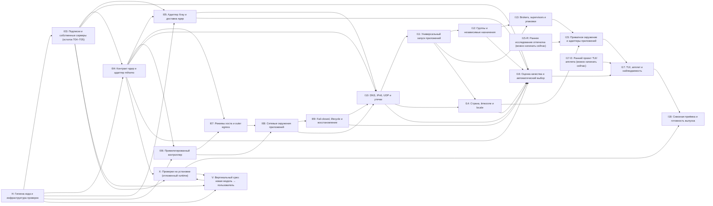
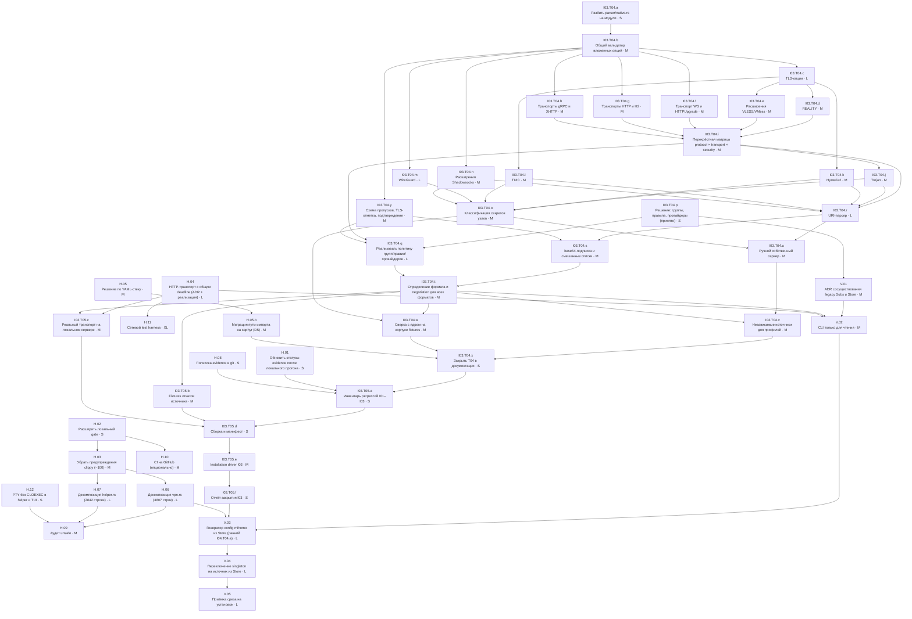

# CM: детальный DAG оставшейся работы

Дата: 2026-10-06. Сгенерировано `tools/remaining_dag.py` — правки вносить в скрипт, затем перезапускать. Дополняет [DETAILED-DAG-PLAN](DETAILED-DAG-PLAN.md) (рубежи и gates G0–G6 остаются в силе) и [точку остановки](WORK-STOP-2026-10-05.md). Машинный граф: [REMAINING-DAG-PLAN.json](REMAINING-DAG-PLAN.json). Очередь Composer на H.01, H.02 и I03.T04: [COMPOSER-QUEUE-2026-10-06](COMPOSER-QUEUE-2026-10-06.md); независимое ревью и оракул pinned-источников — Grok: [GROK-QUEUE-2026-10-06](GROK-QUEUE-2026-10-06.md).

## 1. Как читать

- Пять крупных задач каждого рубежа разбиты на подзадачи `Ixx.Tyy.z`. Зависимости заданы на уровне подзадач: работа, не требующая принятого результата предшественника, может идти раньше (§4.1).
- Инварианты проверяет генератор: последняя подзадача рубежа зависит от всех его подзадач и от закрытия каждого рубежа-предшественника из DAG-PLAN.json; подзадач без потребителя нет. Поэтому закрытие рубежа не может опередить исходный DAG, даже если его отдельные части начинаются раньше. H — пул без закрытия. Runtime-проверки (L4) кодовых рубежей собираются в X.07 и не блокируют следующие кодовые рубежи; I18 ждёт X.07.
- Новые рубежи: **H** (гигиена и инфраструктура проверок), **V** (вертикальный срез, предложение — решение D7), **X** (runtime-проверки на установке). Они не меняют N = 18 направлений.
- Размер — относительный вес, не срок: `S`=1, `M`=2, `L`=4, `XL`=8 (S ≤ ½ дня, M 1–2 дня, L 3–5 дней, XL — разбить при старте).
- Уровень доказательства: `D` — решение пользователя/ADR; `L0` — чтение первичных источников, документ; `L1` — unit/fixture, compile; `L2` — Linux network harness (netns, локальный test endpoint); `L3` — реальное приложение/executor; `L4` — сквозная проверка: fault injection, миграция, установка.
- Кодово завершены (runtime-приёмка в X): `I01.T01`, `I01.T02`, `I01.T03`, `I01.T04`, `I01.T05`, `I02.T01`, `I02.T02`, `I02.T03`, `I02.T04`, `I02.T05`, `I03.T01`, `I03.T02`, `I03.T03`, `I03.T04.p`, `H.01`, `H.02`, `H.04`, `H.05`, `I03.T04.a`, `I03.T04.b`, `I03.T04.y`, `I03.T04.c`, `I03.T04.d`, `I03.T04.e`, `I03.T04.f`, `I03.T04.g`, `I03.T04.h`, `I03.T04.i`, `I03.T04.j`, `I03.T04.k`, `I03.T04.l`, `I03.T04.m`, `I03.T04.n`, `I03.T04.o`, `I03.T04.q`, `I03.T04.r`, `I03.T04.s`, `I03.T04.t`, `I03.T04.u`, `I03.T04.v`, `I03.T04.w`, `H.12`, `I03.T05.b`.

## 2. Сводка

- Подзадач: **164** в 21 рубежах; суммарный вес **387**.
- Критический путь: **58** подзадач, вес **155** (≈ 40% от суммы) — это нижняя граница при неограниченном параллелизме.
- Готовы к старту сейчас: **10** — см. §4.
- Решений, без которых часть графа не двинется: **10** — см. §5.

| Рубеж | Название | Приоритет | Подзадач | Вес | Вопросы | Gate |
|---|---|---|---|---|---|---|
| H | Гигиена кода и инфраструктура проверок | P0 | 13 | 34 | — | H.04 и H.11 блокируют реальные fetch и все L2-проверки |
| I03 | Подписки и собственные серверы (остаток T04–T05) | P1 | 31 | 64 | Q04, Q06, Q24 | Неподдержанное → UnsupportedFeature, а не молчаливое удаление |
| V | Вертикальный срез: новая модель → пользователь | P0 | 5 | 16 | — | Не подменяет I04: генератор V.03 становится основой I04.T04.a |
| I04 | Контракт ядер и адаптер mihomo | P0 | 17 | 36 | Q02, Q03, Q07 | G1 (вместе с I02/I06) |
| I05 | Адаптер Xray и доставка ядер | P1 | 9 | 23 | Q03, Q07 | G3 частично (DNS на обоих ядрах) |
| I06 | Привилегированный контроллер | P0 | 8 | 17 | Q08, Q11, Q16, Q25 | G1 |
| I07 | Режимы хоста и outer egress | P0 | 6 | 17 | Q02, Q03, Q09 | G1 → I08 |
| I08 | Сетевые окружения приложений | P0 | 6 | 13 | Q09, Q10, Q11 | G2 (с I09) |
| I09 | Fail-closed, lifecycle и восстановление | P0 | 5 | 16 | Q12, Q13 | G2 |
| I10 | DNS, IPv6, UDP и утечки | P0 | 6 | 15 | Q03, Q09, Q14 | G3 |
| I11 | Универсальный запуск приложений | P1 | 5 | 11 | Q10, Q11 | — |
| I12 | Группы и независимые назначения | P1 | 5 | 10 | Q05, Q12, Q16 | — |
| I13 | Brokers, supervisors и упаковки | P1 | 5 | 12 | Q10, Q11, Q17 | — |
| I14 | Страна, timezone и locale | P1 | 5 | 9 | Q01, Q15, Q18 | — |
| I15-R | Раннее исследование отпечатка (можно начинать сейчас) | P1 | 5 | 13 | Q01, Q26, Q27 | G4 |
| I15 | Приватное окружение и адаптеры приложений | P1 | 5 | 16 | Q11, Q17, Q18 | — |
| I16 | Оценка качества и автоматический выбор | P1 | 5 | 14 | Q13, Q18, Q19 | — |
| I17-D | Ранний проект TUI/апплета (можно начинать сейчас) | P1 | 5 | 8 | Q22 | — |
| I17 | TUI, апплет и наблюдаемость | P1 | 5 | 11 | Q01, Q22 | — |
| X | Проверки на установке (отложенный runtime) | P0 | 8 | 15 | — | Установка/изменение сети хоста — по явному разрешению |
| I18 | Сквозная приёмка и готовность выпуска | P0 | 5 | 17 | — | G6 |

## 3. Граф рубежей

### Ближайшая работа: I03.T04 и H

## 4. Что можно начинать сейчас

Все зависимости этих подзадач закрыты. Решение-подзадачи (`D`) — вопросы пользователю, их стоит задать первыми.

- `H.03` · Убрать предупреждения clippy (~100) · `M` · L1
- `H.05.b` · Миграция пути импорта на saphyr (D5) · `M` · L1
- `H.08` · Политика evidence в git · `S` · D · решение D8
- `H.10` · CI на GitHub (опционально) · `M` · D · решение D9
- `H.11` · Сетевой test harness · `XL` · L2 · решение D6
- `I03.T05.c` · Реальный транспорт на локальном сервере · `M` · L1
- `V.01` · ADR сосуществования legacy Subs и Store · `M` · D · решение D7
- `I04.T01.a` · Trait CoreAdapter и таксономия ошибок · `M` · L1
- `I15-R.T01.a` · Наблюдаемые свойства и scope · `M` · L0 · решение Q01
- `I17-D.T01.a` · Fixtures состояний · `S` · L1

### 4.1. Намеренно ранние старты

Эти подзадачи начинаются до закрытия предшественника своей исходной задачи. Это проектирование, спецификации и подготовка, которые не опираются на принятый результат; закрытие их рубежа всё равно ждёт предшественника.

- `I05.T01.a` · Pin Xray — до закрытия `I03.T05`
- `I05.T01.a` · Pin Xray — до закрытия `I04.T05`
- `I05.T01.b` · Capability gaps относительно CoreAdapter — до закрытия `I03.T05`
- `I05.T01.b` · Capability gaps относительно CoreAdapter — до закрытия `I04.T05`
- `I06.T01.a` · ADR Q08: helper или отдельный сервис — до закрытия `I04.T05`
- `I06.T01.b` · Typed протокол и polkit-действия — до закрытия `I04.T05`
- `I08.T01.a` · Решение Q09: локальные сети и сервисы — до закрытия `I07.T05`
- `I10.T01.a` · Спецификация DnsPolicy/DnsRuntime — до закрытия `I05.T05`
- `I10.T01.a` · Спецификация DnsPolicy/DnsRuntime — до закрытия `I08.T05`
- `I10.T01.a` · Спецификация DnsPolicy/DnsRuntime — до закрытия `I09.T05`
- `I13.T01.a` · Матрица фактических executors — до закрытия `I12.T05`

### Критический путь

`I03.T04.a` → `I03.T04.b` → `I03.T04.c` → `I03.T04.d` → `I03.T04.i` → `I04.T04.a` → `I04.T04.c` → `I04.T05.a` → `I06.T03.b` → `I06.T04.a` → `I06.T05.a` → `I07.T01.a` → `I07.T01.b` → `I07.T02.a` → `I07.T03.a` → `I07.T04.a` → `I07.T05.a` → `I08.T01.b` → `I08.T02.a` → `I08.T03.a` → `I08.T04.a` → `I08.T05.a` → `I09.T01.a` → `I09.T02.a` → `I09.T03.a` → `I09.T04.a` → `I09.T05.a` → `I10.T04.a` → `I10.T05.a` → `I11.T01.a` → `I11.T02.a` → `I11.T03.a` → `I11.T04.a` → `I11.T05.a` → `I12.T01.a` → `I12.T02.a` → `I12.T03.a` → `I12.T04.a` → `I12.T05.a` → `I13.T02.a` → `I13.T03.a` → `I13.T04.a` → `I13.T05.a` → `I15.T01.a` → `I15.T02.a` → `I15.T03.a` → `I15.T04.a` → `I15.T05.a` → `I17.T01.a` → `I17.T02.a` → `I17.T03.a` → `I17.T04.a` → `I17.T05.a` → `I18.T01.a` → `I18.T02.a` → `I18.T03.a` → `I18.T04.a` → `I18.T05.a`

Ускорить можно только сокращением этой цепочки: раньше получить среду harness (D6), не блокировать I06 на полном I04 (проектирование I06.T01–T02 уже вынесено раньше), держать I10.T01 и I17-D параллельно.

## 5. Решения

| ID | Решение | Где блокирует | Комментарий |
|---|---|---|---|
| D1 | Группы/правила/провайдеры в native-подписках | `I03.T04.p` | **Принято 2026-10-06:** вариант 2 сейчас, вариант 3 в I04.T04.f — [I03-DECISIONS](I03-DECISIONS-2026-10-06.md). |
| D2 | Политика `skip-cert-verify` | `I03.T04.y` | **Принято 2026-10-06:** явный insecure-признак `tls_verification: Disabled` с подтверждением; с pin — `Pinned`. |
| D3 | Смешанный список с неподдержанными строками | `I03.T04.s` | **Принято 2026-10-06:** частичный импорт с перечнем по классам; отказ при порче или 0 узлов. |
| D4 | HTTP-клиент с общим deadline | `H.04` | **Принято 2026-10-06:** вариант B (ureq 2 + резолв в потоке с deadline). |
| D5 | YAML-стек | `H.05` | **Принято:** saphyr на пути импорта; `cargo fetch` для H.05.b разрешён 2026-10-06. |
| D6 | Среда для сетевого harness (rootless netns или VM) | `H.11` | Блокирует все L2-проверки начиная с I04.T03.b. |
| D7 | Принять вертикальный срез V до I04+ | `V.01` | Рекомендуется: даёт первую живую проверку новой модели. |
| D8 | Evidence-логи вне git | `H.08` | Процессное решение. |
| D9 | CI на GitHub | `H.10` | Внешнее действие. |
| D10 | Разрешение на установку и среду | `X.01` | Без него все L4 остаются NOT_RUN. |

Вопросы Q01–Q27 из [QUESTIONS](QUESTIONS.md) указаны у рубежей и решаются перед своими gates.

## 6. Подзадачи

### H. Гигиена кода и инфраструктура проверок

**Приоритет:** P0. **Поток:** Инфраструктура. **Gate:** H.04 и H.11 блокируют реальные fetch и все L2-проверки.

Снять технические блокеры до роста кода: HTTP-транспорт с честным deadline, судьба YAML, декомпозиция крупных модулей, сетевой harness, актуальные статусы evidence.

#### `H.01` Обновить статусы evidence после локального прогона

`S` · L1 · волна 1 · зависит от: —

- **Что:** 2026-10-06 `cargo test --offline --locked` прошёл: 372 теста, 0 отказов. Записать прогон с revision, rustc, хешем Cargo.lock. Разделить в статусах «compile/unit PASS» и «installation runtime NOT_RUN».
- **Выход:** i03-evidence/local-tests-2026-10-06/summary.json; правки WORK-STOP, CODER-QUEUE, DAG-PLAN.json
- **Готово, когда:** Ни один документ не утверждает NOT_RUN для фактически выполненных unit/fixture проверок; runtime-статусы не повышены.

#### `H.02` Расширить локальный gate

`S` · L1 · волна 1 · зависит от: —

- **Что:** В `tests/check_audit.sh`: `cargo clippy --all-targets -- -D warnings` для новых модулей (`src/sources`, `src/profiles`, `src/migration`), `rustfmt --check` для них же, отдельный шаг для `cosmic`.
- **Выход:** tests/check_audit.sh
- **Готово, когда:** Gate падает на новом предупреждении в новых модулях; старые модули пока в allowlist.

#### `H.03` Убрать предупреждения clippy (~100)

`M` · L1 · волна 2 · зависит от: `H.02`

- **Что:** 54× collapsible_if, лишние касты, field_reassign_with_default, too_many_arguments (ввести структуры параметров), items_after_test_module. Отдельные коммиты по файлам, без изменения поведения.
- **Выход:** чистый `cargo clippy --all-targets`
- **Готово, когда:** 0 предупреждений; все 372 теста проходят; diff не меняет логику (ревью по файлу).

#### `H.04` HTTP-транспорт с общим deadline (ADR + реализация)

`L` · L1 · волна 1 · зависит от: — · решение **D4**

- **Что:** Известный блокер: ureq 2.12 не ограничивает DNS lookup таймаутом запроса. Сравнить: ureq 3 с собственным Resolver; резолв в отдельном потоке с отменой по deadline; minreq/свой клиент на rustls. Реализовать `FetchTransport` для `sources::negotiation`: общий deadline (DNS+connect+TLS+body), лимит тела, redirect-политика (лимит, запрет https→http, повторная проверка лимитов), опциональный локальный proxy FlClash по прежним правилам.
- **Выход:** ADR-HTTP-TRANSPORT.md; src/sources/transport.rs; тесты на локальном сервере 127.0.0.1
- **Готово, когда:** Медленный DNS/slow-loris/бесконечный redirect/большое тело завершаются в пределах budget с типизированной ошибкой; секретный URL не попадает в ошибки и логи.

#### `H.05` Решение по YAML-стеку

`M` · L0 · волна 1 · зависит от: — · решение **D5**

- **Что:** serde_yaml 0.9 больше не сопровождается; yaml_guard ходит в FFI `unsafe_libyaml =0.2.11`. Варианты: оставить с pin и аудитом; serde_yaml_ng/serde_norway; парсер на saphyr с собственным guard. Критерии: duplicate keys, лимиты, отсутствие alias expansion, поддержка, unsafe.
- **Выход:** ADR-YAML.md; при смене — миграция parser/native и yaml_guard
- **Готово, когда:** Решение записано; все fixtures native/guard проходят на выбранном стеке.

#### `H.05.b` Миграция пути импорта на saphyr (D5)

`M` · L1 · волна 2 · зависит от: `H.05`

- **Что:** По ADR-YAML-draft: разбор событий `saphyr_parser::Parser::next_event` с собственным guard (дубли ключей, алиасы, теги, лимиты) вместо `serde_yaml` + FFI `unsafe_libyaml`; `Yaml::load_from_str` не использовать. `src/vpn.rs` остаётся на serde_yaml до H.06. Крейта нет в локальном кэше: нужен разовый `cargo fetch` с разрешения пользователя.
- **Выход:** src/sources/parser/native/common.rs, yaml_guard.rs; Cargo.toml/lock (fetch разрешён 2026-10-06)
- **Готово, когда:** 4 guard + 3 YAML native fixtures проходят на saphyr; `unsafe_libyaml` не используется путём импорта.

#### `H.06` Декомпозиция vpn.rs (3807 строк)

`L` · L1 · волна 3 · зависит от: `H.03`

- **Что:** Без изменения поведения разнести на модули: `vpn/subs.rs` (Sub/Subs, хранение), `vpn/fetch.rs` (ureq, UA), `vpn/profile_files.rs` (stage/install/rollback), `vpn/config.rs` (генерация YAML, budget), `vpn/state.rs` (VpnState, last failure), `vpn/conflicts.rs` (FlClash/чужие TUN), `vpn/core.rs` (ядро, geo).
- **Выход:** src/vpn/*.rs
- **Готово, когда:** Публичный API для main/tui/helper не изменился; тесты проходят; ни один файл не длиннее ~900 строк.

#### `H.07` Декомпозиция helper.rs (2842 строки)

`L` · L1 · волна 3 · зависит от: `H.03`

- **Что:** Выделить `helper/protocol.rs` (Request/Envelope/Reply/Event), `helper/auth.rs` (Peer, polkit), `helper/ops.rs` (runner, PTY, очередь событий), `helper/settings.rs`. Это подготовка к I06.
- **Выход:** src/helper/*.rs
- **Готово, когда:** Протокол байт-в-байт совместим (тест сериализации старых сообщений); тесты проходят.

#### `H.08` Политика evidence в git

`S` · D · волна 1 · зависит от: — · решение **D8**

- **Что:** Сейчас в git 148 файлов логов evidence. Предложение: в git только summary.json с хешами и командой, сырые логи — в каталоге вне репозитория или в архиве релиза.
- **Выход:** правило в MODEL-WORKFLOW.md; .gitignore
- **Готово, когда:** Решение пользователя записано и применяется к новым evidence.

#### `H.12` PTY без CLOEXEC в helper и TUI

`S` · L1 · волна 1 · зависит от: —

- **Что:** `openpty` в `src/helper.rs` (spawn_pty) и `src/tui/process.rs` создаёт master и slave без `O_CLOEXEC`; флаг ставится позже и только на master, исходный slave остаётся наследуемым. Fork/exec в другом потоке в это окно уносит копию PTY в чужой процесс, и долгоживущий потомок держит терминал: reader не получает EOF. Сразу после `openpty` ставить `FD_CLOEXEC` на оба fd (stdio потомка ставится через dup2, флаг не мешает) или открывать через `posix_openpt(O_CLOEXEC)`.
- **Выход:** src/helper.rs, src/tui/process.rs; тест
- **Готово, когда:** Тест: параллельный spawn во время открытия PTY не получает PTY-fd (проверка /proc/<pid>/fd потомка).

#### `H.09` Аудит unsafe

`M` · L1 · волна 4 · зависит от: `H.06`, `H.07`, `H.12`

- **Что:** ~190 вхождений `unsafe` (helper 48, store 24, common 24, tui/process 21). Каждому блоку — комментарий SAFETY; `#![deny(unsafe_op_in_unsafe_fn)]` и `clippy::undocumented_unsafe_blocks` для src/sources, src/profiles, src/helper; по возможности заменить libc-вызовы безопасными обёртками (rustix/nix).
- **Выход:** UNSAFE-AUDIT.md; правки кода
- **Готово, когда:** Нет unsafe-блока без обоснования; lint включён в gate H.02.

#### `H.10` CI на GitHub (опционально)

`M` · D · волна 2 · зависит от: `H.02` · решение **D9**

- **Что:** Workflow: build musl, test, clippy, rustfmt новых модулей, сборка cosmic. Без установки и сети хоста. Внешнее действие — только по решению пользователя.
- **Выход:** .github/workflows/check.yml
- **Готово, когда:** Зелёный прогон на ветке; секреты не нужны.

#### `H.11` Сетевой test harness

`XL` · L2 · волна 2 · зависит от: `H.04` · решение **D6**

- **Что:** Rootless user+net namespace (unshare) или VM: veth-пары, «внешний» namespace с тестовыми серверами (mihomo/xray inbound VLESS/VMess/Trojan/SS/Hy2/TUIC/WG, DNS-сервер, HTTP subscription server), tcpdump-capture на каждом интерфейсе, сценарии отказов (drop, delay, link down). Прошлый W0-1 упёрся в запрет NETLINK_ROUTE в песочнице — нужно согласовать среду.
- **Выход:** tests/netharness/ (скрипты + Rust-обвязка), README-NETHARNESS.md
- **Готово, когда:** Один сценарий «клиент → worker → тестовый сервер» проходит с capture; среда воспроизводима одной командой.

### I03. Подписки и собственные серверы (остаток T04–T05)

**Приоритет:** P1. **Поток:** Импорт. **Вопросы:** Q04, Q06, Q24. **Gate:** Неподдержанное → UnsupportedFeature, а не молчаливое удаление.

Довести импорт до полного заявленного subset без silent dropping и закрыть итерацию evidence.

#### `I03.T04.a` Разбить parser/native.rs на модули ★

`S` · L1 · волна 1 · зависит от: —

- **Что:** 849 строк вырастут втрое. Разнести: `native/mod.rs` (вход, лимиты), `native/common.rs` (строгий visitor, строки/числа/enum-наборы), `native/tls.rs`, `native/transport.rs`, `native/proto/{vless,vmess,ss,trojan,hy2,tuic,wg,http,socks}.rs`.
- **Выход:** src/sources/parser/native/*
- **Готово, когда:** Поведение не изменилось: 9 native + 4 guard + 3 pipeline теста проходят.

#### `I03.T04.b` Общий валидатор вложенных опций ★

`M` · L1 · волна 2 · зависит от: `I03.T04.a`

- **Что:** Типизированный builder вложенных map: строгий набор ключей, отказ на неизвестный ключ без эха имени, ограниченные строки (длина, управляющие символы), списки с лимитом, enum-наборы, взаимоисключающие и парные поля. Результат сохраняется в full_definition без потерь, digest стабилен (каноническая сортировка).
- **Выход:** native/common.rs
- **Готово, когда:** Fixture: неизвестный вложенный ключ, дубль, превышение длины, неверный тип → фиксированные коды ошибок.

#### `I03.T04.c` TLS-опции ★

`L` · L1 · волна 3 · зависит от: `I03.T04.b` · решение **D2**

- **Что:** По pinned v1.19.32: `tls`, `servername`/`sni`, `alpn`, `client-fingerprint` (закрытый набор значений), `fingerprint` (pin сертификата, формат hex sha256), `skip-cert-verify` (политика D2), `certificate`/`private-key` (пути хоста — отказ), `ech-opts` → UnsupportedFeature.
- **Выход:** native/tls.rs; fixtures tls_*
- **Готово, когда:** Каждое поле: позитивный и негативный fixture; ссылка на строку первичного источника в doc.

#### `I03.T04.d` REALITY ★

`M` · L1 · волна 4 · зависит от: `I03.T04.c`

- **Что:** `reality-opts`: `public-key` (base64url, 32 байта), `short-id` (hex, ≤16 символов, чётная длина), прочие ключи pinned версии. Разрешённые сочетания: VLESS + TCP/gRPC/XHTTP (сверить с источником), обязателен TLS-блок с servername.
- **Выход:** native/tls.rs (reality)
- **Готово, когда:** Неверная длина ключа, REALITY без servername, REALITY с WS → отказ с кодом.

#### `I03.T04.e` Расширения VLESS/VMess

`M` · L1 · волна 4 · зависит от: `I03.T04.c`

- **Что:** VLESS: `flow` (`xtls-rprx-vision` только с TLS/REALITY на TCP), `packet-encoding` (`packetaddr`/`xudp`). VMess: TLS, `packet-addr`, `global-padding`, `authenticated-length`; `alterId` > 0 — решение по источнику.
- **Выход:** native/proto/vless.rs, vmess.rs
- **Готово, когда:** Матрица flow × transport покрыта fixtures.

#### `I03.T04.f` Транспорт WS и HTTPUpgrade

`M` · L1 · волна 3 · зависит от: `I03.T04.b`

- **Что:** `network: ws`, `ws-opts`: `path`, `headers` (HTTP token, без дублей регистра), `max-early-data`, `early-data-header-name`, `v2ray-http-upgrade`, `v2ray-http-upgrade-fast-open`.
- **Выход:** native/transport.rs (ws)
- **Готово, когда:** Path без ведущего `/`, нечисловой early-data, конфликтующие флаги → отказ.

#### `I03.T04.g` Транспорты HTTP и H2

`M` · L1 · волна 3 · зависит от: `I03.T04.b`

- **Что:** `http-opts`: `method`, `path` (список), `headers` (map → список строк). `h2-opts`: `host` (список), `path`. H2 требует TLS — проверка в I03.T04.i.
- **Выход:** native/transport.rs (http, h2)
- **Готово, когда:** Fixtures для пустых списков, лишних ключей, header-инъекций CR/LF.

#### `I03.T04.h` Транспорты gRPC и XHTTP

`M` · L1 · волна 3 · зависит от: `I03.T04.b`

- **Что:** `grpc-opts.grpc-service-name`. XHTTP: сверить, есть ли он в pinned v1.19.32 и какие ключи (`path`, `host`, `mode`, extra); если в pinned ядре нет — UnsupportedFeature и правка capability matrix.
- **Выход:** native/transport.rs (grpc, xhttp); правка I03-CAPABILITY-MATRIX
- **Готово, когда:** Решение по XHTTP подтверждено ссылкой на pinned source.

#### `I03.T04.i` Перекрёстная матрица protocol × transport × security ★

`M` · L1 · волна 5 · зависит от: `I03.T04.d`, `I03.T04.e`, `I03.T04.f`, `I03.T04.g`, `I03.T04.h`

- **Что:** Единая таблица допустимых сочетаний (из `capabilities::supported_transports` + требования TLS для grpc/h2, REALITY только для перечисленных транспортов, flow только TCP). Валидация после разбора узла.
- **Выход:** native/matrix.rs; генерированная таблица в capability doc
- **Готово, когда:** Таблица в doc генерируется из кода (без ручной копии); fixture на каждый запрещённый класс.

#### `I03.T04.j` Trojan

`M` · L1 · волна 6 · зависит от: `I03.T04.i`

- **Что:** `password`, `sni`, `alpn`, `skip-cert-verify`, `client-fingerprint`, `network` tcp/ws/grpc, `reality-opts` если поддержан, `ss-opts` → UnsupportedFeature, `udp`.
- **Выход:** native/proto/trojan.rs
- **Готово, когда:** Позитивные tcp/ws/grpc; негатив без password, с h2, с ss-opts.

#### `I03.T04.k` Hysteria2

`M` · L1 · волна 4 · зависит от: `I03.T04.c`

- **Что:** `password`, `ports` (диапазоны, лимит количества) и `hop-interval`, `up`/`down` (единицы), `obfs: salamander` + `obfs-password`, `sni`, `alpn`, `skip-cert-verify`, `fingerprint`, `udp`.
- **Выход:** native/proto/hy2.rs
- **Готово, когда:** Port-hopping диапазон 1–65535, перевёрнутый диапазон, obfs без пароля → отказ.

#### `I03.T04.l` TUIC

`M` · L1 · волна 4 · зависит от: `I03.T04.c`

- **Что:** v5: `uuid` + `password`; v4 `token` — UnsupportedFeature (или отдельное решение). `congestion-controller` (cubic/new_reno/bbr), `udp-relay-mode` (native/quic), `reduce-rtt`, `alpn`, `sni`, `disable-sni`, `request-timeout`.
- **Выход:** native/proto/tuic.rs
- **Готово, когда:** Fixtures для v4/v5, неизвестного congestion-controller.

#### `I03.T04.m` WireGuard

`L` · L1 · волна 3 · зависит от: `I03.T04.b`

- **Что:** `private-key`/`public-key`/`pre-shared-key` (base64, 32 байта), `ip`/`ipv6` (CIDR), `allowed-ips`, `mtu`, `reserved`, `peers` (список с лимитом), `persistent-keepalive`. `amnezia-wg-option`, `dialer-proxy`, `remote-dns-resolve`, `dns` → Restricted/Unsupported. Private key — только в закрытом blob.
- **Выход:** native/proto/wg.rs
- **Готово, когда:** Неверная длина ключа, пересекающиеся peers, host-control поле → отказ; ключ не встречается в status DTO.

#### `I03.T04.n` Расширения Shadowsocks

`M` · L1 · волна 3 · зависит от: `I03.T04.b`

- **Что:** Шифры 2022 (`2022-blake3-*`, длина ключа base64 под шифр, мультипользовательский `:`), `udp-over-tcp` (+version), плагины: `obfs`, `v2ray-plugin` — поддержать или явно UnsupportedFeature; `shadow-tls`, `restls` — Unsupported по матрице.
- **Выход:** native/proto/ss.rs
- **Готово, когда:** Ключ 2022 неверной длины → отказ; неизвестный plugin → UnsupportedFeature.

#### `I03.T04.o` Классификация секретов узлов

`M` · L1 · волна 7 · зависит от: `I03.T04.j`, `I03.T04.k`, `I03.T04.l`, `I03.T04.m`, `I03.T04.n`

- **Что:** Перечень секретных полей каждого протокола (uuid, password, private-key, psk, obfs-password, auth). Проверить, что секреты есть только в закрытом blob; status DTO, Debug, ошибки и diagnostic export их не содержат.
- **Выход:** native/secrets.rs; тест-сканер по всем fixtures
- **Готово, когда:** Сканер находит 0 секретов вне закрытого blob на всём корпусе fixtures.

#### `I03.T04.p` Решение: группы, правила, провайдеры (принято)

`S` · D · волна 1 · зависит от: — · решение **D1**

- **Что:** Почти все реальные native-подписки содержат `proxy-groups` и `rules`. Сейчас они отвергаются целиком, значит большинство подписок не импортируется. Варианты: (1) отказ — как сейчас; (2) импорт узлов с явным, сохранённым в provenance списком «не импортировано: groups/rules» и подтверждением пользователя; (3) сохранять groups/rules типизированно для I04.
- **Выход:** запись в QUESTIONS.md / I03-DECISIONS
- **Готово, когда:** Выбран вариант; он не противоречит запрету silent dropping.

#### `I03.T04.y` Схема пропусков, TLS-отметка, подтверждение

`M` · L1 · волна 3 · зависит от: `I03.T04.b`

- **Что:** По I03-DECISIONS-2026-10-06: `ImportOmissions` в provenance (имена секций, классы строк, число узлов без проверки сертификата), `tls_verification` узла (Verified/Pinned/Disabled, в digest), новая версия схемы Store с миграцией, `PendingConfirmation` + `accept_omissions(digest)`, автообновление не шире подтверждённого, > 0 узлов, падение ≤ 50%.
- **Выход:** profiles/model.rs, profiles/store.rs, sources/pipeline.rs; тесты
- **Готово, когда:** Старый Store мигрирует; без подтверждения не публикуется; автообновление с новым пропуском, нулём узлов или падением > 50% оставляет прежнее поколение; ни текста строк, ни значений в сводке.

#### `I03.T04.q` Реализовать политику групп/правил/провайдеров

`L` · L1 · волна 6 · зависит от: `I03.T04.p`, `I03.T04.i`, `I03.T04.y`

- **Что:** По D1 (вариант 2): узлы из `proxies` и `inline` proxy-providers; groups/rules/sub-rules/rule-providers, http и file провайдеры — в `ImportOmissions` без сети и путей хоста; 0 узлов → отказ. Содержимое секций не пишется в диагностику.
- **Выход:** native/sections.rs
- **Готово, когда:** Fixture реальной структуры подписки (обезличенный) импортируется или отвергается ровно по D1.

#### `I03.T04.r` URI-парсер

`L` · L1 · волна 7 · зависит от: `I03.T04.i`, `I03.T04.j`, `I03.T04.k`, `I03.T04.l`, `I03.T04.n`

- **Что:** `vless://`, `vmess://` (base64-JSON формат v2rayN), `ss://` (SIP002 и legacy base64), `trojan://`, `hysteria2://`/`hy2://`, `tuic://`, `socks5://`, `http(s)://`. Percent-decoding, fragment → имя, query → тот же типизированный node, что и в native (одна каноническая форма, один digest). Неизвестный query-параметр → отказ.
- **Выход:** src/sources/parser/uri.rs
- **Готово, когда:** Для каждого протокола URI и эквивалентный native дают одинаковый definition digest.

#### `I03.T04.s` base64-подписка и смешанные списки

`M` · L1 · волна 8 · зависит от: `I03.T04.r`, `I03.T04.y` · решение **D3**

- **Что:** Std/urlsafe, с padding и без, перевод строк; лимит после декодирования; по D3: неподдержанные и испорченные строки — пропуск с классом и номером, порча base64-слоя или 0 узлов — отказ источника.
- **Выход:** src/sources/parser/base64.rs
- **Готово, когда:** Fixtures: мусор, двойной base64, пустые строки, неизвестная схема.

#### `I03.T04.t` Определение формата и negotiation для всех форматов

`M` · L1 · волна 9 · зависит от: `I03.T04.s`, `I03.T04.q`

- **Что:** Классификатор тела: native YAML/JSON, URI-список, base64, HTML/заглушка, пустой. Обобщить `negotiate_native_source` → `negotiate_source`: HTML/непригодное тело даёт bounded retry следующим UA, unsupported semantics — terminal отказ.
- **Выход:** src/sources/parser/detect.rs; pipeline.rs
- **Готово, когда:** Таблица «тело → решение» покрыта fixtures, включая HTML-заглушку провайдера.

#### `I03.T04.u` Ручной собственный сервер

`M` · L1 · волна 8 · зависит от: `I03.T04.r`, `I03.T04.o`

- **Что:** Вход: URI или структурированные поля CLI (`cm source add-server --protocol … --server … --port …`, секреты из stdin/файла, не из argv). SourceKind Manual, origin local, без fetch settings. Изменение = новое поколение, Node identity сохраняется.
- **Выход:** src/sources/manual.rs; CLI-подкоманда за флагом
- **Готово, когда:** Секрет не попадает в argv/историю shell; правка сервера сохраняет Node ID.

#### `I03.T04.v` Независимые источники для профилей

`M` · L1 · волна 10 · зависит от: `I03.T04.u`, `I03.T04.t`

- **Что:** ConnectionProfile ссылается на (source, node) любого источника; несколько источников сосуществуют; удаление используемого источника → staged removal из I02; refresh одного источника не трогает другие.
- **Выход:** profiles/store: тесты сценариев
- **Готово, когда:** Fixtures: два источника, профиль на каждом, удаление одного с активным профилем.

#### `I03.T04.w` Сверка с ядром на корпусе fixtures

`M` · L1 · волна 10 · зависит от: `I03.T04.t`, `I03.T04.o`

- **Что:** Для каждого принятого fixture сгенерировать минимальный config и прогнать `mihomo -t -d <tmp>` pinned версии, если бинарник доступен (без сети). Расхождение «мы приняли — ядро отвергло» = баг парсера.
- **Выход:** tests/audit_i03_core_check.rs (skip без бинарника, с явным статусом)
- **Готово, когда:** 0 расхождений на корпусе; skip отмечается в evidence как SKIPPED, не PASS.

#### `I03.T04.x` Закрыть T04 в документации

`S` · L0 · волна 11 · зависит от: `I03.T04.v`, `I03.T04.w`, `H.05.b`

- **Что:** Обновить capability matrix (из кода), parser contract, I03-NATIVE-PARSER-FIRST → итоговый документ T04.
- **Выход:** I03-PARSER-FINAL.md
- **Готово, когда:** Все пункты списка остатка из WORK-STOP закрыты или явно Unsupported со ссылкой.

#### `I03.T05.a` Инвентарь регрессий I01–I03

`S` · L0 · волна 12 · зависит от: `I03.T04.x`, `H.01`, `H.08`

- **Что:** Каждая проверка → тест-ID, уровень доказательства, статус (PASS локально / NOT_RUN install / SKIPPED).
- **Выход:** I03-REGRESSION-INVENTORY.md
- **Готово, когда:** Нет проверки без ID и статуса.

#### `I03.T05.b` Fixtures отказов источника

`M` · L1 · волна 10 · зависит от: `I03.T04.t`

- **Что:** HTML/заглушка, `subscription-userinfo` с исчерпанной квотой/истёкшим сроком, timeout (mock-транспорт), исчезновение узла, обновление активного источника, битый import не заменяет рабочее состояние.
- **Выход:** tests/audit_i03_failures.rs
- **Готово, когда:** Каждый сценарий: состояние Store до и после совпадает при отказе.

#### `I03.T05.c` Реальный транспорт на локальном сервере

`M` · L1 · волна 10 · зависит от: `H.04`, `I03.T04.t`

- **Что:** Интеграционный тест: локальный HTTP-сервер отдаёт разные тела по UA, задержки, redirect-цепочки, огромные тела.
- **Выход:** tests/audit_i03_transport.rs
- **Готово, когда:** Deadline соблюдается с допуском; ответы классифицируются как в mock-тестах.

#### `I03.T05.d` Сборка и манифест

`S` · L1 · волна 13 · зависит от: `I03.T05.a`, `I03.T05.b`, `I03.T05.c`

- **Что:** `build.sh` musl CLI + compile COSMIC. Манифест: git revision, хеш дерева, Cargo.lock sha256, rustc, sha256 бинарников.
- **Выход:** i03-evidence/build-<date>/manifest.json
- **Готово, когда:** Манифест воспроизводится повторной сборкой (хеши совпадают или отличие объяснено).

#### `I03.T05.e` Installation driver I03

`M` · L0 · волна 14 · зависит от: `I03.T05.d`

- **Что:** Скрипт проверок для установки: реальный импорт подписок пользователя (секреты остаются локально), negotiation с реальным провайдером, refresh, отказ. Только сценарий — выполнение в X-треке.
- **Выход:** tests/check_i03_regressions.py
- **Готово, когда:** Driver проходит dry-run без сети.

#### `I03.T05.f` Отчёт закрытия I03

`S` · L0 · волна 15 · зависит от: `I03.T05.e`

- **Что:** Итог кодовой части I03, ссылки на evidence, обновление DAG-PLAN.json статусов.
- **Выход:** I03-CODER-COMPLETION.md
- **Готово, когда:** Статусы кодовой и runtime-приёмки разделены.

### V. Вертикальный срез: новая модель → пользователь

**Приоритет:** P0. **Поток:** Срез. **Gate:** Не подменяет I04: генератор V.03 становится основой I04.T04.a.

Предложение (решение D7): подключить Store/sources к CLI и текущему singleton mihomo до I04+, чтобы новая архитектура получила живую проверку. Соответствует «Поставке 1» из DETAILED-DAG-PLAN §8.

#### `V.01` ADR сосуществования legacy Subs и Store

`M` · D · волна 2 · зависит от: `I03.T04.p` · решение **D7**

- **Что:** Одноразовый импорт `subs.json` в Store (dry-run → apply), источник истины на переходный период, откат, что видит TUI во время перехода.
- **Выход:** ADR-LEGACY-STORE-BRIDGE.md
- **Готово, когда:** Решение пользователя по D7 записано.

#### `V.02` CLI только для чтения

`M` · L1 · волна 10 · зависит от: `V.01`, `I03.T04.t`, `H.04`

- **Что:** `cm source list|show|import --dry-run|doctor`: новый pipeline с реальным транспортом, диагностика без изменения работающего VPN, вывод без секретов.
- **Выход:** src/main.rs подкоманды; i18n строки
- **Готово, когда:** Dry-run реальной подписки печатает узлы и отказы; файлы legacy не изменены.

#### `V.03` Генератор config mihomo из Store (ранний I04.T04.a)

`L` · L1 · волна 16 · зависит от: `V.02`, `I03.T05.f`, `H.06`

- **Что:** Узлы Store → `proxies`, авто-группа, пользовательские правила `rules.txt`, DNS как в текущем legacy. Проверка `validate_candidate` (`mihomo -t`).
- **Выход:** src/core/mihomo/config.rs
- **Готово, когда:** Для обезличенных fixtures config принят ядром; diff с legacy-генерацией объяснён.

#### `V.04` Переключение singleton на источник из Store

`L` · L1 · волна 17 · зависит от: `V.03`

- **Что:** `cm vpn use source:ID` за флагом: кандидат → проверка → атомарная замена → reload, откат при ошибке; legacy-путь остаётся по умолчанию. До I04.T04.f для источника с пропущенными groups/rules — предупреждение (D1).
- **Выход:** src/vpn/* интеграция
- **Готово, когда:** Unit: отказ проверки оставляет прежний config; флаг выключен по умолчанию.

#### `V.05` Приёмка среза на установке

`L` · L4 · волна 18 · зависит от: `V.04`, `X.01`

- **Что:** По parity-протоколу I01: та же подписка через legacy и через Store, одинаковый узел, A/B/A.
- **Выход:** v-evidence/acceptance/summary.json
- **Готово, когда:** Паритет подтверждён или различие объяснено; без утверждения «VPN исправлен» при неполной parity.

### I04. Контракт ядер и адаптер mihomo

**Приоритет:** P0. **Поток:** Ядра. **Вопросы:** Q02, Q03, Q07. **Gate:** G1 (вместе с I02/I06).

Typed CoreAdapter, instance-owned ресурсы, A+C разделение ответственности, рабочий mihomo-адаптер.

#### `I04.T01.a` Trait CoreAdapter и таксономия ошибок

`M` · L1 · волна 1 · зависит от: —

- **Что:** capabilities(), validate(config), start/stop/reload, health(), statistics(); раздельные состояния ApiReady / RouteReady / RemoteReachable; ошибки без секретов. Может идти параллельно с I03.
- **Выход:** src/core/adapter.rs; ADR-CORE-ADAPTER.md
- **Готово, когда:** Trait компилируется с fake-реализацией; ADR перечисляет, что не гарантируется.

#### `I04.T01.b` Дескриптор возможностей pinned ядра

`S` · L1 · волна 6 · зависит от: `I04.T01.a`, `I03.T04.i`

- **Что:** Capabilities mihomo 1.19.32 из матрицы I03 (одна таблица, без копии).
- **Выход:** src/core/mihomo/caps.rs
- **Готово, когда:** Тест: матрица I03 и дескриптор согласованы.

#### `I04.T01.c` Fake adapter для тестов

`S` · L1 · волна 2 · зависит от: `I04.T01.a`

- **Что:** In-memory адаптер с управляемыми отказами для I06/I07/I09 до реальных ядер.
- **Выход:** src/core/fake.rs
- **Готово, когда:** Используется хотя бы одним тестом lifecycle.

#### `I04.T02.a` Каталоги и права instance

`M` · L1 · волна 2 · зависит от: `I04.T01.a`

- **Что:** InstanceId → `/var/lib/cm/instances/<id>/{config,cache,run}`, владелец, режимы, очистка.
- **Выход:** src/core/instance.rs
- **Готово, когда:** Fixture: два instance не видят файлов друг друга; удаление не трогает соседей.

#### `I04.T02.b` Реестр выделенных ресурсов

`M` · L1 · волна 3 · зависит от: `I04.T02.a`

- **Что:** Leases в Store через CAS: socket, порты, fwmark, номер таблицы маршрутов, имя TUN; освобождение и утечки после crash.
- **Выход:** src/core/leases.rs
- **Готово, когда:** Конкурентное выделение (тест с потоками) не даёт дублей.

#### `I04.T02.c` systemd template `cm-core@.service`

`M` · L1 · волна 3 · зависит от: `I04.T02.a`

- **Что:** На основе ограничений cm-vpn: CAP_NET_ADMIN/RAW/BIND только при нужде, ReadWritePaths только каталог instance, NoNewPrivileges, отдельный RuntimeDirectory.
- **Выход:** packaging/systemd/cm-core@.service
- **Готово, когда:** `systemd-analyze verify` и `security` без регресса к cm-vpn.

#### `I04.T02.d` Legacy host wrapper

`M` · L1 · волна 4 · зависит от: `I04.T02.a`, `H.06`

- **Что:** Текущий cm-vpn как instance `host-legacy` за CoreAdapter, без изменения поведения пользователя.
- **Выход:** src/core/legacy_host.rs
- **Готово, когда:** Все VPN-тесты legacy проходят через wrapper.

#### `I04.T03.a` Запрет конкурирующих настроек в worker

`M` · L1 · волна 4 · зависит от: `I04.T02.a`, `I04.T02.b`

- **Что:** Генератор app-worker конфигов не включает `tun.auto-route`, `auto-redirect`, `dns-hijack`, внешние listeners; worker слушает только выделенные ресурсы.
- **Выход:** src/core/policy.rs
- **Готово, когда:** Fixture: попытка включить запрещённое → ошибка генерации.

#### `I04.T03.b` ADR владения TUN-устройством

`M` · L2 · волна 5 · зависит от: `I04.T03.a`, `H.11`

- **Что:** Эксперимент: CM заранее создаёт persistent TUN (owner uid) и передаёт ядру vs ядро создаёт TUN без маршрутов. Критерии: права, восстановление после crash, MTU, IPv6.
- **Выход:** ADR-TUN-OWNERSHIP.md + capture
- **Готово, когда:** Выбран вариант, подтверждённый на harness.

#### `I04.T04.a` Генератор config mihomo (обобщение V.03) ★

`L` · L1 · волна 6 · зависит от: `I04.T03.a`, `I03.T04.i`

- **Что:** Узлы поддержанных протоколов (растёт вместе с I03.T04.j–n), DnsPolicy профиля, listeners instance; если V.03 сделан — обобщить, иначе написать.
- **Выход:** src/core/mihomo/config.rs
- **Готово, когда:** Корпус I03 → config → `mihomo -t` без расхождений.

#### `I04.T04.b` Валидация и безопасные ошибки

`M` · L1 · волна 7 · зависит от: `I04.T04.a`

- **Что:** `mihomo -t -d <sandbox>`, разбор stderr в фиксированные коды (обобщить `core_validation_reason`).
- **Выход:** src/core/mihomo/validate.rs
- **Готово, когда:** Ни одна ошибка не содержит строк конфига.

#### `I04.T04.c` Lifecycle через API на unix-сокете ★

`L` · L2 · волна 7 · зависит от: `I04.T04.a`, `I04.T02.c`, `H.11`

- **Что:** start/stop/reload (`PUT /configs`), health (`/version`, delay), проверки владельца сокета и peer из текущего vpn.rs.
- **Выход:** src/core/mihomo/lifecycle.rs
- **Готово, когда:** На harness: start → ApiReady → reload → stop без утечек процессов и сокетов.

#### `I04.T04.d` Статистика instance

`S` · L2 · волна 8 · зависит от: `I04.T04.c`

- **Что:** Трафик и соединения через API; без суммирования физического и TUN трафика.
- **Выход:** src/core/mihomo/stats.rs
- **Готово, когда:** Счётчики совпадают с capture ±5%.

#### `I04.T04.e` Эксперимент: N workers vs один multi-outbound

`M` · L2 · волна 8 · зависит от: `I04.T04.c`

- **Что:** RAM/CPU, изоляция отказов, независимость reload на 1/5/20 туннелях.
- **Выход:** ADR-WORKER-TOPOLOGY.md + замеры
- **Готово, когда:** Решение подкреплено числами.

#### `I04.T04.f` Типизированные группы и правила издателя (D1, вариант 3)

`L` · L1 · волна 7 · зависит от: `I04.T04.a`, `I03.T04.q`

- **Что:** Разбор `proxy-groups` (select/url-test/fallback/load-balance; relay — отказ, как в ядре), `rules` с проверкой цели, `sub-rules` и циклов, `inline` rule-providers; повторный разбор из сохранённого сырого тела без загрузки; генерация в config.
- **Выход:** src/core/mihomo/policy.rs
- **Готово, когда:** Подписка с группами и правилами издателя даёт config, принятый `mihomo -t`; пропуски D1 для групп/правил исчезают.

#### `I04.T05.a` Два instance + legacy host одновременно ★

`M` · L2 · волна 8 · зависит от: `I04.T04.c`, `I04.T02.d`

- **Что:** Независимые конфиги/узлы, остановка одного не влияет на другой и на host.
- **Выход:** i04-evidence/two-instances
- **Готово, когда:** Capture показывает раздельный egress.

#### `I04.T05.c` Отчёт кодовой части и ADR I04

`S` · L0 · волна 9 · зависит от: `I04.T05.a`, `I04.T01.b`, `I04.T01.c`, `I04.T03.b`, `I04.T04.b`, `I04.T04.d`, `I04.T04.e`, `I04.T04.f`

- **Что:** Итог кодовой части, ограничения, downstream-воздействие. Parity адаптера (L4) — X.08 → X.07 и не блокирует I06/I07.
- **Выход:** I04-REPORT.md
- **Готово, когда:** Статусы кодовой/runtime-приёмки разделены.

### I05. Адаптер Xray и доставка ядер

**Приоритет:** P1. **Поток:** Ядра. **Вопросы:** Q03, Q07. **Gate:** G3 частично (DNS на обоих ядрах).

Второе ядро за тем же контрактом и безопасное обновление/откат обоих ядер.

#### `I05.T01.a` Pin Xray

`S` · L0 · волна 2 · зависит от: `I04.T01.a`

- **Что:** Версия, URL релиза, `.dgst`-хеши, архитектура x86_64, geo data, лицензия.
- **Выход:** I05-PIN.md
- **Готово, когда:** Хеши проверены по двум источникам.

#### `I05.T01.b` Capability gaps относительно CoreAdapter

`M` · L0 · волна 7 · зависит от: `I05.T01.a`, `I04.T01.b`

- **Что:** Чего нет у Xray: reload без рестарта, delay API, протоколы (Hy2/TUIC/WG в pinned версии) → Unsupported.
- **Выход:** I05-GAPS.md
- **Готово, когда:** Каждый gap имеет решение: unsupported / обход / вне scope.

#### `I05.T02.a` Прототип TCP/UDP/TUN в A+C

`L` · L2 · волна 8 · зависит от: `I05.T01.b`, `H.11`, `I04.T03.b`

- **Что:** Проверить native TUN inbound pinned версии; иначе tproxy/dokodemo-door с маршрутизацией CM. UDP и QUIC отдельно.
- **Выход:** ADR-XRAY-DATAPATH.md + capture
- **Готово, когда:** TCP+UDP проходят; SOCKS-only путь не назван полным туннелем.

#### `I05.T02.b` DNS-путь Xray

`M` · L2 · волна 9 · зависит от: `I05.T02.a`

- **Что:** DNS inbound → routing → DNS outbound; qtypes сверх A/AAAA; truncation/TCP retry.
- **Выход:** capture + таблица qtypes
- **Готово, когда:** Gap зафиксирован, forwarder не добавлен без доказательства.

#### `I05.T03.a` Генератор config Xray

`L` · L1 · волна 12 · зависит от: `I05.T02.a`, `I03.T04.x`

- **Что:** Маппинг узлов Store → outbounds с сохранением семантики; несопоставимые → Unsupported.
- **Выход:** src/core/xray/config.rs
- **Готово, когда:** Корпус I03 → config → `xray run -test` без расхождений; таблица неэквивалентностей.

#### `I05.T03.b` Validate, lifecycle, ошибки

`L` · L2 · волна 13 · зависит от: `I05.T03.a`

- **Что:** `-test`, readiness, start/stop/reload (рестарт, если нет hot reload), безопасный маппинг ошибок.
- **Выход:** src/core/xray/*.rs
- **Готово, когда:** Fake и harness-тесты lifecycle проходят.

#### `I05.T04.a` Загрузчик ядер

`M` · L1 · волна 3 · зависит от: `H.04`, `I05.T01.a`

- **Что:** Через транспорт H.04: лимиты, sha256, распаковка с лимитом, общий для mihomo и Xray (заменить текущий `cm vpn core update`).
- **Выход:** src/core/delivery.rs
- **Готово, когда:** Битый хеш/архив-бомба/подмена имени → отказ.

#### `I05.T04.b` Кандидат, атомарная замена, откат

`M` · L1 · волна 14 · зависит от: `I05.T04.a`, `I05.T03.b`

- **Что:** Кандидат проверяется `version` и validate текущих конфигов; предыдущий бинарник сохраняется; работающие instance остаются на своём бинарнике до рестарта.
- **Выход:** src/core/delivery.rs
- **Готово, когда:** Прерывание на каждом шаге оставляет рабочий бинарник.

#### `I05.T05.a` Проверка на тестовом endpoint

`M` · L2 · волна 16 · зависит от: `I05.T04.b`, `I05.T02.b`, `I03.T05.f`, `I04.T05.c`

- **Что:** Транспорты, DNS, lifecycle; список случаев, где сравнение с mihomo невозможно.
- **Выход:** i05-evidence
- **Готово, когда:** Матрица pass/unsupported заполнена.

### I06. Привилегированный контроллер

**Приоритет:** P0. **Поток:** Root-контроллер. **Вопросы:** Q08, Q11, Q16, Q25. **Gate:** G1.

Typed root-протокол с проверкой владельца, транзакциями и минимальными правами.

#### `I06.T01.a` ADR Q08: helper или отдельный сервис

`M` · D · волна 4 · зависит от: `H.07`, `I04.T01.a`

- **Что:** Сравнить расширение helper (сериализация пакетных операций) и `cm-netd` для параллельных сетевых операций.
- **Выход:** ADR-CONTROLLER.md
- **Готово, когда:** Решение с учётом Q16 (несколько пользователей).

#### `I06.T01.b` Typed протокол и polkit-действия

`M` · L1 · волна 5 · зависит от: `I06.T01.a`, `H.09`

- **Что:** Versioned serde enum, классы операций → отдельные polkit actions, лимиты размера сообщения.
- **Выход:** src/controller/protocol.rs; polkit policy
- **Готово, когда:** Fuzz-цель декодера готова.

#### `I06.T02.a` Идентификация peer

`M` · L1 · волна 6 · зависит от: `I06.T01.b`

- **Что:** SO_PEERCRED + pidfd + start time + cgroup + logind session + netns inode; правила передачи FD.
- **Выход:** src/controller/peer.rs
- **Готово, когда:** PID reuse ловится через pidfd в тесте.

#### `I06.T02.b` Возврат к исходному пользователю

`S` · L1 · волна 7 · зависит от: `I06.T02.a`

- **Что:** AppLaunch выполняется под uid/gid/groups вызывающего, не root.
- **Выход:** src/controller/drop.rs
- **Готово, когда:** Тест: дочерний процесс имеет uid вызывающего и пустые capabilities.

#### `I06.T03.a` Журнал владения и транзакции

`L` · L1 · волна 7 · зависит от: `I06.T02.a`, `I04.T02.b`

- **Что:** allocate/apply/check/stop/reconcile; журнал в Store; compensation при частичном отказе; ключи идемпотентности.
- **Выход:** src/controller/txn.rs
- **Готово, когда:** Fault injection на каждом шаге → консистентное состояние после reconcile.

#### `I06.T03.b` Интеграция с CoreAdapter ★

`M` · L2 · волна 9 · зависит от: `I06.T03.a`, `I04.T05.a`

- **Что:** Контроллер управляет instance через адаптер; generation ownership.
- **Выход:** src/controller/core_ops.rs
- **Готово, когда:** Harness: старт/стоп instance только через контроллер.

#### `I06.T04.a` Ужесточение ★

`M` · L1 · волна 10 · зависит от: `I06.T03.b`

- **Что:** Bounding capabilities, close_range для унаследованных FD, секреты через memfd/FD (не argv/env), rlimits, квоты instance, лимит конкурентных операций, таймауты, редакция диагностики.
- **Выход:** src/controller/*
- **Готово, когда:** Чек-лист с тестом на каждый пункт.

#### `I06.T05.a` Отрицательные проверки ★

`M` · L2 · волна 11 · зависит от: `I06.T04.a`, `I06.T02.b`, `I04.T05.c`

- **Что:** Чужой uid, PID reuse, argv/path injection, устаревший запрос, crash посреди транзакции, fuzz декодера (cargo-fuzz, ≥1 ч).
- **Выход:** i06-evidence
- **Готово, когда:** 0 обходов; найденные креши исправлены и превращены в регрессии.

### I07. Режимы хоста и outer egress

**Приоритет:** P0. **Поток:** Сеть. **Вопросы:** Q02, Q03, Q09. **Gate:** G1 → I08.

CM владеет маршрутами и firewall; worker выходит наружу без петель; host off/proxy/tunnel независимы.

#### `I07.T01.a` Packet-flow спецификация ★

`M` · L0 · волна 12 · зависит от: `I06.T05.a`, `I04.T05.a`

- **Что:** TCP/UDP/DNS для host tunnel и app worker; схема fwmark, диапазон приоритетов `ip rule`, номера таблиц, таблица nftables `inet cm` и sets; чужие rules сохраняются.
- **Выход:** I07-PACKET-FLOW.md + схема
- **Готово, когда:** Ревью: каждый пакетный путь имеет владельца.

#### `I07.T01.b` nftables / iptables-nft ★

`S` · L0 · волна 13 · зависит от: `I07.T01.a`

- **Что:** Определение доступного backend, сосуществование с firewalld/ufw.
- **Выход:** ADR-FIREWALL-BACKEND.md
- **Готово, когда:** Матрица дистрибутивов из «Поддерживаемых систем».

#### `I07.T02.a` Outer egress worker ★

`L` · L2 · волна 14 · зависит от: `I07.T01.b`

- **Что:** Сокеты worker помечаются (SO_MARK задаёт CM, не импорт) → обходная таблица → физический интерфейс; нет chaining через host VPN и рекурсии.
- **Выход:** src/net/egress.rs
- **Готово, когда:** Capture: endpoint ядра идёт мимо TUN при включённом host tunnel.

#### `I07.T03.a` Политика host off/proxy/tunnel ★

`L` · L2 · волна 15 · зависит от: `I07.T02.a`

- **Что:** Переходы между режимами транзакционно; host proxy явно не означает полный охват.
- **Выход:** src/net/host.rs
- **Готово, когда:** Все 6 переходов проверены на harness.

#### `I07.T04.a` NetworkManager, firewalld, чужие VPN ★

`L` · L2 · волна 16 · зависит от: `I07.T03.a`

- **Что:** TUN unmanaged в NM, реакция на смену маршрутов через netlink-монитор, существующее обнаружение конфликтов (vpn.rs), транзакционное применение с rollback.
- **Выход:** src/net/integration.rs
- **Готово, когда:** Включение/выключение Wi-Fi и чужого VPN не ломает состояние.

#### `I07.T05.a` Проверка смены сети и stop host ★

`M` · L2 · волна 17 · зависит от: `I07.T04.a`

- **Что:** Link down/up, смена default route, stop host при работающих app workers.
- **Выход:** i07-evidence (для I08)
- **Готово, когда:** App workers сохраняют egress; утечек нет на capture.

### I08. Сетевые окружения приложений

**Приоритет:** P0. **Поток:** Сеть. **Вопросы:** Q09, Q10, Q11. **Gate:** G2 (с I09).

Netns на приложение/сессию с единственным разрешённым выходом через worker.

#### `I08.T01.a` Решение Q09: локальные сети и сервисы

`S` · D · волна 13 · зависит от: `I07.T01.a`

- **Что:** Что доступно приложению в туннеле: loopback, LAN, принтеры, mDNS, D-Bus системный.
- **Выход:** QUESTIONS.md Q09
- **Готово, когда:** Решение пользователя.

#### `I08.T01.b` Дизайн netns/veth/TUN/cgroup ★

`M` · L0 · волна 18 · зависит от: `I08.T01.a`, `I07.T05.a`

- **Что:** Связь app netns с worker, cgroup v2 на сессию, межприложенная изоляция; abstract unix sockets привязаны к netns (X11, некоторые IPC) — учесть.
- **Выход:** ADR-APP-NETNS.md
- **Готово, когда:** Все пути выхода перечислены и закрыты либо разрешены по Q09.

#### `I08.T02.a` Выделение сети через контроллер ★

`L` · L2 · волна 19 · зависит от: `I08.T01.b`, `I06.T05.a`

- **Что:** Создание netns, nft default-drop до запуска приложения, подключение к worker.
- **Выход:** src/net/appns.rs
- **Готово, когда:** До подключения worker любой выход блокируется (capture).

#### `I08.T03.a` Тестовый launcher под исходным uid ★

`M` · L2 · волна 20 · зависит от: `I08.T02.a`

- **Что:** Ограниченный запуск процесса в netns до универсального I11.
- **Выход:** tests/netharness/run-in-ns
- **Готово, когда:** Процесс получает uid пользователя и только этот netns.

#### `I08.T04.a` Проверки обхода ★

`M` · L2 · волна 21 · зависит от: `I08.T03.a`

- **Что:** fork/exec, IPv4/IPv6, прямые socket calls, raw sockets, унаследованный сетевой FD; GUI (Wayland), audio (PipeWire).
- **Выход:** i08-evidence
- **Готово, когда:** Каждый путь: прошёл через tunnel или заблокирован.

#### `I08.T05.a` Два namespace на двух tunnels ★

`M` · L2 · волна 22 · зависит от: `I08.T04.a`

- **Что:** Независимость, общий транспорт без неявного доступа, критерии cleanup.
- **Выход:** i08-evidence
- **Готово, когда:** Удаление одного не задевает другого.

### I09. Fail-closed, lifecycle и восстановление

**Приоритет:** P0. **Поток:** Сеть. **Вопросы:** Q12, Q13. **Gate:** G2.

Никакой прямой утечки при сбоях; восстановление после crash и перезагрузки.

#### `I09.T01.a` Машина состояний ★

`M` · L1 · волна 23 · зависит от: `I08.T05.a`

- **Что:** allocating/blocked/starting/verified/degraded/stopping/reconciling, хранение в Store, порядок firewall → worker → launch.
- **Выход:** src/net/state.rs
- **Готово, когда:** Property-тест: недопустимые переходы невозможны.

#### `I09.T02.a` Постоянная блокировка ★

`L` · L2 · волна 24 · зависит от: `I09.T01.a`

- **Что:** Правила в ядре не зависят от процессов CM; остановка tunnel не снимает блок с живого приложения.
- **Выход:** src/net/block.rs
- **Готово, когда:** kill всех процессов CM → приложение без сети, не напрямую.

#### `I09.T03.a` Reconcile после crash/reboot ★

`L` · L2 · волна 25 · зависит от: `I09.T02.a`

- **Что:** Ранний systemd unit до сетевых сервисов; жизнь сети приложения не привязана к TUI.
- **Выход:** packaging/systemd/cm-reconcile.service
- **Готово, когда:** Reboot посреди reload → консистентное состояние.

#### `I09.T04.a` Политика отказа endpoint ★

`M` · L1 · волна 26 · зависит от: `I09.T03.a`

- **Что:** Block или разрешённый резерв с constraints; stop all; освобождение ресурсов.
- **Выход:** src/net/failure.rs
- **Готово, когда:** Решение по Q13 применено.

#### `I09.T05.a` Fault matrix ★

`L` · L4 · волна 27 · зависит от: `I09.T04.a`

- **Что:** kill -9 worker/helper/UI, невалидный reload, network flap, suspend/resume, ошибки cleanup; capture негативных путей.
- **Выход:** i09-evidence/fault-matrix
- **Готово, когда:** 0 прямых утечек.

### I10. DNS, IPv6, UDP и утечки

**Приоритет:** P0. **Поток:** Сеть. **Вопросы:** Q03, Q09, Q14. **Gate:** G3.

Доказанный DNS-путь на обоих ядрах, IPv6 pass/block, UDP/QUIC.

#### `I10.T01.a` Спецификация DnsPolicy/DnsRuntime

`M` · L0 · волна 10 · зависит от: `I04.T05.c`

- **Что:** Можно начинать раньше: bootstrap endpoint через outer egress, разрешение приложений, fake-IP инвалидация на поколение.
- **Выход:** I10-DNS-SPEC.md
- **Готово, когда:** Ревью спецификации.

#### `I10.T02.a` Пробы DNS mihomo

`M` · L2 · волна 23 · зависит от: `I10.T01.a`, `I08.T05.a`

- **Что:** UDP/TCP, A/AAAA/TXT/MX/SRV/HTTPS/SVCB, NXDOMAIN, truncation.
- **Выход:** i10-evidence/mihomo
- **Готово, когда:** Таблица qtype × результат.

#### `I10.T02.b` Пробы DNS Xray

`M` · L2 · волна 17 · зависит от: `I10.T01.a`, `I05.T05.a`

- **Что:** Та же матрица для Xray.
- **Выход:** i10-evidence/xray
- **Готово, когда:** Таблица qtype × результат.

#### `I10.T03.a` ADR: встроенный resolver или forwarder

`S` · D · волна 24 · зависит от: `I10.T02.a`, `I10.T02.b`

- **Что:** Forwarder только при доказанном gap.
- **Выход:** ADR-DNS.md
- **Готово, когда:** Решение по данным проб.

#### `I10.T04.a` Per-tunnel resolution и IPv6 ★

`L` · L2 · волна 28 · зависит от: `I10.T03.a`, `I09.T05.a`

- **Что:** resolv.conf в mount ns netns, IPv6 pass/block, UDP/STUN/QUIC, DoH приложения остаётся в tunnel.
- **Выход:** src/net/dns.rs
- **Готово, когда:** Capture без DNS вне tunnel.

#### `I10.T05.a` Матрица протоколов на обоих ядрах ★

`L` · L2 · волна 29 · зависит от: `I10.T04.a`

- **Что:** Отказ DNS, смена поколения, два кэша tunnel.
- **Выход:** i10-evidence/matrix
- **Готово, когда:** Pass или явный block на обоих адаптерах.

### I11. Универсальный запуск приложений

**Приоритет:** P1. **Поток:** Приложения. **Вопросы:** Q10, Q11. 

Произвольный исполняемый файл в готовом окружении без shell и без списка продуктов в коде.

#### `I11.T01.a` Поля запуска ApplicationDefinition ★

`S` · L1 · волна 30 · зависит от: `I10.T05.a`

- **Что:** Абсолютный путь (без PATH-подмены), argv массивом, cwd, allowlist env, data profile.
- **Выход:** profiles/model.rs
- **Готово, когда:** Валидация с отказами на относительный путь/NUL.

#### `I11.T02.a` Typed launch через контроллер ★

`L` · L2 · волна 31 · зависит от: `I11.T01.a`

- **Что:** setns + сброс в uid/gid/groups, transient scope в cgroup сессии, возврат pidfd.
- **Выход:** src/controller/launch.rs
- **Готово, когда:** Harness: процесс в нужном netns/cgroup под uid пользователя.

#### `I11.T03.a` Desktop entry и CLI ★

`M` · L1 · волна 32 · зависит от: `I11.T02.a`

- **Что:** `cm app run ID`, генерация .desktop, экранирование пробелов и спецсимволов.
- **Выход:** src/app/*.rs
- **Готово, когда:** Fixtures имён с пробелами, кавычками, юникодом.

#### `I11.T04.a` Уже запущенные и single-instance ★

`M` · L3 · волна 33 · зависит от: `I11.T03.a`

- **Что:** Handoff в работающий экземпляр (D-Bus, unix-сокет) уводит в сеть хоста → обнаружить и отказать/предупредить.
- **Выход:** src/app/instance.rs
- **Готово, когда:** Сценарий браузера: второй запуск не уходит в host-сеть молча.

#### `I11.T05.a` Проверка на тестовых бинарниках ★

`M` · L3 · волна 34 · зависит от: `I11.T04.a`

- **Что:** Ошибки executable/permissions, повторный запуск, фоновые потомки, привязка Session.
- **Выход:** i11-evidence
- **Готово, когда:** Все сценарии воспроизводимы.

### I12. Группы и независимые назначения

**Приоритет:** P1. **Поток:** Приложения. **Вопросы:** Q05, Q12, Q16. 

Своё туннельное подключение или общая группа; независимые источники.

#### `I12.T01.a` App → own tunnel / shared group ★

`M` · L2 · волна 35 · зависит от: `I11.T05.a`

- **Что:** Каждый профиль выбирает свой source/server/core.
- **Выход:** src/app/assign.rs
- **Готово, когда:** Две подписки одновременно на разных apps.

#### `I12.T02.a` Refcount и lifetime общего tunnel ★

`M` · L1 · волна 36 · зависит от: `I12.T01.a`

- **Что:** Завершение последней сессии ≠ host lifecycle (Q12).
- **Выход:** src/app/shared.rs
- **Готово, когда:** Property-тест refcount.

#### `I12.T03.a` Окружение на сессию при общем выходе ★

`M` · L2 · волна 37 · зависит от: `I12.T02.a`

- **Что:** Per-session EnvironmentProfile, per-data-profile identity.
- **Выход:** src/app/env.rs
- **Готово, когда:** Private state не смешивается.

#### `I12.T04.a` Смена назначения и поколения ★

`M` · L2 · волна 38 · зависит от: `I12.T03.a`

- **Что:** Без тихой переадресации живого соединения; явный restart/reconnect (Q13).
- **Выход:** src/app/reassign.rs
- **Готово, когда:** Сценарий исчезновения узла посреди сессии.

#### `I12.T05.a` Проверки групп ★

`M` · L4 · волна 39 · зависит от: `I12.T04.a`

- **Что:** Закрытие одного из двух apps, несколько групп, stop host.
- **Выход:** i12-evidence
- **Готово, когда:** Все сценарии pass.

### I13. Brokers, supervisors и упаковки

**Приоритет:** P1. **Поток:** Приложения. **Вопросы:** Q10, Q11, Q17. 

Честная матрица: какой процесс на самом деле ходит в сеть для native/AppImage/Flatpak/systemd user/D-Bus.

#### `I13.T01.a` Матрица фактических executors

`M` · L0 · волна 35 · зависит от: `I11.T05.a`

- **Что:** native/terminal/GUI/AppImage/Flatpak, Wayland/X11, portals, systemd user services.
- **Выход:** I13-MATRIX.md
- **Готово, когда:** Для каждой ячейки известен executor.

#### `I13.T02.a` Fixtures broker-сценариев ★

`M` · L3 · волна 40 · зависит от: `I13.T01.a`, `I12.T05.a`

- **Что:** Single-instance браузер, общий supervisor, делегированные операции.
- **Выход:** tests/brokers/
- **Готово, когда:** Fixtures воспроизводимы.

#### `I13.T03.a` Адаптеры упаковок ★

`L` · L3 · волна 41 · зависит от: `I13.T02.a`

- **Что:** Flatpak (bwrap в netns), AppImage, отказ для systemd user/D-Bus activation, если нельзя охватить.
- **Выход:** src/app/packaging/*.rs
- **Готово, когда:** Каждый адаптер: supported/partial/unsupported с причиной.

#### `I13.T04.a` Ограничения брокеров ★

`M` · L3 · волна 42 · зависит от: `I13.T03.a`

- **Что:** Унаследованные сокеты хоста, геолокация, GUI/audio/files; побочные эффекты видны пользователю.
- **Выход:** src/app/broker_policy.rs
- **Готово, когда:** UI/CLI показывает последствия.

#### `I13.T05.a` Подтверждение executor ★

`M` · L3 · волна 43 · зависит от: `I13.T04.a`

- **Что:** netns/cgroup фактического executor для каждой упаковки и версии.
- **Выход:** i13-evidence
- **Готово, когда:** Матрица заполнена доказательствами.

### I14. Страна, timezone и locale

**Приоритет:** P1. **Поток:** Окружение. **Вопросы:** Q01, Q15, Q18. 

Региональное окружение процесса без изменения хоста.

#### `I14.T01.a` Наблюдения страны exit-IP

`M` · L2 · волна 30 · зависит от: `I10.T05.a`

- **Что:** Несколько источников через tunnel, свежесть, расхождения; имя узла не доказательство.
- **Выход:** src/env/geo.rs
- **Готово, когда:** Политика расхождений проверена fixtures.

#### `I14.T02.a` EnvironmentProfile и пресеты

`M` · L1 · волна 31 · зависит от: `I14.T01.a`

- **Что:** IANA timezone, DST, locale, languages; несколько допустимых комбинаций на страну.
- **Выход:** src/env/preset.rs
- **Готово, когда:** Таблица пресетов с источником данных.

#### `I14.T03.a` Применение к процессу

`M` · L2 · волна 32 · зависит от: `I14.T02.a`, `I11.T02.a`

- **Что:** TZ env, приватный /etc/localtime в mount ns, проверка наличия locale.
- **Выход:** src/env/apply.rs
- **Готово, когда:** Хост не меняется.

#### `I14.T04.a` Проверки libc/процесса/браузера

`M` · L3 · волна 33 · зависит от: `I14.T03.a`

- **Что:** Две apps на общем tunnel с разными пресетами.
- **Выход:** i14-evidence
- **Готово, когда:** Значения совпадают с пресетом.

#### `I14.T05.a` Инвалидация после failover

`S` · L2 · волна 34 · зависит от: `I14.T04.a`

- **Что:** Повторная проверка constraint; без тихого рестарта приложения.
- **Выход:** src/env/geo.rs
- **Готово, когда:** Сценарий смены страны.

### I15-R. Раннее исследование отпечатка (можно начинать сейчас)

**Приоритет:** P1. **Поток:** Окружение. **Вопросы:** Q01, Q26, Q27. **Gate:** G4.

Отделить доказуемое от желаемого до большой интеграции.

#### `I15-R.T01.a` Наблюдаемые свойства и scope

`M` · L0 · волна 1 · зависит от: — · решение **Q01**

- **Что:** Network location, app environment, device identity, browser state, account link.
- **Выход:** I15R-SCOPE.md
- **Готово, когда:** Решение по Q01.

#### `I15-R.T02.a` Coverage matrix механизмов

`L` · L0 · волна 2 · зависит от: `I15-R.T01.a`

- **Что:** Политики/prefs, расширения, CDP, патчи движка; UA, Client Hints, workers, Canvas/WebGL/fonts/audio, TLS.
- **Выход:** I15R-COVERAGE.md
- **Готово, когда:** Каждая ячейка со ссылкой на источник.

#### `I15-R.T03.a` Лабораторный эксперимент

`L` · L3 · волна 3 · зависит от: `I15-R.T02.a`

- **Что:** Отдельный тестовый профиль: controls до первого запроса, новые вкладки/workers, cold restart.
- **Выход:** i15r-evidence
- **Готово, когда:** Воспроизводимый протокол.

#### `I15-R.T04.a` Каталог устройств: происхождение и правомерность

`M` · L0 · волна 4 · зависит от: `I15-R.T03.a`

- **Что:** Согласованность с реальным движком; 28 дней и 5 записей истории — гипотезы (Q27).
- **Выход:** I15R-CATALOG.md
- **Готово, когда:** Решение по Q26/Q27.

#### `I15-R.T05.a` ADR go/conditional/no-go по свойствам

`S` · D · волна 5 · зависит от: `I15-R.T04.a`

- **Что:** Evidence, цена поддержки, критерии регрессии.
- **Выход:** ADR-FINGERPRINT.md
- **Готово, когда:** Каждое свойство имеет статус.

### I15. Приватное окружение и адаптеры приложений

**Приоритет:** P1. **Поток:** Окружение. **Вопросы:** Q11, Q17, Q18. 

Только доказанные в I15-R механизмы.

#### `I15.T01.a` Контракт адаптера ★

`M` · L0 · волна 44 · зависит от: `I13.T05.a`, `I14.T05.a`, `I15-R.T05.a`

- **Что:** isolated/fresh/existing data state без авто-удаления HOME.
- **Выход:** ADR-APP-ADAPTER.md
- **Готово, когда:** Scope согласован с G4/G5.

#### `I15.T02.a` Границы XDG/HOME/keyring/SSH-agent/IPC ★

`L` · L3 · волна 45 · зависит от: `I15.T01.a`

- **Что:** С учётом подтверждённых packaging adapters.
- **Выход:** src/env/private.rs
- **Готово, когда:** Каждая граница проверена.

#### `I15.T03.a` BrowserIdentityProfile ★

`L` · L3 · волна 46 · зависит от: `I15.T02.a`

- **Что:** Липкая согласованная личность, явная смена, история, version policy.
- **Выход:** src/env/identity.rs
- **Готово, когда:** Только свойства со статусом go.

#### `I15.T04.a` Интеграция до первого запроса ★

`L` · L3 · волна 47 · зависит от: `I15.T03.a`

- **Что:** Frames/workers/restarts; identity не меняется в живом процессе.
- **Выход:** src/env/adapters/*
- **Готово, когда:** Capture первого запроса.

#### `I15.T05.a` Проверка surfaces и сохранности аккаунта ★

`M` · L4 · волна 48 · зависит от: `I15.T04.a`

- **Что:** Частичные/unsupported свойства показываются.
- **Выход:** i15-evidence
- **Готово, когда:** Нет неподтверждённых гарантий в UI.

### I16. Оценка качества и автоматический выбор

**Приоритет:** P1. **Поток:** Качество. **Вопросы:** Q13, Q18, Q19. 

Объяснимый выбор узла: сначала ограничения, потом score.

#### `I16.T01.a` Constraints-before-score

`M` · L1 · волна 40 · зависит от: `I03.T05.f`, `I04.T05.c`, `I05.T05.a`, `I09.T05.a`, `I10.T05.a`, `I12.T05.a`, `I14.T05.a`

- **Что:** Capabilities, allowlist источников, страна, NET/DNS, лимиты провайдера, stable-IP.
- **Выход:** src/quality/constraints.rs
- **Готово, когда:** Fixtures отсечения.

#### `I16.T02.a` Метрики и budget проб

`M` · L1 · волна 41 · зависит от: `I16.T01.a`

- **Что:** pinned/failover/adaptive; success/latency/TTFB/jitter/обрывы/CPU/RAM; privacy cost.
- **Выход:** src/quality/metrics.rs
- **Готово, когда:** Budget не превышается.

#### `I16.T03.a` A/B/A пилот

`L` · L2 · волна 42 · зависит от: `I16.T02.a`

- **Что:** Размер выборки и допуски из пилота (30 проб — не статистика).
- **Выход:** i16-evidence/pilot
- **Готово, когда:** Параметры выведены из данных.

#### `I16.T04.a` Score, гистерезис, pinning сессий

`L` · L1 · волна 43 · зависит от: `I16.T03.a`

- **Что:** Cooldown, drain/reconnect; без обещания переноса открытого stream.
- **Выход:** src/quality/select.rs
- **Готово, когда:** Property-тест отсутствия флаппинга.

#### `I16.T05.a` Проверки деградации

`M` · L2 · волна 44 · зависит от: `I16.T04.a`

- **Что:** Флаппинг, unavailable, metered/battery, смена страны; причина каждого выбора.
- **Выход:** i16-evidence
- **Готово, когда:** Каждое решение объяснимо.

### I17-D. Ранний проект TUI/апплета (можно начинать сейчас)

**Приоритет:** P1. **Поток:** Интерфейс. **Вопросы:** Q22. 

Макеты на fixtures без обещаний гарантий.

#### `I17-D.T01.a` Fixtures состояний

`S` · L1 · волна 1 · зависит от: —

- **Что:** host off/proxy/tunnel, separate/shared apps, blocked/degraded/unknown.
- **Выход:** tests/fixtures/ui-states/
- **Готово, когда:** Покрыты все оси NET/REGION/STATE/APP.

#### `I17-D.T02.a` Навигация: экран VPN vs страница apps/tunnels

`M` · L0 · волна 2 · зависит от: `I17-D.T01.a`

- **Что:** Клавиши, отмена, подтверждение последствий stop.
- **Выход:** I17D-NAV.md
- **Готово, когда:** Выбор варианта.

#### `I17-D.T03.a` Отображение осей и возраста evidence

`M` · L1 · волна 3 · зависит от: `I17-D.T02.a`

- **Что:** Не сводить к одной зелёной лампе.
- **Выход:** src/tui/mock_tunnels.rs (за флагом)
- **Готово, когда:** Рендер на fixtures.

#### `I17-D.T04.a` SVG апплета для новых состояний

`M` · L1 · волна 4 · зависит от: `I17-D.T03.a`

- **Что:** host off + app active, partial failure, blocked; темы.
- **Выход:** cosmic/res/*.svg
- **Готово, когда:** Сборка cosmic с новыми иконками.

#### `I17-D.T05.a` Проверка размеров и локалей

`S` · L1 · волна 5 · зависит от: `I17-D.T04.a`

- **Что:** 40×12, 60×18, 80×24, 120×32; 6 языков.
- **Выход:** snapshot-тесты
- **Готово, когда:** Snapshot на каждый размер/язык.

### I17. TUI, апплет и наблюдаемость

**Приоритет:** P1. **Поток:** Интерфейс. **Вопросы:** Q01, Q22. 

Реальные статусы вместо макетов.

#### `I17.T01.a` Сверка макетов с контрактами ★

`S` · L0 · волна 49 · зависит от: `I15.T05.a`, `I16.T05.a`, `I17-D.T05.a`

- **Что:** Назначение own/group tunnel.
- **Выход:** I17-UI-CONTRACT.md
- **Готово, когда:** Нет provisional полей.

#### `I17.T02.a` Неблокирующие действия и статусы ★

`L` · L1 · волна 50 · зависит от: `I17.T01.a`

- **Что:** Host/app статусы, свежесть, ядро/узел, причина block/failover.
- **Выход:** src/tui/*
- **Готово, когда:** Фоновая модель как в 0.2.7.

#### `I17.T03.a` Диагностический экспорт ★

`M` · L1 · волна 51 · зависит от: `I17.T02.a`

- **Что:** instance/generation/time; редакция секретов, argv, путей.
- **Выход:** src/diag/export.rs
- **Готово, когда:** Сканер секретов по экспорту = 0.

#### `I17.T04.a` Апплет и монитор ресурсов ★

`M` · L3 · волна 52 · зависит от: `I17.T03.a`

- **Что:** Сессии, ошибки, CPU/RAM workers; трафик не суммируется.
- **Выход:** cosmic/src/*
- **Готово, когда:** Ручная проверка на COSMIC.

#### `I17.T05.a` Проверка реальных состояний ★

`M` · L4 · волна 53 · зависит от: `I17.T04.a`

- **Что:** Long actions, локали, темы, размеры; сверка со capture.
- **Выход:** i17-evidence
- **Готово, когда:** Snapshot ↔ evidence совпадают.

### X. Проверки на установке (отложенный runtime)

**Приоритет:** P0. **Поток:** Установка. **Gate:** Установка/изменение сети хоста — по явному разрешению.

Всё, что нельзя доказать без реальной системы. Только по отдельному поручению пользователя.

#### `X.01` Разрешение и среда установки

`S` · D · волна 14 · зависит от: `I03.T05.d` · решение **D10**

- **Что:** Хост сейчас в состоянии K1 (следы UPD). Выбор: VM-клон или реальный хост; резервная копия; окно работ.
- **Выход:** INSTALL-PLAN.md
- **Готово, когда:** Письменное поручение пользователя.

#### `X.02` Runtime-регрессии I01

`M` · L4 · волна 15 · зависит от: `X.01`

- **Что:** W0-1 (K0–K6), W0-2, миграция UPD→CM на живой системе, recover после прерывания.
- **Выход:** i01-evidence/install
- **Готово, когда:** Миграция без потери конфига и подписок.

#### `X.03` Installation driver I02

`S` · L4 · волна 15 · зависит от: `X.01`

- **Что:** Store на реальной ФС: права, fsync, restart.
- **Выход:** i02-evidence/install
- **Готово, когда:** Все проверки driver pass.

#### `X.04` Installation driver I03

`M` · L4 · волна 15 · зависит от: `X.01`, `I03.T05.e`

- **Что:** Реальные подписки, negotiation, refresh, отказы; секреты локально.
- **Выход:** i03-evidence/install
- **Готово, когда:** Driver pass; actual UA зафиксирован.

#### `X.05` Parity CM vs FlClash (I01.T03)

`L` · L4 · волна 16 · зависит от: `X.04`

- **Что:** A/B/A на одинаковом полном узле; классификация отказа по стадиям.
- **Выход:** i01-evidence/parity-2
- **Готово, когда:** Причина отказа найдена или UNKNOWN честно.

#### `X.06` Пакеты, systemd, гонки

`M` · L4 · волна 16 · зависит от: `X.02`

- **Что:** pacman/apt хуки, units, реальные процессные гонки, сохранение настоящего конфига.
- **Выход:** x-evidence
- **Готово, когда:** Без регресса относительно 0.2.8.

#### `X.08` Parity-протокол I01 на адаптере mihomo

`M` · L4 · волна 15 · зависит от: `I04.T05.a`, `X.01`

- **Что:** A/B/A на одинаковом узле: legacy vs CoreAdapter. Revision FlClash core не считать upstream.
- **Выход:** i04-evidence/parity
- **Готово, когда:** Результат или явный UNKNOWN.

#### `X.07` Сводный runtime-отчёт

`S` · L0 · волна 19 · зависит от: `X.02`, `X.03`, `X.05`, `X.06`, `V.05`, `X.08`

- **Что:** Собрать результаты установки: I01–I03, срез V, parity адаптера; статусы PASS/FAIL/UNKNOWN без повышения.
- **Выход:** X-RUNTIME-REPORT.md
- **Готово, когда:** Каждая отложенная проверка имеет итоговый статус и ссылку на evidence.

### I18. Сквозная приёмка и готовность выпуска

**Приоритет:** P0. **Поток:** Выпуск. **Gate:** G6.

A01–A20 на реальных приложениях.

#### `I18.T01.a` Сверка W01–W11 с evidence ★

`M` · L0 · волна 54 · зависит от: `I17.T05.a`, `X.07`

- **Что:** Открытые P0/conditional/no-go.
- **Выход:** I18-TRACE.md
- **Готово, когда:** Трассировка полная.

#### `I18.T02.a` A01–A20 на реальных apps ★

`XL` · L4 · волна 55 · зависит от: `I18.T01.a`

- **Что:** Captures, fault injection, actual executor.
- **Выход:** i18-evidence
- **Готово, когда:** Все критерии pass или явный blocked.

#### `I18.T03.a` Повтор регрессий ★

`L` · L4 · волна 56 · зависит от: `I18.T02.a`

- **Что:** CM, UPD→CM, core update/rollback, прерванный апгрейд, лимиты ресурсов, долгие сессии.
- **Выход:** i18-evidence/regress
- **Готово, когда:** Без регресса.

#### `I18.T04.a` Scope выпуска и runbooks ★

`M` · L0 · волна 57 · зависит от: `I18.T03.a`

- **Что:** Ядра/версии/упаковки, ограничения, rollback.
- **Выход:** RELEASE-SCOPE.md
- **Готово, когда:** Нет неподтверждённых гарантий.

#### `I18.T05.a` Acceptance report и решение ★

`S` · D · волна 58 · зависит от: `I18.T04.a`

- **Что:** ready/blocked; сборка/публикация — отдельным поручением.
- **Выход:** I18-ACCEPTANCE.md
- **Готово, когда:** Решение пользователя.

★ — подзадача на критическом пути.

## 7. Правила, которые не меняются

- Кодовое завершение и runtime-приёмка учитываются раздельно; L1 не закрывает NET/APP-гарантии.
- Неподдержанное — явный Unsupported, не молчаливое удаление; секреты не попадают в evidence и ошибки.
- Установка, сборка пакета, изменение сети хоста и внешние публикации — только по отдельному поручению (D9, D10).
- При изменении schema/core/route/DNS/adapter повторяются существенные проверки зависимых подзадач (reopen = новая revision evidence, не обратная стрелка).
