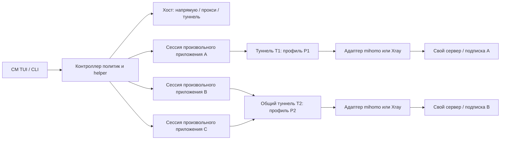
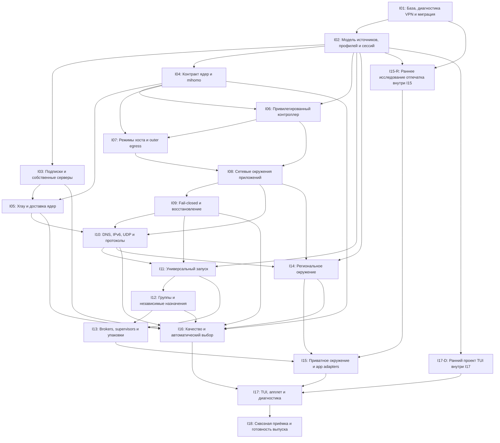
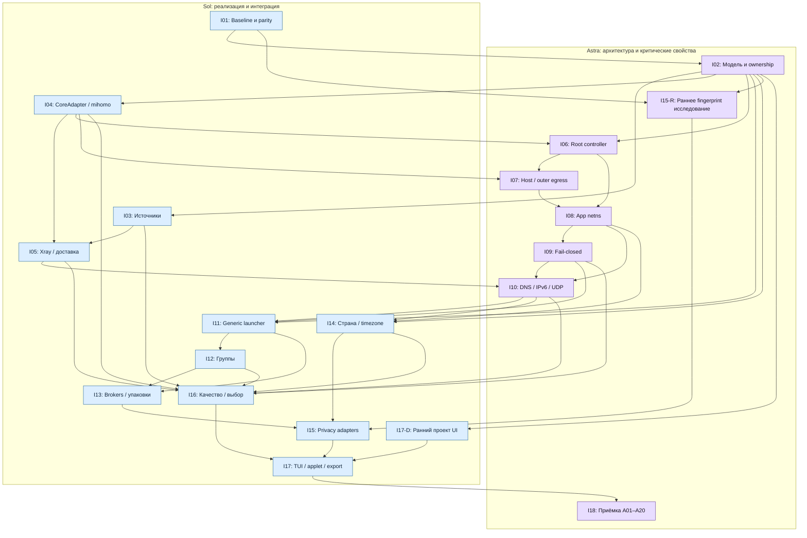
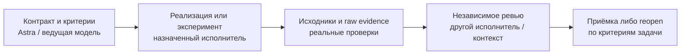

# CM: пакет для внешнего ревью

Актуальный рабочий снимок 2026-10-03. Приняты A+C, N=18 и ранний I15-R. Пользователь разрешил начать I01; остальные направления PLANNED. Координатор задаёт контракты и допуски, тесты исполняет отдельный агент, результаты проверяет независимый рецензент. Сборка пакета и установка на хост запрещены. I01 целиком не принят: проверенный ограниченный guard не заменяет миграцию, proxy pilots не подтверждают исправленный host VPN.

Граф задач: [DAG-PLAN.json](DAG-PLAN.json); роли: [MODEL-WORKFLOW.json](MODEL-WORKFLOW.json); диаграмма: [MODEL-WORKFLOW.mmd](MODEL-WORKFLOW.mmd). Они сохраняют 18 направлений, 20 рубежей и 100 задач. Канонические документы имеют приоритет; прежние отчёты Grok и формулировки «пока только документация» сохранены как история до разрешения I01. Задание Grok ниже относится к исходному архитектурному ревью; текущую реализацию оценивать по последним I01-документам.

Evidence не встроено полностью: безопасные ссылки доступны из отчёта исполнителя. Приватные конфиги, подписки, пароли и профили не прикладывать. Снимок отчёта и review обновляется после завершения новых разрешённых проверок; pending не означает PASS.

Состав: GROK-REVIEW.md, README.md, ITERATIONS.md, DETAILED-DAG-PLAN.md, MODEL-WORKFLOW.md, QUESTIONS.md, GROK-ANALYSIS-2026-10-03.md, RESEARCH-THREE-DIRECTIONS-2026-10-03.md, GROK-THREAD-ANALYSIS-2026-10-03.md, GROK-FINDINGS-2026-10-03.md, GROK-FOLLOWUP-TASK-2026-10-03.md, GROK-THREAD-REVIEW-2026-10-03.md, I01-TEST-CONTRACT.md, I01-SOURCE-AUDIT.md, I01-MIGRATION-GUARD.md, I01-PARITY-PROTOCOL.md, I01-DECISIONS.md, I01-EXECUTION-REPORT.md, I01-INDEPENDENT-REVIEW.md.

---

# Материал 1: GROK-REVIEW.md

# Задание Grok: независимое ревью проекта CM

Скопируйте текст ниже и приложите README.md, ITERATIONS.md и QUESTIONS.md из этой директории либо единый REVIEW-PACK.md. Для технической проверки, если рецензент имеет доступ к репозиторию, предоставьте перечисленные в README исходники. Не прикладывайте `/etc/cm*`, подписки, токены, приватные ключи или личные профили приложений.

## Готовый запрос

Ты — независимый технический рецензент проекта CM (Console Manager), Linux CLI/TUI на Rust. Требуется критически проверить проект развития; не реализовывать код, не собирать/устанавливать пакеты, не обращаться по приватным подпискам.

База — исходники CM 0.2.8. Сейчас CM обновляет/обслуживает Linux, управляет зеркалами, имеет TUI и COSMIC applet-launcher. VPN — один управляемый mihomo, одна активная подписка; Xray, per-app tunneling, независимые региональные окружения и постоянный per-app fail-closed ещё не реализованы. Упоминание xray в conflict detector не доказывает поддержку Xray. Source version не равна подтверждённой версии установленной системы.

Обновление 2026-10-03: пользователь поддержал A+C как основной путь, N=18 и раннее исследование отпечатка внутри I15. Не переоткрывай этот выбор без конкретного технического основания. Прочитай также GROK-ANALYSIS-2026-10-03.md и RESEARCH-THREE-DIRECTIONS-2026-10-03.md. Дополнительно проверь три направления: parity с FlClash при ошибках одного WS endpoint; встроенный per-instance DNS с отдельным bootstrap; механизм и доказательство массовости сохраняемого устройства. Прежний GROK-FINDINGS является материалом ревью, а не доказательством runtime или автоматически утверждённой реализацией.

Пользователь хочет:

- Управлять mihomo/Xray и выбирать server/transport/core по качеству и совместимости.
- Любые приложения Linux без hardcoded whitelist; названия Chrome/Claude Code — примеры.
- Отдельный туннель каждому приложению или один туннель группе.
- Разные subscriptions/свои servers для приложений и host, независимый lifecycle.
- Host off/proxy/tunnel, для назначенных приложений только tunnel. Не заменять это env-прокси.
- Максимально согласованную региональную/приватную среду, включая timezone; конкретные страна/сервис не зашиты.
- Желание «полной анонимизации» отдельно от технических гарантий: требуется честно определить достижимые свойства и ограничения.
- Пока только подробную документацию и план, без реализации/пакета.

Прочитай весь пакет. Разделяй СЕЙЧАС/ЖЕЛАНИЕ/ПРЕДЛОЖЕНИЕ/ВОПРОС/НЕ ПРОВЕРЕНО. Если кода у тебя нет, явно укажи, что описание baseline основано на предоставленном документе, а не твоей проверке. Не выдавай гипотезу, source reading, fake тест или readiness API за реальную network/application/privacy гарантию.

Проверь:

1. Полноту и соответствие пожеланиям, включая независимость host/app и separate/shared туннели из разных subscriptions.
2. Архитектуры A/B/C/D: реальные packet paths TCP/UDP/DNS/IPv6, TUN-интеграцию Xray конкретной версии, ресурсы, разные Linux desktop/packaging scenarios.
3. Privilege boundaries, root launch, cgroup/PID identity, namespace ownership, inherited sockets/FD, D-Bus/portals/shared supervisors и delegated network operations.
4. Fail-closed после crash/startup/reload/rollback/stop all/network change; владение firewall и сосуществование с NetworkManager/firewalld/чужими VPN.
5. Модель Source/Node/Profile/Tunnel/Group/Environment/Session, атомарность обновления/удаления и shared resource lifecycle.
6. Сохранность форматов/credentials/native parameters, реальную совместимость mihomo/Xray/Happ subscriptions и источники доставки ядер.
7. Границы «полной анонимизации», различие UA загрузки/TLS fingerprint/browser fingerprint/account identity; не обещай что одна смена IP/TZ убеждает любой сервис в стране.
8. Достижимость timezone/locale/storage controls для любых apps, generic launcher vs проверенные adapters vs container/VM; risks уникального fingerprint от несогласованной подмены.
9. Country observations, ошибки geo DB, privacy cost probes; stable-IP/session pinning, impact на login/streaming и качество измерений.
10. N = 18 итераций: одна на направление, dependencies, масштаб, порядок, criterion/test levels, забытые направления и release gates.
11. Текущие functions CM: package operations/mirrors/maintenance/helper/TUI и миграцию UPD→CM, которые план не должен сломать.
12. Реестр Q01–Q24: какие решения нужны пользователю, какие закрывает source research, какие требуют прототипа.

Не переписывай закрытые пользовательские требования ради более простого решения. Если требование буквально недостижимо, назови конкретную причину, максимальную проверяемую альтернативу и компромисс, который должен решить пользователь. Произвольный generic launcher не означает автоматическую поддержку всех приватных настроек неизвестной программы.

## Требуемый формат ответа

A. Короткий вердикт: что состоятельно, что блокирует начало реализации, что невозможно обещать.

B. Findings table: ID G01…; severity (критическая/высокая/средняя/низкая), priority P0/P1/P2, документ/раздел/итерация, конкретный failure scenario, evidence/первичный источник, исправление и acceptance test. Не ограничивайся общей фразой «проверить безопасность».

C. Сравнение A/B/C/D и рекомендованный вариант: packet-flow, ownership и минимальный решающий prototype. Если всё ещё неизвестно, назови experiment, а не назначай случайно architecture.

D. Ответы Q01–Q24: choice/recommendation, assumptions, limitations, experiment и user decision. Дополнительные вопросы обозначь Q25+.

E. Предложенные изменения плана I01–I18. Если предлагаешь другой N, объясни объединения/разделения и mapping всех исходных направлений; не потеряй обязательные требования.

F. Проверки, которых не хватает, с разделением unit/fake/Linux network/GUI/end-to-end/migration. Укажи, что можно считать доказательством NET/REGION/STATE/APP.

G. Короткий список решений пользователю: только существенные компромиссы, с 2–3 вариантами и последствиями.

H. Ограничения твоего ревью: что прочитано/проверено, чего не видел, что требует исполнения. Не утверждай, что тесты пройдены, если не запускал.

## После получения ревью

Ответ сохраняется отдельно, например `GROK-FINDINGS-YYYY-MM-DD.md`. Автор проекта связывает Gxx с Rxx/Qxx/Ixx, проверяет обоснование и обновляет проект/план. Рекомендации рецензента не являются автоматическим разрешением реализации, внешних действий или снятием запрета сборки пакета.

---

# Материал 2: README.md

# CM: развитие VPN и туннелей приложений

Дата: 2026-10-03. База: исходники CM / cm-cosmic 0.2.8 в текущем рабочем дереве.
Статус: проект для внешнего ревью, не утверждённая реализация.
Автор требований: пользователь. 2026-10-03 пользователь поддержал A+C как основной сетевой путь, раннее исследование отпечатка внутри I15 и сохранение N=18. Реализация и сетевые гарантии требуют прототипов и приёмки.

Документ описывает весь контекст проекта, а план развития сосредоточен на сетевых функциях, запуске приложений и окружении. Обновление пакетов, зеркала и обслуживание остаются частью CM и входят в регрессионные проверки.

## Навигация и порядок чтения

1. Этот документ: текущее состояние, отдельный список желаний, варианты реализации, ограничения и риски.
2. [ITERATIONS.md](ITERATIONS.md): N = 18 итераций, одна итерация на направление; задачи, зависимости, результаты и критерии готовности.
3. [QUESTIONS.md](QUESTIONS.md): решения и открытые вопросы с приоритетом и ответственным за окончательный выбор.
4. [GROK-REVIEW.md](GROK-REVIEW.md): готовое задание для внешнего рецензента и формат ответа.
5. [GROK-ANALYSIS-2026-10-03.md](GROK-ANALYSIS-2026-10-03.md): анализ полученного ревью, принятые направления и спорные утверждения.
6. [RESEARCH-THREE-DIRECTIONS-2026-10-03.md](RESEARCH-THREE-DIRECTIONS-2026-10-03.md): стабильность относительно FlClash, DNS и раннее исследование отпечатка; привязка к 18 итерациям.
7. [GROK-THREAD-ANALYSIS-2026-10-03.md](GROK-THREAD-ANALYSIS-2026-10-03.md): проверка повторного ревью F01–F14, опровержения и уточнение плана.
8. [DETAILED-DAG-PLAN.md](DETAILED-DAG-PLAN.md): детальный порядок выполнения — 18 направлений, 20 рубежей, 100 задач, gates и критерии приёмки; [DAG-PLAN.json](DAG-PLAN.json) содержит проверяемые зависимости каждой задачи.
9. [MODEL-WORKFLOW.md](MODEL-WORKFLOW.md): сводная схема по ведущим моделям, независимое ревью и evidence; [назначения](MODEL-WORKFLOW.json) дополняют DAG, а [Mermaid](MODEL-WORKFLOW.mmd) сохраняет его зависимости.
10. I01 начат по заданию пользователя: [контракт тестов и допуски](I01-TEST-CONTRACT.md), [исходный аудит](I01-SOURCE-AUDIT.md), [отчёт исполнителя](I01-EXECUTION-REPORT.md), [решения](I01-DECISIONS.md). Координатор задаёт контракты; проверки выполняет отдельный исполнитель. Другие направления остаются PLANNED, сборка пакета запрещена. Защита legacy install проверяется отдельно от полноценной миграции; proxy pilots отдельно от host TUN.

Для повторного ревью передаются основные документы вместе с анализом и исследованием либо актуальный REVIEW-PACK. Нужные места исходников перечислены ниже. Секретные конфиги, реальные подписки, VPN-ключи и пользовательские профили приложений в пакет ревью не входят.

Предыдущая подготовка документации выполнялась без реализации. Затем пользователь разрешил начать только I01: диагностику, миграционные исправления и регрессии, с отдельным исполнителем тестов и независимым ревью. Версия не меняется, пакет не собирается. Внешние отчёты Grok получены и проверяются отдельно; автоматическая отправка через подключённый инструмент Grok не выполнялась. Исходные отчёты сохраняются как история, текущие решения и границы фиксируются в канонических документах.

## 1. Значение статусов и приоритетов

- **СЕЙЧАС** — поведение или структура подтверждены чтением текущих исходников; это не автоматически доказательство работы на всех Linux-системах.
- **ЖЕЛАНИЕ** — пользовательский результат без предположений о технической достижимости.
- **ПРЕДЛОЖЕНИЕ** — возможное устройство проекта, которое ещё не реализовано.
- **ВОПРОС** — решение, которое требуется до соответствующей итерации.
- **НЕ ПРОВЕРЕНО** — требуются эксперимент, внешняя проверка или приёмочные испытания.

Приоритет работ: **P0** — блокирует безопасный выпуск/архитектуру; **P1** — обязательная функция целевой версии; **P2** — последующее улучшение. Значимость риска: **критическая** — прямой выход защищённого приложения, нарушение привилегий или потеря данных; **высокая** — неверный маршрут/страна, несовместимость или ложное утверждение защиты; **средняя** — качество, ресурсные затраты, неполная диагностика; **низкая** — удобство. Приоритет и значимость не равны сроку или оценке трудозатрат.

## 2. СЕЙЧАС: что умеет CM

### 2.1. Продукт и интерфейс

CM — Console Manager, Linux-утилита на Rust с CLI и TUI. Команды: `cm`; компонент COSMIC: `cm-cosmic`. Оба Cargo-пакета имеют версию 0.2.8. Исполняемый CM рассчитан на статическую сборку musl; компонент COSMIC имеет отдельный workspace и зависит от libcosmic.

| Область | Реализовано в исходниках | Граница подтверждения / место в проекте |
|---|---|---|
| Пакеты | Проверка, предзагрузка и обновление через pacman, apt, dnf, zypper | Возможности зависят от backend; [src/backend.rs](../../../src/backend.rs), [src/main.rs](../../../src/main.rs) |
| Дополнительные обновления | Flatpak, AUR через доступный helper, прошивки; новости Arch | Условные интеграции, не одинаковы на всех системах; [src/extras.rs](../../../src/extras.rs) |
| Обслуживание | Снапшоты, информация об откате, службы, кэш, сироты, новые конфиги, история | Зависит от установленных инструментов; CM не превращает любую систему в универсальную систему отката |
| Зеркала и автоматика | Выбор/закрепление зеркал там, где backend это поддерживает; периодические проверки и реакция на сеть | Сохранить регрессии при смене маршрута хоста; [src/mirrors.rs](../../../src/mirrors.rs) |
| TUI | Главное меню, VPN, зеркала, AUR, текстовые страницы, PTY-экран команд, журнал F2, интерактивный терминал F4 | [src/tui.rs](../../../src/tui.rs), [src/tui/process.rs](../../../src/tui/process.rs) |
| Хост и ресурсы | Модель хоста/CPU, ядро, система, GPU vendor/device/driver; CPU, load average, RAM, swap, диск `/`, сетевые скорости, uptime | При открытом главном меню замеры раз в секунду; GPU usage, все диски и ресурсы по приложениям не реализованы; [src/tui/host.rs](../../../src/tui/host.rs) |
| COSMIC | Апплет состояния и запуск TUI; повторный запуск использует живой терминал; отдельное окно по запросу | Возврат фокуса на Wayland зависит от композитора; [cosmic/src/model.rs](../../../cosmic/src/model.rs), [cosmic/src/tui_launch.rs](../../../cosmic/src/tui_launch.rs) |
| Иконки | Первая итерация: терминал `>_` с разными индикаторами состояния | [Предпросмотр](../../cm-0.2.8/icons-iteration-1.png); будущий учёт нескольких туннелей не реализован |
| Локализация | ru, en, de, it, zh, ar | Новые сетевые функции должны сохранять локализацию и работу узкого терминала |

### 2.2. VPN и подписки

СЕЙЧАС: [src/vpn.rs](../../../src/vpn.rs) управляет mihomo, одной службой `cm-vpn.service`, одним TUN `cm-vpn`, одним основным runtime-каталогом и конфигом. В `Subs` есть список подписок и одно поле `active`. Наличие нескольких записей не означает наличие нескольких независимых туннелей.

- Добавление/обновление/удаление HTTPS-подписок, стабильные id, выбор подписки и серверов/групп, состояние и журнал.
- Форматы: YAML Clash/mihomo и URI-списки в тексте/base64; URI-профили подключаются через файловый provider mihomo. Произвольный JSON Xray/Sing-box не является поддерживаемым профилем.
- User-Agent можно задать для подписки. При непригодном успешном HTTP-ответе есть ограниченный перебор совместимых клиентов. При сетевой/HTTP-ошибке перебор прекращается. Это совместимость форматов, не анонимизация.
- Распознавание некоторых заглушек неподдерживаемого клиента, непринятие HTML как рабочей подписки. Непригодный сохранённый профиль повторно загружается при выборе.
- Секретные URL хранятся отдельно от публичного состояния. В конфиг переносятся разрешённые части подписки; управляющие параметры CM задаёт сам.
- TUN либо локальный mixed HTTP/SOCKS-прокси; системный прокси настраивается отдельно, не все программы обязаны его использовать.
- Настройки `rule/global/direct`, DNS/fake-IP, IPv6, LAN и прямых маршрутов. В текущих настройках есть прямые исключения для LAN/России; они не подходят как неявная политика строгих туннелей приложений.
- Автовыбор по задержке — группа mihomo URL-test. Это не комплексная оценка качества, не балансировщик между ядрами и не увеличение скорости одного потока за счёт суммирования каналов.
- API mihomo через закрытый Unix-сокет; проверка владельца/peer. Подготовка конфигурации, проверка ядром и операции сохранения/отката.
- Установка/проверка/обновление mihomo, геофайлов; проверка SHA-256 digest для устанавливаемого ядра. Проверки релизов связаны с FlClash и mihomo; Xray как управляемое ядро отсутствует.
- В `VPN_CORES` встречается `xray` для обнаружения конфликтующего внешнего процесса. Это НЕ поддержка Xray.

Версия mihomo v1.19.32 была показана пользователем. Она не зашита как обязательная установленная версия для любого хоста; некоторые User-Agent сейчас содержат фиксированные версии клиентов.

### 2.3. Права, пути и переход UPD → CM

СЕЙЧАС: helper через Unix-сокет и polkit, типизированные запросы, peer identity, ограничение допустимых операций; пользовательский TUI может повышать права для действий. [src/helper.rs](../../../src/helper.rs), [src/common.rs](../../../src/common.rs).

Основные пути: `/etc/cm.conf`, `/etc/cm/vpn`, `/var/lib/cm/vpn`, `/run/cm/helper.sock`. Есть совместимость переменных путей `UPD_*` и переход известных старых каталогов/служб при установке. Переход требует отдельной приёмки на установленных системах: чтение кода и тесты с фиктивными службами не доказывают завершённую миграцию пакетов на хосте пользователя. См. `migrate_upd` в [src/main.rs](../../../src/main.rs).

### 2.4. Чего сейчас нет

Управляемого Xray; модели нескольких активных профилей; per-app namespaces; универсального launcher приложений; групп приложений с независимыми подписками; постоянного fail-closed firewall для таких групп; независимых региональных окружений; смены timezone/locale приложения; проверки browser fingerprint; адаптивного выбора между ядрами. Существующее чтение cgroup для обслуживания служб не является маршрутизацией приложений.

### 2.5. Доказательства и открытая проблема подписки

В предыдущей итерации в сессии прошли библиотечные, CLI, интеграционные, COSMIC и launcher-тесты. Это исторический результат для текущей разработки; эта подготовка документов не перезапускает тесты и не объявляет новые runtime-гарантии. Пакет 0.2.8 в этой сессии не собирался и не устанавливался.

Для проблемной подписки из сообщения не подтверждено реальное подключение исправленной CM 0.2.8. Старые отчёты в `docs/VPN-PROVIDER-REVIEW-2026-10-02.md` описывают другую стадию/установленный UPD; переносить их выводы на новую версию нельзя. Обобщённые тесты перебора User-Agent не заменяют проверки конкретного провайдера.

## 3. ЖЕЛАНИЯ: пользовательский результат, отдельно от реализации

Этот раздел фиксирует запрос; он не обещает достижимость каждой формулировки.

| ID | Желание | Важность |
|---|---|---|
| W01 | Поддерживать mihomo и Xray, вручную и автоматически выбирать подходящее соединение | P1 |
| W02 | Выбирать по реальному качеству: стабильность, задержка, скорость, ресурсы, совместимость | P1 |
| W03 | Туннелировать произвольные приложения Linux; Chrome/Claude Code — только примеры, без закрытого списка | P1 |
| W04 | Каждому приложению назначать свой туннель или объединять несколько приложений в один | P1 |
| W05 | Для приложений/групп использовать другую подписку либо собственный сервер независимо от хоста | P1 |
| W06 | Для хоста оставить режимы без VPN, прокси и туннель | P1 |
| W07 | Назначенным приложениям предоставить только туннель, без режима обычного прокси приложения | P0 |
| W08 | Хост может работать через другой сервер или напрямую, пока приложения остаются в своих туннелях | P0 |
| W09 | «Полная анонимизация»: приложение должно видеть окружение, согласованное со страной выбранного IP, включая часовой пояс | P1; границы требуют решения Q01 |
| W10 | Менять все необходимые признаки, а не только внешний IP; конкретная страна/сервис не зашиты | P1; универсальная достижимость не подтверждена |
| W11 | Понятный TUI, достоверный статус защиты и состояния отдельных туннелей; апплет открывает консоль | P1 |
| W12 | Сейчас подготовить проект и вопросы для Grok, без реализации и сборки пакета | Действующее ограничение этой работы |

Частный список приложений пользователь готов предоставить при необходимости. Для общего launcher он не требуется; для проверки совместимости и адаптеров пригодится тестовая выборка, которая не становится ограничением продукта.

## 4. Границы обещаний и проверяемые цели

**Полная анонимность произвольного приложения не гарантируется VPN-ядром, namespace или сменой timezone.** Сервис может учитывать аккаунт, cookies, синхронизацию, прошлую активность, IP/ASN и признаки устройства. Приложение может само отправлять сохранённые данные. Это ограничение нужно согласовать, а не заменить желание молча.

Предлагаемые независимые уровни:

| Уровень | Проверяемый результат | Что он не доказывает |
|---|---|---|
| NET | Назначенные процессы и обычные потомки имеют только разрешённый сетевой выход; отказ блокирует выход | Не охватывает автоматически внешнюю службу, которой программа поручила запрос |
| REGION | Проверены IP/country observations, DNS, timezone, locale в управляемом окружении | Один сервис может классифицировать IP иначе; timezone не подтверждает физическое местоположение |
| STATE | Отдельные настройки/хранилища, контролируемый доступ к внешним службам | Общая авторизация и импорт старых данных могут восстановить связь с прежней личностью |
| APP | Для конкретного приложения проверены дополнительные региональные/приватные настройки | Не означает полного универсального скрытия fingerprint или аккаунта |

Предлагаемая модель угроз: обычное приложение и его сетевые пути, ошибочная конфигурация, авария CM/ядра, DNS/IPv6/UDP-обход, смена сети, внешние посредники и чтение доступного окружения. Защита от враждебного администратора/скомпрометированного ядра/процесса с сетевыми привилегиями не заявляется. Если требуется изоляция от вредоносного приложения, это отдельная цель и более строгий sandbox/VM, а не расширенное название туннеля.

NET/REGION должны иметь состояния «проверено», «проверено частично», «не проверено», «блокировано», «ошибка». Слово «анонимно» без измеримых критериев запрещено как обещание интерфейса; термин пользовательского желания W09 сохраняется в этом документе.

## 5. Возможные архитектуры

### 5.1. Общая модель данных — ПРЕДЛОЖЕНИЕ

| Сущность | Содержимое / роль |
|---|---|
| Source | Подписка, ручной конфиг или свой сервер; приватные credentials; формат и origin |
| Node | Конкретный endpoint, протокол/транспорт, параметры и поддерживаемые возможности; стабильная идентичность |
| ConnectionProfile | Допустимые Source/Node, ядро или политика выбора, резервы, страна и ограничения качества |
| TunnelInstance | Runtime конкретного соединения: ядро, namespace, маршруты, DNS, проверки, поколение конфига |
| ApplicationDefinition | Desktop ID / executable / структурированные argv, рабочий каталог; область пользователя |
| ApplicationGroup | Приложения, использующие один логический туннель; политика общего ресурса |
| EnvironmentProfile | Timezone, locale, доступ к файлам/IPC, отдельные данные, возможности адаптера |
| BrowserIdentityProfile | Предлагаемая сохраняемая личность профиля данных браузера; источник каталога, совместимость версий и история; не принадлежит туннелю |
| DnsPolicy / DnsRuntime | Политика профиля подключения и реализация/cache/fake-IP конкретного поколения TunnelInstance |
| Session | Конкретный запуск: uid, PID + start time, cgroup, namespace, ссылки на TunnelInstance/EnvironmentProfile |
| HostPolicy | Без VPN / прокси / туннель; настройки независимо от сессий приложений |
| Verification | Какие свойства проверены, чем, когда, с какого маршрута и для какого поколения конфигурации |

Подписка ≠ сервер ≠ профиль ≠ активный туннель. Одно ядро может поддерживать несколько outbounds, но это не равно нескольким независимым окружениям. Количество workers является решением после измерений. Общий логический туннель не обязан давать приложениям общий HOME, loopback или файловую систему.

### 5.2. Вариант A: Linux-контроллер маршрутов, ядра как workers

CM контролирует системные маршруты, namespaces и правила блокировки; mihomo/Xray обслуживают профили через адаптеры. Приложения входят в свои сетевые окружения и используют заданный шлюз туннеля. Внешние соединения ядра явно отделяются от внутреннего потока и могут достигать endpoint через физическую сеть, независимо от VPN хоста.

Плюсы: Xray не зависит от обязательного присутствия mihomo; единый контроль запрета прямого выхода; независимость хоста/приложений. Минусы: самая большая ответственность CM, отдельное решение доставки TCP/UDP из TUN каждому ядру, сложная совместимость с NetworkManager/firewall.

ВОПРОС: использовать native TUN определённой версии ядра либо отдельный адаптер транспорта? Проверить матрицу версии/платформы/UDP. Нельзя считать, что Xray и mihomo имеют одинаковый интерфейс TUN. Дополнительный TUN→proxy компонент — новая зависимость, требующая явного решения, не «бесплатная» часть архитектуры.

### 5.3. Вариант B: mihomo как маршрутизатор, Xray как локальный upstream

Mihomo принимает трафик через TUN/шлюзы, а часть соединений передаёт локальному Xray. Пользовательские приложения всё равно имеют только туннель; локальный proxy между компонентами не является пользовательским proxy-режимом приложения.

Плюсы: повторное использование маршрутизации и групп mihomo, меньше собственного транспорта. Минусы: обязательность mihomo даже для Xray-профиля, дополнительные ресурсы/точки отказа, необходимость проверить UDP и отсутствие циклов. Сам по себе общий TUN с PROCESS-NAME не обеспечивает строгой изоляции любых приложений.

### 5.4. Вариант C: отдельное окружение туннеля на профиль

На профиль создаётся worker/namespace; приложения или их namespaces подключаются к нему. Хост имеет отдельный маршрут. Плюсы: проще объяснять владение и локализовать ошибку. Минусы: RAM, процессы, интерфейсы, лимиты; много туннелей могут дублировать ядра. Требуется отдельно решить безопасность нескольких приложений, разделяющих один выход.

### 5.5. Вариант D: VM/контейнер для расширенного окружения

Использовать дополнительное окружение для приложений, которым нужен контроль большей части видимой системы. Плюсы: больше контроля ОС, timezone, хранилищ и процессов. Минусы: сложнее GUI/GPU/аудио, работа с файлами и обновлениями, выше ресурсы; VM не скрывает авторизацию и не гарантирует анонимность. Это расширение, а не исходное требование установить отдельную VM для каждой программы.

| Вариант | Независимость ядер | Собственное сетевое управление CM | Ресурсы | Главная неопределённость |
|---|---|---|---|---|
| A | Высокая | Высокая | Зависит от workers | Транспорт TUN/UDP и надёжность контроллера |
| B | Xray зависит от front-end | Средняя | Два ядра для части маршрутов | Цепочка proxy, UDP, fail-closed |
| C | Высокая | Высокая | Может быть высокая | Совместный выход и изоляция приложений |
| D | Высокая | Высокая + управление окружением | Наибольшая | Интеграция GUI и реалистичный scope |

Принято пользователем 2026-10-03: A+C — основной путь для строгого per-app режима. CM владеет маршрутами и правилами блокировки; отдельные workers/namespaces обслуживают TunnelInstance. B остаётся запасным транспортным адаптером после испытаний Xray TUN, а не параллельным продуктом. Q03 и Q08 требуют выбора технического механизма и прототипа. D не является выбранным обязательным путём. Таблица сохраняется для обоснования решения.



Схема — логические отношения, не готовый чертёж интерфейсов Linux. Между приложением, workers и физической сетью нужны проверяемые маршруты и правила запрета обхода.

## 6. Решения по направлениям — ПРЕДЛОЖЕНИЯ

### 6.1. Подписки и своё подключение

Сохранять исходный формат и provenance. Импортёр выделяет поддерживаемые узлы без исполнения удалённых указаний. Неподдерживаемые транспорты диагностируются, а не молча переписываются в похожий протокол. Raw JSON ядра не получает право включить произвольные listeners, host networking, внешние управляющие API или загрузку кода.

Варианты: native-формат каждого ядра; общий нормализованный Node плюс закрытые engine-specific поля; комбинация общего набора и непреобразованных расширений. Выбрать Q04. При обновлении исчезнувшего/переименованного узла активная сессия не должна внезапно уходить на случайный сервер.

### 6.2. Режимы хоста и туннели приложений

Хост: без VPN / прокси / туннель. Назначенные приложения: только туннель. «Без VPN хоста» не выключает T1/T2. «Остановить все туннели» при живых защищённых сессиях сохраняет блокировку сети до явного изменения политики/завершения сессий.

Общий proxy-режим хоста не должен перенаправлять транспорт приложения поверх другого VPN случайно. Внешний endpoint ядра может быть исключением маршрута; это не разрешение прямого выхода приложению. Существующие глобальные `vpn_direct_ru`/`vpn_direct_lan` не наследуются строгой сессией автоматически. Для LAN/локальных сервисов требуется отдельная явная политика Q09.

### 6.3. Привилегии и lifecycle

Root/helper создаёт и проверяет только разрешённые сетевые объекты. Приложение запускается исходным uid/gid с нужными файлами/сессией рабочего стола. Структурированные argv без `sh -c`; всё, что потребует оболочки как пользовательской команды, должно быть явным запуском пользовательского shell, не root-конкатенацией.

Сессия идентифицируется не одним PID, а PID/start time и принадлежностью cgroup/namespace. Серверный endpoint разрешён worker, а приложению — только назначенный выход. Crash helper/ядра/UI не убирает fail-closed. Завершение ресурса учитывает всех пользователей общего туннеля.

Предлагаемые состояния: `Draft → Preparing → Blocked → Validating → Active → Degraded → Recovering`; завершение `Stopping → Closed`. При любой ошибке до `Active` сеть приложения остаётся запрещена. Есть отдельный журнал владения ресурсами для восстановления после перезапуска/перезагрузки. «Нет процесса CM» не означает «можно удалить firewall».

### 6.4. DNS, IPv6, UDP и обходы

DNS-политика привязана к TunnelInstance, проверяется из namespace сессии. Host stub `127.0.0.53` не становится автоматически доступным внутри нового namespace. Нужны решения bootstrap DNS для endpoint, DoH/DoT самого приложения и разделения внутреннего DNS от служебного DNS транспорта.

IPv6: либо полностью обслуживаемый маршрут, либо явная блокировка, а не только флаг в конфиге ядра. UDP/QUIC/WebRTC: поддержать через выбранный транспорт либо блокировать с объяснением. Нет fallback на прямой UDP. Проверять реальный исходящий интерфейс, а не только успешный TCP-запрос проверки IP.

### 6.5. Произвольные приложения и специальные случаи

Общий launcher принимает desktop entry, executable или argv. Отдельные generic интеграции допустимы для формата запуска: native, AppImage, Flatpak, terminal/GUI. Это не hardcoded whitelist приложений. Нет молчаливого переноса уже открытых сокетов в новый маршрут; по умолчанию новый управляемый запуск.

Внешние brokers, D-Bus/systemd user services, portals и общие supervisors могут выполнить сеть вне namespace потомков. Не объявлять их покрытыми без проверки. Режимы: отдельный экземпляр службы; управляемый запуск службы; запрет конкретного посредника; явная несовместимость. Смешанные namespace/cgroup/PID проверки и трассировка на приёмке нужны для оценки охвата.

### 6.6. Региональное окружение

IP-страна — ограничение профиля, а не текст названия узла/флаг провайдера. Нужны observations из независимых источников и timestamp; определить что делать при расхождении классификации. Использование внешнего сервиса проверки раскрывает ему IP и сам факт проверки; предусмотреть собственный endpoint и локальные данные.

Timezone: IANA ID, `TZ` плюс контролируемый вид `/etc/localtime`/при необходимости `/etc/timezone`; отдельный mount namespace с правильной propagation. Системные часы UTC не сдвигать. Linux time namespace не является механизмом смены timezone; realtime clocks не нужно подделывать. Locale: наличие locale на системе, настройки программы и browser language требуют проверки. Часовой пояс нельзя однозначно вывести только из страны.

Свежий профиль приложения — вариант, не автоматическое удаление существующих данных. Сохранить рабочие каталоги/файлы проекта по явной политике. HOME/XDG и read-only доступ к нужным файлам выбираются отдельно: монтирование всего HOME может возвращать старую идентичность.

ЖЕЛАНИЕ: Chromium-подобный браузер сохраняет существующий профиль и аккаунт, а весь заявленный видимый отпечаток заменяется другим массовым согласованным набором, включая User-Agent, Client Hints, шрифты, Canvas и WebGL. Механизм полного набора, каталог и его массовость НЕ ПРОВЕРЕНЫ. Ранний I15-R выбирает механизм и проверяет поверхности/контексты до большой интеграции. Отдельные flags/CDP не являются доказательством полной подмены устройства.

ПРЕДЛОЖЕНИЕ: BrowserIdentityProfile принадлежит профилю данных, независимо от TunnelInstance. Смена страны меняет выбранное региональное окружение и сетевой путь, но не создаёт новое устройство. Пока профиль жив, личность стабильна; её изменения применяются на холодном старте по Q27. Числа 28 дней и пять прошлых записей — предварительные параметры рецензента, не измеренный стандарт и не требование задержать обновления безопасности. Представляемая версия должна оставаться совместимой с реальным браузером. UA загрузки подписки не относится к этой личности.

REGION оценивается для каждой сессии относительно её EnvironmentProfile. Разные допустимые языки/часовые пояса приложений на одном туннеле сами по себе не понижают статус. Несоответствие заданному пресету либо неизвестное применение дают partial/unknown. Применённые настройки, наблюдаемая IP-страна и решение внешнего сервиса не смешиваются в одну гарантию.

### 6.7. Качество и переключения

Единица оценки: профиль + узел + транспорт + версия ядра + текущая сеть. Сначала обязательные constraints (совместимость, страна, DNS, NET-проверки), затем качество. Метрики: доля успешных проб, задержка/TTFB и разброс, обрывы, при разрешении — ограниченная throughput-проба; CPU/RAM на профиль. Последнее измерение имеет срок годности.

Политики: фиксированный сервер; фиксированный сервер с резервом; лучший из разрешённых. Порог улучшения, окно наблюдения и cooldown исключают постоянные переключения. Значения выбираются по измерениям, не объявляются заранее оптимальными. Верификация страны/IP относится к выбранному кандидату, а не только исходному узлу.

Session pinning и смена IP: существующие TCP/UDP-сессии обычно не переносятся между внешними соединениями прозрачно. Для AI-streaming/логинов нужен выбор «держать сервер до завершения», «резерв при отказе» или «перезапуск». Не смешивать стабильность внешнего IP, скорость, полноценное соединение каналов и анонимность.

### 6.8. TUI и пример отображения

Варианты: расширить существующий экран VPN вкладками «Хост / Туннели / Приложения / Источники / Диагностика»; либо оставить основные вкладки и открыть per-app управление отдельным экраном. Сравнить действия/ширину терминала/число клавиш в I17.

```text
Хост          напрямую
Туннель T1    источник A · узел N1 · Xray · NET проверено
Туннель T2    источник B · узел N2 · mihomo · NET проверено
Приложение A  T1 · среда E1 · REGION проверено частично
Приложение B  T2 · среда E2 · запущено
Приложение C  T2 · среда E3 · запущено
Проверка      DNS / IPv6 / UDP / IP / timezone: отдельные результаты
```

Это макет, не реальный CLI-вывод. Апплет должен различать отсутствие VPN хоста и наличие живых туннелей приложений. Ошибка одной группы не превращает остальные в ошибку; глобальный сигнал имеет понятную причину. Закрытие окна TUI не обязано завершать приложения или workers.

### 6.9. Возможный CLI и расположение кода

Вариант public CLI — оставить существующие `cm vpn ...` совместимыми для хоста, добавить отдельные operations туннелей и `cm app ...` для запусков. Альтернатива — общий `cm net ...`, где host/app являются targets; сравнить ясность и migration cost. Примеры ниже **не являются существующими командами**:

```text
cm vpn host off
cm vpn tunnel create --profile PROFILE_ID
cm app add --desktop-id DESKTOP_ID
cm app assign APP_ID --tunnel TUNNEL_ID --environment ENV_ID
cm app run APP_ID
cm app run --tunnel TUNNEL_ID -- /path/to/program ARGUMENT
cm vpn verify --tunnel TUNNEL_ID
```

Для общей группы несколько ApplicationDefinition ссылаются на один TUNNEL_ID. USER argv не интерполируются в shell. Конкретный синтаксис, names и возможность transient session принимаются в I11/I17. Source/credentials задаются безопасным отдельным вводом, не примером URL с токеном в argv.

Варианты кода: расширить большой `src/vpn.rs` либо выделить `src/network/{model,controller,policy,verification}`, `src/network/engines/{mihomo,xray}` и `src/apps/{launch,environment,adapters}`. Предпочтение: постепенное выделение модулей с legacy wrapper; не переписывать пакетные backends и весь TUI одновременно. Сначала зафиксировать interface contracts и базовую регрессию. Предложенные модули пока не существуют.

## 7. Проблемные места и значимость

| Риск | Проблема | Значимость | Приоритет | Подход / проверка | Итерации |
|---|---|---|---|---|---|
| R01 | Прямой выход при падении ядра/controller или между startup steps | Критическая | P0 | Заблокированное исходное состояние, независимый от процесса запрет, packet capture | I06–I10, I18 |
| R02 | Root-launch, argv injection, неверная uid/namespace ownership | Критическая | P0 | Peer identity, typed requests, исходный uid, отрицательные проверки | I06, I11 |
| R03 | Потеря старых настроек при миграции/rollback | Критическая | P0 | Сохранение исходников данных, версии схемы, тест UPD/CM и конфликты каталогов | I01–I02, I18 |
| R04 | Namespace есть, но фактический egress не соответствует профилю | Высокая | P0 | Отдельные app/worker namespaces, проверка интерфейса/endpoint/маркировки | I07–I10 |
| R05 | DNS/IPv6/UDP или вспомогательные маршруты обходят туннель | Критическая | P0 | Проверки всех протоколов, fail-closed для неподдержанных функций | I09–I10 |
| R06 | Сеть выполняет внешний broker/supervisor | Высокая | P0 | Подтверждённая интеграция или запрет запуска в защищённом режиме | I11, I13, I18 |
| R07 | Общий туннель исчезает после закрытия первого приложения | Высокая | P0 | Refcounts/session ownership/reconciliation, проверка concurrent stop/start | I09, I12 |
| R08 | Старые direct/LAN/Россия исключения нарушают требования приложений | Высокая | P0 | Разные host/app policies; отсутствие неявного наследования | I02, I07, I10 |
| R09 | «Анонимно» показывается на основании одного IP/пинга | Высокая | P0 | Раздельные NET/REGION/STATE/APP, возраст evidence и unknown | I14–I18 |
| R10 | Геобазы/название узла/сервис расходятся о стране | Высокая | P1 | Provenance observations, ручной override не считается доказательством | I14, I16 |
| R11 | TZ/locale не применяется программой или читается через host IPC | Высокая | P1 | App probe, закрытые IPC-пути, честный partial/unsupported | I13–I15 |
| R12 | Native JSON/protocol options теряются при конвертации | Высокая | P1 | Capability matrix, explicit unsupported, differential configs | I03–I05 |
| R13 | Взаимное перехватывание ядрами, маршрутизационная петля, host VPN chaining | Высокая | P0 | Один owner общих маршрутов, выделенный egress транспорта | I07–I10 |
| R14 | Namespace ломает GUI, GPU, audio, portals или упаковку приложения | Высокая | P1 | Пакетные/desktop интеграции с минимальными разрешениями | I11, I13, I15 |
| R15 | Частая смена IP ломает login/streaming и повышает подозрительность | Высокая | P1 | Pinning, cooldown, страна/сервер как constraint | I16 |
| R16 | Много ядер/проверок расходуют RAM, батарею и трафик | Средняя | P1 | Лимиты workers, lazy start, probe budgets, измерение idle | I04–I05, I12, I16 |
| R17 | Секреты в диагностике/документации/реестре argv | Критическая | P0 | Redaction, private state, контролируемый экспорт | I02–I06, I17–I18 |
| R18 | Новые rules ломают NetworkManager/firewalld/чужой VPN | Высокая | P0 | Только свои объекты, collision checks, coexistence/rollback | I07, I09, I18 |
| R19 | Защищённый child выходит из session scope, получает лишние capabilities или старый FD | Критическая | P0 | Capability/FD policy, cgroup tracking, broker tests | I06, I11, I13 |
| R20 | Хост/пакетные операции перестают работать после изменения VPN | Высокая | P0 | Регрессии mirrors/prefetch/обновлений/systemd/helper | I01, I07, I18 |

## 8. Проверка успеха: разные уровни доказательства

1. Unit/config tests: разбирают данные и правила, не доказывают отсутствие утечки.
2. Integration с fake workers: проверяют lifecycle и транзакции, не доказывают маршрутизацию Linux.
3. Linux namespace tests с фиктивным endpoint и packet capture: проверяют интерфейсы, отказ, DNS/TCP/UDP/IPv6, race windows.
4. Приложения и GUI: проверяют реальный запуск/потомков/broker/storage/timezone; отдельная матрица поддержки.
5. Реальный свой сервер/подписка: проверяют end-to-end и сравнение ядер по одному endpoint; используются разрешённые тестовые credentials.
6. Релизные проверки: миграция/регрессии/backend/установка; сборка/установка пакета разрешается отдельным будущим заданием.

Нельзя подменять уровни: `mihomo -t` подтверждает валидность конфига, `/version` подтверждает API, ping показывает только тестируемый путь. Ни одно из них само по себе не подтверждает полную сеть приложения или его региональную идентичность.

## 9. Дополнение: что не вошло в основную реализацию

Вопросы учтены, но не считаются автоматически согласованными задачами ближайшего выпуска:

- Tor, multi-hop и доказательство анонимности на уровне модели противника; другой scope, чем региональный туннель.
- VM/полная ОС на приложение; вариант D требует отдельного решения о ресурсах и GUI.
- Полная anti-fingerprinting модификация браузера; upstream launcher сам её не предоставляет.
- Развёртывание/администрирование собственного удалённого VPN-сервера: здесь предусматривается подключение к уже имеющемуся серверу.
- Истинное bonding каналов и ускорение одного соединения за счёт нескольких серверов.
- Маршрутизация входящих подключений, опубликованные порты, LAN-discovery и broadcast/multicast внутри групп.
- Мобильные клиенты, Windows/macOS, удалённое управление CM.
- Поддержка privileged/сетевых системных служб как «произвольного приложения»; требует особой модели прав.
- Несколько одновременных Linux-пользователей, разделение их источников/туннелей; базовая схема должна не нарушать ownership, полный shared management — Q16.
- Доверенный portable identity/browser image и согласованность аппаратных fingerprint surfaces.
- Единый policy bundle для региона: пользователь может захотеть язык, отличный от страны; это не всегда противоречие.
- Политика доступности принтеров, локальной разработки, SSH-agent, keyring, audio и D-Bus; не выдавать всем доступ по умолчанию.
- Лимиты/условия подписок: несколько устройств, соединений, несовместимые client-specific ответы, квоты; CM должен их учитывать диагностически.
- Архив старых отчётов, имена UPD в исторических документах и реальные версии установленного приложения; документация 0.2.8 не должна ретроспективно переписывать доказательства старых аудитов.

Если рецензент считает дополнение необходимым для NET/REGION, он должен перенести пункт в обязательные задачи с объяснением и зависимостями, а не только предложить «улучшение».

## 10. Первичные источники и ограничения их использования

Источники описывают возможности механизмов/приложений, а не подтверждают готовность CM. Дата просмотра: 2026-10-03. Перед реализацией закрепить версии и повторно проверить API.

- Linux [network namespaces](https://man7.org/linux/man-pages/man7/network_namespaces.7.html): изоляция сетевых стеков/маршрутов и необходимость CONFIG_NET_NS; основа вариантов A/C.
- Linux [mount namespaces](https://man7.org/linux/man-pages/man7/mount_namespaces.7.html): отдельный вид mount points, propagation; основа per-app файлов timezone.
- Linux [tzset](https://man7.org/linux/man-pages/man3/tzset.3.html) и [time namespaces](https://man7.org/linux/man-pages/man7/time_namespaces.7.html): TZ/timezone отдельно от виртуализации часов.
- Mihomo [routing rules](https://wiki.metacubex.one/en/config/rules/): PROCESS-PATH/PROCESS-NAME/UID; наличие правила не доказывает полный охват произвольного приложения.
- Mihomo [URL-test](https://wiki.metacubex.one/en/config/proxy-groups/url-test/) и [load-balance](https://wiki.metacubex.one/en/config/proxy-groups/load-balance/): доступные групповые политики, не CM multi-engine controller.
- Xray [Observatory](https://xtls.github.io/en/config/observatory.html): пробы для выбора соединения; учесть стоимость и поведенческий след измерений.
- Xray [TLS](https://xtls.github.io/en/config/transports/tls.html) и mihomo [TLS](https://wiki.metacubex.one/en/config/proxies/tls/): fingerprint настройки транспорта, не полная анонимизация приложения.
- [Marzban subscription router](https://github.com/Gozargah/Marzban/blob/master/app/routers/subscription.py) и [Remnawave response rules](https://github.com/remnawave/templates/blob/main/remnawave-default/response-rules/srr-default-config.json): выдача формата по заголовкам клиента.
- [Happ Desktop](https://github.com/Happ-proxy/happ-desktop): применение Xray; это не готовый API/код интеграции Happ в CM.
- [Chromium SOCKS](https://www.chromium.org/developers/design-documents/network-stack/socks-proxy/): ограниченный охват proxy-параметров браузера. Используется для объяснения требований к туннелю, а не выбора proxy-режима приложений.
- [Claude Code network configuration](https://code.claude.com/docs/en/network-config): proxy API и особенности фонового supervisor/launch wrapper. Это пример класса интеграций, не hardcoded требование поддерживать только Claude.
- [Google location information](https://support.google.com/websearch/answer/179386?hl=en): учёт местоположения/активности/аккаунта помимо IP. Это пример ограничений гарантии W09, не особая цель «эмулировать одну страну для Google».

---

# Материал 3: ITERATIONS.md

# План развития: 18 итераций по направлениям

База: CM 0.2.8. По последующему заданию пользователя I01 — **IN_PROGRESS**, остальные направления — **PLANNED**. Тесты выполняет отдельный исполнитель по [контракту и допускам](I01-TEST-CONTRACT.md); пакет не собирать. N = **18**, одна итерация на каждое направление. Это декомпозиция области работы, а не обещание 18 одинаковых по длительности спринтов.

[Общий проект](README.md) · [Вопросы и решения](QUESTIONS.md) · [Задание Grok](GROK-REVIEW.md).

[Детальный DAG-план](DETAILED-DAG-PLAN.md) раскрывает эти 18 направлений в 20 рубежей и 100 задач. I15-R и I17-D — внутренние ранние рубежи, не дополнительные итерации. [Машинный граф](DAG-PLAN.json) задаёт зависимости задач; окончательная приёмка I10 дополнительно требует I05 для проверки обоих ядер.

2026-10-03 пользователь поддержал A+C как основной путь, раннее исследование отпечатка внутри I15 и N=18. [Исследование трёх направлений](RESEARCH-THREE-DIRECTIONS-2026-10-03.md) уточняет задачи стабильности, DNS и отпечатка. Начат только I01; остальные реализации остаются PLANNED. Текущие результаты и границы: [отчёт исполнителя](I01-EXECUTION-REPORT.md), [решения](I01-DECISIONS.md).

## Правила выполнения будущего плана

- Итерация содержит исследование/прототип, выбранное решение, реализацию при её разрешении, доказательства и документацию своего направления. Значительное новое направление добавляется отдельным изменением плана, не скрывается внутри задачи.
- Зависимости обязательны. ID обозначает направление и порядок подготовки, а не разрешение пропустить открытые P0-вопросы.
- Общий Definition of Done: сохранены действующие требования; закрыты связанные P0; исходники и ограничения описаны; положительные и отрицательные проверки пройдены; нет секретов в отчётах; нет неподтверждённого статуса защиты.
- На уровне mocked/unit tests не ставится отметка «проверена сеть приложения». Приёмка требует соответствующего уровня доказательства из README.
- Новые CLI-команды/пути/таблицы ниже — предлагаемый контракт; сегодня их в CM нет.
- Отдельный выпуск и номер версии выбираются после ревью. Никакая итерация не снимает действующий запрет сборки пакета без нового задания пользователя.

## Карта направлений

| ID | Направление | Приоритет | Основные зависимости | Блокирующие вопросы |
|---|---|---|---|---|
| I01 | Текущая база, регрессии и миграция | P0 | — | Q20, Q21 |
| I02 | Модель профилей, источников и сессий | P0 | I01 | Q05, Q16 |
| I03 | Подписки и собственные серверы | P1 | I02 | Q04, Q06, Q24 |
| I04 | Общий контракт ядер и адаптер mihomo | P0 | I02 | Q02, Q03, Q07 |
| I05 | Адаптер Xray и доставка ядра | P1 | I03, I04 | Q03, Q07 |
| I06 | Привилегированный контроллер | P0 | I02, I04 | Q08, Q11, Q16 |
| I07 | Режимы хоста и сетевые маршруты | P0 | I04, I06 | Q02, Q03, Q09 |
| I08 | Сетевые окружения приложений | P0 | I06, I07 | Q10, Q11 |
| I09 | Fail-closed, lifecycle и восстановление | P0 | I08 | Q12, Q13 |
| I10 | DNS, IPv6, UDP и утечки | P0 | I05, I08, I09; спецификация раньше | Q03, Q09, Q14 |
| I11 | Универсальный запуск приложений | P1 | I02, I09, I10 | Q10, Q11 |
| I12 | Группы и совместное использование туннеля | P1 | I11 | Q05, Q12, Q16 |
| I13 | Brokers, supervisors и упаковка приложений | P1 | I11, I12 | Q10, Q11, Q17 |
| I14 | Страна, timezone и locale | P1 | I02, I08, I10 | Q01, Q15, Q18 |
| I15 | Приватное окружение и адаптеры приложений | P1 | I13, I14, ранний I15-R | Q01, Q11, Q17, Q18, Q26, Q27 |
| I16 | Оценка качества и автоматический выбор | P1 | I03–I05, I09–I10, I12, I14 | Q13, Q18, Q19 |
| I17 | TUI, апплет и наблюдаемость | P1 | Контракты I02–I16 | Q01, Q22 |
| I18 | Сквозная приёмка и готовность к выпуску | P0 | I01–I17 | Все блокирующие вопросы |

I17 можно проектировать на фикстурах раньше завершения runtime-итераций; показывать реальные гарантии до их приёмки нельзя. I03/I04 могут выполняться независимо после I02; это не указание запускать агентов или реализацию сейчас.

## I01. Текущая база, регрессии и миграция

**Цель:** установить доказуемую исходную точку и сохранить действующие функции CM. **Значимость:** критическая при потере данных, высокая при регрессиях.

Задачи:

- Зафиксировать версии исходников/ядер, результаты существующих тестов и различие source build / установленный UPD / установленный CM.
- Связать диагностические события с contemporaneous source/config/selection generation и временем. Поздний config не считать конфигом исторического отказа; при отсутствии исходного снимка прошлый класс параметров оставить unknown.
- Проверить переход путей, env variables, пакетов, desktop IDs, systemd units и сохранённых subscriptions; отдельно случай одновременно существующих старых/новых каталогов.
- Определить резервную копию/rollback и владельца файлов; не перезаписывать пользовательские/пакетные чужие файлы.
- Отделить реальное подтверждение проблемной подписки от результатов фиктивных тестов; получить тестовую подписку/endpoint для дальнейших разрешённых испытаний.
- Создать регрессионную матрицу обновлений, mirrors, prefetch, снапшотов, helper, TUI и launcher; дописать только необходимые проверки.

**Результат:** baseline-report с evidence, миграционная матрица и перечень известных gaps. **Готово, когда:** нет неподтверждённого утверждения «установлено/подключается»; миграция моделируется без потери credentials; все новые регрессии имеют владельца/приоритет. **Не входит:** добавление новых туннелей. **Вопросы:** Q20, Q21.

## I02. Модель профилей, источников и сессий

**Цель:** заменить логическую зависимость «одна active подписка = вся VPN-сеть» независимыми сущностями. **Значимость:** критическая для ownership и сохранности настроек.

Задачи:

- Определить Source, Node, ConnectionProfile, TunnelInstance, ApplicationDefinition, ApplicationGroup, EnvironmentProfile, Session и Verification.
- Ввести stable IDs, schema version, user ownership, generation/revision; отделить private credentials от публичного статуса.
- Задать владельцев DnsPolicy (ConnectionProfile), DnsRuntime/cache/fake-IP (поколение TunnelInstance), BrowserIdentityProfile (профиль данных) и per-session EnvironmentProfile/evidence.
- Определить ссылки и поведение удаления используемого source/profile/node: запрет, staged removal либо остановка по явно выбранной политике.
- Разделить HostPolicy и app policies, включая режимы и независимый autostart; исключить неявное наследование host direct rules.
- Спроектировать атомарное сохранение и восстановление нескольких связанных записей; решить фиксирование узла при изменении подписки.

**Результат:** спецификация схемы, примеры с двумя подписками/тремя приложениями без секретов, migration draft. **Готово, когда:** модель представляет все W03–W08; restart сохраняет назначения; удаление записи не переадресует живую сессию случайно; host stop не трактуется как stop all. **Вопросы:** Q05, Q16.

## I03. Подписки и собственные серверы

**Цель:** подключать источники независимо от хоста и выбранного ядра. **Значимость:** высокая; критическая при утечке credentials.

Задачи:

- Определить матрицу реально поддерживаемых форматов/протоколов/транспортов для конкретных версий обоих ядер.
- Добавить варианты собственного сервера: поддерживаемая URI-ссылка, структурированное ручное подключение, проверяемый native-конфиг; не обещать любой URI/JSON.
- Выбрать нормализацию Node либо native сохранение; сохранять происхождение и неподдерживаемые поля с явной диагностикой.
- Уточнить UA negotiation: лимит запросов/общего времени, HTTP-коды, cached winning format, использование указанных provider endpoints без угадывания секретных URL.
- Сохранять actual accepted UA, формат, время, локальный digest тела и поколение применения отдельно от configured UA. Проверять сохранность proxies и влияющих разрешённых global defaults; равенство объектов узлов не означает эквивалентность всего эффективного конфига.
- Запретить сторонний облачный converter по умолчанию, произвольные удалённые команды и управляющие listeners; определить limits/редакцию всех секретов.
- Проверить обновление источника при работающих профилях, disappeared node, provider quota и невозможность преобразования транспортов.

**Результат:** capability matrix, import contract и fixture set YAML/URI/base64/JSON/HTML/placeholder. **Готово, когда:** несовместимость не выдаётся за success; плохой import сохраняет рабочее состояние; свои и подписочные узлы доступны нескольким профилям. **Вопросы:** Q04, Q06, Q24.

## I04. Общий контракт ядер и адаптер mihomo

**Цель:** убрать singleton предположения из управляющего слоя, сохранив работу mihomo. **Значимость:** высокая; P0 для архитектуры.

Задачи:

- Определить общий контракт capabilities, config validate, start/stop/reload, health, statistics и error mapping.
- Заменить глобальные service/path/socket/TUN имена на instance-owned ресурсы; оставить legacy wrapper для текущего host VPN.
- Определить что реализует ядро, а что CM: DNS, TUN, country constraint, переключение, firewall и session lifetime.
- Сравнить reuse worker с несколькими outbounds и worker на TunnelInstance; измерить ресурсы и управляемость.
- Обеспечить независимые конфиги/cache/API нескольких mihomo instances без cross-profile reuse секретов.
- Ввести проверку совместимости с рабочим FlClash: одинаковый конкретный узел/транспорт, revision ядра, эффективный конфиг и метод измерений. Разделить ошибки DNS, dial, TLS/REALITY, WS/HTTP, remote service и TUN. Не считать upstream latest эквивалентом ядра FlClash.
- Проверять равенство полного node definition, а не только имени: read-only исследование показало 61 различающийся узел из 62, при этом UPD сохранил исходные proxies без изменений. Фиксировать происхождение и время снимка; легальную смену параметров провайдера не считать повреждением конфига без сетевого доказательства.
- В A+C маршруты/firewall задаёт CM; автомаршруты и автоматические изменения DNS ядра не конкурируют с контроллером. Текущий host wrapper с auto-route — отдельная legacy-политика, не шаблон будущего app worker.

**Результат:** интерфейс адаптера, mihomo prototype, измерения одного/нескольких instances. **Готово, когда:** два независимых профиля не делят порты/сокеты/cache случайно; старый host сценарий работает; отсутствие remote connectivity не маскируется готовностью API. **Вопросы:** Q02, Q03, Q07.

## I05. Адаптер Xray и доставка ядра

**Цель:** управлять Xray как вторым ядром, а не устанавливать приложение Happ. **Значимость:** высокая; критическая для цепочки доверия бинарника.

Задачи:

- Закрепить источник, версии, архитектуры и capability matrix Xray; отдельно выяснить путь TUN/TCP/UDP.
- Сначала испытать native DNS-путь закреплённой версии: локальный Tunnel/dokodemo-door inbound → routing → DNS outbound. Forwarder добавлять по выявленному capability gap; проверить qtypes помимо A/AAAA и отсутствие unintended direct/local DNS modes.
- Определить эквиваленты общих операций; при отсутствии API способности помечать unsupported, а не имитировать успешный ответ.
- Реализовать формирование/валидацию разрешённого native-config, readiness и полный цикл worker.
- Спроектировать verify/update/rollback бинарника и geo data; проверить права и отсутствие перезапуска всех профилей при обновлении одного ядра.
- Сравнить один совместимый endpoint с mihomo/Xray; перечислить конфиги, для которых сравнение не эквивалентно.

**Результат:** Xray adapter, update policy и end-to-end evidence на тестовом сервере. **Готово, когда:** нужные протоколы проверены; некорректный config/новый binary сохраняет предыдущий рабочий экземпляр; нет допущения «Happ работает → любой Xray config подходит». **Вопросы:** Q03, Q07.

## I06. Привилегированный контроллер

**Цель:** ограничить root операции и обеспечить владение сетевыми ресурсами. **Значимость:** критическая.

Задачи:

- Решить reuse helper либо отдельный network service; определить protocol version, typed operations и polkit scope.
- Проверить uid/gid/user session и namespace/cgroup ownership для каждого запроса; не доверять PID/путям от клиента без проверки.
- Создать контракт allocate/apply/check/stop/reconcile с транзакцией и compensation для частичной ошибки.
- Определить dropping capabilities, fd inheritance, secret passing и startup application as original user.
- Ограничить ресурсы/время/число instances и конкурирующих операций; ошибки root операций должны попадать в status без credentials.

**Результат:** privilege design, протокол и отрицательные тесты. **Готово, когда:** чужой uid не управляет сессией; приложение не получает root/network admin; malicious argv/path/PID reuse не расширяет полномочия. **Вопросы:** Q08, Q11, Q16.

## I07. Режимы хоста и сетевые маршруты

**Цель:** независимо обслуживать host off/proxy/tunnel и outer egress ядер. **Значимость:** критическая при обходе, высокая при конфликте сети.

Задачи:

- Детализировать принятую A+C и ownership общих Linux routes/firewall; описать packet paths TCP/UDP/DNS.
- Выделить outer transport: worker достигает своего endpoint без случайного host-VPN chaining и маршрутизационной петли.
- Поддержать host proxy, не объявляя его полным перехватом трафика; применять proxy-настройки в нужной user session.
- Создавать только CM-owned interfaces/rules/tables, избегать коллизий; определить coexistence с NetworkManager, firewalld/nftables и внешним VPN.
- Отработать Wi-Fi/Ethernet/default-route change/suspend/captive portal и обновления зеркал через изменённую сеть.

**Результат:** packet-flow схемы, host prototype и rollback design. **Готово, когда:** host переключения не меняют назначенный server приложений; worker подключается напрямую к разрешённому endpoint даже при другом host VPN; чужие правила сохранены. **Вопросы:** Q02, Q03, Q09.

## I08. Сетевые окружения приложений

**Цель:** создать универсальную основу туннеля без proxy-настроек приложения. **Значимость:** критическая.

Задачи:

- Определить отдельный app namespace, gateway/worker namespace и межпространственный транспорт; проверить CONFIG_NET_NS и необходимые capabilities.
- Обеспечить только назначенный tunnel path, приватный loopback, явные IPv4/IPv6 routes, пределы доступа к локальным сервисам.
- Выбрать namespace на приложение/группу либо отдельные app namespaces к общему tunnel gateway; оценить взаимный доступ приложений.
- Ввести namespace identity и управляемый scope потомков; запретить unsafe privilege escalation/сетевые capabilities.
- Проверить простым клиентом TCP и UDP без использования HTTP_PROXY/HTTPS_PROXY/ALL_PROXY.

**Результат:** namespace prototype и схема объектов Linux. **Готово, когда:** приложение не может выбрать иной интерфейс/прямой route обычными настройками; namespace приложения и outer worker path различимы в evidence. Это основа, запуск реального произвольного GUI завершает I11/I13. **Вопросы:** Q10, Q11.

## I09. Fail-closed, lifecycle и восстановление

**Цель:** отказ CM/ядра не открывает сеть приложения. **Значимость:** критическая.

Задачи:

- До запуска приложения создавать запрет; открывать разрешённый path только после необходимых проверок.
- Описать transitions и что сохраняется после kill -9, падения helper, удаления интерфейса, неверного reload и частичной остановки.
- Хранить owned-resource journal/generation; reconcile после restart/boot без удаления блокировки живых sessions.
- Разделить закрытие TUI, завершение session, stop host, stop group и stop all; подтвердить безопасный detach пользователя.
- Обеспечить rollback apply/failover и refcounts будущих общих ресурсов; race tests и injected faults.

**Результат:** state machine, failure matrix и packet-capture evidence. **Готово, когда:** нет прямого app egress ни до подключения, ни после аварий, ни при cleanup/retry; stale objects не закрывают сеть другому пользователю; safe rollback описан и испытан. **Вопросы:** Q12, Q13.

## I10. DNS, IPv6, UDP и утечки

**Цель:** обеспечить tunnel-only для всех поддерживаемых сетевых путей. **Значимость:** критическая.

Задачи:

- Сделать per-tunnel DNS с отдельным namespace resolver view, не зависеть от host stub; обработать fake-IP и реальный DNS.
- Основной кандидат — встроенный resolver ядра на TunnelInstance; дополнительный forwarder только по доказанной необходимости. Задать доступный app namespace адрес/порт, приватный resolv.conf, изолированный cache/fake-IP и обработку смены поколения; один общий host resolver не считать изоляцией.
- Отделить endpoint bootstrap от app DNS; определить allowed service traffic и что попадает в диагностику.
- Для IPv6/UDP/QUIC/WebRTC создать supported-through-tunnel либо blocked policy; direct fallback запрещён.
- Проверить app DoH/DoT, literal IP, UDP STUN, DNS TCP/UDP, IPv6-only sites и смену default route.
- DNS-матрица включает TXT/MX/SRV/HTTPS/SVCB, NXDOMAIN, truncation/TCP retry и поведение неподдержанных qtypes. На WS ошибках различать неизменный dial IP и изменение gateway после DNS, а не считать DNS универсальным лечением или универсально исключённым фактором.
- Проверять с physical interface/packet capture; внешний check endpoint и источники country evidence выбираются пользователем.

**Результат:** протокольная матрица и диагностический probe suite. **Готово, когда:** NET verified выставляется только по доказанным возможностям; unsupported UDP/IPv6 блокируются; обе engine paths прошли одинаковые проверки там, где поддерживаются. **Вопросы:** Q03, Q09, Q14.

## I11. Универсальный запуск приложений

**Цель:** добавить любую обычную программу без специального имени в коде. **Значимость:** высокая; критическая при privilege/FD обходах.

Задачи:

- Импорт desktop entries с корректным Exec/field codes, command/executable/argv, env, cwd и терминального запуска.
- Привязать запуск к Session и TunnelInstance; не определять приложение по имени `node`/`python` и не полагаться на один PID.
- Сохранить исходный uid, рабочие файлы и GUI access по явной policy; опции root launcher не попадают в user command.
- Определить existing-instance handling: новый экземпляр/отдельный профиль, отказ с объяснением, приложение-специфичный проверяемый вариант.
- Предоставить пользовательский launcher/desktop integration для повторных запусков; отдельно отметить запуск мимо CM.
- Проверить arbitrary fixtures с fork/exec, network subprocess, terminal exit, PID reuse и open FD inheritance.

**Результат:** generic launcher и понятный контракт supported/partial/unsupported. **Готово, когда:** неизвестная заранее программа запускается с tunnel-only; потомки охвачены; перенос уже открытых сокетов не обещается; неполная изоляция не показывается как success. **Вопросы:** Q10, Q11.

## I12. Группы и совместное использование туннеля

**Цель:** поддержать отдельный туннель каждому приложению и общий группе. **Значимость:** высокая.

Задачи:

- Назначения app→profile и app→group→profile; независимая подписка группы/хоста.
- Общий logical TunnelInstance с refcount и явным lifetime: пока есть sessions либо сохраняемый пользовательский tunnel.
- Разные EnvironmentProfile для приложений при общем server; не требовать общий HOME/loopback.
- Проверять REGION каждой сессии против её заданных параметров и observations. Разные допустимые timezone/languages сами по себе не означают partial; общая сеть не навязывает единый BrowserIdentityProfile.
- Определить изменения membership/profile при работающих sessions: apply next launch, staged restart либо отказ; никакого молчаливого переподключения.
- Проверить concurrent start/stop/delete, исчезновение Source, падение одного приложения, лимиты provider connections и RAM.

**Результат:** group operations и ресурсоизмерения. **Готово, когда:** закрытие одного приложения не разрушает сеть остальных; независимые группы не меняют чужие subscriptions; общий tunnel не открывает взаимный доступ без policy. **Вопросы:** Q05, Q12, Q16.

## I13. Brokers, supervisors и упаковка приложений

**Цель:** определить фактический охват программ, передающих действия внешним процессам. **Значимость:** высокая; P0 для заявления охвата конкретной интеграции.

Задачи:

- Матрица native/GUI/terminal/AppImage/Flatpak, Wayland/X11, portals/D-Bus/systemd user services.
- Проверить общий supervisor/background workers, процессы через IPC и делегированные network operations; включить Claude Code как пример класса, не product whitelist.
- Выбрать отдельный service instance, управляемый wrapper, constrained portal либо отказ в защищённом запуске; влияние на обычную пользовательскую session показать явно.
- Не запускать неподконтрольную службу, затем объявлять её covered по имени процесса; доказать namespace/cgroup фактического исполнителя.
- Ограничить доступ к DBus/network/geolocation brokers и inherited host sockets, сохранив необходимые GUI/audio/file функции.

**Результат:** compatibility matrix с evidence и generic packaging adapters. **Готово, когда:** background не уходит в host route незаметно; неподдержанный способ запуска отмечен до утверждения защиты; список приложений расширяется без правки core launcher. **Вопросы:** Q10, Q11, Q17.

## I14. Страна, timezone и locale

**Цель:** дать управляемое окружение выбранного региона, отдельно от качества канала. **Значимость:** высокая.

Задачи:

- Country constraint и observations выбранного exit IP; не доверять только имени/флагу узла; выбрать поведение при расхождении источников.
- EnvironmentProfile с IANA timezone, DST, locale и language overrides; поддержать несколько timezone для одной страны.
- Применять TZ и private `/etc/localtime`/locale view; системные часы UTC/host timezone не изменять.
- Проверить фактические значения в пользовательском процессе, библиотеке и поддерживаемом браузере; отсутствие locale не скрывать.
- Обновление IP/country после failover инвалидирует связанные observations; не перезапускать приложения молча ради смены региона.

**Результат:** region policy, sources policy, environment prototype и проверки. **Готово, когда:** app timezone отличается от host при необходимости; DST корректен; country unknown/mismatch не показывается verified; W09 имеет согласованные границы. **Вопросы:** Q01, Q15, Q18.

## I15. Приватное окружение и адаптеры приложений

**Цель:** расширить контроль региональной идентичности без ложного обещания полной анонимности. **Значимость:** высокая.

**Ранний исследовательский рубеж принят пользователем:** начать анализ механизма и ограниченный эксперимент после фиксации baseline/модели I01–I02, до полной реализации браузерного слоя. Он не зависит от готовности launcher I13; итоговая интеграция I15 по-прежнему требует I13/I14. Рубеж должен определить механизм подмены, охват поверхностей и происхождение каталога массовых сочетаний. Если механизм не подтверждён, желаемое свойство остаётся в scope, но APP не получает неподтверждённую гарантию.

Задачи:

- Варианты fresh/isolated/existing app state; явный выбор сохранения логинов/данных; никакого автоматического удаления HOME.
- Политика XDG/HOME/разрешённых files/SSH-agent/keyring/IPC/geolocation, различие process sandbox и защиты от malicious application.
- Браузерный адаптер как отдельный plug-in contract на существующем профиле с аккаунтом: Intl/timezone/languages, geolocation permissions, WebRTC probes; устойчивость для tabs/workers/restarts.
- Липкий отпечаток: каталог массовых согласованных наборов, одна действующая личность на профиль, история пяти предыдущих. Место (страна, DNS, пояс, язык) меняется отдельно от устройства. Пока процесс жив, смена запрещена. Автосдвиг только версии браузера того же устройства, на холодном старте, не чаще 28 дней. Другое устройство — явная команда или снятие записи каталога.
- Период 28 дней и глубина истории пять — предварительные параметры, уточняемые I15-R; наличие каталога не доказывает массовость. Сравнить documented controls, extension/CDP composition и engine changes по охвату, не объявляя единственный механизм до эксперимента.
- BrowserIdentityProfile не принадлежит туннелю: два профиля на общем выходе могут иметь разные устройства. Проверить UA/Client Hints в HTTP и JS, workers/frames, Canvas/WebGL/fonts/audio/screen и соответствие реальным TLS/возможностям браузера. Обновления безопасности не ждут периода смены представляемой личности.
- Описать native app opt-outs/прочитанные host settings/аккаунтную связь; partial evidence и варианты container/VM при действительно нужной изоляции.

**Результат:** environment capabilities, минимум один подтверждённый app adapter и перечень unsupported guarantees. **Готово, когда:** свойство проверено по конкретной программе/версии; аккаунт не выдаётся за anonymous; неизвестное приложение сохраняет generic network support, но APP verification не появляется автоматически. **Вопросы:** Q01, Q11, Q17, Q18, Q26, Q27.

## I16. Оценка качества и автоматический выбор

**Цель:** выбирать устойчивую подходящую связку server/transport/core. **Значимость:** высокая для ложных переключений, средняя для оптимизации ресурсов.

Задачи:

- Constraint-first selection: capabilities, source allowlist, country, NET/DNS policy, provider limits.
- Метрики успешности/latency/TTFB/jitter/обрывов и CPU/RAM; ограниченная throughput-проба только по разрешённой budget policy.
- Profile modes pinned/failover/adaptive; определить stable-IP requirement, cooldown/hysteresis и возраст результатов.
- Честное A/B сравнение ядер на эквивалентном endpoint; недоступное сравнение помечать неизвестным.
- Для parity использовать одинаковое полное определение и эффективные defaults, matched conditions и A/B/A. 30 проб — пилот; окончательные допуски/размер выборки/интервалы выбирать после него. Успех сейчас не опровергает исторический отказ; identical config не исключает общей ошибки WS-параметров.
- Session pinning, drain/forced reconnect/failure behaviour; не обещать перенос TCP/UDP/AI stream на другой сервер.
- Собственный/внешний probe endpoint, metered/battery constraints и объяснение причин выбора.

**Результат:** selection spec, benchmark report, fault/failover tests. **Готово, когда:** лучший ping не нарушает country/NET constraints; нет flapping; disabled probes не считаются success; смена IP имеет явную причину и impact. **Вопросы:** Q13, Q18, Q19.

## I17. TUI, апплет и наблюдаемость

**Цель:** сделать несколько маршрутов понятными и проверяемыми пользователем. **Значимость:** высокая при неверных статусах, средняя для удобства.

Задачи:

- Сравнить layout расширенного VPN и отдельного приложения/туннеля; формализовать действия клавиатуры и безопасную отмену.
- Раздельно показывать host mode, groups/sessions, active core/node, country observations, NET/REGION/STATE/APP и возраст проверок.
- Добавить диагностический экспорт без credentials/полных argv/приватных путей; last failure с instance ID.
- Уточнить апплет для host off + app tunnels active, partial failure и блокированных приложений; итерация новых SVG и counter policy.
- Расширить host monitor ресурсами CM/ядер по необходимости; не суммировать физический интерфейс и TUN как уникальный трафик.
- Проверить 40×12 минимальный режим, 60×18/80×24/120×32, все языки, светлую/тёмную тему и доступность при долгих actions.

**Результат:** TUI prototypes, snapshots и icon review. **Готово, когда:** «VPN выключен» не скрывает app tunnels; status green не основан только на API/ping; UI не блокируется сетевыми probes; пользователь видит влияние stop/failover. **Вопросы:** Q01, Q22.

## I18. Сквозная приёмка и готовность к выпуску

**Цель:** подтвердить end-to-end требования и определить, что разрешено выпускать. **Значимость:** критическая.

Задачи:

- Все сценарии W01–W11 связать с измеримыми criteria; W09/W10 не объявлять полностью выполненными без согласованной формулировки Q01.
- Пройти полную матрицу ниже с packet capture и реальными приложениями/тестовыми endpoints; различать fake/unit/network/end-to-end evidence.
- Повторить нужные regressions package backends, mirrors, helper, TUI, migration; сохранить исходный VPN workflow.
- Проверить resource ceilings, lifetime sessions, user separation, redacted diagnostics и rollback при interrupted upgrade.
- Определить release scope, versions, поддержанные ядра/Linux упаковки и известные ограничения; собрать release checklist.
- Сборку/установку пакетов выполнять только если к этому моменту пользователь явно изменил действующее ограничение соответствующим заданием; повторное разрешение при наличии такого задания не требуется. В этой документационной работе пакеты не собираются.

**Результат:** acceptance report с evidence, разрешённый scope и явные release blockers. **Готово, когда:** ни один открытый P0 не скрыт; unsupported paths не выглядят защищёнными; необходимые реалистичные тесты пройдены; действия с реальной системой соответствуют отдельному заданию пользователя. **Вопросы:** Q01–Q27 по применимости.

## Покрытие пожеланий направлениями

| Желание | Итерации | Проверка / граница |
|---|---|---|
| W01: два ядра | I04–I05, I07, I16 | Закреплённые capabilities, реальное соединение, независимые workers |
| W02: качество | I16 | Constraints-before-score, evidence/cooldown, ограничение стоимости |
| W03: произвольные apps | I08–I11, I13 | Открытый launcher; упаковки/службы по доказанной матрице |
| W04: отдельно/группа | I02, I12 | Обе модели назначений, refcounts, разные environments |
| W05: независимые subscriptions/свой server | I02–I03, I12 | Source не привязан к host active; server import capabilities |
| W06: режимы хоста | I07 | Off/proxy/tunnel независимо от app sessions |
| W07: только tunnel apps | I08–I11 | No app proxy mode, fail-closed и protocol/capture evidence |
| W08: host другой route/direct | I07–I10, I12 | Матрица A01–A06 и явный outer transport |
| W09: полная анонимизация как желание | Q01, I14–I15, I18 | Универсальная полная гарантия недостижима; согласовать измеримые уровни |
| W10: признаки окружения/любая страна | I14–I15 | Generic environment + конкретные app capabilities; unknown не скрывается |
| W11: TUI/апплет | I17 | Статусы и evidence, локали, narrow terminal, multi-tunnel icons |
| W12: сейчас документы, без реализации | Текущая документационная работа | Все Ixx PLANNED; code/package действия отсутствуют |

## Сквозная приёмочная матрица

| ID | Проверка | Ожидаемый результат | Доказательство |
|---|---|---|---|
| A01 | Host direct, app T1 | Только app выходит через заданный T1 | Проверки из обоих окружений + capture |
| A02 | Host tunnel H, app T1 из другой подписки | Независимые выходы; T1 не цепляется поверх H случайно | Endpoint/route evidence |
| A03 | Host proxy, app tunnel | App не зависит от proxy variables и от host proxy | Прямые socket probes |
| A04 | Две apps → общий T1, закрыть первую | Вторая сохраняет маршрут; refcount корректен | Runtime/cgroup/network |
| A05 | Две apps → T1/T2 | У каждой свой Source/node/core по policy | Два независимых observations |
| A06 | Host VPN выключить | App tunnels продолжают работать | Capture до/после |
| A07 | Kernel/helper/UI kill -9, reload error | App direct egress отсутствует | Fault injection + capture |
| A08 | Endpoint unavailable / connection refused | Block либо разрешённый резерв; no direct | Failure path capture |
| A09 | DNS UDP/TCP/DoH, IPv6, STUN/QUIC | Через tunnel либо заблокировано с причиной | Protocol matrix/capture |
| A10 | Wi-Fi→Ethernet, suspend/resume, route change | Политики сохраняются; при неопределённости block | Lifecycle trace |
| A11 | fork/exec/потомок/фон через broker | Сеть либо охвачена, либо статус unsupported/block | Actual executor identity |
| A12 | Existing browser instance/shared supervisor | Нет silent handoff в host route | App-specific evidence |
| A13 | Одинаковый Source обновить/удалить node | Живая session не уходит на случайный server | Generation/selection trace |
| A14 | Разные app timezone/locale при одном tunnel | Каждое окружение видит свой EnvironmentProfile | libc/app/browser probes |
| A15 | Country disagreement/stale observations | Не verified; автоматический выбор следует policy | Sources/timestamps |
| A16 | Приложение произвольного имени/упаковки | Не нужен whitelist; capability проверяется | Native/packaging fixtures |
| A17 | Чужой uid/PID reuse/argv injection | Операция отклонена; чужие ресурсы целы | Negative privilege tests |
| A18 | Обновление ядра/UPD→CM/rollback | Данные и работающие допустимые sessions сохранены либо явно безопасно остановлены | Migration evidence |
| A19 | Старые direct rules/обновления системы | Нет нарушения app NET и regressions основной CM | Config + backend tests |
| A20 | TUI/app state/export | Нет ложной green защиты и утечек credentials | Snapshots/redaction tests |

## Решение о выпуске по частям

Возможный ранний milestone: I01–I12 плюс достаточные части I13/I17/I18 для подтверждённых способов запуска. Он может называться «туннели приложений», но не «полная анонимизация» и не «любая упаковка полностью поддержана». Региональное окружение требует I14/I15; автоматический выбор — I16. Это варианты scope для решения пользователя после ревью, не разрешение пропустить обязательную приёмку.

---

# Материал 4: DETAILED-DAG-PLAN.md

# CM: детальный DAG-план на 18 направлений

Дата: 2026-10-03. База: исходники CM 0.2.8. **Пользователь разрешил начать только I01; статус IN_PROGRESS. Остальные направления PLANNED. Проверки выполняет отдельный исполнитель по [контракту и допускам](I01-TEST-CONTRACT.md). Сборка/установка пакета и изменение действующей сети этим заданием не разрешены.**

[Общий проект](README.md) · [18 направлений](ITERATIONS.md) · [Решения Q01–Q27](QUESTIONS.md) · [Анализ ревью Grok](GROK-THREAD-ANALYSIS-2026-10-03.md) · [Машиночитаемый граф](DAG-PLAN.json).

[Схема использования моделей](MODEL-WORKFLOW.md) распределяет ведущие роли и независимое ревью, сохраняя этот DAG. Для I01 работа отдельных исполнителей начата; другие направления не запускаются.

## 1. Как читать и выполнять план

N остаётся **18**. В графе **20 рубежей и 100 задач**: I15-R — раннее исследование внутри I15; I17-D — раннее проектирование внутри I17. Они не добавляют итерации. ID направления не является номером спринта или разрешением на реализацию.

Стрелка `A → B` означает: для завершения B требуется принятый результат A. В машинном графе это также консервативный порядок начала задач: первая задача B зависит от последней задачи каждого predecessor; внутри рубежа пять задач идут последовательно. Можно заранее изучать документацию и готовить fixtures, но зависимая реализация не считается принятой до закрытия prerequisites. Если работа требует более тонкого параллелизма, сначала уточняется граф задач и повторяется проверка на циклы.

Раннее I15-R зависит только от baseline и модели, а интеграция I15 — от I13, I14 и I15-R. Ранние макеты I17-D зависят только от модели; реальный I17 ждёт интеграции и качества. I10 дополнительно ждёт I05 для окончательной проверки DNS на обоих ядрах; предварительная спецификация и mihomo-пробы могут готовиться раньше, но не закрывают весь рубеж. Это уточнение грубой карты ITERATIONS, а не изменение принятого A+C.

P0 обозначает блокер архитектуры/приёмки, P1 — обязательную функцию целевого scope; длительность из приоритета не выводится. Календарные сроки не назначены без оценки прототипов. Неподдержанные упаковки и свойства перечисляются явно; любое сокращение обязательного пользовательского scope требует отдельного решения.

## 2. Исходная проблема и решения, которые сохраняем

- CM управляет singleton mihomo в текущем коде; независимые app tunnels, Xray adapter и browser identity пока не реализованы.
- Принята A+C: CM владеет Linux routes/firewall, transport workers обслуживают tunnels, apps запускаются в управляемых network environments.
- Host: off/proxy/tunnel. Apps: только tunnel; произвольные launch definitions без списка названий в коде. Возможны отдельные subscriptions/servers и общий tunnel группы.
- DNS: сначала проверка native возможностей закреплённых ядер; локальный forwarder вводится только при доказанном gap. Network isolation необходима независимо от resolver.
- Отпечаток: ранний эксперимент, затем механизм и проверяемые гарантии. Account link, network location, environment и device identity рассматриваются отдельно; желание полной анонимизации не выдаётся за реализованное свойство.

[Исследование](RESEARCH-THREE-DIRECTIONS-2026-10-03.md) и [обезличенное сравнение](VPN-CONFIG-COMPARISON-2026-10-03.json) показывают: из 62 одноимённых узлов UPD/FlClash только один имел одинаковое полное определение. В UPD source/runtime определения совпали; это не доказывает эквивалентности глобальных настроек. Снимки конфигов сделаны позже исследованных ошибок. Поэтому старый WS 502, параметры нового снимка и DNS не связываются причинно без нового доказательства. Стабильность FlClash со слов пользователя — повод для контролируемого сравнения, а не уже установленная причина дефекта CM.

## 3. DAG рубежей



Это граф принятия результатов, а не оценка длительности. Одна из длинных цепочек зависимостей: **I01 → I02 → I04 → I06 → I07 → I08 → I09 → I10 → I11 → I12 → I13 → I15 → I17 → I18**. Дополнительные входы I05, I14, I15-R и I16 также обязательны; «критический путь» по календарю определяется только после оценки работ.

## 4. Очередь по готовности зависимостей

| Волна | Можно начинать после принятия предыдущих входов | Что проверяется на выходе |
|---|---|---|
| 0 | I01 | Baseline, диагностика и сохранность миграции |
| 1 | I02 | Версионированная модель без singleton |
| 2 | I03, I04, I15-R, I17-D | Источники, контракт ядер, ранние fingerprint и UI решения |
| 3 | I05, I06 | Второе ядро и ограниченный root control |
| 4 | I07 | Host modes и outer egress |
| 5 | I08 | Проверенная сеть app под исходным uid |
| 6 | I09 | Fail-closed и recovery |
| 7 | I10 | DNS/IPv6/UDP на обоих ядрах |
| 8 | I11, I14 | Generic launch и региональное окружение |
| 9 | I12 | Separate/shared назначения |
| 10 | I13, I16 | Packaging/executor coverage и качество |
| 11 | I15 | Интеграция только подтверждённого privacy scope |
| 12 | I17 | Реальные UI статусы и диагностика |
| 13 | I18 | Сквозная приёмка; сборка всё ещё запрещена |

Волны — топологические слои, не одинаковые по длительности спринты. Внутри слоя направления независимы по графу; следующий рубеж может стартовать сразу после своих входов, не ждать несвязанное направление. Это не поручение запускать агентов или работы сейчас.

## 5. Детальные задачи и критерии

Каждая задача ниже имеет ID, описание и точные зависимости в DAG-PLAN.json. Для T01 перечислены завершённые входные рубежи; T02–T05 последовательно зависят от предыдущей задачи того же рубежа. Актуальные статусы ведутся в DAG-PLAN.json. I01.T01–T05 имеют подготовленные или частично исполненные результаты, но остаются IN_PROGRESS до полной приёмки; подготовка защитного guard и локальных регрессий не закрывает зависимость от полноценной миграции. Результат, приёмка и поведение при провале относятся ко всему рубежу; evidence отдельной задачи прикладывается к [отчёту исполнителя](I01-EXECUTION-REPORT.md).

### I01. База, диагностика VPN и миграция

**Приоритет:** P0. **Входы:** нет. **Вопросы:** Q20, Q21. **Приёмка:** A18, A19.

- **I01.T01** — Инвентаризировать исходники CM 0.2.8 и установленный UPD: версии, digest ядер, units, пути, действующий конфиг, выбранную группу и узел. Записать время и происхождение каждого снимка.
- **I01.T02** — Разобрать текущий отказ по этапам DNS → dial → TLS/REALITY → WS/HTTP → remote service → TUN. Связать журнал с конфигом именно того времени; при отсутствии снимка оставить историческую причину unknown.
- **I01.T03** — Подготовить и, при отдельном задании на испытания, провести сравнение CM/UPD и FlClash на одинаковом полном узле и эффективном конфиге по A/B/A. Различия ядра и глобальных настроек изменять по одному; сохранять capture и классификацию ошибок.
- **I01.T04** — Составить и реализовать миграцию UPD→CM с резервной копией, проверкой владельцев и конфликтов старых/новых каталогов; обеспечить восстановление credentials, units и назначений после прерывания.
- **I01.T05** — Закрыть регрессии обновлений, mirrors, prefetch, снапшотов, helper, TUI и launcher. Выпустить baseline-report: доказанные факты, открытые причины отказов, приоритеты и ссылки на evidence.

**Результат:** Baseline-report; план и evidence миграции; протокол parity; реестр регрессий.

**Готово, когда:** Нет потери данных; факты установленной системы отделены от исходников; несовпадение снимков явно указано. Отчёт с unknown допускает переход к проектированию, но не утверждение «VPN исправлен».

**При провале:** Недоказанная причина отказа остаётся блокером соответствующего заявления о стабильности; потеря данных блокирует дальнейшее применение миграции.

### I02. Модель источников, профилей и сессий

**Приоритет:** P0. **Входы:** I01. **Вопросы:** Q05, Q16. **Приёмка:** A02, A04, A05, A06, A13.

- **I02.T01** — Задать Source, Node, ConnectionProfile, TunnelInstance, ApplicationDefinition, ApplicationGroup, EnvironmentProfile, BrowserIdentityProfile, Session и Verification; описать ссылки и ownership.
- **I02.T02** — Разделить HostPolicy и app policies: host off/proxy/tunnel; apps только tunnel; независимые источники, autostart и stop. Описать примеры одной группы и отдельных туннелей.
- **I02.T03** — Определить stable IDs, schema version и generation pinning. DnsPolicy принадлежит connection profile, DNS cache/fake-IP — поколению tunnel, browser identity — профилю данных приложения.
- **I02.T04** — Реализовать атомарное хранение, обновление и удаление связанных записей: используемый source/node нельзя молча заменить случайным. Credentials отделить от публичного статуса.
- **I02.T05** — Проверить restart, concurrent update, disappeared node и staged removal; выпустить schema examples без секретов и контракт ошибок для следующих направлений.

**Результат:** Версионированная схема; контракты сущностей; примеры назначений; проверки хранилища.

**Готово, когда:** Две подписки и три произвольных приложения представлены без singleton; host stop не означает stop all; ссылка живой сессии сохраняет generation.

**При провале:** Изменение схемы требует согласованной миграции; downstream не принимает несовместимый контракт молча.

### I03. Подписки и собственные серверы

**Приоритет:** P1. **Входы:** I02. **Вопросы:** Q04, Q06, Q24. **Приёмка:** A05, A13.

- **I03.T01** — Закрепить версии и матрицу форматов/протоколов/транспортов. Определить поддержанные URI, YAML, base64 и native config; неизвестные поля диагностировать.
- **I03.T02** — Спроектировать UA negotiation с общим budget, лимитом запросов, HTTP/error mapping и cache выигравшего варианта. Provider endpoints брать из конфигурации, не угадывать секретные URL.
- **I03.T03** — Реализовать сохранение actual accepted UA, формата, времени, локального digest и поколения. Сохранять разрешённые параметры узлов и влияющие глобальные defaults с происхождением.
- **I03.T04** — Добавить ручной собственный сервер и независимые источники для профилей. Ограничить native configs, listeners, remote providers и размеры; исключить облачный converter по умолчанию.
- **I03.T05** — Проверить fixtures валидных и повреждённых ответов, HTML/заглушек, quota, timeout, исчезновения узла и обновления активного source. Плохой import не заменяет рабочее состояние.

**Результат:** Capability matrix; import pipeline; диагностические fixtures; provenance источников.

**Готово, когда:** Совместимость проверяется по конкретному ядру; actual UA отличается от configured UA; неудачный import атомарно отклоняется.

**При провале:** Неподдержанный transport получает unsupported; нельзя имитировать успешную конверсию.

### I04. Контракт ядер и mihomo

**Приоритет:** P0. **Входы:** I02. **Вопросы:** Q02, Q03, Q07. **Приёмка:** A02, A05, A18.

- **I04.T01** — Определить typed CoreAdapter: capabilities, validate, start, stop, reload, health, statistics, errors. Разделить API-ready, route-ready и remote connectivity.
- **I04.T02** — Выделить instance-owned config, socket, порт, cache, service и secret scope; сохранить отдельный legacy host wrapper для прежнего сценария.
- **I04.T03** — Закрепить ответственность A+C: CM владеет routes/firewall, ядро обслуживает транспорт. Исключить конкурирующие auto-route/DNS изменения в app worker.
- **I04.T04** — Реализовать mihomo adapter и сравнить worker на tunnel с несколькими outbounds в одном worker по ресурсам, отказам и независимости управления.
- **I04.T05** — Проверить два независимых instances и legacy host. Использовать parity-протокол I01; revision FlClash core не считать тождественным upstream latest.

**Результат:** CoreAdapter contract; mihomo worker; resource report; legacy compatibility evidence.

**Готово, когда:** Конфиги/API/cache не пересекаются; остановка одного worker не ломает другой; API-ready не выдаётся за рабочий выход.

**При провале:** Без измерений выбор модели worker остаётся ADR с незакрытым экспериментом.

### I05. Xray и доставка ядер

**Приоритет:** P1. **Входы:** I03, I04. **Вопросы:** Q03, Q07. **Приёмка:** A05, A09, A18.

- **I05.T01** — Закрепить источник и версии Xray, архитектуры, проверку бинарника и geo data; составить capability gaps относительно CoreAdapter.
- **I05.T02** — Прототипировать путь TCP/UDP/TUN в A+C. Отдельно проверить native DNS inbound → routing → DNS outbound и qtypes сверх A/AAAA; не добавлять forwarder без выявленного gap.
- **I05.T03** — Реализовать генерацию и validate разрешённого native config, readiness, start/stop/reload и error mapping; отсутствующие операции возвращают unsupported.
- **I05.T04** — Реализовать update/rollback ядра с проверкой кандидата, сохранением предыдущего binary и независимостью работающих профилей; не обещать перенос существующих соединений.
- **I05.T05** — На совместимом тестовом endpoint подтвердить транспорт, DNS и lifecycle. Зафиксировать неэквивалентные конфиги и случаи, где сравнение с mihomo невозможно.

**Результат:** Xray adapter; delivery policy; native DNS report; тесты транспорта и rollback.

**Готово, когда:** Поддержанные пути доказаны на закреплённой версии; invalid binary/config не уничтожает рабочую конфигурацию.

**При провале:** Провал native DNS разрешается явным решением о дополнительном forwarder; произвольный новый компонент не вводится автоматически.

### I06. Привилегированный контроллер

**Приоритет:** P0. **Входы:** I02, I04. **Вопросы:** Q08, Q11, Q16. **Приёмка:** A07, A17.

- **I06.T01** — Выбрать расширение helper или отдельный network service; задать typed protocol, polkit scope и границы root операций.
- **I06.T02** — Определить проверку uid/gid/session, PID start time, namespace/cgroup ownership, paths и FD. AppLaunch возвращает исходного пользователя, не root.
- **I06.T03** — Реализовать allocate/apply/check/stop/reconcile с журналом ownership, транзакцией и compensation для частичного отказа.
- **I06.T04** — Ограничить capabilities, inherited FD, secret passing, ресурсы, число instances, конкурирующие операции и timeout. Диагностика не содержит credentials.
- **I06.T05** — Провести отрицательные проверки чужого uid, PID reuse, argv/path injection, устаревшего запроса и прерывания транзакции.

**Результат:** Privilege ADR; протокол контроллера; ownership journal; negative-test evidence.

**Готово, когда:** Клиент не расширяет root полномочия; приложение работает под своим uid; reconcile затрагивает только ресурсы CM.

**При провале:** Любой обход ownership блокирует сетевые эксперименты с пользовательскими приложениями.

### I07. Режимы хоста и outer egress

**Приоритет:** P0. **Входы:** I04, I06. **Вопросы:** Q02, Q03, Q09. **Приёмка:** A01, A02, A03, A06, A10, A19.

- **I07.T01** — Детализировать принятую A+C: packet-flow TCP/UDP/DNS, таблицы routes, marks, firewall sets и ownership. Чужие таблицы и rules сохранять.
- **I07.T02** — Реализовать отдельный outer egress к endpoint ядра: без случайного chaining через host VPN и рекурсивной маршрутизации.
- **I07.T03** — Реализовать host off/proxy/tunnel как независимую политику. Host proxy не означает полный охват сети хоста.
- **I07.T04** — Согласовать NetworkManager, firewalld, чужие VPN и обновления physical routes; применить изменения транзакционно с rollback.
- **I07.T05** — Проверить смену сети, stop host и сохранение внешней связности app workers; подготовить packet-flow evidence для I08.

**Результат:** Routing ADR; host mode controller; outer transport evidence; coexistence matrix.

**Готово, когда:** Host stop не останавливает apps; endpoint traffic не зацикливается; чужие ресурсы не удаляются.

**При провале:** При конфликте ownership операция отклоняется с причиной, а не переписывает чужой firewall.

### I08. Сетевые окружения приложений

**Приоритет:** P0. **Входы:** I06, I07. **Вопросы:** Q10, Q11. **Приёмка:** A01, A02, A03, A05, A11, A17.

- **I08.T01** — Спроектировать app netns, veth/TUN, cgroup и их связь с tunnel worker; определить единственный разрешённый egress и границы межприложенного доступа.
- **I08.T02** — Реализовать выделение сети через контроллер, разрешённый транспорт к worker и блокировку прямого выхода до запуска приложения.
- **I08.T03** — Подготовить ограниченный тестовый harness для процессов под исходным uid. Он нужен для проверки netns до универсального launcher I11.
- **I08.T04** — Проверить fork/exec, IPv4/IPv6, прямые socket calls и inherited network FD. Доступ GUI/audio/files согласовать с сетевой моделью.
- **I08.T05** — Проверить независимые namespaces на двух tunnels и общий transport без неявного доступа между apps; зафиксировать критерии ownership и cleanup.

**Результат:** App network runtime; test harness; namespace/cgroup trace; network captures.

**Готово, когда:** Приложение не получает host route; потомки охвачены в рамках проверенного способа запуска; нет root у приложения.

**При провале:** Inherited host socket или обход через внешний executor не скрывается; соответствующий запуск блокируется/помечается неподдержанным.

### I09. Fail-closed и восстановление

**Приоритет:** P0. **Входы:** I08. **Вопросы:** Q12, Q13. **Приёмка:** A07, A08, A10.

- **I09.T01** — Определить state machine allocating/blocked/starting/verified/degraded/stopping/reconciling и порядок firewall → worker → launch.
- **I09.T02** — Реализовать постоянную блокировку direct egress независимо от UI/worker; остановка tunnel не снимает защиту с живой app.
- **I09.T03** — Реализовать recover/reconcile после crash, reboot и прерывания reload; не привязывать срок жизни app сети к процессу TUI.
- **I09.T04** — Ввести policy endpoint failure: block или разрешённый резерв с соблюдением constraints. Описать явный stop all и безопасное освобождение ресурсов.
- **I09.T05** — Проверить kill -9 worker/helper/UI, invalid reload, network flap, suspend/resume и ошибки cleanup с capture отрицательных путей.

**Результат:** Lifecycle specification; recovery runtime; fault matrix; leak-negative evidence.

**Готово, когда:** Ни одна проверенная авария не открывает direct egress; неизвестное состояние блокирует новую передачу.

**При провале:** Любая direct утечка — P0: downstream integration и выпуск остановлены до повторной проверки.

### I10. DNS, IPv6, UDP и протоколы

**Приоритет:** P0. **Входы:** I05, I08, I09. **Вопросы:** Q03, Q09, Q14. **Приёмка:** A09, A10.

- **I10.T01** — Задать DnsPolicy для profile и DnsRuntime на поколение tunnel; отделить endpoint bootstrap от app resolution, определить cache/fake-IP invalidation.
- **I10.T02** — Проверить закреплённые native DNS пути mihomo/Xray: UDP/TCP, A/AAAA/TXT/MX/SRV/HTTPS/SVCB, NXDOMAIN и truncation/TCP retry. Local/direct режимы явно ограничить firewall.
- **I10.T03** — По результатам выбрать встроенный resolver или дополнительный локальный forwarder. Описать необходимый gap, ownership, ресурсы, trust и failure policy.
- **I10.T04** — Реализовать per-tunnel resolution, IPv6 pass/block, UDP/STUN/QUIC и app-owned DoH. Произвольный DoH не обязан пользоваться CM DNS, но его транспорт должен оставаться в tunnel либо блокироваться.
- **I10.T05** — Проверить protocol matrix с внешним capture, отказ DNS, смену generation и два tunnel cache. Повторить критические проверки на обоих адаптерах.

**Результат:** DNS ADR; protocol capability matrix; DNS runtime; positive/negative captures.

**Готово, когда:** DNS/IPv6/UDP пути доказаны либо явно blocked; кеш не смешивает tunnels; запрет утечек действует независимо от resolver.

**При провале:** Дополнительный resolver не считается самостоятельным доказательством privacy; неизвестный protocol path блокирует заявление NET.

### I11. Универсальный запуск

**Приоритет:** P1. **Входы:** I02, I09, I10. **Вопросы:** Q10, Q11. **Приёмка:** A11, A12, A16, A17.

- **I11.T01** — Задать ApplicationDefinition без hardcoded product names: executable, argv, cwd, data profile, environment и назначение connection/group.
- **I11.T02** — Реализовать typed launch через контроллер под исходным uid/gid в готовом network environment; argv передавать массивом без shell interpolation.
- **I11.T03** — Описать desktop entry, CLI и пользовательские launch definitions. Проверить имя/путь/аргументы, включая пробелы и специальные символы.
- **I11.T04** — Обработать already-running app, single-instance handoff и descendants. Не присоединять обычный host процесс по имени задним числом.
- **I11.T05** — На произвольных test binaries проверить запуск, ошибки executable/permissions, повторный запуск, фоновые процессы и корректное назначение Session.

**Результат:** Generic launcher; CLI/desktop contract; session tracking; arbitrary-name fixtures.

**Готово, когда:** Добавление app не требует изменения core; несовместимый handoff не выдаётся за защищённый запуск.

**При провале:** Поддержка имени приложения не означает поддержку его IPC/broker упаковки; это отдельно принимает I13.

### I12. Группы и независимые назначения

**Приоритет:** P1. **Входы:** I11. **Вопросы:** Q05, Q12, Q16. **Приёмка:** A02, A04, A05, A06, A13, A14.

- **I12.T01** — Реализовать app → own tunnel и app → shared group; каждый profile выбирает независимый source/server/core.
- **I12.T02** — Задать refcount, ownership и lifetime shared tunnel; отделить условия завершения последней session от host lifecycle.
- **I12.T03** — Реализовать per-session EnvironmentProfile и per-data-profile identity при общем выходе; не объединять private app state.
- **I12.T04** — Реализовать изменение назначения и source generation без случайной переадресации живого соединения; явно описать restart/reconnect.
- **I12.T05** — Проверить закрытие одного из двух apps, две подписки, несколько групп, stop host и исчезновение node во время общей session.

**Результат:** Group runtime; assignment policies; refcount and generation evidence.

**Готово, когда:** Обе модели назначений работают; один app не останавливает остальных; общий tunnel не смешивает state и credentials.

**При провале:** Смена маршрута не обещает бесшовный перенос существующего TCP/UDP stream.

### I13. Brokers, supervisors и упаковки

**Приоритет:** P1. **Входы:** I11, I12. **Вопросы:** Q10, Q11, Q17. **Приёмка:** A11, A12, A16.

- **I13.T01** — Составить матрицу native/terminal/GUI/AppImage/Flatpak и Wayland/X11: фактический network executor, D-Bus, portals и systemd user services.
- **I13.T02** — Проверить single-instance browser, shared supervisor и делегированные network operations на репрезентативных fixtures; product names остаются примерами.
- **I13.T03** — Выбрать generic packaging adapters: отдельный service instance, wrapper, constrained broker либо отказ конкретного защищённого пути.
- **I13.T04** — Реализовать ограничения inherited host sockets, network/geolocation broker access и необходимый GUI/audio/file доступ; побочные эффекты показать пользователю.
- **I13.T05** — Подтвердить actual executor netns/cgroup. Для каждой упаковки записать supported/partial/unsupported, версию, доказательства и границы.

**Результат:** Packaging adapters; executor evidence; compatibility matrix.

**Готово, когда:** Фон и delegated network не выходят через host незаметно; unsupported определяется до зелёного статуса.

**При провале:** Нельзя объявить охват всей упаковки по одному удачному запуску foreground процесса.

### I14. Региональное окружение

**Приоритет:** P1. **Входы:** I02, I08, I10. **Вопросы:** Q01, Q15, Q18. **Приёмка:** A14, A15.

- **I14.T01** — Определить country constraint, sources exit-IP observations, freshness и policy disagreement; имя узла не является геодоказательством.
- **I14.T02** — Задать EnvironmentProfile с IANA timezone, DST, locale и languages; страна допускает несколько корректных комбинаций.
- **I14.T03** — Реализовать per-process TZ, private localtime/locale view и проверку наличия locale. Host timezone и системные часы не изменять.
- **I14.T04** — Проверить значения в libc, пользовательском процессе и поддержанном браузере; две apps на общем tunnel могут иметь разные явные presets.
- **I14.T05** — После failover инвалидировать IP/country observations; перепроверить constraint и согласованность preset. Не перезапускать приложение молча.

**Результат:** Region policy; observation provenance; environment runtime; timezone/DST evidence.

**Готово, когда:** Unknown/stale/mismatch не verified; корректные различные timezone не считаются ошибкой сами по себе.

**При провале:** Выходной IP и timezone не доказывают классификацию страны любым внешним сервисом.

### I15-R. Раннее исследование отпечатка внутри I15

**Приоритет:** P1. **Входы:** I01, I02. **Вопросы:** Q01, Q18, Q26, Q27. **Приёмка:** A12, A14, A20.

- **I15-R.T01** — Определить требуемые наблюдаемые свойства: network location, app environment, device identity, browser state и account link; отделить желание от доказуемого scope.
- **I15-R.T02** — Составить coverage matrix documented controls, extensions, CDP и engine changes: HTTP/JS UA, Client Hints, frames/workers, Canvas/WebGL/fonts/audio/screen, TLS.
- **I15-R.T03** — Провести ограниченный лабораторный эксперимент на отдельном тестовом профиле до большой интеграции: controls до первого запроса, новые tabs/workers и cold restart.
- **I15-R.T04** — Проверить происхождение и правомерность каталога согласованных массовых устройств; оценить согласованность с реальным browser engine. Период 28 дней и история 5 записей остаются гипотезами.
- **I15-R.T05** — Выпустить go/conditional/no-go ADR по каждому свойству и механизму: evidence, цена поддержки, ограничения, критерии регрессии. Неподтверждённое свойство оставить желанием.

**Результат:** Fingerprint coverage matrix; лабораторный отчёт; ADR выбора механизма и каталога.

**Готово, когда:** Проверен конкретный browser/version, доказательства HTTP и JS связаны; универсальная анонимность не заявлена.

**При провале:** No-go блокирует обещание/реализацию этого свойства, но не generic network launcher; безопасность браузера не ждёт периода смены личности.

### I15. Приватное окружение и app adapters

**Приоритет:** P1. **Входы:** I13, I14, I15-R. **Вопросы:** Q01, Q11, Q17, Q18, Q26, Q27. **Приёмка:** A11, A12, A14, A20.

- **I15.T01** — По ADR I15-R определить поддержанный adapter contract и scope. Задать isolated/fresh/existing data state без автоматического удаления HOME и аккаунтов.
- **I15.T02** — Реализовать разрешённые XDG/HOME/files/keyring/SSH-agent/IPC/geolocation boundaries с учётом необходимых функций и подтверждённых packaging adapters.
- **I15.T03** — Реализовать BrowserIdentityProfile на профиль данных: липкая согласованная личность, явная смена устройства, история и version policy после проверки параметров I15-R.
- **I15.T04** — Интегрировать выбранный механизм до первого наблюдаемого запроса и для frames/workers/restarts. Device identity не принадлежит tunnel и не меняется в живом процессе.
- **I15.T05** — Проверить реальные surfaces и сохранение данных/аккаунта; показать частичные и unsupported свойства. Для native apps применять только доказанные generic/app controls.

**Результат:** Environment adapters; identity runtime; surface and state report; unsupported guarantees.

**Готово, когда:** APP evidence относится к конкретной программе/версии; логин не превращается в анонимный аккаунт; неизвестная app не получает APP verified автоматически.

**При провале:** При conditional/no-go scope сужается явно по свойствам, не подменяет пользовательское желание и не вводит обязательную VM без отдельного решения.

### I16. Качество и автоматический выбор

**Приоритет:** P1. **Входы:** I03, I04, I05, I09, I10, I12, I14. **Вопросы:** Q13, Q18, Q19. **Приёмка:** A08, A10, A13, A15.

- **I16.T01** — Определить constraints-before-score: capabilities, source allowlist, country, NET/DNS, provider limits и stable-IP policy.
- **I16.T02** — Задать pinned/failover/adaptive, набор метрик success/latency/TTFB/jitter/обрывы/CPU/RAM, budget probes, freshness и privacy cost.
- **I16.T03** — Провести matched A/B/A pilot на эквивалентных endpoints; 30 проб не считать окончательной статистикой. Размер выборки и допуски вывести из пилота.
- **I16.T04** — Реализовать score, cooldown/hysteresis, session pinning и reconnect/drain policy; не обещать перенос открытого stream на другое ядро/сервер.
- **I16.T05** — Проверить флаппинг, деградацию, unavailable endpoint, metered/battery mode и смену country. Сохранить объяснимую причину каждого выбора.

**Результат:** Selection ADR; benchmark report; adaptive runtime; fault evidence.

**Готово, когда:** Лучший ping не нарушает constraints; отключённые probes не success; смена IP объяснена и имеет явный impact.

**При провале:** При нехватке совместимых candidates приложение остаётся blocked, если policy не разрешила другой проверенный вариант.

### I17-D. Ранний проект TUI внутри I17

**Приоритет:** P1. **Входы:** I02. **Вопросы:** Q01, Q22. **Приёмка:** A20.

- **I17-D.T01** — Подготовить fixtures host off/proxy/tunnel, separate/shared apps, blocked/degraded/unknown и active core/node.
- **I17-D.T02** — Сравнить расширение VPN экрана и отдельную страницу apps/tunnels; задать navigation, keyboard actions, отмену и подтверждения влияния stop.
- **I17-D.T03** — Спроектировать NET/REGION/STATE/APP, возраст evidence и last failure; не сводить их к единой зелёной VPN лампе.
- **I17-D.T04** — Подготовить варианты SVG апплета для host off + app active, partial failure и blocked; сохранить терминальное назначение и поддержку тем.
- **I17-D.T05** — Проверить макеты на 40×12, 60×18, 80×24, 120×32 и локализации; записать provisional поля, ожидающие runtime contracts.

**Результат:** TUI mockups; status contract; icon variants; layout review.

**Готово, когда:** Макеты различают host и apps; simulated fixtures подписаны; UI не обещает неподтверждённую защиту.

**При провале:** Это проектирование, а не готовность runtime I17; ранний макет не закрывает A20.

### I17. TUI, апплет и диагностика

**Приоритет:** P1. **Входы:** I15, I16, I17-D. **Вопросы:** Q01, Q22. **Приёмка:** A20.

- **I17.T01** — Согласовать макеты I17-D с окончательными contracts источников, workers, sessions и verification; добавить назначение own/group tunnel.
- **I17.T02** — Реализовать неблокирующие actions и отдельные host/app статусы, NET/REGION/STATE/APP, freshness, selected core/node и причину block/failover.
- **I17.T03** — Реализовать диагностический экспорт с instance/generation/time и редакцией credentials, полных argv и приватных путей.
- **I17.T04** — Интегрировать апплет и resource monitor: host/app sessions, ошибки, CPU/RAM workers; физический и TUN трафик не суммировать как уникальный.
- **I17.T05** — Проверить реальные states, long actions, локали, темы и terminal sizes; сопоставить snapshots с capture/evidence, проверить секреты в exports.

**Результат:** TUI/app runtime; applet icons; sanitized diagnostics; accessibility evidence.

**Готово, когда:** API/ping не превращается в зелёную защиту; host off не скрывает app tunnels; ошибки видны без блокировки интерфейса.

**При провале:** Экспорт с credentials или ложный verified — blocker приёмки.

### I18. Сквозная приёмка и готовность выпуска

**Приоритет:** P0. **Входы:** I17. **Вопросы:** Q01–Q27 по применимости. **Приёмка:** A01–A20.

- **I18.T01** — Сопоставить W01–W11 с выполненными задачами и evidence; проверить обязательные результаты всех I01–I17 и открытые P0/conditional/no-go.
- **I18.T02** — Пройти A01–A20 на реальных apps/test endpoints с captures, fault injection и actual executor evidence; fixture tests не заменяют сеть.
- **I18.T03** — Повторить необходимые regressions CM, UPD→CM, ownership, core update/rollback, interrupted upgrade, resource ceilings и долгие sessions.
- **I18.T04** — Зафиксировать поддержанные ядра/версии/Linux упаковки, release scope, известные ограничения и rollback/runbooks; отвергнуть неподтверждённые гарантии.
- **I18.T05** — Выпустить acceptance-report и решение ready/blocked. Сборка/установка пакета исключена до отдельного задания, снимающего текущий запрет; готовность не означает публикацию.

**Результат:** Acceptance report; coverage matrix; release blockers; эксплуатационные runbooks.

**Готово, когда:** Все обязательные сценарии доказаны на нужном уровне; открытые P0 блокируют release; unsupported явно видны пользователю.

**При провале:** При провале возвращаться к владельцу дефекта и повторять затронутые downstream проверки; граф новых зависимостей пересматривать без циклов.

## 6. Рубежи принятия решений

| Gate | Где | Условие перехода | Если условие не выполнено |
|---|---|---|---|
| G0: достоверный baseline | I01 → I02 | Версии/время/происхождение известны; исторические gaps явно unknown; нет потери данных | Дополнить baseline; не обещать исправление VPN без evidence |
| G1: архитектура и authority | I02/I04/I06 → I07 | Схема, ownership, core capabilities и typed root protocol согласованы | Не переходить к пользовательским app сетям |
| G2: закрытый выход | I08/I09 → I10/I11 | Crash/reload/network-change не дают direct egress | Исправление P0 и повторная fault matrix |
| G3: протоколы | I05/I10 → I11/I14 | DNS/IPv6/UDP pass или явно block доказаны на обоих ядрах | Unsupported в матрице; не ставить NET verified |
| G4: механизм отпечатка | I15-R → I15 | Coverage и каталог подтверждены для выбранного scope | Conditional/no-go по свойству; сеть продолжается, APP обещание блокируется |
| G5: фактический executor | I13 → I15 | Проверен охват конкретных broker/packaging путей | Ограничить поддержанный способ запуска и показать причину |
| G6: выпуск | I18 | Все обязательные evidence и применимые P0 закрыты | Release blocked; ready не снимает запрет сборки |

Применимые Q01–Q27 разбираются перед своими gates. Технический выбор закрывается ADR/экспериментом; пользовательский компромисс — отдельным решением пользователя, а не предположением команды. Параметры истории личности и периода смены, границы упаковок и политика смены IP не считаются автоматически утверждёнными.

## 7. Evidence и контроль изменений

Для каждой принятой задачи записываются task ID, revision CM, версии/digest ядер, окружение, время UTC, source/config generation, метод проверки, ожидаемый и фактический результат, артефакты и ограничения. Секреты, полные subscription URLs, UUID/keys и пользовательские browser profiles во внешнее ревью не передаются. Digest не заменяет полного локального сравнения конфига; чувствительный оригинал остаётся вне ревью-пакета.

Уровни различаются: source reading → unit/fixture → Linux network harness → real application/executor → end-to-end fault/migration. Приёмка NET требует network evidence, APP — конкретного app adapter и наблюдаемых surfaces. Mock, API readiness и низкий ping не закрывают эти гарантии.

При изменении schema/core/route/DNS/adapter нужно указать затронутые downstream узлы и повторить их существенные проверки. P0 direct leak, privilege bypass или data loss останавливает затронутую ветку до исправления. Reopen задачи — изменение статуса/новая revision evidence, а не обратная стрелка в DAG; причинная цепочка остаётся ацикличной.

Каждый рубеж выпускает короткий ADR: выбранный подход, рассмотренные варианты, эксперимент, ограничения, failure policy и rollback. Пакет проектной документации можно подготовить к ревью сейчас; network/service/profile действия относятся к будущей отдельно заданной реализации.

## 8. Возможные поставки без потери полного плана

1. **Работающий host VPN:** I01 и необходимые части I03/I04, проверенный parity и регрессии. Не означает готовность multi-app.
2. **Туннели приложений:** I01–I12, обязательные для заявленных упаковок части I13, UI и соответствующая сквозная приёмка. Без browser anonymity обещания.
3. **Региональное и приватное окружение:** I14/I15, ранний I15-R и проверки конкретных adapters. Условные результаты исследования отражаются в scope.
4. **Автоматическое качество:** I16, объяснимый выбор и fault evidence, без обхода ограничений страны/сети.

Это варианты staged scope для последующего решения, а не разрешение пропустить I18 или удалить обязательное направление. Полный целевой scope соответствует завершению всех 18 направлений. Сборка, установка и публикация остаются вне текущего задания.

## 9. Первое будущее задание

Начать с **I01.T01–I01.T03**: точный установленный baseline, привязка исторического отказа и воспроизводимое parity-сравнение с FlClash. Не угадывать исправление User-Agent/DNS по одной ошибке. Параллельно с подготовкой диагностических материалов можно читать первичные источники для I15-R; эксперименты и закрытие этого рубежа — после I01/I02.

Перед реализацией уточнить только действительно недостающие условия: доступ к разрешённому test endpoint, выбранный способ исполнения сетевых испытаний и применимый scope. Уже принятые A+C, произвольные apps, independent sources, app-only-tunnel и N=18 повторно на согласование не выносятся.

---

# Материал 5: MODEL-WORKFLOW.md

# CM: сводная схема работ и распределение моделей

Дата: 2026-10-03. **Для I01 пользователь разрешил начать работу отдельных исполнителей и ревью; остальные назначения предложены для будущих направлений.** Координатор пишет тестовые контракты и допуски, тесты исполняет другой исполнитель. N=18, 20 внутренних рубежей и 100 задач сохраняются. Пакет не собирается. Это дополнение к [детальному плану](DETAILED-DAG-PLAN.md), а не новый граф исполнения.

[Назначения моделей](MODEL-WORKFLOW.json) · [Mermaid для экспорта](MODEL-WORKFLOW.mmd) · [Канонические зависимости](DAG-PLAN.json).

## 1. Основание выбора

Официальная документация описывает Astra как наиболее сильную модель для сложного анализа, Sol — как вариант для сложных технических работ, Luna — для ограниченных задач. Это исходная рекомендация, которую следует проверять на одинаковых входах. Наша конкретная раскладка по CM — инженерное предложение, а не сравнительный benchmark проекта. [OpenAI: model selection](https://developers.openai.com/api/docs/guides/model-selection).

Для будущего запуска используются доступные в текущей среде IDs `gpt-6-astra`, `gpt-6.1-sol`, `gpt-6-luna`. База — `high` для основных задач и `medium` для вспомогательных. `xhigh` — кандидат для сложной диагностики, security review и fingerprint исследования после сравнения с high; повышение effort без доказанного выигрыша не считается гарантией качества. Реальная доступность и настройки перепроверяются в момент запуска. [OpenAI: reasoning effort](https://developers.openai.com/api/docs/guides/reasoning).

При приоритете максимального качества Astra ведёт архитектуру и наиболее опасные системные изменения; Sol реализует адаптеры, launcher, интеграции и интерфейс. Критический код не ограничивается дешёвым исполнителем: при неоднозначности или повторном провале задача передаётся Astra с воспроизводимым контрпримером. Luna не принимает security/privacy решения и не формулирует итоговый verdict сетевых тестов.

## 2. Точная диаграмма по ведущей модели

Стрелки полностью соответствуют DAG-PLAN.json. Группы показывают ведущую модель рубежа, а не право одной модели самостоятельно принять свою работу. Поддержка Luna и внешний Grok вынесены в роли ниже: их наличие не добавляет зависимостей в DAG.



I15-R и I17-D остаются частями I15/I17. Основная длинная цепочка проходит через I01 → I02 → I04 → I06–I10 → I11–I13 → I15 → I17 → I18; Xray, регион и качество имеют дополнительные обязательные входы. Исследование отпечатка и макеты интерфейса стартуют рано после I02.

## 3. Раскладка по группам задач

| Группа | Направления/рубежи | Ведущая модель | Независимая проверка | Основание приёмки |
|---|---|---|---|---|
| Baseline и текущий VPN | I01 | Sol high; Astra разбирает спорную причинность | Astra по журналам и config provenance | Сопоставимые снимки и parity A/B/A, не догадка по 502 |
| Модель и ownership | I02 | Astra high | Sol проверяет реализуемость контрактов | Schema/generation/migration fixtures |
| Источники и ядра | I03–I05 | Sol high | Astra: capability gaps, defaults, update/rollback | Реальные endpoints и независимость instances |
| Привилегии и Linux сеть | I06–I10 | Astra high | Отдельный Sol review; финальный P0-review в свежем контексте Astra | Negative privilege, crash/reload и protocol capture |
| Generic apps и упаковки | I11–I13 | Sol high | Astra: фактический executor, IPC и handoff | Произвольные launch definitions; netns/cgroup actual executor |
| Региональное окружение | I14 | Sol high | Astra: ограничения наблюдений и locale | libc/app/browser, DST и stale/mismatch |
| Отпечаток: исследование | I15-R | Astra high; сравнение с xhigh при трудной гипотезе | Sol пытается воспроизвести и опровергнуть; Grok по желанию | HTTP/JS surfaces, workers/frames, источник каталога |
| Privacy integration | I15 | Sol high по принятому ADR | Astra: scope, state/account boundaries | Конкретные app/version surfaces и сохранность данных |
| Качество канала | I16 | Sol high | Astra: эксперимент и статистические выводы | Matched pilot, constraints, hysteresis и failure paths |
| TUI и апплет | I17-D, I17 | Sol high | Astra: правдивость статусов; Luna помогает с formatting | Runtime states, snapshots, redaction и локали |
| Сквозная приёмка | I18 | Astra high в отдельном контексте | Sol воспроизводит спорные проверки | A01–A20, P0 blockers и regression evidence |

Для задачи, которую выполняла Astra, Sol проверяет реализацию независимо; окончательное принятие P0 требует также свежего review по raw evidence. Повторная сессия той же модели не гарантирует независимости ошибок, поэтому отрицательные тесты и captures обязательны.

## 4. Цикл одной задачи



При отказе задача возвращается в работу новой revision; обратная связь не добавляет обратную стрелку к графу зависимостей. Downstream принимает только завершённый contract/evidence. Для исследования вместо code diff передаются эксперимент, наблюдения и ограничения; для UI mock не заменяет runtime.

Рецензент получает исходное задание, актуальный контракт, diff и raw evidence до чтения вывода автора. Его задача — найти failure scenario и попытаться опровергнуть результат. Несогласие решается дополнительным экспериментом или уточнением контракта, не голосованием моделей. Grok может дать дополнительную внешнюю критику A+C, DNS, fingerprint и release scope; версия его модели не задана и роль не считается доказанно сильнее других.

## 5. Контекст и организация будущих запусков

- Один координатор хранит DAG, решения Q01–Q27, interfaces и evidence registry; предлагает изменения scope, но не скрывает открытые P0.
- Каждому исполнителю передаются task IDs, завершённые prerequisites, необходимые файлы, ownership области, критерии и формат evidence. Общая история — справочный материал; текущие канонические решения — рабочий контракт.
- Разные исполнители не редактируют общий файл одновременно. Схема, CoreAdapter и root protocol сначала согласуются; интеграция выполняется последовательно по принятым revisions.
- Network fault injection, смена host VPN и запуск изменённого helper на одном реальном хосте сериализуются. Независимость направлений по DAG не делает одновременные сетевые испытания сопоставимыми.
- Допустимы независимые исследования I15-R, макеты I17-D и работа над I03/I04 после их входов. Финальная интеграция сохраняет все зависимости.
- Передача внешнему Grok — только по отдельному поручению и с обезличенными материалами; автоматической отправки в этой работе нет.

Пользователь поручил начать I01 в согласованной схеме. Практическая раскладка для среды с четырьмя слотами: координатор, исполнитель исходного изменения, отдельный исполнитель тестов, рецензент. Это распределение ролей, а не четыре параллельных изменения root/сети; реальные сетевые проверки сериализованы у одного исполнителя.

## 6. Pilot выбора моделей и условия смены роли

Первый контрольный набор: разбор диагностического evidence I01, контракт сущностей I02 и один отрицательный сценарий ownership I06. Astra и Sol получают одинаковые исходные материалы в отдельных контекстах. Оценивать правильность фактов, сохранность требований, найденные контрпримеры, воспроизводимость и число существенных замечаний после ревью; для кода — также реальные проверки.

Выигрыш high/xhigh и точная раскладка подтверждаются этим pilot, а не названием модели. Если модель пропускает P0, не удерживает contract или не воспроизводит эксперимент, задачу передать более сильному/другому исполнителю и повторить затронутую приёмку. При отсутствии Astra её приёмка не объявляется выполненной автоматически: временный reviewer и границы качества фиксируются отдельно.

Машинное описание хранит только предложенные роли. Статусы выполнения и зависимости остаются в DAG-PLAN.json; завершение работы оценивается по evidence, а не факту использования рекомендованной модели.

---

# Материал 6: QUESTIONS.md

# Реестр вопросов, решений и подходов

Статус: подготовлено для Grok и последующего решения пользователя. [Проект](README.md) · [18 итераций](ITERATIONS.md).

## Уже заданные требования — не переоткрывать без явного обоснования

| Решение | Основание | Последствие |
|---|---|---|
| Проект называется CM, база 0.2.8 | Выполненная предыдущая итерация | Не возвращать UPD как новый public name; legacy migration сохраняется |
| Основной интерфейс — TUI, COSMIC applet открывает терминал | Требование пользователя и текущий код | Новое полноценное GUI не входит в план |
| Произвольные приложения, без whitelist | Прямое уточнение пользователя | Chrome/Claude Code — примеры, не список обязательных имён в launcher |
| Отдельные туннели и общий туннель группы | Прямое уточнение пользователя | Требуются оба сценария и ресурсный lifecycle |
| Независимые subscriptions / свой сервер | Прямое уточнение пользователя | Source приложения не связан с active subscription хоста |
| Для приложений только туннель | Прямое уточнение пользователя | Не предлагать обычный proxy-режим приложения вместо требования |
| Для хоста off/proxy/tunnel | Прямое уточнение пользователя | HostPolicy отдельно от app policies |
| Выбранная страна/сервис — общий механизм | Уточнение «последняя фраза как пример» | Не зашивать конкретную страну, Google или единственную locale |
| Полная анонимизация — желание, которому нужны честные границы | Требование пользователя + технические ограничения | Не объявлять желание автоматически выполненным или молча удалить из scope |
| Свой аккаунт едет в выбранную страну | Уточнение пользователя | Пустой профиль не требуется; текущие сигналы сессии сходятся на страну |
| Отпечаток другой, массовый и липкий | Уточнение пользователя, логика смены в Q27 | Подмена обязательна; не менять устройство на каждый запрос и при смене страны |
| Виртуалка не входила в требования | Уточнение пользователя | Вариант D не выбранный путь |
| Код CM на Rust, ядра внешние | Уточнение пользователя | Контроллер не переписывать на Go |
| Сейчас документация и ревью, без реализации/пакета | Действующий запрос | Любые предложения ниже остаются планом |
| A+C — основной сетевой путь; N=18 | Пользователь поддержал рекомендацию 2026-10-03 | CM владеет маршрутами/firewall; profile workers/namespaces; механизм Xray требует проверки |
| Исследование отпечатка проводится рано внутри I15 | Пользователь поддержал рекомендацию 2026-10-03 | Исследование не ждёт завершения I13/I14; полноценная реализация сохраняет зависимости |

## Как отвечать на вопросы

Для каждого Qxx: выбранный вариант либо «нужен эксперимент»; обоснование; ограничения; первичный источник/место кода; проверка; зависимая итерация; что требуется от пользователя. Владельцем продуктового компромисса является пользователь, технический рецензент даёт рекомендацию и evidence. Рецензент не может снять требования туннеля/открытого списка приложений ради удобства.

### Q01. Что является проверяемым выполнением «полной анонимизации»?

**P0, до заявления готовности REGION/APP; пользователь + рецензент.**
Варианты: NET + региональная согласованность; дополнительно отдельное состояние приложения и adapters; более строгая изоляция container/VM. Ни один не является гарантией неизвестности аккаунта/оператора/всех fingerprint surfaces. Предпочтение: отдельные NET/REGION/STATE/APP и согласованный threat model; сохранить W09 как желание, перечислить недостижимые универсальные гарантии. Проверка: сопоставить каждое обещание с реальным probe и конкретной программой/версией. **I14–I18.**

### Q02. Кто управляет системными маршрутами?

**P0, до I07; техническое решение с ревью.**
**Основной выбор принят пользователем 2026-10-03: A+C.** CM Linux controller владеет маршрутами/firewall, profile workers/namespaces обслуживают туннели. B — запасной внутренний транспорт при доказанной необходимости, D не выбран. Открыты Q03/Q08 и детали ownership. Проверка: два server/core paths, host direct/tunnel, отсутствие routing loops и внешних конфликтов. Описать owned interfaces/rules и failure states. **I04, I07–I10.**

### Q03. Как доставить TUN-трафик в Xray и обеспечить UDP?

**P0, до обещания Xray tunnel-only.**
Варианты: проверенная native TUN функция закреплённой версии; отдельный транспортный adapter; upstream через mihomo. Нельзя использовать SOCKS-only path, не проверив UDP, и называть это полным туннелем. Любая новая бинарная dependency учитывается в update/resource policy. Проверка TCP/UDP/IPv6/MTU/QUIC на каждой поддержанной версии. **I04–I05, I07, I10.**

### Q04. Как хранить форматы подписок и engine-specific параметры?

**P1; техническое решение.**
Варианты: native profiles; общий Node; общий Node с закрытыми native extensions. Предпочтение гибридное, с provenance и явной несовместимостью. Нужны правила authority для DNS/routes/listeners из source. Проверка на наборах, где транспорт нельзя преобразовать без изменения semantics. **I03–I05.**

### Q05. Что означает общий туннель нескольких приложений?

**P0 для ownership, P1 для UX.**
Варианты: один namespace всей группы; отдельные app namespaces к общему gateway; несколько instances к одному exit server. Предпочтение: общий logical TunnelInstance с отдельными environments; mutual app network access — явное свойство, не побочный эффект общего server. Проверить refcount, совместный stop, лимиты подписки и resources. **I02, I08, I12.**

### Q06. Как выбирать формат ответа провайдера?

**P1.**
СЕЙЧАС есть UA-перебор успешных непригодных ответов. Варианты: сохранить; кэшировать working UA/format; использовать заявленный provider format endpoint; диагностировать отдельные HTTP-коды. Определить общий time/request budget и поведение явно заданного UA. Не пересылать секретный URL внешнему converter. Проверить custom rules, HTTP errors, placeholder URI/YAML/JSON, expired subscription. **I03.**

### Q07. Какие версии ядер и источники обновлений поддерживать?

**P0 для доверия/rollback, P1 для матрицы версий.**
Варианты: закреплённые версии с ручным update; поддержанный диапазон; release channel policy. Предпочтение: pinned tested versions + проверяемое update/rollback, независимые от consumer-приложений релизы где возможно. Проверить hashes/signatures/digest availability, architectures, старые профили и instance restart. **I04–I05.**

### Q08. Расширять helper или вводить отдельный network service?

**P0.**
Варианты: существующий helper; отдельный daemon; небольшой helper + supervising systemd units. Сравнить сериализацию текущих package operations с параллельными network/session operations. Требуются typed protocol, peer credentials, generation ownership и минимальные privileges. Проверить attacker UID/PID/argv/path, отказ авторизации и crash во время transaction. **I06.**

### Q09. Какие локальные сети/сервисы разрешены приложению?

**P0; пользователь выбирает исключения.**
Варианты: никакого LAN; адресные/портовые исключения; отдельные scoped IPC services. Предпочтение: strict default, явные exceptions без наследования `vpn_direct_ru`/`vpn_direct_lan`. Нужны localhost dev servers, printer/audio/keyring policy. Проверить что разрешение local service не позволяет ему выполнять неконтролируемую сеть за приложение. **I07–I10, I13.**

### Q10. Что означает «любое приложение Linux» в первой версии?

**P0 для честного заявления, P1 для охвата упаковок.**
Варианты: arbitrary native executable/argv; плюс desktop/AppImage; плюс Flatpak/portals/shared services. Открытый список приложений фиксирован, но матрица поддержанных launch methods расширяется постепенно. Определить privileged apps и already-running instances. Проверка неизвестной программы и каждой заявленной packaging integration. **I08, I11, I13.**

### Q11. Как контролировать IPC, files и внешних исполнителей?

**P0.**
Варианты: filtered IPC; отдельные broker/service instances; минимальное разрешение конкретных services; строгий sandbox/VM. Предпочтение: минимально необходимый доступ с доказанным охватом. Учитывать host sockets/FD, session D-Bus, user systemd, geolocation service и supervisor. Не решать это общей передачей всех host sockets. **I06, I08, I11, I13, I15.**

### Q12. Как долго живут туннели и что значит «остановить»?

**P0; пользовательские ожидания + техническое владение.**
Варианты: по refcount sessions; persistent pinned tunnel; detach/reconnect. Предпочтение: обе явные lifetime policies; TUI close не меняет protected app routes. При stop all live app sessions остаются block; uninstall требует отдельной политики. Проверить reboot, stale session, последний/непоследний subscriber, concurrent stop. **I09, I12.**

### Q13. Что делать с активными соединениями при переключении?

**P1; продуктовый выбор.**
Варианты: session pinning; drain; немедленный reconnect; block при невозможности. Предпочтение: фиксированный server/approved failover по профилю, изменения с объяснением. TCP/UDP migration не обещается. Проверить streaming, downloads/login/WebSocket и разный exit IP. **I09, I16.**

### Q14. Какой DNS путь и что делать с IPv6/UDP?

**P0.**
Варианты DNS: per-tunnel resolver, engine DNS либо общий компонент с жёстким instance separation. Неподдержанный IPv6/UDP блокируется; исключения для bootstrap описаны отдельно. Проверки DoH/DoT, host stub, fake-IP, UDP STUN, literal IP и IPv6-only endpoint. **I10.**

Рекомендация исследования: управляемый локальный DNS каждого TunnelInstance, сначала встроенный resolver; отдельный daemon не обязателен. Bootstrap VPN endpoint, app DNS и host DNS имеют разные пути и права. Runtime Xray path требует проверки, как и изменение DNS подписки в host profile. См. [исследование, направление B](RESEARCH-THREE-DIRECTIONS-2026-10-03.md#3-направление-b-dns-независимых-туннелей).

### Q15. Как выбирать timezone/locale и чем проверять применение?

**P1.**
Страна не даёт один timezone/language. Варианты: region preset, ручной IANA ID/locale, app overrides. Предпочтение: preset с явным выбором и `TZ` + private files + app-specific settings по capabilities; не подделывать UTC clock. Проверить DST, unavailable locales, чтение `/etc/localtime` и host services. **I14–I15.**

### Q16. Нужна ли поддержка нескольких Linux-пользователей сразу?

**P0 для ownership; расширенный shared UX — P2.**
Минимум: uid separation и невозможность читать чужие credentials/управлять session. Варианты: источники полностью per-user; root-managed shared sources с access policy; isolated scopes. Решить кто видит общий TunnelInstance и лимиты. Проверить одинаковые app names, источники и группы у двух пользователей. **I02, I06, I12, I18.**

### Q17. Каким будет контракт адаптеров приложений?

**P1.**
Варианты: data-driven adapters, встроенные проверенные adapters, sandboxed extension API; без root arbitrary scripts. Предпочтение: общий launcher + capability-based проверенные расширения; список adapters не ограничивает выбор executable. Определить signed/trusted adapters, версии и unsupported changes. Проверить browser/supervisor примеры без hardcoding обязательного product list. **I13, I15.**

### Q18. Как проверять страну и согласованность окружения?

**P1, но false verified — P0 blocker.**
Варианты: локальная geo DB; внешний endpoint; пользовательский сервер; несколько observations. Определить confidence, stale TTL, mismatch policy, privacy cost и owner manual override. Предпочтение: provenance + время + unknown/partial; country constraints обязательны для автоматического выбора. Проверить геобазы с разными ответами и смену IP. **I14–I16.**

### Q19. Какой budget и score у проверки качества?

**P1.**
Варианты: только availability/latency; composite score; opt-in throughput. Предпочтение: constraints сначала, transparent composite score, батарея/лимитная сеть/число probes учитываются. Выбрать hysteresis/cooldown после измерений. Проверить app traffic vs probe traffic и невозможность сравнить разные transport conditions. **I16.**

### Q20. Что делать с реально установленным UPD при переходе?

**P0.**
Различить manual/package installation, старые службы/desktop IDs/CM dirs и permissions. Варианты: staged migration; side-by-side на временных именах; отказ до ручного merge при конфликте. Предпочтение: никакого silent overwrite, явный rollback. Проверить старые hooks и сохранение работающего VPN/активных профилей; не использовать старую фикстуру как доказательство живой миграции. **I01–I02, I18.**

### Q21. Как подтвердить исправление проблемной подписки?

**P1; отдельный известный gap.**
Нужен разрешённый тестовый endpoint/подписка и безопасная диагностика content type, формата, capabilities и ответа для UA. Варианты: пользовательская проверка локально; специальный тестовый аккаунт; воспроизводимая provider fixture. URL/token не включаются в Grok-пакет. Ready API/config validity не равны успешному VPN. **I01, I03, I18.**

### Q22. Как показать состояние нескольких туннелей в TUI/апплете?

**P1; ложные статусы — P0.**
Варианты: расширенные вкладки VPN; отдельный screen; общая summary + drill-down. Выбрать aggregation priority, counter и текст host off + app tunnels alive. Предпочтение: раздельные host/session states и evidence timestamps. Проверить narrow terminal, локали и недоступный helper. **I17.**

### Q23. Как разбить выпуск после ревью?

**P1; пользовательский scope.**
Варианты: network-only milestone, затем environment и quality; один полный выпуск; ограниченная experimental feature. Любой вариант проходит P0/приёмку и честно сообщает limitations. Версию/сроки/сборку пакета не назначать автоматически. **I18, итог ревью.**

### Q24. Какие способы подключения собственного сервера входят в первую версию?

**P1.**
Варианты: URI с выбранными протоколами; structured editor; native file import; позднее другие транспорты. Предпочтение: поддерживаемый bounded набор с expansion по capabilities, без обязательной subscription. Развёртывание server, SSH relay и bonding не становятся скрытой зависимостью. Проверить credentials storage, unsupported params и Node identity. **I03, I05.**

### Q25. На каком языке реализуется контроллер CM?

**Зафиксировано в реестре: Rust, ядра внешними бинарниками.** Существующий Rust-проект сохраняется; отдельный язык внутри mihomo/Xray не требует переписывания контроллера. Источник: таблица принятых требований и внешнее ревью. Новую реализацию это решение не разрешает. **I04–I06.**

### Q26. Что считается другим массовым отпечатком?

**Желание принято; механизм и доказательство массовости НЕ ПРОВЕРЕНЫ.** Нужен согласованный набор, устойчивый в профиле данных, с доказанным источником целых сочетаний. Смена UA отдельно не является выполнением полного требования. Охват поверхностей/контекстов и альтернативы определяет ранний I15-R; BrowserIdentityProfile не принадлежит туннелю. **I15, I18.**

### Q27. Когда меняется сгенерированный отпечаток браузера?

**Требование устойчивости и истории принято. P1. Конкретные параметры политики предварительные; механизм проверяет I15-R. I15.**

Пользователь: UA генерируется и подменяется, при этом хранится история, чтобы отпечаток не менялся по много раз в минуту.

Предложенная логика — липкая личность устройства. Числа 28 дней и пять записей выбраны рецензентом как исходная политика, а не процитированы из требования пользователя и не подтверждены измерениями:

- При первом запуске профиля выбирается один набор из каталога частых согласованных сочетаний UA, Client Hints, шрифтов, Canvas и WebGL. Случайная строка вне каталога не генерируется.
- Набор записывается и переиспользуется на вкладках, воркерах, перезапусках, обрывах, смене сервера и смене страны.
- Страна меняет IP, DNS, пояс и язык. Устройство при этом остаётся тем же.
- Пока хотя бы один процесс профиля жив, записанный набор заморожен. Отложенная смена входит в силу на следующем холодном старте.
- Раз в 28 дней, и только на холодном старте, у того же устройства можно сдвинуть версию браузера до текущей частой. Это обновление программы, не новая машина.
- Другое устройство назначается по явной команде либо когда каталог снял эту запись. Предыдущая личность в новый выбор сразу не возвращается.
- История хранит действующую запись и пять предыдущих с датами. В интерфейсе виден возраст устройства, не полный отпечаток в статусной строке.
- UA загрузки подписки сюда не подмешивается.

Граница решения: устройство принадлежит профилю приложения, не TunnelInstance. Период 28 дней относится к политике представляемой личности и не откладывает обновления безопасности реального браузера. Совместимость представляемой версии с исполняемым браузером, происхождение каталога и полный механизм подмены пока не доказаны; проверяются ранним исследованием I15. Сохранение истории не является доказательством массовости отпечатка.

## Минимум решений до начала реализации

1. Q01: согласовать формулировки результата, которые CM вправе показывать.
2. Q02/Q03/Q08: выбрать controller/transport/privilege архитектуру или определить решающий прототип.
3. Q05/Q09/Q10/Q11/Q12/Q14/Q16: определить boundaries/lifetime/IPC/protocol rules.
4. Q20: зафиксировать baseline и безопасную миграцию.
5. Остальные вопросы могут закрываться по зависимостям, но не оставаться скрытыми до релиза.

Список — вход для обсуждения, а не просьба ответить на 24 вопроса прямо сейчас. После Grok собрать короткий перечень реально необходимых пользовательских решений и отдельно технических экспериментов.

---

# Материал 7: GROK-ANALYSIS-2026-10-03.md

# Анализ ревью Grok: архитектура, доказательства и нерешённые места

Дата: 2026-10-03. Основание: [отчёт Grok](GROK-FINDINGS-2026-10-03.md), текущие [вопросы](QUESTIONS.md), [проект](README.md), [итерации](ITERATIONS.md), чтение исходников CM и первичных внешних источников.

Статус: анализ и рекомендации. Архитектура не реализована, сетевые эксперименты и тесты не выполнялись, пакет не собирался. Исходный отчёт Grok и канонический план этим документом не переписываются. Упоминание решения пользователя в отчёте не доказывает техническую достижимость этого решения.

## 1. Общая оценка

Grok в основном подтвердил исходный план и сузил архитектурный выбор. Самые полезные замечания: единое владение маршрутами, независимые экземпляры VPN, отдельный контракт запуска приложений, проверки аварийного закрытия доступа, проверка окружения внутри приложения. Это хорошее архитектурное ревью, но не доказательство работы будущего продукта.

Сетевая часть описана конкретнее браузерной. В части подмены устройства отчёт переходит от пожелания к обещанию, не предъявляя механизм, каталог массовых устройств или результаты измерений. Поэтому рекомендации по сети можно переносить в критерии приёмки после уточнений; браузерную часть сначала нужно довести до технического контракта и эксперимента.

Три разных результата нельзя смешивать: приложение соединяется через нужный туннель; приложение наблюдает заданное региональное окружение; внешний сервис классифицирует пользователя как находящегося в этой стране. Первые два доступны проверке в CM. Последний зависит также от правил сервиса и истории аккаунта, поэтому без проверки конкретного сервиса обещать его нельзя.

## 2. Как Grok видит проект

Предлагается сочетание A+C: Rust-контроллер CM владеет Linux-маршрутами, firewall и пространствами имён; mihomo и Xray работают внешними процессами, обслуживающими отдельные TunnelInstance. Для приложения создаётся отдельная netns; несколько приложений могут подключаться к общему шлюзу туннеля. HostPolicy существует независимо: off, proxy или tunnel.

Выключение туннеля хоста не должно менять защиту приложений. Падение ядра, интерфейса CM или управляющего процесса не должно разрешать приложению прямой выход. Исключения LAN и прямых маршрутов текущего VPN хоста не наследуются автоматически.

Для Xray сначала проверяется собственный TUN. Если нужный транспорт не проходит испытания, Grok допускает mihomo как TUN-фронт и Xray как upstream внутри защищённой среды. Это запасной транспортный путь с дополнительными процессами и ресурсами, а не отдельный режим обычного прокси для приложения.

Региональное окружение задаётся отдельно: страна, явный часовой пояс, языки, разрешения геолокации и настройки конкретного приложения. Общий launcher принимает произвольную программу; проверенные адаптеры добавляют возможности для отдельных программ и версий. Поддержка запуска не равна поддержке подмены всех сигналов любой программы.

Rust сохраняется для CM; Go остаётся внутри поставляемых ядер. Отдельный сетевой демон выбирается по требованиям жизненного цикла и конкуренции операций. Сохранение нынешнего helper — допустимая гипотеза, а не уже доказанное решение.

## 3. Оценка G01–G12

| Находка | Оценка | Что следует сделать |
|---|---|---|
| G01: одного TZ недостаточно | Принять с исправлением объяснения | Проверять Intl, локали и геолокацию в приложении. Не утверждать без проверки, что стандартный Settings portal сообщает часовой пояс |
| G02: UA подписки не является отпечатком браузера | Разделение принять; реализацию отпечатка не считать решённой | Нужны механизм, поддержанные версии, охват workers/frames и критерий массовости |
| G03: DNS/DoH/IPv6/WebRTC | Принять сетевые проверки; уточнить категории | GeoClue/Location — отдельный канал получения местоположения. Заблокированный IPv6 безопасен относительно утечки, но имеет ограниченную функциональность |
| G04: одно устройство на общий туннель | Не принимать в предложенном виде | Устройство закреплять за профилем приложения/браузера. Общая сеть не означает одинаковые устройства, шрифты и языки |
| G05: маршруты Xray и эксперимент TUN | Принять с дополнением | Проверить также автоматическую настройку DNS и внешнего интерфейса; все управляющие параметры принадлежат CM |
| G06: отдельный контракт запуска | Принять и усилить, критический P0 | Выполнять приложение с правами пользователя; uid и принадлежность namespace выводить из доверенного контекста, не принимать как произвольную команду клиента |
| G07: глобальные имена единственного VPN | Подтверждено исходниками | Разделить service/interface/API/config/state/DNS ресурсы экземпляров и модель active |
| G08: язык CM отдельно от окружения приложения | Принять | Региональный LANG не передавать в служебные пакетные команды и интерфейс оператора |
| G09: закрепление узла живой сессии | Принять как политику по умолчанию | Согласовать разрешённый failover, разрыв соединений, обновление наблюдений и смену IP |
| G10: A+C вместо четырёх продуктов | Принять как основную рекомендацию | Сделать один контроллер с несколькими транспортными адаптерами; запасной B проверять отдельно |
| G11: собственные nft/mark/routing объекты | Принять | Проверять пересечения, глобальные политики других firewall, suspend/resume и смену сети |
| G12: сохранить N=18 | Принять | Уточнять задачи внутри направлений; число 18 не означает 18 одинаковых по объёму этапов |

### Что подтверждается текущим кодом

- [src/vpn.rs](../../../src/vpn.rs): SERVICE = cm-vpn.service, TUN_DEV = cm-vpn, DNS_PORT = 1053; Subs содержит одно active. Это реальные ограничения многопрофильности.
- Там же текущий url-test является механизмом mihomo; это не общий менеджер качества двух ядер.
- [src/helper.rs](../../../src/helper.rs): Request::Start принимает команды CM, allowed() содержит закрытый список. Сокет при ручном создании получает 0666; есть SO_PEERCRED и идентификация процесса для polkit. Сам по себе доступный сокет не доказывает обход авторизации.
- helper рассчитан на завершение после периода простоя. Долгоживущие туннели потребуют отдельного владения и восстановления; нельзя считать открытый TUI условием их жизни.
- В текущем src отсутствует реализация предлагаемого контроллера netns. Проектируемая схема ещё не прошла проверку.

## 4. Противоречия и чрезмерно сильные утверждения

### 4.1. Отпечаток устройства не должен принадлежать туннелю

G04 требует один массовый отпечаток на TunnelInstance. Q27 одновременно закрепляет устройство за профилем и запрещает его смену при смене страны. Эти правила конфликтуют при переносе профиля между туннелями и при объединении двух профилей в группу.

Предлагаемая модель: TunnelInstance определяет путь сети; EnvironmentProfile — региональные настройки; отдельный BrowserIdentityProfile — сохраняемое устройство конкретного профиля браузера. Общий туннель может задавать региональный пресет по умолчанию, но не стирать различия независимых устройств.

Разные языки у пользователей одного IP сами по себе не доказывают нарушение. Страна также не определяет единственный язык и пояс. REGION должен показывать применение выбранного пресета и наблюдаемую страну, а не считать любой английский язык при иностранном IP ошибкой.

### 4.2. «Массовый отпечаток» пока является спецификацией желания

В отчёте одновременно сказано, что подмена Canvas/WebGL не нужна, и что Canvas/WebGL/шрифты должны входить в обязательный заменяемый набор. Не указан способ совместить эти утверждения.

Документированный Chromium DevTools Protocol позволяет переопределять timezone, UA и UA metadata. Это подтверждает существование отдельных инструментов, но не доказывает подмену полного устройства или охват всех контекстов браузера. [Первичный источник: Emulation](https://chromedevtools.github.io/devtools-protocol/tot/Emulation/).

До реализации I15 нужны: выбранный механизм адаптера, перечень изменяемых поверхностей, ограничения, поддержанные версии, проверки frames/workers, сохранение профиля и результаты независимого тестирования. Вывод анализа: обычные флаги языка, TZ и UA не являются достаточным доказательством полного согласованного отпечатка.

Для каталога нужна измеримая «массовость»: происхождение данных, актуальность, частота сочетаний и условия исключения записей. В отчёте этих данных нет. Нельзя произвольно выбрать популярную видеокарту и назвать всё устройство массовым.

TLS браузера к сайту также должен учитываться в заявленной согласованности браузера. Отчёт правильно отделяет его от VPN-транспорта, но затем обещает произвольное другое устройство при неизменённом TLS. Это дополнительная проверка совместимости выбранной личности с реально исполняемым браузером, а не основание добавлять MITM.

### 4.3. Правило 28 дней не должно задерживать безопасность

Закрепление личности полезно для исключения постоянной смены признаков. Но 28 дней и история из пяти записей — предложенные параметры политики, не выведенный из измерений стандарт.

Нужно различать обновление браузера и смену представляемой личности. Исправления безопасности устанавливаются независимо от периода смены. Представляемая версия должна оставаться совместимой с реальным браузером и его поведением. Простая подмена номера на «популярный» может создать новое противоречие. Пока жив профиль, смена допустима только по явно определённым правилам с проверкой всех связанных сигналов.

### 4.4. Геолокация и порталы описаны неточно

Стандартные ключи Settings portal относятся к оформлению и доступности; timezone среди перечисленных стандартных ключей отсутствует. Дополнительные ключи конкретного backend возможны и требуют проверки. [Первичный источник: Settings](https://flatpak.github.io/xdg-desktop-portal/docs/doc-org.freedesktop.portal.Settings.html).

Отдельный Location portal действительно передаёт координаты. Поэтому запрещать или ограничивать источники местоположения нужно, но объяснение «браузер через Settings получает домашний пояс и город» не доказано. [Первичный источник: Location](https://flatpak.github.io/xdg-desktop-portal/docs/doc-org.freedesktop.portal.Location.html).

NET проверяет путь соединений. Доступ к координатам через IPC и выдача их сайту требуют отдельной проверки политики местоположения: возможны даже при правильном сетевом маршруте. Блокировка координат означает отсутствие этого сигнала, а не выдачу координат выбранной страны.

### 4.5. Отсутствие трафика на физическом интерфейсе сформулировано неверно

Внешнее соединение ядра с VPN-сервером должно проходить физическую сеть. Приёмка: отсутствие прямых соединений приложения и его DNS вне разрешённого пути; наличие ожидаемого внешнего трафика ядра допустимо. Фильтры захвата и атрибуция потоков должны отделять эти категории.

DoH/DoT сами по себе не обходят netns: если соединение процесса принудительно проходит туннель, транспорт резолвера тоже проходит его. Риск возникает при прямом исключении, передаче запроса сервису хоста или другом исполнителе. Нужна проверка маршрута, а не обязательное выключение всех защищённых DNS-протоколов.

DNS-резолвер не обязан иметь географию выходного IP. Требуется отсутствие прямого DNS и выполнение выбранной политики; география резолвера — отдельное наблюдение, а не универсальная гарантия страны пользователя.

### 4.6. Привилегированный запуск требует большей конкретики

Нельзя запускать переданный executable с полномочиями root. Привилегированная часть создаёт и проверяет сетевые объекты; приложение получает uid/gid пользователя и необходимое окружение без управляющих capabilities.

Ссылка на файл не должна считаться доверенной только потому, что нет symlink: нужны устойчивое разрешение executable и защита от подмены между проверкой и exec. Обычные системные symlink не следует запрещать без причины. Переданный namespace FD также требует проверки принадлежности CM и сессии. Root-контроллер не должен принимать произвольные пространства имён, uid или пути от недоверенного клиента.

### 4.7. Xray TUN есть, но это не готовая гарантия CM

Первичная документация Xray подтверждает native TUN и предупреждает о петлях маршрутизации внешнего соединения. README реализации перечисляет TCP/UDP/IPv4/IPv6 и ограничения обработки ICMP. Это подтверждает направление Grok, но не работу закреплённой версии с нашим server transport. [TUN](https://xtls.github.io/en/config/inbounds/tun.html), [README реализации](https://github.com/XTLS/Xray-core/blob/main/proxy/tun/README.md).

Следует контролировать не только autoSystemRoutingTable, но и автоматику DNS/выходного интерфейса согласно выбранной версии. CM задаёт маршруты и DNS явно. Новые поля из движущейся ветки main не переносить автоматически в контракт конкретного релиза.

TUN-вход не означает универсальную поддержку всех IP-протоколов конечным транспортом. Проверки требуют реального удалённого ответа; локальный SYN-ACK, создание интерфейса или ответ виртуального ping недостаточны.

## 5. Что предлагается уточнить в 18 итерациях

| Итерации | Дополнение к задачам и приёмке | Значимость |
|---|---|---|
| I01–I03 | Зафиксировать установленный baseline; тесты проблемной подписки; import сохраняет предыдущий рабочий профиль | Высокая; миграция — P0 |
| I04–I05 | Полный список глобальных ресурсов; два живых экземпляра; закреплённый Xray TUN; отдельная оценка запасного B | P0 |
| I06 | Контракт AppLaunch, доверенный uid, сброс прав, проверка FD, lifecycle без TUI; сравнение helper/service | Критическая, P0 |
| I07–I10 | CM-owned правила; независимый egress ядра; DNS bootstrap; crash/start/recovery/reboot/suspend/network-change; UDP/IPv6/DoH/WebRTC | Критическая, P0 |
| I11–I13 | Неизвестный executable; дочерние процессы; внешний broker; уже работающий экземпляр; группы без общего browser identity | P0 для обхода, P1 для охвата |
| I14 | Региональный preset с явным IANA ID; проверка внутри приложения; политика Location отдельно от network | Высокая, P1; ложный статус — P0 |
| I15 | Раннее исследование механизма подмены; BrowserIdentityProfile; каталог и доказательство массовости; аккаунт и данные; обновления безопасности | Высокая, P1; ложная гарантия — P0 |
| I16 | Рейтинг только совместимых кандидатов; pinning по умолчанию; явный failover; измерительные соединения отдельно | P1 |
| I17–I18 | Раздельные статусы сети/региона/устройства/приложения; реальный стенд и миграция; честный scope выпуска | P0 для приёмки |

Исследование I15 стоит провести рано, до обещаний и больших затрат на браузерный слой. Это не новая 19-я итерация и не реализация прямо сейчас: внутри существующего направления нужен ранний технический рубеж.

## 6. Какие доказательства нужны до разработки полного контура

1. Сеть: произвольная программа → app netns → gateway/TUN → заданный сервер; хост direct и через другой VPN; приложение без proxy env. Проверить оба ядра, прямой DNS, IPv6, UDP, отключение ядра и переключение сети.
2. Права: недоверенный клиент не выбирает чужие uid/namespace и не запускает приложение как root; операции с сетью не блокируются обновлением пакетов; закрытие CM не открывает сеть.
3. Браузер: конкретная версия, сохраняемый профиль и аккаунт; измерить применённые региональные параметры и фактические поверхности устройства. Не засчитывать вывод shell как браузерный результат.
4. Каталог: определить реальное происхождение и актуальность профилей устройства. Если механизм не закрывает часть поверхностей, сохранить требование, но перечислить разрыв и альтернативы, а не отметить APP как готовый.

Первый выпуск может иметь доказанные туннели приложений раньше доказанной подмены браузерного устройства. Это последовательность реализации, не удаление желания из документации.

## 7. Дополнения и вопросы для повторного ревью

- Как именно выбранный адаптер меняет Canvas/WebGL/шрифты, а не только UA и язык? Где границы и поддержанные версии?
- Какие данные подтверждают массовость всего сочетания, а не отдельных полей?
- Почему G04 связывает устройство с TunnelInstance, хотя Q27 связывает его с профилем и сохраняет при смене страны?
- Как совмещается представляемая версия с реальными обновлениями безопасности и TLS/JS возможностями браузера?
- Какая доверенная операция запускает обычный пользовательский процесс внутри созданного CM namespace?
- Как маршрутизируется внешний сокет ядра при активном VPN хоста, смене default route и сервере с несколькими адресами?
- Как fail-closed обеспечен до запуска ядра, при аварии, после перезагрузки и при восстановлении контроллера?
- Как отдельно измеряются сетевой путь, региональная конфигурация, подмена устройства и решение внешнего сервиса?

Дополнительные пробелы документации: Q25/Q26 присутствуют в ответах Grok, но не заведены отдельными вопросами в QUESTIONS; Q27 добавлен после Q24. Снимок REVIEW-PACK нужно пересоздать после принятия изменений, чтобы следующий рецензент не получил разные версии требований. Эти несоответствия не исправлялись автоматически в рамках анализа.

Итоговая рекомендация: взять A+C и замечания о владении/авариях за основной технический путь; сохранить открытый список приложений, независимые источники и оба режима групп; уточнить модель browser identity и провести ранний эксперимент I15. Не принимать обещание полного массового отпечатка за завершённое архитектурное решение.

---

# Материал 8: RESEARCH-THREE-DIRECTIONS-2026-10-03.md

# Исследование: FlClash, DNS и отпечаток приложения

Дата: 2026-10-03. [План N=18](ITERATIONS.md) · [Решения](QUESTIONS.md) · [Анализ Grok](GROK-ANALYSIS-2026-10-03.md).

Уточнение после повторного ревью: [проверка F01–F14](GROK-THREAD-ANALYSIS-2026-10-03.md). Одинаковые определения не исключают общей ошибки; DNS может менять будущий gateway при server-домене; native DNS Xray проверяется до выбора forwarder; REGION оценивается для конкретного EnvironmentProfile.

Пользователь поддержал основной путь A+C и раннее исследование отпечатка внутри I15. Этот документ развивает три направления: стабильность и задержка относительно FlClash; DNS независимых туннелей; региональное окружение и сохраняемый отпечаток браузера. Новые итерации не добавляются.

## 1. Что проверено и чего исследование не доказывает

Прочитаны текущие src/vpn.rs, src/main.rs, src/common.rs, документация плана, доступный journal установленного upd-vpn, сохранённые настройки и YAML FlClash. Из приватных конфигов в отчёт попадают только флаги, количества и результаты сравнения; адресов серверов, UUID, ключей и URL подписок здесь нет. Проверены публичные первичные источники mihomo, FlClash, Chromium, Mozilla и Tor.

На машине есть /usr/local/bin/upd и /etc/upd.conf. Рабочее дерево CM 0.2.8 не равно установленному UPD. Новая сборка/установка не выполнялась. Сохранённый config FlClash не считается автоматически конфигурацией живого процесса; его runtime API и текущий выбранный узел не опрашивались.

Дополнение после разрешения пользователя: защищённый /var/lib/upd/vpn/config.yaml прочитан через sudo с локальным askpass-окном. Пароль не передавался в чат и не записывался. Сравнение показало, что одинаковые названия узлов UPD и FlClash не означают одинаковые параметры подключения; подробности ниже. Исходная попытка sudo -n требовала пароль и теперь не является блокирующим ограничением для этого файла.

Ядра не запускались и не переключались, маршруты не менялись, подписки не обновлялись. Новые сетевые пробы VPN-серверов, измерения скорости, browser experiments и сборка пакета не выполнялись. Сетевые причины ниже разделены на факты и гипотезы.

## 2. Направление A: стабильность и задержка относительно FlClash

### A1. Найденные факты

Фиксированная выборка: 600 записей upd-vpn за 2026-10-03 14:35:21–14:45:18 UTC, то есть 17:35:21–17:45:18 по Москве. Это короткий фрагмент журнала, не статистика всех соединений. Машинная сводка без секретов: [VPN-JOURNAL-SUMMARY-2026-10-03.json](VPN-JOURNAL-SUMMARY-2026-10-03.json).

| Наблюдение | Результат | Что можно заключить |
|---|---|---|
| unexpected status: 502 Bad Gateway | 236 записей; адрес совпал с одним WS endpoint сохранённого FlClash | На этом пути получен HTTP-ответ с ошибкой; не все серверы молчат |
| context deadline exceeded с совпадением endpoint | 66 записей, тот же WS endpoint | Этот путь также регулярно не завершает подключение в бюджет |
| context deadline exceeded без совпадения endpoint | 134 записи | Нельзя определить узел: возможны другой профиль/адрес или разрешённое доменное имя |
| Сохранённые узлы FlClash | 62 VLESS: 56 tcp, 6 ws | Есть несколько транспортных вариантов; это не результаты проверки их доступности |
| Исходный и итоговый сохранённые YAML FlClash | Все 62 объекта узлов совпадают полностью | FlClash в этих файлах не изменил поля узлов |
| Группа сохранённого FlClash | Одна select-группа BlancVPN, 62 участника; одно правило | Сохранённая схема проще автогруппы CM; выбранный runtime-участник неизвестен |
| DNS сохранённого FlClash | fake-ip; respect-rules=false; overrideDns=false | Рабочий пример сохраняет DNS подписки вместо обязательной замены |
| Общие флаги | IPv6=false, mixed TUN, unified-delay=true, tcp-concurrent=true | Добавление этих двух «ускорителей» не объясняет преимущество: они уже есть в CM |
| URL ручной проверки FlClash | Совпадает с TEST_URL CM | Разный URL не объясняет расхождение для сохранённых настроек; timeout/метод/cache ещё могут отличаться |

Сообщение unexpected status возникает в коде WebSocket/HTTP Upgrade при неподходящем HTTP-ответе. Совпадение формы ошибки и WS endpoint делает отказ handshake сильной гипотезой, но не устанавливает, кто именно ответил 502. [Первичный источник mihomo: websocket.go](https://github.com/MetaCubeX/mihomo/blob/Meta/transport/vmess/websocket.go).

Это НЕ ошибка заглушки подписки. Заглушка возникает до запуска рабочего узла при загрузке профиля. Здесь есть попытки outbound-соединений после запуска ядра. Проблемы могут сосуществовать и требуют разных диагностик.

### A1.1. Дополнительное сравнение с sudo

Сопоставлены защищённый runtime YAML UPD и сохранённый config.yaml FlClash:

| Проверка | Подтверждённый результат |
|---|---|
| Совпадающие названия узлов | 62 |
| Полностью одинаковые определения | Только 1 из 62 |
| Различающийся server | 18 узлов |
| Различающийся servername / SNI | 49 узлов |
| Различающийся reality-opts | 55 узлов |
| Различающийся ws-opts | 5 узлов |
| DNS respect-rules | UPD true, FlClash false |
| DNS nameserver/default-nameserver/proxy-server-nameserver | Все три набора различаются |
| fake-ip-filter | UPD 12 записей, FlClash 33 |
| Маршрутизация | UPD 7 правил и Auto url-test + select; FlClash 1 правило и select |

Вывод: сравнение задержки клиентов по одинаковому названию сервера сейчас не является эквивалентным A/B-тестом. В первую очередь нужно установить происхождение разных адресов, SNI, REALITY и WS параметров: разные/обновлённые ответы подписки либо преобразование в управляющем слое. Сами различия ещё не доказывают, что ошибся именно UPD.

### A1.2. Происхождение различий установлено для прочитанных файлов

Дополнительное read-only сравнение исходного профиля UPD с его runtime YAML показало: **все 62 объекта proxies полностью одинаковы**. Следовательно, для этого снимка UPD не исказил server/SNI/REALITY/WS параметры при формировании конфигурации. Отличия от FlClash уже присутствуют в сохранённом исходном ответе подписки UPD.

Между UPD и FlClash одинаковы UUID, порт и network у всех 62 одноимённых узлов. Различия REALITY относятся к short-id у 55 узлов; различия WS — к path и headers у 5 узлов. Значения ключей и заголовков не публикуются. [Обезличенные результаты сравнения](VPN-CONFIG-COMPARISON-2026-10-03.json).

Это сужает исследование до выдачи/сохранения профиля, его применения и выбранного пути. Возможны легальные разные параметры при отдельных выдачах, смена endpoint, разные источники/форматы/заголовки или обновление профиля. Само отличие short-id либо SNI **не доказывает**, что один ответ невалиден. Следующий решающий эксперимент — один и тот же свежий node definition в двух сопоставимых транспортных контурах.

Времена файлов UTC: FlClash 14:45:40; исходный профиль UPD 14:50:39; runtime YAML UPD 14:51:09. Все они являются снимками файлов, а не временем фактического подключения. Новый runtime UPD создан после приведённой выборки ошибок 14:35–14:45: нельзя автоматически приписать эти ошибки прочитанным позднее определениям узлов.

На момент дополнительного чтения обнаружены FlClash и FlClashCore; запрос GET к локальному API UPD завершился ConnectionRefusedError, процесс mihomo в проверенном списке не обнаружен. Поэтому текущую цепочку выбора UPD и его задержку не удалось измерить. VPN в рамках исследования не запускался/не останавливался/не переключался.

SHA-256 установленного /usr/local/bin/upd: 58520fbe70796d5bd018d56ad4ebbb120cea92c8edcb2cb52f5983ea694b14c2. SHA-256 /var/lib/upd/vpn/bin/mihomo: 98f50f0fdc498a9be1aa65ee991cda1c5854650d948e9001d7e13b703ab6cc3d. Это идентификация прочитанных файлов, а не проверка доступности узлов или аутентичности релиза.

### A2. Причины по порядку проверки

| Гипотеза | Основание | Решающий способ проверки | Значимость |
|---|---|---|---|
| UPD закреплён на неработающем WS, FlClash использует другой узел | Повторные ошибки одного endpoint; FlClash имеет альтернативные tcp-узлы | Прочитать фактическую цепочку выбранных групп обоих runtime, сравнить один node definition | Высокая, P0 для исправления текущего подключения |
| Сохранённый выбор переживает включение auto | CM ставит store-selected=true и добавляет Auto первой в select, но это не является явной командой выбора | Проверить API now и цепочку select → Auto → node после reload; не сбрасывать выбор вслепую | Высокая, P1 |
| WS host/path/SNI/ALPN/early-data не соответствует шлюзу | 502 на транспортном handshake | Сравнить effective definition и stage ошибки; одни и те же credentials и узел, разные ядра | Высокая, P0 для затронутого транспорта |
| Клиенты используют разные ответы/снимки подписки | Подтверждены различия 61 из 62 узлов; исходный файл UPD совпадает с его runtime | Сравнить происхождение, дату, формат и headers локально; испытать один одинаковый node definition. Не объявлять изменённые short-id автоматически ошибкой | Высокая, P0 для достоверного сравнения |
| Разные ревизии ядра/особенности fork | CM скачивает upstream MetaCubeX; FlClash использует собственный submodule | Установить version+revision+digest+build features обоих бинарников, проверить закреплённую пару | Высокая, P1 |
| Разный bootstrap DNS ведёт к другому адресу/маршруту шлюза | Разные resolver sets и respect-rules; CM перезаписывает DNS | Сравнить A/AAAA, фактический dial address, interface и bootstrap policy | Высокая, P0 для маршрута |
| DNS приложения зависит от неисправного выбранного туннеля | CM DoH следует правилам; журнал исторически содержит DNS-таймауты | Разделить endpoint bootstrap, app query и DoH connection; проверить после исправления handshake | Высокая, P0 |
| Маршруты/TUN/два VPN конфликтуют | CM использует auto-route/auto-redirect; окружение хоста изменяемо | Сначала один узел в proxy-контуре стенда, затем TUN; сравнить таблицы/метки/capture | Критическая для app tunnel-only, P0 |
| Тест доступности слишком узкий/короткий | Auto timeout=3 s; manual API timeout=5 s; один gstatic URL | Одинаковые условия, cold/warm серии, несколько контролируемых целей, budget и очередь | Средняя, P1 |
| MTU/PMTU/UDP/NAT idle | Возможны в TUN, особенно при больших потоках/долгом простое | Проверки больших ответов, QUIC, reconnect после idle, capture/retransmit | Высокая при подтверждении; пока вторичная гипотеза |

Важно: 502 означает, что на HTTP-этапе кто-то ответил. Увеличение timeout или установка нового локального DNS не являются самостоятельным лечением неправильного WS path/Host или отказавшего upstream шлюза.

### A3. Ядро FlClash не тождественно любому mihomo

В первичном репозитории FlClash core/go.mod направляет mihomo на локальный submodule, а .gitmodules указывает chen08209/Clash.Meta, ветку FlClash. Это подтверждает отдельную линию исходников, но не доказывает наличие полезного конкретному серверу патча в установленной версии. [go.mod](https://github.com/chen08209/FlClash/blob/main/core/go.mod), [.gitmodules](https://github.com/chen08209/FlClash/blob/main/.gitmodules).

CM core_check получает latest FlClash как сигнал, но версию ядра берёт из latest MetaCubeX/mihomo. Следовательно, сообщение об обновлении «по FlClash» не обеспечивает идентичность его ядру. Нужен manifest происхождения: upstream/fork, revision, версия, архитектура, features, digest и проверенная матрица транспорта. Подменять бинарник на FlClashCore вслепую нельзя: формат запуска/API/упаковка могут отличаться.

### A4. Как достичь сопоставимой стабильности и задержки

Сначала достичь функционального равенства одного рабочего пути, потом оптимизировать. TUI на Rust обычно управляет ядром и не является обязательным обработчиком каждого пакета; переписывание интерфейса на другой язык не решает транспортный handshake.

План проверки, не выполнявшийся в этой сессии:

1. Зафиксировать actual binaries, effective configs, подписку, выбранные группы/узлы и DNS. Секреты сравнивать локально, в отчёте показывать только равенство и различия полей.
2. На контролируемом стенде проверить тот же конкретный узел через одно ядро/конфиг, затем менять по одному фактору. Не запускать два конкурирующих host TUN одновременно.
3. Проверить TCP+TLS+transport до VPN-сервера, затем реальный ответ конечного сервиса. Не считать открытый порт успехом VLESS/REALITY и не считать API readiness доступностью сервера.
4. Сопоставить сохранённый профиль FlClash и конвертацию CM. Сохранять допустимые transport-поля; для DNS/hosts/sniffer/global defaults описать authority и совместимость. Не импортировать root scripts/listeners/firewall из подписки автоматически.
5. Проверить proxy-path стенда, затем TUN-path, host direct и host через другой сервер в A+C. Это диагностический этап; режим приложения в продукте остаётся только tunnel.
6. Измерить отдельно DNS time, TCP connect, TLS/transport setup, TTFB, загрузку, обрывы после idle, CPU/RAM. Для cold/warm условий фиксировать cache и reuse. Предлагаемая начальная серия: 30 запросов каждого короткого сценария, p50/p95 и доля успеха; число и допуск уточнить после пилота.
7. Ввести карантин неисправного узла с причиной и cooldown; выбранную live session не переносить без разрешённой failover policy. Резервирование по отказу не равно переключению на самый низкий ping.

unified-delay меняет представление delay, а tcp-concurrent использует несколько полученных IP и первый успешный connect. Эти опции не доказывают низкую пользовательскую TTFB. [Общая конфигурация mihomo](https://wiki.metacubex.one/en/config/general/).

Критерий parity: одинаковый рабочий endpoint, transport и набор целей; сопоставимые условия; отсутствие ошибок протокола и статистически описанная задержка. Универсальное обещание «не медленнее FlClash» до такого стенда не подтверждено.

## 3. Направление B: DNS независимых туннелей

### B1. Нужен ли собственный локальный резолвер

Нужен управляемый локальный DNS-путь и изолированное состояние каждого TunnelInstance. Дополнительный отдельный daemon не обязателен. Для mihomo первым кандидатом является встроенный DNS. Для Xray адаптер обязан доказать полный путь запроса и ответа; внутренний DNS ядра нельзя без проверки приравнивать к доступному приложению локальному DNS-серверу.

Собственный рекурсивный резолвер на локальном хосте не гарантирует выбранную страну и не является необходимым первым шагом. Если его рекурсивные запросы идут напрямую, он нарушает требование приложений. Рекурсия на собственном exit server — отдельный будущий вариант контроля, обслуживания и стоимости, а не скрытая зависимость CM.

### B2. Три разные DNS-задачи

| Назначение | Пример | Разрешённый путь |
|---|---|---|
| Bootstrap | Получить IP VPN endpoint до подключения | Только контролируемый служебный путь ядра/контроллера; не общий выход запросов приложения |
| Application DNS | Имена сайтов и сервисов приложения | Резолвер назначенного TunnelInstance; upstream только через разрешённый туннель |
| Host DNS | Имена обычных процессов хоста | Отдельная HostPolicy: direct/proxy/tunnel по выбранной конфигурации |

В mihomo default-nameserver служит для имён DNS-серверов, proxy-server-nameserver — для имён proxy nodes. respect-rules связывает DNS-соединения с правилами маршрутизации. Их нельзя смешивать в одну абстракцию «выбрать быстрый DNS». [Первичный источник DNS](https://wiki.metacubex.one/en/config/dns/).

Bootstrap не должен пытаться разрешать адрес сервера через туннель, который ещё не создан. После падения туннеля app DNS не должен переходить на system resolver. Служебное исключение ограничено субъектом, назначением и lifecycle; оно не доступно произвольному приложению как запасной шлюз.

### B3. Предлагаемая модель

- DnsPolicy принадлежит ConnectionProfile; DnsRuntime/cache/fake-IP mapping принадлежат TunnelInstance и его поколению.
- Несколько приложений общего туннеля используют один DNS policy/cache; независимые туннели не делят результаты и fake-IP mappings автоматически.
- В app namespace задаётся приватный resolv.conf с адресом доступного только нужному экземпляру resolver listener. Host resolv.conf не подменяется для всех программ.
- Listener должен быть доступен по стандартному DNS-порту либо иметь явно проверенное перенаправление. Обычный resolv.conf не задаёт произвольный порт 1053; нельзя просто записать туда 127.0.0.1:1053. [resolv.conf(5)](https://man7.org/linux/man-pages/man5/resolv.conf.5.html).
- При app namespace → gateway namespace адрес 127.0.0.1 относится к самому приложению, не к шлюзу. Выбрать доступный gateway DNS address либо локальный listener/redirect, а затем проверить фактический путь.
- UDP/TCP DNS, DoH/DoT и literal-IP соединения подчиняются network policy. DoH приложения может использовать собственный кэш, но должен оставаться в том же туннеле; отдельная политика резолвера при необходимости задаётся адаптером.
- На смене сервера/поколения определить очистку cache, NXDOMAIN policy, stale ответы и срок действия observations. Приватные internal domains/split DNS не передавать внешнему резолверу автоматически.
- В строгом app worker исключить наследование system DNS и hosts-файла без явного правила. Даже встроенный DNS с безопасным listener может получать данные хоста, если inputs не изолированы.

### B4. Варианты реализации

| Вариант | Что даёт | Ограничения | Решение исследования |
|---|---|---|---|
| Встроенный DNS ядра на экземпляр | Меньше процессов, близость к fake-IP/маршрутизации | Engine-specific поведение; единый контракт нужно проверять | Основной кандидат для mihomo |
| Отдельный небольшой forwarder на экземпляр | Общий DNS-контракт для ядер, ясное владение | Дополнительная dependency; TLS/UDP/upstream/socket/privileges | Резерв, если native path Xray или изоляция не проходят |
| Unbound/dnsmasq на экземпляр | Стандартные инструменты и настройки | Ресурсы, обслуживание, новые взаимодействия | Только по доказанной потребности; не обязательная зависимость |
| Общий DNS daemon с разделением клиентов | Экономия процессов | Ошибки разделения cache/routes становятся общей утечкой | Не основной путь первой строгой версии |
| Резолвер на собственном сервере | Контроль upstream на выходе | Нужен server lifecycle; доверие и доступность | Дополнение, не prerequisite |

Кэш может уменьшить повторную задержку DNS, но не исправляет WS 502. DNSSEC относится к проверке данных, шифрование — к каналу, маршрут — к выходу; ни один из этих признаков сам по себе не означает анонимизацию.

### B5. Приёмка

Проверить два одновременных туннеля с разными resolver policies; один общий туннель группы; host direct и host через третий путь; cold start; kill ядра; отсутствие ответа upstream; IPv6/UDP blocked или supported; DoH/DoT приложения; переданный host stub socket; смену сети и поколения.

Успех: приложение получает реальные ответы по нужному пути, а при отказе остаётся блокировано. Packet capture различает разрешённый outer traffic ядра и прямой трафик приложения. География anycast-резолвера не считается автоматическим доказательством географии пользователя.

## 4. Направление C: региональное окружение и отпечаток

### C1. Модель, совместимая с A+C

Предлагается отдельная BrowserIdentityProfile, связанная с профилем данных браузера. TunnelInstance отвечает за сеть, EnvironmentProfile за выбранные региональные параметры. Смена страны не генерирует новое устройство; два браузерных профиля на общем туннеле могут сохранять разные устройства.

Общий Linux launcher остаётся открытым для любых executable/argv. Подмена языка, GPU API или UA конкретной программы требует поддержанного адаптера. Браузерное решение не становится универсальной подменой идентичности любого Linux-приложения.

Три области наблюдений: route evidence; applied region/device evidence; решение внешнего сервиса. Отдельный успешный IP check не доказывает второй и третий результаты. Вход в свой аккаунт сохраняется как режим; его история и привязки не исчезают от смены окружения.

### C2. Какие средства действительно существуют

| Подход | Применение в CM | Чего нельзя предполагать |
|---|---|---|
| TZ/locale/private files | Базовое окружение произвольного процесса | Что каждый GUI/worker читает только env, а не собственные настройки/IPC |
| Chromium CDP | Ранний исследовательский стенд региональных параметров и UA metadata | Что одной командой заменяется GPU/Canvas или охвачены все контексты |
| Browser extension | Узкий адаптер настроек/permissions и некоторых поверхностей | Полное управление TLS и движком всех workers; отсутствие следов JS-подмены |
| Встроенная fingerprinting protection браузера | Проверенный альтернативный набор защитных возможностей | Что нормализация сигналов означает нужное пользователю другое массовое устройство |
| Изменение/поддержка браузерного движка | Кандидат при обязательной глубокой подмене | Малые затраты; поддержку любых установленных браузеров без выпусков/обновлений |

UA Client Hints доступны в HTTP и JavaScript, включая подробные сведения по запросу. Проверять нужно обе поверхности, а не только строку navigator.userAgent. [Chrome Developers](https://developer.chrome.com/docs/privacy-security/user-agent-client-hints).

CDP содержит отдельные операции Emulation и механизмы подключения Target к создаваемым контекстам. Для стенда нужно закрепить версию протокола и проверять новые tabs/frames/workers до первого запроса. Это инструмент эксперимента, не уже готовая production-подмена. [Emulation](https://chromedevtools.github.io/devtools-protocol/tot/Emulation/), [Target](https://chromedevtools.github.io/devtools-protocol/tot/Target/).

Mozilla Resist Fingerprinting может нормализовать timezone до UTC и изменять Canvas; Tor Browser ограничивает различия шрифтов и размеров окон. Эти подходы подтверждают масштаб задачи, но их стандартная политика не тождественна региональному устройству, запрошенному пользователем. Подменять исходное требование ими нельзя. [Mozilla](https://support.mozilla.org/en-US/kb/resist-fingerprinting), [Tor](https://support.torproject.org/tor-browser/features/fingerprinting-protections/).

### C3. Ранний рубеж I15-R

I15-R — исследовательская часть I15, не 19-я итерация. Может идти после I01/I02, пока сеть и launcher ещё не реализованы полностью.

Задачи:

1. Зафиксировать конкретную программу/версию для стенда и контракт capabilities. Название в стенде не ограничивает список приложений продукта.
2. Построить реестр поверхностей: UA/Client Hints, Intl/timezone/languages, Canvas/WebGL/fonts/audio, screen/DPR, CPU/device memory, WebRTC/permissions, TLS и реально доступные JS API.
3. Для каждой поверхности указать механизм, область действия, устойчивость, ограничения и проверку до/после. Если поверхность не меняется, явно показать её влияние на согласованность.
4. Проверить page + cross-origin frame + dedicated/shared/service workers, запросы из каждого контекста, новые окна, restart и существующий процесс. Не считать JS patch основной страницы доказательством остального браузера.
5. Установить происхождение каталога: какие целые сочетания наблюдались, когда, каким методом и с каким разрешением. Популярность каждого отдельного поля не подтверждает популярность их произвольной смеси.
6. Проверить сохранение одной личности между сессиями и сменой сервера/страны; другой profile получает независимое устройство по правилам каталога.
7. Уточнить миграцию действующего профиля данных и эксклюзивный доступ: нельзя одновременно открывать один user-data-dir двумя инстансами или автоматически переносить его в host-браузер.
8. Провести отрицательные проверки: unavailable locale, ошибочный timezone, старые workers, несовместимый claimed browser version, открытый debugging endpoint, API без заявленной подмены.

Результат: capability matrix, протокол воспроизводимого локального стенда, выбранный механизм/альтернативы и стоимость поддержки. Если нет механизма и каталога, результатом исследования является документированный разрыв, а не обещание полного отпечатка.

### C4. Сохранение и обновление личности

Каталог → согласованная запись → профиль → действующая сессия. Запись содержит identity ID, schema version, источник, supported browser range и даты. В публичном UI видны возраст и статус, а не полный fingerprint. История пяти предыдущих записей хранится с теми же ограничениями доступа, что и профиль.

28 дней — политика отложенной смены представляемой версии, а не срок запрета обновлений безопасности. Если реальный браузер обновился и прежнее представление стало несовместимым, адаптер обязан диагностировать конфликт и обновить/ограничить представление по согласованной политике. Несовместимую версию нельзя сохранять ради формального соблюдения периода.

Приватный debugging канал требует контроля доступа: его нельзя открывать для произвольных локальных клиентов или сети. Адаптер не запускается как произвольный root-script.

## 5. Привязка исследования к N=18

| Направление | Итерации | Конкретный результат | Рубеж |
|---|---|---|---|
| Рабочий baseline и FlClash parity | I01, I03, I04 | Actual manifest, локальное сравнение effective config, причина WS отказа, один доказанный рабочий путь | До заявления об исправлении текущего VPN |
| Владение сетью A+C | I04–I10 | Instance-owned ресурсы, внешний egress ядра, fail-closed, проверенный Xray path | До запуска защищённых приложений |
| DNS | I02, I04–I05, I10 | DnsPolicy/DnsRuntime, bootstrap отдельно от app DNS, два независимых экземпляра | До NET verified |
| Ранний отпечаток | Исследование I15 после I01/I02 | Mechanism/capabilities/catalog feasibility | До большой реализации браузерного слоя |
| Интеграция региона/устройства | I11–I15 | Generic launcher плюс проверенный адаптер, сохранённые данные/identity | До REGION/APP verified |
| Качество | I16 | Parity measurements, constraints, health stages, карантин/failover | После устойчивого базового пути |
| Пользовательская диагностика | I17–I18 | Раздельные статусы, воспроизводимые проверки, регрессии UPD→CM | До выпуска; сборка отдельно не разрешена |

Очередность практических доказательств: установить фактический выбранный WS/альтернативный путь → воспроизвести один рабочий узел → разделить DNS → доказать два независимых туннеля → подключить проверенный region/device adapter → оптимизировать quality. Раннее исследование I15 идёт параллельно подготовке сети, но его неопределённость не скрывается до конца проекта.

## 6. Открытые вопросы и дополнения

- Какой actual node работает во FlClash и какой выбран UPD? Полное runtime-сравнение ограничено доступом к root-конфигу/API.
- Почему один WS gateway даёт 502: upstream отказ, несовместимый handshake, изменившийся endpoint или другой контекст? Нужен разрешённый воспроизводимый стенд с тем же узлом.
- Какая exact revision FlClashCore даёт рабочий результат? Опубликованный main не доказывает её совпадение с установленным клиентом.
- Должен ли host VPN сохранять DNS подписки через разрешённый набор полей, а строгие app profiles задавать отдельную обязательную политику? Нужны authority/provenance и диагностика различий.
- Может ли Xray adapter обеспечить native локальный DNS listener и fake-IP requirements без дополнительного forwarder? Решается матрицей capabilities и стендом, не выбором имени ядра.
- Как обновлять claimed identity при обязательном security update? Как доказать массовость целого набора? Это открытая часть I15-R.
- BrowserIdentityProfile с выбранными логинами должен иметь явное владение и backup/migration. Сохранение аккаунта не гарантирует отсутствие запросов повторной авторизации со стороны сервиса.
- Если понадобится fork браузера/ядра, заранее оценить релизы, CVE-response, лицензирование, архитектуры, хранение профилей и доверие источнику. Приватный профиль не передаётся внешнему fingerprint-сервису автоматически.

Рекомендации исследования: не лечить текущий WS отказ переходом на другое ядро без parity-проверки; начать с встроенного per-instance DNS и проверенного bootstrap; сохранить требование другого согласованного устройства, но выбрать механизм по раннему эксперименту. A+C и N=18 остаются принятыми направлениями, реализация пока не разрешена.

---

# Материал 9: GROK-THREAD-ANALYSIS-2026-10-03.md

# Проверка повторного ревью Grok и оптимизация плана

Дата: 2026-10-03. Проверяемый документ: [GROK-THREAD-REVIEW-2026-10-03.md](GROK-THREAD-REVIEW-2026-10-03.md).

Статус: анализ и оптимизация документации. A+C, N=18 и ранний I15-R сохраняются. Код не реализован; sudo, runtime-переключения, сетевые пробы подписок, browser experiments и сборка пакета в этой проверке не выполнялись.

## 1. Вердикт

Повторное ревью существенно точнее первого: оно признаёт ошибки привязки устройства к туннелю, различает исходную подписку и конфиг ядра, учитывает время снимков и не объявляет единственную причину отказа VPN. Предложения о provenance подписки, manifest ядра, безопасном launcher и отдельном DNS-пути полезны.

Но часть предлагаемых критериев не позволяет сделать заявленный вывод. Важные исправления: одинаковый конфиг не исключает одинаково неправильные параметры; отказ в прошлом не опровергается успешным подключением сейчас; язык не определяет страну; DNS может изменить выбранный gateway и тем самым исход будущего WS handshake; Xray имеет документируемый native DNS-путь; расширения браузера не ограничены только JS-hook.

Оптимизация плана здесь означает уточнение доказательств, границ и зависимостей внутри существующих 18 направлений. Желание другого согласованного устройства не удаляется и не выдаётся за уже реализованный механизм.

## 2. Что проверено независимо

Прочитан весь повторный отчёт, сопоставлены src/vpn.rs (negotiate_subscription, fetch_sub, profile_part, build_config_for, core_check, select), src/helper.rs и генерация служб в src/main.rs. Проверены локальные JSON-сводки предыдущего исследования и соответствующие разделы README/QUESTIONS/ITERATIONS.

Числа 236 + 66 + 134 = 436, остаток выборки из 600 равен 164. Это арифметическая проверка сводки, не повторная классификация сырых журналов. Сравнение исходного/runtime YAML через sudo в этой сессии не повторялось; доказательство их равенства относится к ранее прочитанному снимку.

Перечитаны публичные первичные источники FlClash, Xray и Chrome. Их нынешняя документация подтверждает наличие механизмов, но не соответствие установленной версии либо испытания в архитектуре CM. Версию/commit требуется закрепить в будущих прототипах.

Доступная здесь переписка подтверждает поддержку A+C, N=18 и раннего I15. Содержание отдельных Grok-сессий и точное время пользовательских реплик из отчёта независимо не воспроизводились; они остаются атрибуцией автора ревью. Прямые пользовательские числа «28 дней» и «пять записей» в доступной ленте отсутствуют; их правильно обозначить как параметры предложенной политики.

## 3. Оценка F01–F14

| ID | Подтверждение / опровержение | Итог для плана |
|---|---|---|
| F01 | Числа и границы выборки подтверждены JSON. 502 означает HTTP-ответ на одном пути, но не успешную работу VPN | Сохранить диагностику одного WS-пути. Не опровергать пользовательское «VPN не работает» наличием 502 |
| F02 | Пробел связи endpoint с историческим определением подтверждён. Вывод «узел identical → path/headers не виноваты» логически неверен | Привязать событие к contemporaneous source/config/selection; совместная ошибка возможна в обоих одинаковых конфигах |
| F03 | Для предыдущего снимка source и runtime имеют одинаковые proxies; сборщик копирует эти объекты | Закрыть гипотезу переписывания именно этих объектов. Не считать весь эффективный конфиг эквивалентным: глобальные defaults/DNS/rules меняются |
| F04 | negotiate останавливается на первом пригодном теле. fetch_sub сохраняет metadata, но выбранный в переборе UA отдельно не записывается | Добавить accepted UA/format/time/local digest и поколение применения; configured UA не заменяет accepted UA |
| F05 | Происхождение ядер различается: CM получает upstream latest, FlClash использует локальный submodule/fork | Manifest версии/revision/build features/digest; не менять бинарник вслепую |
| F06 | Вставка Auto первой и store-selected не доказывают runtime now; прошлый API отказ не измеряет текущую задержку | Явная выбранная policy и чтение цепочки выбора, отдельно от списка кандидатов |
| F07 | Разделение loopback namespaces, стандартного DNS-порта и bootstrap корректно. Полная замена DNS подтверждается кодом | Сохранить native per-instance путь и fail-closed. Уточнить возможность влияния DNS на следующий WS gateway |
| F08 | Внутренний DNS сам по себе не означает готового listener — верно. Документация Xray описывает exposed port 53 через inbound и DNS outbound | Сначала native prototype; forwarder только после доказанного capability gap |
| F09 | Обычные flags/CDP не доказывают весь отпечаток, полный набор команд Emulation не является полной сменой устройства | Сохранить I15-R. Не делать вывод «единственный вариант — fork» без испытаний комбинаций механизмов |
| F10 | Независимость BrowserIdentityProfile от туннеля подтверждается моделью. Автоматическое снижение REGION из-за разных языков/поясов необоснованно | Проверять каждый EnvironmentProfile отдельно; допустимые региональные варианты не являются ошибкой общего туннеля |
| F11 | 28 дней/5 записей — параметры рекомендации, не измеренный стандарт; security updates не ждут их | Обозначить tentative параметры, отделить срок ротации от actual browser release |
| F12 | Внешний поток ядра закономерно виден на физическом интерфейсе | Attributed capture: запрещён direct app traffic, разрешён ожидаемый outer traffic ядра |
| F13 | Socket 0666, allowlist и polkit подтверждаются кодом; сами права сокета не доказывают обход | Typed AppLaunch, trusted uid/gid, CM-owned namespace/FD, сброс прав и защита от TOCTOU |
| F14 | README описывал ещё не выбранный механизм слишком утвердительно; Q25/Q26 отсутствовали отдельными разделами | Исправить актуальный канон, сохранить исходный отчёт как историю |

## 4. Где требуется опровержение или уточнение

### 4.1. Эквивалентность не является доказательством правильности

В F02 Grok предлагает снять гипотезу неправильных path/headers, если endpoint относится к identical-узлу. Это не следует из равенства: оба конфига могут содержать одинаковый нерабочий path. Подтверждённая одинаковость устраняет фактор различия параметров, а не ошибочность их общего значения.

Успешный handshake того же определения сейчас тоже не опровергает прошлый отказ: шлюз мог восстановиться. Результат следует формулировать как «не воспроизведено при условиях X и времени T». Верификация требует повторяемого A/B/A, неизменных endpoint/маршрута/определения и совпадающего окна наблюдения.

Особенно важно: имеющиеся config файлы новее журнала. Для исторического события может не сохраниться соответствующее определение. Тогда класс события остаётся неизвестным, а текущий эксперимент начинает новую доказательную цепочку. Нельзя восстанавливать старые SNI/path по новому файлу без подтверждения происхождения.

### 4.2. DNS иногда может изменить исход WS подключения

DNS не исправляет уже полученный HTTP 502 и не доказывает исправление path/Host. Но если server задан именем и резолвер выбирает другой A/AAAA/CDN edge, дальнейшая попытка может попасть на исправный шлюз. Поэтому категоричное «DNS не чинит 502» следует заменить проверяемым разрезом: тот же dial IP или другой dial IP.

Для литерального IP в поле server именно DNS этого поля не является фактором. Однако DNS конечной цели, SNI-related механизмы и служебные ресурсы всё ещё могут участвовать в полном сценарии. Доказательство отказа нужно привязывать к стадии, а не отключать всю линию DNS одной проверкой наличия IP.

### 4.3. Native DNS Xray можно проверить без нового daemon

Xray документирует путь Tunnel/dokodemo-door inbound → routing → DNS outbound, включая exposed port 53. Встроенный DNS обрабатывает прежде всего IP-запросы; другие типы требуют отдельной политики. [Built-in DNS](https://xtls.github.io/en/config/dns.html), [DNS outbound](https://xtls.github.io/en/config/outbounds/dns.html), [Tunnel inbound](https://xtls.github.io/en/config/inbounds/tunnel.html).

Это не готовая гарантия CM и не основание переносить поля текущей документации в любую старую версию. Но рациональный порядок I05/I10: native DNS path на закреплённой версии → проверка функциональных пробелов → при необходимости forwarder. Наличие internal DNS не требует автоматически отдельного процесса.

В дополнение к A/AAAA проверить TXT, MX, SRV, HTTPS/SVCB, NXDOMAIN, truncation и TCP retry. Нельзя объявлять универсальный DNS для любых приложений готовым по одному A-запросу. Отдельно проверить local/direct DNS modes: отсутствие обхода внутреннего routing не доказано названием «DNS». Сетевые ограничения CM должны защищать и ошибочную конфигурацию ядра.

### 4.4. REGION принадлежит сессии и её заданному пресету

Один внешний IP может обслуживать пользователей с разными языками и устройствами. Страна может иметь несколько часовых поясов. Поэтому общий туннель не требует одинаковых языков или единственного timezone.

REGION проверяется против выбранных параметров конкретного EnvironmentProfile и наблюдений IP. Если программа не применила заданный TZ/language, результат partial. Если пользователь явно выбрал допустимый другой language/TZ, это override с описанной policy, а не автоматическая неисправность сети или страны. Различие двух EnvironmentProfile само по себе не понижает статус ни одного.

Наблюдаемая IP-страна, применённые regional settings и оценка внешнего сервиса остаются разными фактами. Проверяемые признаки не дают CM доступа к скрытому классификатору любого сайта.

### 4.5. Расширения не ограничены только JS-hook

Chrome declarativeNetRequest умеет изменять request/response headers. Поэтому строка ревью, исключающая HTTP-заголовки из класса extension, слишком широкая. Это не означает полную согласованную подмену Client Hints: синхронизация JS/HTTP, high-entropy hints, workers и constraints проверяются отдельно. [Chrome API](https://developer.chrome.com/docs/extensions/reference/api/declarativeNetRequest).

Контролируемый движок — серьёзный кандидат, но его исключительность не доказана. Сначала сравнить documented controls, доверенный adapter, extension/CDP composition и engine changes по поверхности и контексту. Недоказанный охват Canvas/TLS не превращать ни в гарантию, ни в универсальную невозможность любого будущего механизма.

Сохранение желания полной подмены не требует показывать промежуточную UA-подмену как готовое другое устройство. Исследовательский стенд может проверять отдельные поверхности; продуктовый статус полного устройства не выдаётся, пока требования не выполнены.

### 4.6. Массовость и статистика требуют более точного смысла

Популярность полей по отдельности не доказывает популярность всего набора — подтверждено. Но «массовый» также нельзя проверить фразой «совпадает с каталогом»: каталог может быть составлен произвольно. Нужны источник, cohort, дата, joint distribution/наблюдавшиеся сочетания и неопределённость.

30 коротких проб — разумный пилот, а не критерий статистической эквивалентности. Например, даже серия без отказов не доказывает почти стопроцентную надёжность; p95 на малой серии нестабилен. Для окончательного parity-критерия выбрать допуск, размер выборки и интервал уверенности после пилота. A/B/A и matched conditions позволяют отделять дрейф сети от эффекта клиента.

## 5. Оптимизация без расширения N

1. I01/I03: зафиксировать source/raw config/core/selection generation и время. Не сравнивать исторический журнал с новым config как одним событием. Для диагностики сохранять безопасную атрибуцию, а секретные определения и raw digest — только локально по policy.
2. I04/I16: один рабочий путь и простой health contract до рейтинга. Разделить config validity, API readiness, endpoint dial, TLS/transport, DNS и real-service response. Измерительную схему готовить рано; адаптивные переключения оставить I16.
3. I05/I10: начать с встроенных механизмов DNS каждого ядра. Удалять ненужный компонент только после доказанного native coverage; добавлять forwarder по конкретной missing capability, не по названию ядра.
4. I02/I12/I14: явные владельцы TunnelInstance, DnsRuntime, EnvironmentProfile и BrowserIdentityProfile. REGION — per-session, cache/fake-IP — per-tunnel generation, устройство — per-data-profile.
5. I15-R после baseline/model: выбранная программа/версия, coverage matrix, раннее применение, известные и неизвестные поверхности, catalogue evidence. Большую интеграцию I15 не начинать с обещания уже существующей подмены.
6. I17/I18: основной UI показывает проверяемые состояния. Результат внешнего сервиса выводится только когда есть реальная проба/наблюдение этого сервиса и время; универсальный четвёртый «классификатор» не имитируется.

Текущий дефект host VPN — отдельная диагностическая задача внутри baseline/parity. Для его локализации не требуется предварительно реализовать всю A+C, Xray, пер-app launcher или fingerprint layer.

## 6. Что остаётся непроверенным

- Точное старое определение узла и выбор, соответствующие WS 502; причина 134 unmatched таймаутов.
- Фактическая выигрышная ревизия/настройка FlClash и сравнительная задержка при одинаковом полном node definition.
- Native DNS/TUN Xray в закреплённой версии в namespaces CM, все qtypes и аварийное поведение.
- Полный механизм другого массового устройства, каталог и покрытие всех обещанных browser contexts.
- Полная исходная лента отдельных Grok-сессий и её timestamps.

Исходный GROK-THREAD-REVIEW сохранён без изменений. В актуальных документах уточняются статусы и задачи, а не ставятся отметки о выполненных сетевых испытаниях.

---

# Материал 10: GROK-FINDINGS-2026-10-03.md

# Ревью CM: находки Grok, 2026-10-03

Статус: независимое ревью документации и исходников CM 0.2.8. Реализацию, сборку пакета и обращения к подпискам это ревью не разрешает.

Прочитаны канонические `README.md`, `ITERATIONS.md`, `QUESTIONS.md`, `GROK-REVIEW.md` и снимок `REVIEW-PACK.md`. Исходники сверены точечно: `Cargo.toml`, `cosmic/Cargo.toml`, `src/vpn.rs`, `src/helper.rs`, `src/main.rs` (unit `cm-vpn.service`), поиск namespace/nft по `src`. Тесты в этой сессии не запускались. Сеть, пакет и установленный UPD не проверялись.

## A. Вердикт

План состоятелен как карта из 18 направлений. Модель Source / Node / Profile / Tunnel / Group / Environment / Session, раздельные host off|proxy|tunnel и app tunnel-only, запрет неявного наследования `vpn_direct_ru` / `vpn_direct_lan`, уровни NET / REGION / STATE / APP и запрет слова «анонимно» в интерфейсе стоит сохранить.

Начало реализации блокируют не текст желаний, а три незакрытых решения: архитектура маршрутов (ниже — A+C и эксперимент по Xray TUN), контракт привилегированного запуска (не расширять нынешний `Request::Start`) и формулировка W09. Пока нет матрицы сигналов, ранний статус REGION можно получить командой `date` в оболочке, тогда как классификатор в браузере продолжит видеть домашнюю страну.

Универсальная «полная анонимизация» произвольной программы недостижима: аккаунт, cookies, история и железо остаются. Достижима другая, проверяемая цель, и она как раз совпадает с примером «японский выход, и классификатор видит Японию»: один региональный пресет, применённый целиком к сетевым утечкам и к тем признакам окружения, которые страница умеет прочитать. Подмена половины признаков делает клиента заметнее, чем честный иностранный IP.

Язык продукта остаётся Rust. Go остаётся языком поставляемых ядер mihomo и Xray, не вторым языком контроллера.

## Отдельный проход. Что именно подменять, чтобы классификатор увидел выбранную страну

Пример «Япония» — приёмочная фикстура общего механизма. В продукт страна не зашивается. У Японии одна гражданская зона `Asia/Tokyo` и нет перехода на летнее время; у других стран зон и языков несколько, поэтому пресет хранит явный IANA ID и список языков, а не функцию `country → locale`.

Желаемый результат, как его задал пользователь: тот же аккаунт уезжает в выбранную страну. Текущая сессия показывает эту страну по IP, DNS, часовому поясу, языку и остальным видимым признакам. Пустой профиль и выход из аккаунта для этого не требуются. Сайт по-прежнему знает этот аккаунт. Отдельно он может помнить домашний регион по старой истории; текущие сигналы сессии при этом должны сходиться на выбранную страну.

Виртуальная машина в требования пользователя не входит. Её упомянул рецензент. В план как обязательный путь она не ставится.

Правило согласованности: к сессии применяется весь пресет, либо статус REGION остаётся «частично» и страна не заявляется. IP Японии при домашнем часовом поясе для классификатора хуже, чем один только иностранный IP.

### Матрица сигналов

| Сигнал | Кто его видит | Действие CM | Если пропустить |
|---|---|---|---|
| IP выхода TCP, включая HTTPS | страница классификатора | весь TCP сессии только в её туннель | видна домашняя сеть |
| Резолвер DNS | тест утечки и иногда гео | резолвер только внутри туннеля; прочий порт 53 из netns отбросить | страна провайдера |
| DoH/DoT самого приложения | Chrome к своему резолверу, минуя `resolv.conf` | политика «выключить» или принудительно через туннель | системный DNS уже ни при чём |
| IPv6 | отдельный адрес рядом с IPv4 | свой маршрут в туннеле или запрет в netns приложения | домашний адрес при «японском» IPv4 |
| WebRTC / STUN, host-candidate | скрипт на странице | UDP через туннель или запрет; не оставлять host ICE | публичный домашний IP при рабочем HTTPS |
| Geolocation, GeoClue, список Wi-Fi | служба геолокации браузера | запрет разрешения; портал геолокации в сессию не передавать | город по Wi-Fi, VPN на страну не влияет |
| Часовой пояс ICU (`Intl`, `getTimezoneOffset`) | скрипт | `TZ` и свой вид `/etc/localtime`, видимый песочнице браузера | домашний пояс при японском IP |
| Портал настроек рабочего стола | приложение спрашивает хост, игнорируя env | не прокидывать host Settings в сессию | хостовые язык и пояс |
| `LANG` / `LC_*` | libc и часть программ | локаль пресета, реально сгенерированная в системе | `C` или язык хоста |
| Язык UI браузера и `navigator.languages` | страница и заголовок | язык пресета страны в том же профиле, где открыт аккаунт | язык хоста или смесь с другими сигналами |
| `Accept-Language` | HTTP-запрос | тот же упорядоченный список | язык хоста |
| User-Agent, Client Hints, шрифты, Canvas, WebGL | классификатор | заменить весь видимый набор одним популярным согласованным отпечатком, не отпечатком этой машины и не случайной смесью | одна подменённая строка при живой видеокарте этой машины делает клиент редким |
| TLS браузера к сайту | сайт | не подменять | опция fingerprint ядра VPN на этот канал не действует |
| uTLS ядра на участке до сервера | сервер VPN | настройка транспорта против блокировок | на страну в классификаторе не влияет |
| User-Agent загрузки подписки | панель подписки | оставить переговором формата | на браузер не влияет |
| Cookies и аккаунт | классификатор с историей | для проверки — новый профиль и выход из аккаунта | страна аккаунта важнее IP |
| Шрифты, Canvas, WebGL, имя GPU | отпечаток устройства | входят в тот же популярный набор, что UA и язык; по отдельности не меняются | кусок своего железа среди чужих признаков |
| Раскладка и IME | слабый признак | по умолчанию не трогать | ломается ввод |
| Системные часы UTC | не страна | не сдвигать | ломаются журналы и сравнение времени |
| Язык интерфейса самого CM | оператор | не следует за страной туннеля | служебные команды получат чужой `LANG` |

### Как это ложится на уже написанные уровни

- NET (P0, I08–I10): IP, DNS, DoH/DoT, IPv6, UDP, WebRTC, отсутствие пакетов сессии на физическом интерфейсе. Сюда же запрет GeoClue: это обход туннеля, не «косметика браузера».
- REGION (I14): пресет страны, явная зона IANA, локаль, наблюдение IP с временем и источником. Проба снимается внутри запущенного браузера, не командой `date` в оболочке.
- STATE (I15): свой аккаунт и свой профиль сохраняются. Подменяется окружение сессии, а не личность аккаунта. HOME целиком без правил не отдавать туда, где лежат чужие машинные идентификаторы, которые ломают общий отпечаток.
- APP (I15): для известного адаптера проверены язык, геолокация, WebRTC, DoH. Неизвестная программа сохраняет сетевой туннель и env, без автоматической галочки APP.

Общий туннель (I12) и разные EnvironmentProfile на одном IP связаны. Два часовых пояса или два языка с одним выходом — противоречие для классификатора и общая корреляция. По умолчанию один страновой пресет на TunnelInstance. Осознанное отклонение (английский интерфейс через японский выход) допустимо и обязано понижать REGION до «частично».

Контроль CM не переводится на язык страны. В `src/helper.rs` при языке интерфейса `auto` служба уже подставляет `LANG` запускающему (`lang_env`). Региональный пресет применяется только к среде приложения.

### Чем проверять

Внутри запущенного браузера, в том числе со своим аккаунтом:

- страна IP совпала с пресетом;
- `Intl.DateTimeFormat().resolvedOptions().timeZone` совпал с IANA ID;
- `navigator.languages` совпал со списком пресета;
- ICE-кандидаты не содержат домашний публичный адрес;
- вызов геолокации получает отказ;
- захват на физическом интерфейсе не показывает DNS/TCP/UDP этой netns.

Для Японии фикстура пресета: страна JP, зона `Asia/Tokyo`, локаль `ja_JP.UTF-8`, языки `ja-JP, ja`. Та же схема обязана принять другую страну с несколькими зонами, где зону выбирают явно.

Вход в свой аккаунт — нормальный режим, а не исключение. Проверка страны считается по текущим сигналам сессии. Старая история аккаунта может по-прежнему помнить дом. Это не повод требовать пустой профиль.

Адаптер Chromium-подобного браузера, не универсальный launcher: отдельный `--user-data-dir`, `--lang`, `--accept-lang`, политика геолокации «запретить», WebRTC без host-адреса вне туннеля, DoH выключен или уходит в туннель. Расширение браузера и подмена Canvas/WebGL для этой цели не нужны.

Виртуальная машина в этот путь не входит. Массовый отпечаток собирает адаптер браузера целиком: UA, Client Hints, язык, шрифты и WebGL из одного популярного профиля.

## Отдельный проход. Язык

Сейчас продукт — Rust, edition 2024, версия 0.2.8. Основной бинарник статически рассчитан на musl; зависимости узкие: `ratatui`, `serde`, `ureq`, `sha2`, `libc`, без tokio. Апплет COSMIC — второй Cargo workspace на glibc, потому что ему нужны Wayland и libcosmic; он подключает библиотеку `cm`. Крупные файлы: `src/vpn.rs` 3807 строк, `src/tui.rs` 2929, `src/helper.rs` 2842, `src/main.rs` 2176. Ядер в репозитории нет: mihomo запускается отдельным процессом из unit `cm-vpn.service`.

Рекомендация: оставить Rust языком CM, helper, TUI, контроллера, политик и оркестрации адаптеров. Ядра mihomo и Xray поставлять как теперь — отдельными проверенными бинарниками. Их исходный язык Go не переносится в процесс CM.

Почему так:

- Перепись на Go выбросит TUI, backends пакетов, протокол helper, musl-сборку и библиотеку, от которой зависит апплет.
- Связка Rust+Go в одном процессе (cgo) добавляет два runtime в привилегированный путь и не упрощает netns, nft и polkit.
- Отдельный Go-сервис «только для сети» дробит владение маршрутами. Netlink и namespaces доступны из Rust через уже подключённый `libc`; вызовы `nft` тем же способом, каким CM уже вызывает системные утилиты, достаточны для прототипа.
- Python на пути root/helper противоречит статической сборке.
- JavaScript уместен только как маленький артефакт адаптера, если политики браузера не закроют сигнал. Для страны из матрицы выше он не нужен. Контроллером он не становится.

Делить код стоит модулями Rust, как уже предложено в разделе 6.9: `network` и `apps`, legacy-обёртка вокруг нынешнего VPN хоста. Это граница файлов, не смена языка.

Повторный выбор языка имел бы смысл только при доказанном тупике: например, политика браузера не закрывает сигнал и нужен изолированный маленький адаптер. До прототипа A+C такого тупика нет.

## B. Находки

| ID | Важность | Приоритет | Где | Сценарий отказа | Основание | Исправление | Приёмка |
|---|---|---|---|---|---|---|---|
| G01 | высокая | P0 | README §4, §6.6; I14; Q01 | В оболочке `TZ=Asia/Tokyo`, браузер через портал и GeoClue сообщает домашние пояс и город. UI уже мог показать REGION | Матрица выше; в коде нет netns и подмены окружения (поиск по `src`) | Ввести пресет и матрицу сигналов. Проба REGION выполняется в браузере. Утечки отнести к NET | Фикстура JP и фикстура страны с двумя зонами; захват пакетов; отказ геолокации |
| G02 | высокая | P0 | `src/vpn.rs` UA; Q06; W10 | Подменена одна строка UA, а видеокарта, шрифты и Client Hints остались этой машины. Клиент стал редким. Либо UA загрузки подписки перепутали с отпечатком браузера | Решение пользователя: отпечаток другой и при этом массовый. `UA` в `vpn.rs` — только формат подписки | Менять весь видимый набор одним популярным согласованным профилем. Кусками не подменять. Поле UA подписки в EnvironmentProfile не копировать | Набор UA, Client Hints, WebGL, шрифтов и языка внутренне согласован и совпадает с выбранным массовым профилем; отпечаток этой машины не торчит |
| G03 | высокая | P0 | I10, I13, I15; R11 | DoH, IPv6 или WebRTC обходят туннель, системный DNS при этом «правильный» | I10 уже называет протоколы, но не связывает их с критерием страны | Считать DNS, DoH, IPv6, UDP, WebRTC и GeoClue условиями NET для заявления страны | Матрица A09 плюс отказ геолокации и отсутствие host ICE |
| G04 | высокая | P0 | I12, I15; Q15 | Два приложения на одном выходном IP с разными поясами или разными отпечатками | I12 разрешает разные EnvironmentProfile на одном сервере. Аккаунт пользователь забирает с собой, это не ошибка | Один страновой пресет и один массовый отпечаток на туннель. Свой аккаунт остаётся в сессии | A04/A14 при включённом аккаунте: текущие сигналы страны совпали |
| G05 | высокая | P0 | I05; Q03; вариант A | У Xray включён `autoSystemRoutingTable`: ядро само пишет системные маршруты и спорит с VPN хоста | Обзор TUN Xray-core (`proxy/tun`, описание на v26.9.9): TCP/UDP/IPv4/IPv6 есть, strict-route нет, автомаршруты необязательны и опасны для CM | Запретить автомаршруты ядра. Маршруты принадлежат CM. До обещания tunnel-only снять эксперимент UDP/IPv6 захватом | Два пути, mihomo и Xray, без автомаршрутов; падение ядра не открывает прямой выход |
| G06 | высокая | P0 | I06, I11; `helper.rs` | Новый запуск приложений добавлен в `Request::Start` и `allowed()`. Сокет helper создаётся с режимом 0666 | `allowed()` — закрытый список команд `cm`. `Start` не является API произвольного argv. Peercred и start time уже есть | Отдельная типизированная операция: путь или fd, массив argv, uid, fd namespace. Без оболочки. Тот же polkit | Чужой uid, подмена argv/PID и путь через symlink отклонены |
| G07 | средняя | P0 | I04; `vpn.rs`, unit в `main.rs` | Второй профиль берёт `cm-vpn`, порт DNS 1053 и один каталог. `Restart=on-failure` одной службы воспринимается как политика всех туннелей | Константы `SERVICE`, `TUN_DEV`, `DNS_PORT`; один `Subs.active` | В критерии I04 перечислить эти глобальные имена и запретить их повторное использование экземплярами | Два профиля, разные сокеты, интерфейсы и каталоги |
| G08 | высокая | P1 | I14 против `helper.rs` `lang_env` | Пресет страны экспортирует `LANG` в сессию пользователя или в helper. Интерфейс CM и пакетные команды меняют язык | `lang_env` при `auto` уже ставит `LANG` служебной команде | Пресет изолирован в среде приложения. Язык CM — настройка интерфейса | Туннель JP, меню CM остаётся языком оператора |
| G09 | средняя | P1 | I16; Q13; R15 | URL-test по всем узлам меняет выход под живой сессией. Наблюдение страны и трафик приложения смотрят в разные IP | Нынешний автовыбор — группа mihomo URL-test, README §2.2 | Пока региональная сессия жива, узел закреплён. Смена выхода — явное действие со сбросом observations | Нет смены IP во время сессии; проба не считается трафиком приложения |
| G10 | средняя | P0 | §5.2–5.5; Q02 | Четыре варианта реализуют как четыре продукта, либо B с PROCESS-NAME принимают за изоляцию произвольных программ | Документ сам говорит, что A и C сочетаются, а PROCESS-NAME недостаточен | Зафиксировать A+C. B — только внутренний транспорт worker, если эксперимент Xray TUN не прошёл | Прототип из раздела C |
| G11 | средняя | P1 | I07; R18 | Свои правила nft попадают в чужие таблицы NetworkManager, firewalld или другого VPN | В плане есть принцип «только свои объекты», нет имён таблицы, fwmark и приоритета | До кода I07 назвать принадлежащие CM таблицу, метки и цепочки; прототип сосуществования | Чужие правила на месте после start/stop; откат удаляет только свои объекты |
| G12 | низкая | P2 | I01–I18 | Новая 19-я итерация «анонимизация» расползается рядом с сетью | Матрица закрывается задачами внутри I10, I14, I15 | N оставить 18. Ранний рубеж I01–I12 не называть анонимизацией | Трассировка W09 → G01–G04 → I10/I14/I15 → A14 |

## C. Архитектуры

Рекомендация: A вместе с C. B не выбирается системой. D не входит в первый контур страны.

Поток пакета:

1. Приложение находится в своей netns. Маршрут по умолчанию один — на шлюз туннеля. Прямого пути к физическому интерфейсу нет. IPv6 либо тоже туда, либо запрещён.
2. Шлюз — netns профиля. В ней слушает TUN mihomo или Xray. DNS этой netns — резолвер туннеля.
3. Внешнее соединение ядра к серверу VPN уходит в физическую сеть по правилу, которым владеет CM, и не заворачивается в VPN хоста и не возвращается в netns приложения.
4. Хост off, proxy или свой туннель — отдельная политика. Выключение VPN хоста не снимает запрет приложений.

Владение: контроллер CM создаёт netns, маршруты, правила nft и журнал поколений. Ядру запрещены `autoSystemRoutingTable` и любые чужие таблицы. Падение TUI, helper или ядра оставляет запрет.

B допустим только внутри netns профиля: mihomo принимает TUN, Xray стоит upstream, если эксперимент покажет, что собственный TUN Xray не держит UDP или петляет. Для пользователя это по-прежнему туннель, не режим прокси приложения.

Вариант D пользователь не задавал. В выбранный путь он не входит. IP, DNS, пояс, язык и массовый отпечаток делаются адаптером и netns.

Минимальный прототип, до массовой реализации:

1. Две netns, veth, один mihomo, приложение без `HTTP(S)_PROXY`. Захват на физическом интерфейсе пуст для трафика приложения. После `kill -9` ядра прямого выхода нет.
2. Тот же сценарий с Xray `protocol: tun` без автомаршрутов: TCP, UDP, IPv6, MTU. Неудача UDP оставляет Xray за адаптером B, а не объявляет туннель готовым.
3. Один браузер со своим профилем и пресетом JP: проверки сигналов страны и цельность массового отпечатка. Пустой профиль не является условием.

Пока шаг 2 не снят, tunnel-only для Xray остаётся НЕ ПРОВЕРЕНО.

## D. Ответы на вопросы

Формат: рекомендация, граница, что решить пользователю.

- Q01. Решение пользователя: сессия согласована со страной, аккаунт едет с пользователем. Текущее место для сайта — выбранная страна. Неизвестность человека не обещается и пользователем не требовалась. Пустой профиль не нужен. В интерфейсе по-прежнему нет слова «анонимно» без расшифровки сигналов.
- Q02. A+C. Эксперимент из раздела C обязателен для транспорта, не для выбора между четырьмя продуктами.
- Q03. Сначала собственный TUN закреплённой версии, без автомаршрутов ядра. Если UDP/IPv6 Xray не проходят захват — mihomo как TUN-фронт в той же netns. Новый сторонний tun2socks не добавлять, пока не исчерпаны эти два пути.
- Q04. Общий Node для полей, которые оба ядра понимают одинаково, плюс непрозрачные native-поля с происхождением. Непреобразуемый транспорт — ошибка импорта, рабочий профиль не заменяется.
- Q05. Один логический TunnelInstance, отдельные среды процессов, общий страновой пресет. Взаимный доступ приложений друг к другу — отдельный выключенный по умолчанию флаг. Общий HOME и общий loopback не выдаются.
- Q06. Кэш удачного формата и заявленный endpoint провайдера, общий бюджет времени и числа запросов. Перебор UA — только совместимость панели. Секретный URL во внешний конвертер не отправляется. Это не признак страны.
- Q07. Закреплённые проверенные версии, подпись или digest, откат одного ядра без перезапуска чужих профилей. Диапазон «любая свежая» не обещать.
- Q08. Тот же helper, если новая операция типизирована, проходит polkit и не расширяет `allowed()` до произвольной команды. Отдельный демон нужен только когда прототип покажет, что сериализация пакетных операций helper блокирует сеть. До прототипа демон не вводить.
- Q09. По умолчанию LAN приложению недоступен, включая наследование прямых правил хоста. Исключения — явный адрес и порт. Разрешённый локальный сервис не получает право ходить в сеть от имени приложения. Пользователь позже называет нужные исключения (принтер, dev-порт); в первой версии список пуст.
- Q10. Первая версия заявляет произвольный native executable и argv. Desktop entry и AppImage — следом. Flatpak и порталы — только после строки в матрице I13. Уже запущенный экземпляр по умолчанию не подхватывается.
- Q11. Минимальный набор сокетов. Host D-Bus Settings и GeoClue в строгую сессию не входят. Общая передача всех сокетов хоста запрещена.
- Q12. Две явные политики времени жизни: пока есть сессии и пока пользователь не остановил закреплённый туннель. Закрытие TUI не меняет маршруты. Остановка при живых сессиях оставляет блок.
- Q13. Пока региональная сессия активна — закреплённый узел. Резерв только по отказу и с объяснением. Перенос TCP/UDP на другой сервер не обещается.
- Q14. DNS принадлежит TunnelInstance. IPv6 и UDP либо проходят тот же туннель, либо запрещены. Прямого запасного пути нет.
- Q15. Пресет: страна, явная зона, упорядоченные локали и Accept-Language, политики геолокации, WebRTC и DoH. Ручной другой язык разрешён и понижает REGION. Часы UTC не подменяются.
- Q16. В первой версии хватает разделения uid: чужой пользователь не читает credentials и не управляет сессией. Общий многопользовательский интерфейс — позже.
- Q17. Общий launcher плюс проверенные адаптеры по capabilities. Список адаптеров не ограничивает, какую программу можно запустить. Непроверенная программа не получает статус APP. Произвольные root-скрипты адаптеров запрещены.
- Q18. Наблюдение: источник, время, поколение конфига. Расхождение источников даёт «не проверено», не галочку. Ручная пометка не считается доказательством. Внешняя проба раскрывает ей IP; нужен свой или явно выбранный endpoint.
- Q19. Сначала ограничения, потом прозрачный счёт. Пока сессия жива, измерительный перебор узлов не меняет её выход. Проба расхода трафика — только по отдельному согласию.
- Q20. Без тихого перезаписывания. Конфликт старого и нового каталога останавливает миграцию до ручного выбора. Откат обязателен. Фиктивные unit-тесты не принимаются за миграцию установленной системы.
- Q21. Нужен разрешённый тестовый endpoint вне этого репозитория. Готовность API ядра не равна живому VPN. Токен в документы не класть.
- Q22. Раздельные строки хоста, туннелей и сессий. «VPN выключен» при живых туннелях приложений запрещён. Сводный зелёный статус защиты запрещён.
- Q23. Ранний рубеж — туннели приложений (I01–I12 и доказанные строки I13). Страна и адаптер — I14–I15. Автовыбор — I16. Имена рубежам давать по доказанному, без «полной анонимизации».
- Q24. В первую версию: ограниченный набор URI, структурный ввод и проверенный native-файл. Обязательной подписки нет. Поднятие своего сервера, SSH-релей и bonding в продукт не входят.
- Q25. Язык реализации: Rust для CM и оркестрации; Go только как готовые ядра. Подтверждение пользователя достаточно, отдельный прототип не нужен.
- Q26. Решение пользователя: видимый отпечаток заменить на другой, массовый, не отпечаток этой машины. Меняется весь согласованный набор. Подмена одной строки UA запрещена: так клиент становится редким. Виртуалка для этого не выбиралась.
- Q27. Решение: липкая личность. Генерация из каталога при первом запуске, дальше тот же набор. История из действующей записи и пяти предыдущих. Автосмена версии браузера не чаще 28 дней и только на холодном старте. Полная смена устройства — явная команда или снятие записи каталога. Смена страны устройство не трогает.

## E. План I01–I18

N остаётся 18. Направления не сливаются и не выбрасываются.

- I01–I03, I06, I08, I09, I11–I13, I17, I18 — оставить как есть по целям.
- I04 — в критерий добавить инвентарь глобальных имён: служба, TUN, DNS-порт, сокет API, каталог конфига, поле `Subs.active`.
- I05 — запрет автомаршрутов Xray и явный исход эксперимента UDP/IPv6: свой TUN или фронт mihomo.
- I07 — перед кодом зафиксировать имена своих таблиц, fwmark и порядок относительно NetworkManager и firewalld.
- I10 — включить в NET для заявления страны: DoH/DoT, WebRTC host-candidate, GeoClue. Это не новая итерация.
- I12 — общий туннель наследует один страновой пресет.
- I14 — сущность пресета из Q15 и проба в браузере. `date` в оболочке не является доказательством.
- I15 — адаптер языка и политик браузера на существующем профиле с аккаунтом; весь видимый отпечаток заменяется одним массовым согласованным набором.
- I16 — запрет смены узла под живой региональной сессией.

Ранний выпуск по-прежнему не называется анонимизацией.

## F. Каких проверок не хватает

Уже верно разделено в README §8: unit и fake не доказывают сеть. Добавить:

- Unit: пресет не выводит один пояс из страны; противоречивый язык понижает REGION; UA подписки не копируется в среду.
- Fake workers: поколение конфига, refcount, остановка не последнего участника группы.
- Linux network: захват физического интерфейса для TCP, UDP, DNS, IPv6; `kill -9`; смена default route.
- GUI: браузер в netns, портал Settings хоста не отвечает локалью хоста; геолокация отклонена; уже открытое окно браузера не считается туннелем.
- End-to-end: свой сервер или разрешённая тестовая подписка, оба ядра, фикстура страны. В этой сессии не выполнялось.
- Migration: реальный каталог UPD на копии, не фикстура systemd из unit-теста.

Доказательства уровней:

- NET — захват и сокеты из netns при живом туннеле и после аварии.
- REGION — наблюдение IP плюс проба пояса и языков внутри процесса приложения, одно поколение конфига.
- STATE — показан отдельный каталог данных и список непереданных сокетов.
- APP — названы программа и версия, закрыт каждый пункт матрицы, который этот адаптер заявляет.

## G. Что пользователь уже решил

1. Успех — поездка своего аккаунта в выбранную страну. Текущие сигналы сессии сходятся на эту страну. Неизвестность человека не обещается.
2. Пустой профиль не требуется. Тот же браузер и тот же аккаунт остаются рабочим режимом.
3. Отпечаток становится другим и массовым, не отпечатком этой машины. Кусками его не собирают: одна чужая строка UA при своей видеокарте делает клиент редким. Подмена обязательна. Смена липкая: одно сохранённое устройство на профиль, история пяти предыдущих. Страна, перезапуск и обрыв устройство не меняют. Новая версия браузера того же устройства — не чаще 28 дней и только на холодном старте. Другая машина — только по явной команде или когда каталог снял запись.
4. Виртуальная машина в исходные требования не входила и в выбранный путь не входит. Туннели — архитектура A+C, Xray проверяется прототипом.
5. Код CM остаётся на Rust. Ядра — внешние бинарники.

Остальные Q закрываются этими решениями и прототипом. Отвечать на все 24 пункта по одному не требуется.

## H. Ограничения ревью

Проверено чтением: четыре документа проекта, снимок пакета, версии Cargo 0.2.8, модель одной подписки и одного TUN, список UA загрузки, allowlist helper, unit `cm-vpn.service`, отсутствие netns в `src`, раздельные workspace Rust.

Не проверялось исполнением: тесты, захват пакетов, живая подписка, установленный UPD/CM, реальный Xray на этой машине, поведение конкретного выпуска Chrome, порталы рабочего стола. Утверждение про TUN Xray опирается на публичное описание `proxy/tun` (ориентир v26.9.9) и до прототипа остаётся НЕ ПРОВЕРЕНО на стенде CM.

Исторические тесты предыдущей сессии и отчёт `docs/VPN-PROVIDER-REVIEW-2026-10-02.md` на эту версию не переносились.

---

# Материал 11: GROK-FOLLOWUP-TASK-2026-10-03.md

# Задание Grok: повторное ревью всей ленты и результатов исследования

Готовый запрос для передачи Grok вместе с доступной лентой и актуальным REVIEW-PACK.md. Это задание подготовлено, а не автоматически отправлено внешнему сервису.

---

Пройди всю доступную ленту обсуждения CM от исходных требований до последнего исследования через sudo. Сопоставь последовательность решений с текущими документами и своим прежним ревью. Цель — найти ошибки, противоречия и пробелы, проверить выводы исследования и уточнить уже выбранный план. Пока только анализ и документация: код не реализовывать, VPN не переключать, пакет не собирать и не устанавливать.

Если полная лента тебе недоступна, честно перечисли доступные материалы. Не называй пересказ документов проверкой всей переписки и не приписывай пользователю решения, которых не видел. Для каждого существенного решения отличай прямое сообщение пользователя, запись в реестре, рекомендацию рецензента и техническую гипотезу.

## Материалы

Прочитай актуальные файлы docs/design/cm-network-manager:

- README.md — текущие возможности, желания, архитектура, риски.
- ITERATIONS.md — 18 направлений, зависимости и приёмка.
- QUESTIONS.md — требования и решения, включая Q27.
- GROK-FINDINGS-2026-10-03.md — твоё предыдущее ревью; не считай его утверждения автоматически доказанными.
- GROK-ANALYSIS-2026-10-03.md — разбор предыдущего ревью и спорных мест.
- RESEARCH-THREE-DIRECTIONS-2026-10-03.md — исследование FlClash, DNS и отпечатка, включая дополнение после sudo.
- VPN-JOURNAL-SUMMARY-2026-10-03.json и VPN-CONFIG-COMPARISON-2026-10-03.json — обезличенные доказательства.

Основные материалы собраны в REVIEW-PACK.md. Если есть доступ к репозиторию, проверь src/vpn.rs, src/helper.rs, src/common.rs и генерацию systemd units в src/main.rs. Секретные подписки, credentials и профили пользователей во внешнее ревью не передаются. Проверяй спорные внешние технические утверждения по первичным источникам и указывай версии/ревизии.

## Решения и требования, которые нужно сохранить

Пользователь прямо поддержал A+C как основной сетевой путь, N=18 и раннее исследование отпечатка внутри I15. Реализация этим выбором ещё не разрешена. CM управляет маршрутами/firewall; отдельные workers/namespaces обслуживают туннели. Детали Xray TUN и привилегированного контроллера требуют проверок. Если видишь критический недостаток выбранного пути, докажи конкретный сценарий отказа, а не просто предложи снова выбрать архитектуру.

Список приложений открытый, без hardcoded whitelist. Возможны отдельный туннель приложению и общий туннель группе; источники/серверы независимы от хоста. Для приложений только tunnel; для хоста off/proxy/tunnel. Chrome, Claude Code, страна и конкретный сервис — примеры, не фиксированный список.

Желание максимально полной подмены окружения/анонимизации не удалять из scope. Отделять его от доказанных гарантий NET/REGION/STATE/APP. Сохранение своего аккаунта и требование другого массового липкого отпечатка записаны в QUESTIONS; проверь происхождение этих уточнений по доступной ленте. Не подменяй их обязательным пустым профилем или виртуальной машиной без согласования компромисса.

## Три направления повторного исследования

### 1. Почему UPD не работает как FlClash

Проверь цепочку доказательств, особенно дополнение после sudo:

- В выборке журнала 236 ошибок 502 и 66 таймаутов связаны с одним WS endpoint сохранённого FlClash; это не тест всех серверов.
- Между UPD и FlClash совпадают имена 62 узлов; полные определения совпадают только у одного. Различаются server у 18, SNI у 49, REALITY short-id у 55 и WS path/headers у 5.
- UUID, port и network совпадают у всех 62. Исходный файл подписки UPD и его runtime YAML содержат полностью одинаковые 62 proxies: повреждение этих полей при сборке конфига для этого снимка не подтверждается.
- Различаются DNS, правила и группы. Включённый auto_select и добавление Auto в select не доказывают, что runtime действительно выбрал Auto.
- Прочитанный runtime UPD новее выборки журнала. Нельзя автоматически приписать старые ошибки этому конфигу.
- При дополнительном чтении работали FlClash/FlClashCore, API UPD отвечал ConnectionRefusedError. Эквивалентного live A/B-теста нет.

Дай ранжированный перечень причин: выдача подписки/UA/формат/время, реальные transport parameters, выбранный узел, ревизия ядра, DNS bootstrap и маршрут, затем MTU/UDP/idle. Легальную вариативность SNI/short-id не объявляй ошибкой без доказательства. Предложи минимальную последовательность экспериментов, меняющую по одному фактору, без двух конкурирующих host TUN. Определи справедливое сравнение delay/TTFB/успешности: одинаковое полное node definition, endpoint, цели, cold/warm условия и budgets.

### 2. Какой локальный DNS нужен

Сравни встроенный DNS на TunnelInstance и отдельный forwarder/daemon. Не вводи Unbound/dnsmasq как обязательную зависимость без необходимости. Раздели bootstrap VPN endpoint, app DNS и host DNS; опиши путь TCP/UDP/DoH/DoT, cache/fake-IP ownership, listeners, приватный resolv.conf, сброс поколений и fail-closed.

Проверь, что loopback app namespace не ошибочно считается loopback gateway, порт 1053 не записывается в обычный resolv.conf как стандартный DNS, а system resolver не становится запасным выходом приложения. Для Xray докажи доступный приложению DNS path, не приравнивай наличие внутренних DNS-функций к готовому resolver listener. Отдельно объясни, что DNS может исправить, а что он не исправит при WS 502.

### 3. Как реально реализовать согласованное другое устройство

Пересмотри противоречия своего прежнего ответа: «Canvas/WebGL менять не нужно» против требования заменять весь набор; устройство на TunnelInstance против личности на profile; массовость отдельных полей против массовости сочетания; правило 28 дней против security updates.

Предложи конкретные технические варианты и их стоимость: поддержанный браузерный adapter/CDP, extension, движок с контролируемыми поверхностями. Для каждого назови охват UA/Client Hints в HTTP и JS, Intl/languages/timezone, Canvas/WebGL/fonts/audio/screen, workers/frames, TLS и capabilities реального браузера. Смена строки UA не является полным механизмом. Нормализация Tor/Firefox не считается автоматически выполнением требования другого массового устройства и заданной страны.

Определи ранний исследовательский рубеж I15: версионный стенд, происхождение каталога, проверка цельности/устойчивости и go/no-go по каждому обещанию. BrowserIdentityProfile принадлежит профилю данных; смена страны/туннеля сама не создаёт новое устройство. Новые security updates не откладываются ради периода ротации. Если часть требования не подтверждается, сохрани её как желание и назови максимальный доказуемый результат, ограничения и необходимый продуктовый компромисс.

## Формат результата

1. Короткий вердикт после всей ленты: что изменилось относительно твоего первого ревью.
2. Реестр решений: источник, статус, подтверждение в ленте, последствия; спорные авторства отдельно.
3. Таблица новых findings F01…: значимость, P0/P1/P2, факт/гипотеза, evidence, сценарий отказа, изменение и приёмка. Свяжи с прежними Gxx и Ixx/Qxx.
4. По каждому из трёх направлений: текущие доказательства, ранжированные гипотезы, рекомендуемый механизм, альтернативы, минимальный эксперимент, ожидаемые результаты и критерий отказа от гипотезы.
5. Точные предложения к задачам/зависимостям/приёмке I01–I18; исследование I15 раньше его полной интеграции. N=18 сохраняется.
6. Короткий список действительно необходимых пользовательских компромиссов. Технические проверки и открытые факты не перекладывай на пользователя как повторное анкетирование.
7. Ограничения: что видел, что проверил чтением, какие runtime/сетевые/browser проверки не выполнял. Не объявляй найденной единственную причину отказа VPN без решающего доказательства.

Если есть файловый доступ, сохрани только новый отчёт GROK-THREAD-REVIEW-2026-10-03.md, не переписывая предыдущие findings и принятый план. Иначе выдай полный текст для сохранения. Само ревью не разрешает реализацию, смену VPN, запросы по приватной подписке или сборку пакета.

---

# Материал 12: GROK-THREAD-REVIEW-2026-10-03.md

# Повторное ревью ленты CM, 2026-10-03

Статус: анализ и документация. Код не реализован, VPN не переключался, подписка не запрашивалась, пакет не собирался. Этот файл не заменяет `GROK-FINDINGS-2026-10-03.md`, `GROK-ANALYSIS-2026-10-03.md`, `RESEARCH-THREE-DIRECTIONS-2026-10-03.md` и план N=18.

A+C, N=18 и раннее исследование внутри I15 остаются выбранным путём. Сценария, который ломает A+C, в доказательствах нет: отказ одного WS-пути — задача текущего host mihomo, а не повод собирать четыре архитектуры.

## 0. Три слоя: исходное, после задания, после отдельной проверки

Проверка шла в два прохода. Первый читал ленту и пакет целиком. Второй заново разбирал каждое направление по коду `src/vpn.rs`, `src/helper.rs`, `src/main.rs` и по двум JSON. Расхождение слоёв записано явно.

| Вопрос | Исходно | После пункта 1, чтение пакета и ленты | После пункта 2, отдельная проверка |
|---|---|---|---|
| Почему UPD хуже FlClash | Пользователь: на текущей сборке серверы не отвечают, FlClash стабилен и быстрее. Первое ревью этот разрыв не измеряло | Журнал — один WS endpoint, 236 ответов 502 и 66 таймаутов; 61 из 62 узлов различается; исходный профиль UPD совпадает с runtime; live A/B нет. Причина не установлена | То же, плюс механизм в коде: `profile_part` копирует `proxies` как есть и не переписывает transport. Совпадение 62 proxies ожидаемо для этого сборщика. Какой из 62 дал 502 и входит ли он в 5 узлов с другим `ws-opts`, JSON не говорит. Пока этой склейки нет, порядок «транспорт / другая выдача / другой выбранный узел» не выбирается |
| Локальный DNS | В коде один listen `127.0.0.1:1053` и hijack `:53` для единственного host TUN. Пользователь спросил, нужен ли свой резолвер | Управляемый DNS на TunnelInstance; Unbound не обязателен; bootstrap, app и host разделены; порт 1053 в обычный `resolv.conf` не пишется; 502 DNS не лечится | Хостовый путь подтверждён чтением: при `vpn_dns` ключ `dns` заменяется целиком, `dns-hijack` ловит `any:53` в том же namespace, bootstrap включает `system` и `77.88.8.8`. Для app netns адрес `127.0.0.1` — это само приложение. Отдельный демон по-прежнему не первый шаг |
| Другое массовое устройство | Пользователь: подменить всё, чтобы сессия сходилась на страну; аккаунт свой; отпечаток другой и как у всех; не прыгает по много раз в минуту; логику смены задаёт рецензент; виртуалку не просил | Первое ревью одновременно запретило подмену Canvas/WebGL и потребовало её. Анализ и исследование развели сеть, регион и устройство, оставили желание и ранний I15 | CDP/флаги закрывают UA, Client Hints, timezone, язык и метрики экрана. Canvas, WebGL, шрифты, audio и TLS страницы на обычном Chromium этим не становятся другим массовым устройством. Это предел, а не выполненное W10 |
| Устройство на туннеле | Пользователь привязал личность к сохранённой истории, не к туннелю | G04 потребовал один отпечаток на TunnelInstance. Q27 и исследование привязали BrowserIdentityProfile к профилю данных | G04 для отпечатка снимается. Общий туннель задаёт сеть. Разные пояс и язык на одном выходе оставляют REGION «частично». I12 это ещё не пишет |
| 28 дней и пять записей | В ленте этих чисел нет. Есть делегирование логики смены | Первое ревью записало их как решение. Q27 позже отделил их от обновлений безопасности. README §6.6 по-прежнему формулирует их как рабочий режим | Числа остаются временной политикой рецензента. Приёмка I15 их не замораживает. Обновление безопасности реального браузера не ждёт периода |
| Архитектура и язык | Пользователь поддержал A+C, N=18 и Rust плюс внешние бинарники ядер | Пакет это сохраняет. Критического отказа A+C нет | Код текущего host VPN этому не противоречит и этого ещё не реализует: один `cm-vpn`, один TUN, один `Subs.active`, netns в `src` нет |

## 1. Вердикт относительно первого ревью

Первое ревью верно отделило NET, REGION, STATE и APP, оставило Rust, не стало обещать неизвестность человека и правильно выбрало A+C как один контроллер с несколькими ядрами. Пользователь этот выбор поддержал после ревью, 2026-10-03 15:07 UTC, вместе с ранним исследованием I15 и сохранением 18 направлений.

Три утверждения того ревью доказательства не выдержали.

- Строка «расширение и подмена Canvas/WebGL не нужны» расходится с матрицей того же отчёта, с Q27 и с требованием ленты менять весь видимый набор так, чтобы клиент не стал редким.
- Один массовый отпечаток на TunnelInstance расходится с липкой личностью профиля: смена страны и общий туннель устройство не создают и не обязаны уравнивать.
- Формулировка «на физическом интерфейсе нет пакетов сессии» годится только для трафика приложения. Внешнее соединение ядра с сервером VPN по физическому интерфейсу идёт обязано. В прототипе первого ревью оговорка «для трафика приложения» уже есть; в критерии NET её нет.

Исследование FlClash и DNS после sudo в главном корректно и завышенных выводов «вот единственная причина» не содержит. Отдельная проверка сузила следующий шаг: не смена ядра и не новый DNS, а склейка конкретного WS endpoint из журнала с классом различия узлов.

Желание полной подмены окружения из scope не удаляется. Доказанный результат без отдельного движка — согласованные сеть, DNS, пояс и язык. Другое массовое устройство обычным Chromium не подтверждено.

## 2. Что видела лента

Полная переписка всех агентов не равна доступным материалам. Ниже только то, что прочитано.

Прямые сообщения пользователя в сессии Codex `01a100ec` (2026-10-03, репозиторий upd):

- переименовать UPD в CM, не собирать пакет, иконка ведёт в TUI, ошибка заглушки User-Agent одной подписки;
- вопрос про mihomo v1.19.32 и про ядро Happ; оба ядра, выбор по качеству и анонимизация, пока без реализации;
- туннель отдельным приложениям, пример Chrome и Claude Code, хост на другом сервере или без VPN;
- приложения любые, без hardcoded списка; свой туннель или общий группе; своя подписка; у хоста proxy и tunnel, у приложений только tunnel; подменить всё, включая часовой пояс; страна и сервис — пример;
- подготовить документацию и N итераций по направлениям для ревью;
- после ревью: разобрать выводы; серверы текущей сборки не отвечают, FlClash стабильнее и с меньшей задержкой; поддержка A+C, раннего I15 и N=18; вопрос про локальный DNS; исследовать три направления; разрешить sudo и записать результат; поставить эту задачу.

Прямые сообщения в сессии Grok `01a10160`, те же сутки:

- смотреть ленту и логику «японский выход, и классификатор видит Японию»: пояс, DNS, язык, UA и остальное подменить; отдельно выбрать язык проекта;
- «уехать можно со своим аккаунтом»; отпечаток другой и как у всех, не редкий и не свой; виртуалку пользователь не задавал; язык — Rust;
- UA генерируется, нужна история, чтобы не менялся по много раз в минуту; замена обязательна; логика смены на рецензенте.

Сохранённый текст первого ревью — `GROK-FINDINGS-2026-10-03.md`. Черновик ответов Grok вне этого файла не перечитывался. Git-истории каталога `docs/design/cm-network-manager` нет: исходные формулировки README до правок восстановлены только по ленте и по самому findings.

## 3. Реестр решений

| Решение | Источник | Статус | Подтверждение | Последствие |
|---|---|---|---|---|
| Имя CM, база исходников 0.2.8, пакет в этой работе не собирать | Пользователь, Codex | Принято | Первое сообщение итерации | Миграция UPD остаётся; установленный `/usr/local/bin/upd` не равен рабочему дереву |
| Любые приложения, без whitelist | Пользователь | Принято | Уточнение после примера Chrome | Launcher общий. Адаптер не ограничивает список |
| Отдельный туннель и общий туннель группы | Пользователь | Принято | То же уточнение | Оба сценария в I08 и I12 |
| Своя подписка или сервер у приложений, независимо от хоста | Пользователь | Принято | То же | `Subs.active` текущего кода этому не соответствует |
| Хост off, proxy или tunnel; приложения только tunnel | Пользователь | Принято | То же | Env-прокси не заменяет tunnel-only |
| Страна и сервис — примеры механизма | Пользователь | Принято | «Последняя фраза как пример» | JP и Google — фикстура, не продукт |
| Свой аккаунт едет вместе с сессией | Пользователь, Grok-сессия | Принято | Прямая реплика про аккаунт | Пустой профиль не режим продукта. Сайт продолжает знать аккаунт и может помнить старый регион |
| Отпечаток другой, массовый, с историей, не на каждый запрос | Пользователь | Принято как желание | Реплика «как у всех, но не мой» и реплика про историю | Кусок чужого UA при своём GPU желанию не отвечает |
| Логика смены на рецензенте | Пользователь делегировал | Делегировано | «какая логика смены это уже с тебя» | Рецензент может предложить параметры. Цитаты пользователя на «28 дней» и «пять записей» нет |
| Виртуалка не выбранный путь | Пользователь отклонил идею рецензента | Принято | «я ничего про виртуалку не писал» | D не входит в контур. Изоляция от вредоносного приложения этим не обещана |
| Rust для CM, ядра внешними бинарниками | Пользователь | Принято | «значит Rust» после вопроса о языке | Go остаётся внутри mihomo и Xray |
| A+C, N=18, раннее I15 | Пользователь поддержал рекомендацию рецензента | Принято как направление, не как разрешение кода | Реплика 15:07 UTC | Реализация по-прежнему запрещена, пока нет прототипа |
| 28 дней, история из пяти, устройство на профиле, каталог Canvas/WebGL | Рецензент в findings и Q27 | Параметры рецензента под делегированием | В QUESTIONS стоит «Решено». В ленте пользователь эти числа не произносил | Политика липкости верна по делегированию. Числа не приёмочный закон и не откладывают CVE |
| Один отпечаток на TunnelInstance | Рецензент, G04 | Не принято | Противоречит липкости профиля и позднему Q27 | Снято в F10 |
| «Canvas менять не нужно» | Рецензент, findings, абзац про адаптер Chromium | Отвергнуто тем же ревью и лентой | Матрица того же файла требует Canvas/WebGL | Снято. Механизм при этом ещё не доказан |
| Встроенный DNS экземпляра, без обязательного Unbound | Исследование, направление B | Рекомендация, не реализация | Код host VPN её ещё не выполняет для нескольких netns | I10 |
| Причина отказа относительно FlClash | Никто | Не установлена | Журнал, JSON, код сборщика | F01–F06 |

Спорное авторство, отдельно: фраза Q27 «Решено» смешивает прямое требование пользователя и параметры, которые рецензент выбрал сам после делегирования. Для приёмки обязательны подмена согласованного набора, сохранение истории и запрет смены на каждый запрос. Конкретные 28 дней и глубина истории пять — черновик политики до результата I15-R.

## 4. Находки F01–F14

Связка с прежними Gxx сохранена. Новых G не добавляется.

| ID | Значимость | Приоритет | Статус | Evidence | Отказ, если оставить как есть | Изменение и приёмка |
|---|---|---|---|---|---|---|
| F01 | высокая | P0 | Факт | `VPN-JOURNAL-SUMMARY`: 600 строк, 14:35:21–14:45:18 UTC; 502 = 236 и один endpoint; WS timeout = 66 и тот же класс; 134 таймаута без совпадения endpoint. Сумма трёх классов 436, остальные 164 строки сводка не классифицирует | Объявить, что не отвечает вся подписка или что виноват прочитанный позже config | Диагностика одного WS-пути. Успех: назван узел и стадия handshake. Провал гипотезы «все серверы молчат» уже наступил: 502 — это HTTP-ответ |
| F02 | высокая | P0 | Пробел измерения | `VPN-CONFIG-COMPARISON`: identical 1, server 18, servername 49, short-id 55, ws path и headers 5. Журнальный endpoint с этими классами не склеен | Менять ядро или DNS, пока неизвестно, совпадает ли отказавший узел с единственным identical или с пятью WS | Следующий эксперимент §5. Отказ гипотезы «виноваты path/headers»: endpoint входит в identical-узел. Отказ гипотезы «узлы эквивалентны»: endpoint входит в пятёрку WS |
| F03 | высокая | P0 | Факт кода | `PROFILE_KEYS` включает `proxies`. `profile_part` копирует значения. `build_config_for` не меняет объекты узлов. JSON: source и runtime UPD, 62 из 62 proxies одинаковы. Файлы приватного YAML в этой сессии не открывались | Искать порчу UUID, port и network в сборщике этого снимка | Для этого снимка гипотеза порчи transport-полей сборщиком закрыта. Приёмка I03: регрессия, что объекты `proxies` после сборки равны входу |
| F04 | высокая | P1 | Факт кода, гипотеза причины | `negotiate_subscription` останавливается на первом пригодном теле. Список: `mihomo/1.19.32`, `ClashMeta/1.19.32`, `Clash-Verge/2.4.2`, `FlClash/0.8.92`, `v2rayNG/1.8.10`. Какой агент дал сохранённый профиль, JSON не пишет | Считать две выдачи одним ответом провайдера | В приватное состояние писать принятый UA, время и digest тела. В отчёт — только равенство. Разные short-id сами по себе не брак |
| F05 | высокая | P1 | Факт кода | Комментарий `src/vpn.rs:1` называет mihomo тем же ядром, что внутри FlClash. `core_check` берёт tag FlClash как сигнал, `core_install` качает `MetaCubeX/mihomo` и сверяет SHA-256 digest релиза. Страницы FlClash go.mod в этой сессии не открылись | Поставить FlClashCore вместо mihomo без манифеста или считать tag FlClash версией бинарника | Манифест: upstream, revision, digest, features. Совпадение digest двух бинарников либо зафиксированное различие. Сообщение «обновлено по FlClash» не означает тождество |
| F06 | высокая | P1 | Факт кода плюс отсутствие runtime | `store-selected: true`. При `vpn_auto_select` группа `⚡ Auto` вставляется первой в select. Вызова API выбора нет. В момент чтения API UPD ответил ConnectionRefused, процесс mihomo в списке исследования не найден, FlClash и FlClashCore были запущены | Вывести из флага auto, что runtime выбрал Auto, либо что выбрал старый WS | Читать `now` цепочки select после одного контролируемого reload. Отказ гипотезы закрепления: API показывает Auto и конкретный узел, отличный от WS журнала |
| F07 | критическая для будущего app tunnel, высокая для текущего 502 | P0 | Факт кода | При `vpn_dns` блок `dns` заменяется: listen `127.0.0.1:1053`, fake-ip, `respect-rules: true`, `default-nameserver` = system, `77.88.8.8`, `1.1.1.1`, `proxy-server-nameserver` = system, `77.88.8.8`. TUN: `dns-hijack` `any:53` и `tcp://any:53` в том же namespace. `resolv.conf(5)` задаёт адрес, не порт | Записать `127.0.0.1:1053` в resolv.conf приложения; считать loopback app netns шлюзом; отдать app DNS в system | I10: listener порта 53, доступный из namespace приложения, либо redirect на резолвер экземпляра. System resolver не fallback приложения. 502 от этого не исчезает |
| F08 | высокая | P1 | Гипотеза до стенда | У Xray есть внутренние DNS-функции. Доступный приложению DNS listener этой версией не показан. Документация Xray в этой сессии не перечитана: запрос к xtls.github.io инструмент отклонил | Приравнять наличие DNS-модуля к resolver в netns и закрыть I05 | Строка capability matrix: адрес, порт, UDP и TCP, fake-IP, поведение при падении upstream. Нет listener — отдельный forwarder, не Unbound по умолчанию |
| F09 | высокая, ложная гарантия критическая | P0 | Факт противоречия документов и предел механизма | Findings требует и запрещает подмену Canvas/WebGL. Пользователь требовал весь набор и массовость сочетания. CDP Emulation даёт UA, UA metadata, timezone, locale, device metrics. Подмены пикселей Canvas, отчёта WebGL, шрифтов, audio и TLS страницы в этом наборе команд нет | Поставить `--lang` и UA и выставить APP | I15-R: go по поверхностям, которые стенд изменил до первого запроса во всех контекстах; no-go по остальным, желание остаётся |
| F10 | высокая | P0 | Факт документов | G04 против Q27. I15 уже говорит, что BrowserIdentityProfile не принадлежит туннелю. I12 всё ещё разрешает разные EnvironmentProfile на одном сервере и не снижает REGION | Два пояса на одном IP объявить проверенной страной, либо стереть второе устройство ради G04 | Один сетевой путь на туннель. Устройства независимы. Расхождение пояса или языка с пресетом выхода даёт REGION «частично» |
| F11 | средняя | P1 | Факт авторства | Чисел 28 и 5 в репликах пользователя нет. Q27 и I15 уже не задерживают CVE. README §6.6 говорит о 28 днях как о рабочем режиме | Отложить security update ради периода ротации или считать числа измеренным стандартом | В приёмке период и глубина истории — временные параметры. Несовместимая с реальным браузером представляемая версия не сохраняется |
| F12 | высокая | P1 | Уточнение формулировки | Прототип findings уже исключает трафик приложения. Критерий NET говорит о пакетах сессии на физическом интерфейсе без этого разреза. Ядро с `auto-route` обязано выйти в сеть | Приёмка провалит любой живой туннель, потому что ядро видно на NIC, либо пропустит прямой выход приложения | Два фильтра захвата: трафик netns приложения и внешний поток ядра. Второй разрешён и атрибутирован |
| F13 | высокая | P0 | Факт кода | `cm-helper.socket` имеет `SocketMode=0666`. `helper.rs` выставляет `0o666`. `allowed()` — закрытый список команд `cm`, запуска приложения там нет. Запрос идёт в polkit `pkcheck` с pid и временем старта | Расширить `Request::Start` произвольным argv от клиента сокета | Отдельная операция: проверенный executable, argv массивом, uid из peer, namespace fd владельца CM. Чужой uid и подмена между проверкой и exec отклоняются |
| F14 | низкая | P2 | Факт оглавления | Q25 и Q26 есть в findings и в таблице «уже задано», отдельных секций QUESTIONS нет. README §6.6 обещает механизм отпечатка, который I15-R ещё не выбрал. В README осталась фраза, что отправка Grok не выполнена | Следующий рецензент примет черновик §6.6 за закрытый контракт | Не переписывать план этим файлом. При следующей правке канона свести §6.6 к желанию и ссылке на I15-R |

G01, G03, G05–G09, G11 и G12 этим проходом не отменяются. G02 остаётся в части «UA подписки не есть отпечаток браузера»; обещание, что адаптер уже умеет собрать массовый набор, из G02 убирается до I15-R. G04 заменяется на F10. G10 остаётся: A+C.

## 5. Направление A. Почему текущий UPD не ведёт себя как FlClash

### Доказательства

Факты снимка, прочитанные из JSON, а не пересказом:

- окно журнала 10 минут, не история всех серверов;
- 502 и WS-таймаут сходятся к одному endpoint сохранённого FlClash;
- имена 62 узлов совпали; полное определение совпало у одного;
- UUID, port и network совпали у всех 62;
- runtime UPD новее журнала: runtime 14:51:09 UTC, журнал закончился 14:45:18;
- в момент дополнительного чтения API UPD не принял соединение.

Факты кода, независимые от YAML:

- сборщик не переписывает объекты `proxies`;
- он переписывает DNS, добавляет Auto и дописывает свои правила впереди правил подписки;
- включённый auto не является командой выбора;
- бинарник ядра берётся из MetaCubeX, tag FlClash только открывает проверку обновления;
- установленный SHA из исследования здесь не пересчитывался.

Эквивалентного измерения delay, TTFB и доли успеха нет. Пользовательское наблюдение «FlClash быстрее» остаётся наблюдением, не результатом стенда.

### Гипотезы по силе

Порядок ниже — порядок проверки. Это не найденная единственная причина.

1. Отказ конкретного WS handshake или upstream этого шлюза. Основание: 502 приходит на HTTP-этапе. Снимается, если тот же полный node definition на том же ядре получает успешный Upgrade.
2. Клиенты держат разные выдачи одного имени. Основание: 61 различное определение при совпадении UUID, port и network. Снимается, если один и тот же свежий node definition воспроизводит разрыв.
3. Выбран разный узел: UPD мог остаться на этом WS из-за `store-selected`, FlClash мог стоять на TCP-узле. Снимается, если оба runtime в один момент показывают один и тот же now.
4. Разные ревизии ядра. Основание: код не ставит ядро FlClash. Снимается, если digest и revision совпали, а разрыв остался, либо если одно ядро на фиксированном определении разрыв убирает.
5. Bootstrap DNS сменил адрес имени. Основание: разные nameserver и `respect-rules`. Снимается, если `server` — литеральный IP, либо если A/AAAA и dial address совпали. Для чистого 502 это слабее пункта 1: ответ уже кто-то отдал. Для 134 несопоставленных таймаутов вес выше.
6. MTU, UDP, idle, узкий url-test 3 с и один URL `gstatic`. Это гипотезы качества после живого пути. 502 они не объясняют.

Короткий SNI или другой short-id — наблюдаемое различие выдачи, не автоматический дефект UPD.

### Механизм

Сначала один рабочий путь, затем сравнение. Ядро не менять вслепую. DNS не ставить лечением 502.

Минимальный эксперимент, по одному фактору, без двух host TUN:

1. По журналу назвать узел 502 и записать класс: identical, иной server, иной SNI, иной short-id, иной ws path или headers. Секреты в отчёт не класть.
2. Зафиксировать принятый UA и время обоих сохранений.
3. Собрать один полный node definition. Прогнать его proxy-путём одного ядра, cold и warm. Цели и бюджеты одинаковые: TCP connect, TLS или REALITY, transport setup, TTFB, доля успеха. Предлагаемая первая серия — 30 коротких проб, p50, p95 и доля успеха; порог уточнить после пилота, не до него.
4. Второй фактор — только другое ядро на том же определении и том же маршруте.
5. Третий — тот же узел через TUN одного клиента. Второй клиент в это время выключен.
6. Четвёртый — bootstrap DNS, и только если server является именем.

Ожидание шага 1: класс узла известен, и гипотезы 1–3 либо поднимаются, либо снимаются. Ожидание шагов 3–4: одинаковый результат снимает вину клиента; разный результат при равном определении оставляет ядро или локальный маршрут. Критерий отказа от всей линии «FlClash принципиально быстрее»: на равном определении, равном ядре и равных целях доли успеха и задержки описываются одним разбросом.

## 6. Направление B. Какой локальный DNS нужен

### Доказательства

Сейчас DNS существует только у одного host VPN. Hijack порта 53 работает, потому что приложения и TUN в одном namespace. Слушатель `127.0.0.1:1053` этому namespace доступен. В app netns тот же адрес указывает на само приложение.

`system` и `77.88.8.8` в `proxy-server-nameserver` и `default-nameserver` — прямой служебный путь до подъёма туннеля. Для резолва имён VPN-сервера он объясним. Для запросов приложения он является обходом.

Отдельный рекурсивный демон, чьи запросы идут мимо туннеля, нарушает tunnel-only. Рекурсия на своём exit — отдельная будущая стоимость, не зависимость первой версии.

### Три пути

| Путь | Кто спрашивает | Куда имеет право |
|---|---|---|
| Bootstrap | Ядро или контроллер до туннеля | Только имя или адрес своего endpoint, ограниченный subject и время жизни |
| DNS приложения | Процессы TunnelInstance | Резолвер этого экземпляра, upstream только внутри туннеля |
| DNS хоста | Обычные процессы | Политика хоста: off, proxy или tunnel |

Cache и fake-IP принадлежат поколению TunnelInstance. Общий туннель делит одну политику. Два туннеля mappings не делят. Смена поколения определяет сброс cache, NXDOMAIN и срок observations.

Listener для приложения — порт 53 на адресе, который это namespace реально достигает: свой stub в app netns или адрес шлюза. Строка `127.0.0.1:1053` в обычном resolv.conf портом не является. После падения резолвера переход на system resolver запрещён: выход закрывается.

DoH и DoT приложения остаются соединениями того же туннеля. Их наличие не обходит netns само по себе. Обход появляется, если запрос уходит хостовой службе или другому исполнителю.

Для Xray путь доказываеся отдельно. Внутренний резолвер outbound не равен серверу, которого видит `resolv.conf` приложения. Если на закреплённой версии нет подходящего listener, ставится маленький forwarder экземпляра. Unbound и dnsmasq в обязательные зависимости не входят.

### Что DNS меняет, а что нет

DNS может убрать утечку имени, чужую страну резолвера в тесте утечки и ложный адрес endpoint, если server задан именем. DNS не чинит HTTP 502 на уже достигнутом WS-шлюзе, не создаёт другой браузерный отпечаток и не доказывает страну пользователя по географии anycast-резолвера.

Приёмка: два туннеля с разными политиками, одна группа на общем cache, хост напрямую и хост своим путём, cold start, kill ядра, тишина upstream, IPv6 и UDP в режиме pass или block, DoH приложения, смена сети. Успех — ответ по заданному пути, а при отказе блок. Захват отличает внешний поток ядра от прямого запроса приложения.

## 7. Направление C. Согласованное другое устройство

### Что лента требует

Сессия сходится на выбранную страну: IP, DNS, пояс, язык и остальные видимые признаки. Аккаунт остаётся. Устройство другое и массовое как сочетание, не как набор по отдельности популярных полей. Оно не меняется на каждый запрос и не создаётся заново сменой туннеля. Пустой профиль и виртуалка пользователем не выбраны.

Первое ревью этот набор описало и в одном абзаце отменило подмену Canvas/WebGL. Анализ это поймал. README §6.6 снова излагает подмену как рабочий режим. Пока I15-R не дал механизм, это желание.

### Варианты и стоимость

| Механизм | Что реально покрывает | Чего не покрывает | Стоимость |
|---|---|---|---|
| Флаги и CDP обычного Chromium | UA и Client Hints в HTTP и JS, если metadata заданы и проверены; Intl и timezone; languages; метрики экрана; часть геолокации и WebRTC политикой | Canvas, WebGL, шрифты, audio, TLS страницы, все workers и уже открытые процессы без раннего attach | Низкая для стенда региона. Недостаточная для другого устройства |
| Расширение | Точечные JS-поверхности страницы, куда hook успел встать | Workers, часть frames, HTTP Client Hints, TLS; сам hook может сделать клиент редким | Средняя и хрупкая на каждую версию браузера |
| Движок с контролируемыми поверхностями | Шанс менять Canvas, WebGL, шрифты и audio ниже JS | Совпадение с обычным Chrome по TLS и возможностям; сопровождение CVE, профили, архитектуры, лицензия | Высокая. Единственный кандидат на полный набор, и он ещё не проверен |
| Нормализация Tor или Firefox RFP | Сходство с толпой защищённых браузеров, часто UTC и свой набор размеров | Заданная страна, заданный пояс и обычное массовое устройство выбранного региона | Не выполнение W09 и W10 |

Смена строки UA полным механизмом не является. Нормализация Tor и Firefox автоматически требованием другого массового устройства в заданной стране не является.

Личность хранится в BrowserIdentityProfile профиля данных. EnvironmentProfile хранит страну, IANA ID и языки. TunnelInstance хранит сеть. Смена страны меняет первые сигналы региона и не выдаёт новое устройство. Два профиля на одном туннеле могут сохранять разные устройства; если их пояса или языки расходятся с одним выходом, REGION остаётся частичным.

Каталог, если он появится, хранит целые наблюдавшиеся сочетания: когда, каким методом и в каком разрешении. Популярность видеокарты отдельно от популярности пары «эта видеокарта + этот UA + этот набор шрифтов» массовости не доказывает.

28 дней — черновик отложенной смены представляемой версии на холодном старте. Security update реального браузера применяется сразу. Если после него представляемая версия несовместима с поведением браузера, адаптер диагностирует конфликт и сужает обещание. Старую версию ради календаря не удерживать.

### Рубеж I15-R

После фиксации I01 и I02, параллельно сети, до интеграции браузерного слоя и до галочки APP.

Стенд фиксирует программу и версию. Для каждой поверхности: механизм, охват page, frame, dedicated, shared и service worker, устойчивость после нового окна и рестарта, проверка до первого запроса. Отдельные обещания:

- go, если IP, DNS, пояс и языки внутри этого браузера сошлись с пресетом;
- go, если UA и Client Hints совпали в HTTP и JS во всех заявленных контекстах;
- no-go для Canvas, WebGL, шрифтов, audio и TLS, пока нет измерения на выбранном механизме;
- no-go для «массовости», пока нет происхождения каталога сочетаний;
- аккаунт в режиме продукта сохраняется; отдельный чистый профиль допустим только как фикстура измерения, не как требование пользователю.

Максимальный честный результат на обычном браузере: эта машина в выбранной сети и с выбранными поясом и языком. Сайт знает аккаунт. Устройство остаётся устройством машины, и частичная подмена одной строки UA как раз делает его редким. Поэтому частичную подмену в продукт не включать: либо полный проверенный набор, либо явное «устройство не подменяется».

## 8. Правки задач I01–I18

N остаётся 18. Новых направлений нет. Ниже только то, что добавить к уже написанным задачам и приёмке.

- I01. Зафиксировать, что рабочее дерево 0.2.8 и установленный `/usr/local/bin/upd` — разные объекты. Журнал 14:35–14:45 UTC не приписывать файлам 14:50–14:51. Миграция установленной системы отдельным прогоном, не чтением `migrate_upd`.
- I02. Три владельца: DnsPolicy у профиля соединения, DnsRuntime у поколения туннеля, BrowserIdentityProfile у профиля данных приложения.
- I03. В приватное состояние принятый UA, время и digest. Регрессия: объекты proxies после сборки равны входу. Разница SNI и short-id без одинакового определения — не дефект импорта.
- I04. Манифест ядра отделяет tag FlClash от бинарника MetaCubeX. Комментарий в `vpn.rs` тождеством не считается. Глобальные имена `cm-vpn.service`, `cm-vpn`, порт 1053, один сокет и одно `Subs.active` в список запретов повторного использования уже опираются на код.
- I05. Capability Xray включает DNS listener, доступный приложению, UDP и запрет автомаршрутов. Нет listener — явная строка forwarder. Новый tun2socks не добавлять, пока не закрыты свой TUN и запасной путь B внутри той же netns.
- I06. Не расширять `allowed()` и `Request::Start`. Операция запуска типизирована. Сокет 0666 остаётся причиной проверять peer и polkit, а не доказанным обходом.
- I07. Отдельные объекты nft для запрета прямого выхода приложения и для разрешённого egress ядра. Имена таблицы и fwmark зафиксировать до кода.
- I08. Адрес DNS в app netns не равен loopback приложения. Потомки и унаследованные сокеты входят в проверку.
- I09. Падение ядра и резолвера оставляет блок. System resolver не становится запасным путём. Закрытие TUI маршруты не снимает.
- I10. Три DNS-пути из §6. Hijack `:53` текущего host TUN не копировать как готовую схему нескольких namespace. Приёмка захвата разделяет приложение и ядро. 502 в критерии DNS не числится.
- I11. Неизвестный executable запускается в tunnel-only без статуса APP.
- I12. Общий туннель не навязывает один BrowserIdentityProfile. G04 в этой части снят. Расхождение региональных признаков на одном выходе понижает REGION.
- I13. Location portal и GeoClue — отдельный канал от Settings. Ключ timezone в стандартном Settings portal не предполагать, пока он не прочитан у конкретного backend.
- I14. Пресет хранит явный IANA ID и список языков. Проба внутри приложения. `date` в оболочке статусом не является.
- I15. I15-R раньше интеграции, критерии go и no-go из §7. Числа 28 и 5 не блокируют приёмку и не задерживают обновления безопасности. Желание полного набора сохранить при любом no-go.
- I16. Сравнение только на равном полном node definition, равных целях, cold и warm, с записанным бюджетом. Два host TUN одновременно не запускать. `now` читать из API. Закрепление живой сессии не выводить из порядка имён в select.
- I17. Четыре статуса отдельно: путь, регион, устройство, решение внешнего сервиса. Слова «анонимно» в интерфейсе нет. «VPN выключен» при живых туннелях приложений запрещён.
- I18. Выпуск сетевого рубежа может предшествовать устройству. Устройство не отмечать готовым по результатам I14. Сборка пакета этим ревью не разрешена.

## 9. Компромиссы, которые действительно остаются пользователю

Технические шаги §5 и §6 на пользователя не перекладываются. Архитектуру, язык, список приложений и tunnel-only заново не спрашивать.

Один продуктовый предел нужно будет принять после I15-R, не раньше:

- оставить обычный браузер и честно показывать, что устройство — это устройство машины, а страна и сеть подменены;
- либо сопровождать отдельный движок, если стенд докажет целый массовый набор.

До стенда выбирать не требуется. Частичную подмену UA при живом GPU в любой из вариантов не включать: по условию пользователя такой клиент редкий.

Следствие уже принятого решения про свой аккаунт, не новый вопрос: сервис знает аккаунт и может помнить прежний регион. Текущие сигналы сессии при этом всё равно сводятся к выбранной стране там, где механизм доказан.

## 10. Ограничения этого прохода

Прочитаны: лента пользователя Codex `01a100ec` и короткие реплики Grok `01a10160`; README, ITERATIONS, QUESTIONS, GROK-REVIEW, GROK-FINDINGS, GROK-ANALYSIS, RESEARCH, оба JSON, FOLLOWUP и REVIEW-PACK. По коду прочитаны сборка конфига, UA-перебор, установка ядра, unit `cm-vpn.service`, сокет helper и `allowed()`.

Не открывались приватные подписки, runtime YAML и журнал целиком. Числа JSON не пересчитывались из сырых файлов. SHA бинарников не пересчитывались. Тесты не запускались. Сеть, захват, delay и браузерный стенд не выполнялись. Страницы FlClash, Xray, Chromium CDP, Mozilla и Tor в этой сессии не открылись: инструмент отклонил обращения. Утверждения о submodule FlClash и о тексте TUN конкретной версии Xray остаются цитатами прошлого исследования, здесь они не перепроверены.

Единственная причина, почему UPD не работает как FlClash, не найдена. Её и не должно появиться, пока не склеены endpoint журнала и класс узла.

---

# Материал 13: I01-TEST-CONTRACT.md

# I01: контракт исполнения проверок и допуски

Дата: 2026-10-03. Пользователь разрешил начать I01 и уточнил: координатор пишет контракты, **тесты выполняет отдельный исполнитель**. Этот контракт относится только к I01, не разрешает реализацию I02–I18. Пакет не собирать.

## Роли и фиксация результата

Координатор задаёт сценарии, допуски и критерии; читает исходники и отчёты, но не запускает тесты. Исполнитель отдельно проводит разрешённые проверки и сохраняет evidence. Рецензент отдельно проверяет исходники/контракты/evidence, не принимает выводы на доверии. Автор изменения не является единственным принимающим его тесты.

До проверки записать revision исходников, digest исполняемого файла/ядер, время UTC, target, argv без секретов, состояние prerequisites. Статусы: PASS, FAIL, BLOCKED, NOT_RUN, INCONCLUSIVE; только реально исполненный сценарий получает PASS. Старый отчёт не заменяет свежий запуск. Fixture/unit, private-network и live-host evidence различаются.

## Допуски исполнителя: права и границы

**Разрешено:** чтение исходников и установленного состояния; read-only systemd/API GET; локальные fixture/unit/regression tests; компиляция тестов и отладочного бинарника через Cargo без package/build scripts; создание временных файлов под `/tmp` и отдельных артефактов evidence в проекте; запуск worker без TUN/auto-route в изолированном окружении на выделенных loopback портах; ограниченные запросы к публичному test endpoint через такие workers.

Здесь «без package/build scripts» запрещает проектные `build.sh`, `package.sh` и пакетные сценарии; стандартные Cargo dependency `build.rs` при offline компиляции зафиксированного lockfile допустимы. Их выполнение не обозначает сборку дистрибутивного пакета. HEAD дополнить digest проверяемого dirty source tree/patch: один HEAD не описывает текущее дерево.

Root-чтение конфигов/журналов допустимо в ранее разрешённом пользователем read-only scope, с безопасным GUI askpass при необходимости. Пароль не передавать через чат/argv/logs. Escalation использовать только для конкретной разрешённой операции. Если инструмент отклонил её, записать BLOCKED и причину, не расширять полномочия обходным способом.

**Запрещено:** `package.sh`, `build.sh`, nfpm/pacman/apt/dnf/zypper install/update/remove; запуск общего `tests/check_audit.sh` без аудита его транзитивных действий; изменение действующих `/etc`, `/var/lib`, host routes/firewall/DNS, stop/restart установленного VPN или FlClash; запуск install/migrate на настоящем хосте; обновление ядра, подписки или запрос её URL; PUT/PATCH/DELETE к живому core API; сторонние конвертеры; изменение реального browser profile. Реальную миграцию проверять только в disposable sandbox/fixture filesystem.

Нельзя считать переменные `CM_STATE_DIR`/`UPD_STATE_DIR` доказательством изоляции миграции: исходный `migrate_upd()` до C17 в этом режиме пропускал работу. Текущий guard не исполняет миграцию и не обходится этими переменными. Для миграционных сценариев нужен фактически выполняющий миграцию test seam либо private mount namespace с безопасно заменёнными абсолютными путями и внешними командами. Имитация всего `migrate_upd()` не проверяет его correctness.

**Остановка:** любая попытка изменить живую сеть/службы, пересечение worker ports/resources, секрет в stdout/export, неожиданная запись вне выделенной области или неоднозначное ownership. Остановить только собственные временные процессы, записать факт и сохранить обезличенное evidence. Не уничтожать чужие ресурсы при cleanup.

## Допуски результата

- Потеря/порча credentials или пользовательских данных: **0**. Сравнивать полное локальное содержимое и permissions; секреты не экспортировать.
- Изменение чужих файлов/служб/ресурсов: **0**. Snapshot до/после должен совпадать за пределами явно принадлежащих тесту ресурсов.
- Секреты в evidence: **0**. Полные URL, UUID, passwords, keys, headers и профили не включать; логи обрабатывать перед записью в проект.
- PASS локальных регрессий: exit code 0 и все выбранные assertions выполнены; пропуск/timeout не PASS.
- Parity: полное определение узла идентично; никакие различия не допускаются в UUID, server, port, transport, SNI, REALITY, WS path/headers. Различия effective defaults должны быть отдельно перечислены и изменяться по одному.
- Время снимка не приравнивается к времени исторической ошибки. Без contemporaneous config причинность — INCONCLUSIVE.
- Скорость: заранее принятого числового преимущества CM нет. Сначала пилот, затем оценка разброса и предложение практического порога. 30 запросов — пилот, а не доказательство устойчивого p95 или превосходства.
- Проход пилота не закрывает TUN/host routing, если worker тестировался только через loopback proxy. Readiness API не заменяет remote connectivity.

## Проверки

| ID | Сценарий | Критерий | Уровень / evidence |
|---|---|---|---|
| C01 | Инвентаризация source / installed UPD / installed CM / FlClash core | Версии, локальные digests, UTC, пути, доступность API и process ownership отдельно; отсутствие CM явно указано | READ_ONLY: обезличенный baseline JSON |
| C02 | Снимки UPD source/runtime и FlClash | Количество и полное равенство узлов, изменения fields/counts, разрешённые global knobs и mtime; никаких credentials | READ_ONLY: сравнительная таблица |
| C03 | Ошибки действующего/исторического журнала | Классы DNS/dial/TLS/WS/timeout/TUN разделены; события связаны с поколением либо unknown | READ_ONLY: counts/time range и ограничения |
| C04 | Реальный выбранный узел | Только GET API: resolver chain до конкретного node, loop detection, actual core version; файловый config не объявляется active selection | READ_ONLY: типы/состояния цепочки без имён/адресов |
| C05 | План и подготовка parity | Сопоставимый узел, конфиги и test path; binary revisions известны; живой FlClash не остановлен; proxy-only scope подписан | ISOLATED: redacted methodology |
| C06 | A/B/A пилот одного транспорта | Не более 30 измеряемых запросов суммарно плюс до 3 warm-up; timeout до 10 с каждый; concurrency 1; общий deadline 15 мин. Записать success/error class/latency/TTFB если измеряется | ISOLATED NETWORK: observations; PASS только connectivity в этом scope, performance INCONCLUSIVE без статистического вывода |
| C07 | Миграция только old layout | Данные и права перенесены, state/config paths согласованы; после прерывания сохраняется восстанавливаемая копия | DISPOSABLE MIGRATION: before/after inventory |
| C08 | Одновременно old/new config или directories | Preflight отклоняет неоднозначный конфликт **до** остановки служб/rename/removal; old/new остаются нетронутыми | DISPOSABLE MIGRATION: negative scenario |
| C09 | Отказ на каждом шаге миграции | Fault injection stop/rename/write/hooks/new install: rollback либо доказанно восстанавливаемая транзакция; не оставлять бесконтрольную частичную миграцию | DISPOSABLE MIGRATION: fault matrix |
| C10 | Чужие/package-owned units, hooks, desktop files, binaries | Не удаляются/не заменяются по одному имени; распознаётся exact managed content/ownership | DISPOSABLE MIGRATION: foreign sentinel fixtures |
| C11 | Повторная миграция, legacy env, смешанный layout | Idempotency, однозначный приоритет CM/UPD env; unsafe смешанный layout диагностируется; нет silent смены credentials | FIXTURE/UNIT: actual code assertions |
| C12 | VPN local regressions | Parsing/UA fallback, failed import/validation preserves state, locks, redaction, readiness semantics; пройти существующие подходящие tests без сети | UNIT/FIXTURE: команды и summaries |
| C13 | Helper/backend/TUI/launcher regressions | Пройти подходящие существующие проверки без package scripts и host mutations; сохранить локали/permissions/argv boundaries | UNIT/FIXTURE: named assertions и failures |
| C14 | Cleanup после worker/test failure | Собственные процессы/сокеты/temp configs убраны; host services/routes/global config не изменены | ISOLATED: before/after и cleanup result |
| C15 | Старый helper занят, обновление выполняется, locks удерживаются | Миграция отклонена до stop/rename либо доказано безопасное завершение операции; PID/name не заменяют actual operation ownership | DISPOSABLE MIGRATION: BUSY/lock fixtures |
| C16 | Legacy CLI/desktop/applet/cron после перехода | Не создают второе пустое UPD состояние; package-owned/foreign entries сохранены; для ручных входов есть явный проверенный переход | DISPOSABLE MIGRATION + source audit: entry-point matrix |
| C17 | Временная защита неподдержанной legacy установки | Production-used preflight вызывается до config save/install mutation; old data/config/units/hooks/cron/desktop/helper socket, symlink и ошибки чтения дают информативный отказ. Fresh layout проходит preflight; нет env bypass | ACTUAL CODE UNIT + CLI fixture: ноль мутаций; **не** PASS миграции C07/C09 |
| C18 | Help после добавления предупреждения миграции | Исходный USAGE translation key сохранён; RU/en/de/it/zh/ar help остаётся в выбранной локали, отдельный migration notice локализован; не читать/менять реальный config в fixture | ACTUAL CLI + dictionary/unit: private CM_CONF с lang, отсутствие Config save/external commands |
| C19 | После нестабильного WS pilot: TCP/REALITY и контроль живого FlClash | Новый отдельный диагностический budget: максимум 30 measured A1/B/A2 + 3 warm-up на одном полном TCP/REALITY node из локального Fl source; дополнительно максимум 4 control requests через подтверждённый живой loopback proxy FlClash. Не повторять C06 WS; использовать два публичных HTTPS targets, raw bodies не экспортировать. Сравнить error stage/config/node/outer path; не выбирать winner по пилоту | HOST-CONDITIONED PROXY: bounded new experiment; I01, без host mutations/private subscription requests |
| C20 | Локализация общего curl35 после C19 | Максимум четыре последовательных запроса к gstatic: один через собственный native worker, один через собственный Fl worker на том же полном TCP/REALITY узле C19, один через подтверждённый live Fl proxy и один без explicit proxy. Сохранить CONNECT status, HTTP status, TLS verification result, безопасную причину curl и доступный error stage собственного core. Не повторять throughput/pilot | DIAGNOSTIC: четыре запроса, вывод о стадии отказа или явно unknown; без заявления о физическом обходе host TUN |

Если C05/C06 недоступны без изменения живой сети, C06 = BLOCKED, а не имитация успеха. Если FlClash core невозможно независимо запустить с тем же config, сравнение клиентов proxy path может быть дополнительным наблюдением, но не «same-config core A/B/A». При невозможности восстановить исторический конфиг C03 остаётся INCONCLUSIVE в причинности прошлого отказа.

C17 — минимальное безопасное исправление по независимому review. Оно блокирует автоматическую UPD→CM миграцию известных legacy layouts до появления проверенной транзакции; не преобразует файлы, не удаляет старые entries и не объявляет rollback готовым. Ограничение явно описать в help/документации. C07/C09/C15 остаются NOT_RUN/BLOCKED до полного executor/recovery. Этот рубеж безопасности не закрывает I01.T04 целиком.

C19 добавлен после реально исполненного C06: WS pilot дал 4/10, 2/10 и 0/10 успехов, все остальные curl exit 35. Новый эксперимент обоснован этим unresolved failure и последующим поручением пользователя «продолжай», а не автоматическим расширением прежнего budget. Общий допуск C19: concurrency 1, timeout <=10 с, deadline <=15 мин; два targets — `https://www.gstatic.com/generate_204` и `https://www.cloudflare.com/cdn-cgi/trace`, для каждого проверить TLS и ожидаемый HTTP status, тело trace не сохранять/печатать. Measured запросы распределяются одинаково между targets в каждой фазе (по пять), warm-up всего три. Live Fl proxy controls только при доказанном владении port/socket, до двух на target; если proxy unavailable, control BLOCKED. Настройку, выбранный узел и connections живого FlClash не менять.

TCP/REALITY node выбирается детерминированно из существующего локального source, фактическая live selection может оставаться unknown. Успешный control показывает работоспособность выбранного live proxy пути, не конкретного test node. Одинаковый Fl source node должен быть применён обоим temporary cores полностью, без преобразования UUID/keys/SNI/short-id; absent capability/invalid config — BLOCKED до remote requests. Native/Fl differing outcomes — гипотеза, требующая error evidence; оба failures при live controls PASS — повод локализовать node/transport/outer path, а не объявить весь VPN сломанным.

C20 добавлен после завершённого C19: все 37 запросов завершились curl35, но драйвер не сохранил CONNECT status и подробную причину. Это отдельный инструментированный опыт для устранения недостатка evidence, не повтор пилота. Concurrency 1, timeout <=10 с, общий deadline <=5 мин, один публичный target `https://www.gstatic.com/generate_204`, body `/dev/null`. Запуск curl с `--disable` первым аргументом и явными proxy/noproxy; TLS verification сохраняется, `--insecure` запрещён. Из error text и логов экспортировать только безопасный класс и текст после удаления credentials/адресов узлов. Verbose/raw logs не сохранять в проекте. При неуверенной очистке оставить raw evidence только в private временной области и экспортировать UNKNOWN. Для direct запроса явно очистить proxy variables; это всё ещё host network path при работающем FlClash, не гарантированный обход TUN. Все прежние запреты и cleanup C14 сохраняются. Новые workers используют уже проверенные binary/config/node digests; живой core не перенастраивать.

## Порядок исполнения

1. Исполнитель: C01–C04 и чтение транзитивных test scripts; докладывает без изменений хоста.
2. Исполнитель: C12–C13 в offline/local режиме; package-generating tests исключает по имени с причиной.
3. По prerequisites: C05–C06 и C14, без stop живого VPN. До сети проверить no-TUN/no-auto-route и выделенность ports.
4. C07–C11/C15–C16: фактическая миграция только в disposable test seam; при отсутствии seam предложить минимальный refactor. До него эти проверки не обозначать PASS.
5. Рецензент проверяет выводы и raw evidence; координатор фиксирует gaps, исправления и statuses I01.T01–T05. Исправленный код повторно проверяет исполнитель, не координатор.

## Отчёт исполнителя

Передать выполненные Cxx, команды, timestamps/digests, environment, evidence paths, PASS/FAIL/BLOCKED/NOT_RUN/INCONCLUSIVE, фактические отклонения и влияние на scope. Отдельно: что не исполнялось, какие реальные источники могли различаться, где mock использован и какие выводы из него недопустимы. Недостаточность прав/prerequisites не скрывать.

---

# Материал 14: I01-SOURCE-AUDIT.md

# I01: исходный аудит миграции и регрессий

Дата: 2026-10-03. Уровень исходного evidence: чтение кода до ограниченного исправления отдельным аудитором; **не воспроизведение тестами**. Runtime и тесты выполняет отдельный исполнитель по [контракту и допускам](I01-TEST-CONTRACT.md). Последующее [исправление C17](I01-MIGRATION-GUARD.md) удаляет опасный путь автоматической миграции и блокирует переход, а не реализует полноценный перенос.

## Исходный verdict

Production UPD→CM migration в текущем виде **NO-GO**. Это не вывод о качестве сетевого ядра и не утверждение, что пользовательские данные уже повреждены. Миграция на реальном хосте не выполнялась.

Таблица ниже фиксирует исходные defects и незакрытые требования. После C17 прежние мутации `migrate_upd()` удалены; свойства full migration по-прежнему не реализованы. Нельзя читать MIG-01/03/07 как утверждение, что защищённая текущая функция всё ещё останавливает legacy службы.

| ID | Проблема | Подтверждение | Необходимый результат |
|---|---|---|---|
| MIG-01 | После отключения legacy units возможна ошибка rename/install без восстановления прежнего состояния | `src/main.rs`, `migrate_upd()` и следующие ранние возвраты `cmd_install()` | Preflight до мутаций; транзакция/rollback или явный безопасный отказ неподдержанного перехода |
| MIG-02 | Ручные legacy binaries, desktop/app IDs и пользовательские panel references не переводятся | `migrate_upd()`; legacy генераторы в Git HEAD | Явный ownership-aware переход входов; исключить создание второго пустого UPD state |
| MIG-03 | Managed vendor unit допускает остановку имени при foreign effective `/etc` override | Поиск маркера в двух directories, затем `disable --now` по имени | Проверять эффективный unit и drop-ins; не затрагивать foreign resource |
| MIG-04 | Оба `/etc/upd.conf` и `/etc/cm.conf` не проверяются как конфликт до stop | Preflight directories и отдельный условный rename config | Конфликт явно отклонён до первой записи/остановки |
| MIG-05 | Legacy cron не включён в переход, может продолжать запускать старый UPD | Старый installer создавал `/etc/cron.d/upd`; новое `migrate_upd()` его не рассматривает | Проверяемая политика cron и binaries; запрет удаления по имени |
| MIG-06 | Env-isolated install пропускает production migration | `test_mode()` → ранний `return Ok(false)` | Actual-code injectable seam; fixture исполняет решение и операции миграции |
| MIG-07 | Legacy helper/дочерняя операция могут продолжать писать при переносе | Legacy `KillMode=process`; новый busy query использует CM socket после части install | Preflight legacy busy/unknown; не stop/rename во время операции |
| MIG-08 | Последующий install может писать через foreign targets/symlinks, а manual cleanup удаляет часть targets без ownership | `write_system_files()`, `write_host()`, `install_gui()`, `install_binary()`, `remove_manual_files()` | C10 охватывает всю установку; preflight/rollback legacy path сам по себе это не исправляет |

Главный preflight должен учитывать также сохранение default config в `main()` до `cmd_install()`. Guard только внутри `migrate_upd()` не доказывает отсутствие ранней записи.

Symlinks, masks/drop-ins, simultaneous old/new paths, package/manual ownership и ошибки `systemctl` входят в отрицательные сценарии. Исторический marker не заменяет фактическую ownership; известное имя не даёт права удалить пользовательский файл.

## Что уже предусмотрено

- Directory conflict old/new обнаруживается до stop.
- Три hooks удаляются только при точном совпадении с ожидаемым содержимым.
- `CM_*` env имеет приоритет над legacy `UPD_*` fallback.
- Успешный `rename` не преобразует credential содержимое; это ещё не rollback всей установки.

## Границы регрессионного исполнения

`tests/check_audit.sh` нельзя запускать целиком: через `tests/test_build_artifacts.py` он достигает `package.sh` с fake Cargo/nfpm и создаёт package artifacts. Этот путь исключён при действующем запрете пакета. Исполнитель выбирает непакетные Cargo/unit/fixture и launcher проверки по контракту C12/C13.

Postinstall скрывает код ошибки `cm install --package` через `|| true`; успешная транзакция пакетного менеджера поэтому не означает успешную миграцию. Сам package/postinstall в текущей работе не выполняется.

Окончательная приёмка зависит от независимого review и фактически исполненных сценариев C07–C11/C15–C16. До появления такого evidence миграция не помечается готовой; документ служит перечнем исходных defects для исправления и проверки.

Первое ограниченное исправление — C17: read-only fail-closed preflight блокирует legacy installation до любых записей, пока нет доказанной транзакции. Это защита от известного unsafe перехода, а не готовая миграция. C07/C09 и общий ownership последующего install остаются отдельными незакрытыми результатами.

---

# Материал 15: I01-MIGRATION-GUARD.md

# I01: временный read-only guard установки

Автоматическая миграция UPD → CM заблокирована до реализации и независимой проверки безопасной транзакции и восстановления после отказа. Это минимальное исправление C17, не завершение I01.T04 и не PASS миграции C07/C09/C15.

`main()` вызывает `cm::migration::preflight_install(Path::new("/"))` после повышения прав, до `Config::load()` и сохранения default config. Прямой `cmd_install()` первым действием вызывает тот же production guard через read-only `migrate_upd()`. Прежние stop/disable, удаление hooks и rename из `migrate_upd()` удалены; прямой вызов этой функции также не выполняет миграцию.

Guard проверяет известные пути конфигурации и данных UPD, runtime helper, cron, hooks, ручных и пакетных бинарников, desktop entries, icons и polkit policy. Старые generated unit names, их drop-in каталоги и enablement links в любых `*.wants`/`*.requires` проверяются в `/etc`, `/run` и `/usr/lib` для systemd system/user. Проверка использует `symlink_metadata`: final symlink, включая dangling symlink и mask, считается присутствующим; symlink/non-directory в предке и ошибки metadata/read_dir приводят к отказу. Содержимое credentials не читается, внешние команды не запускаются, файлы и службы не изменяются.

Наличие пути не доказывает ownership. Например, `/usr/bin/upd` может быть чужим: guard консервативно отклоняет неоднозначный layout, сообщает, что принадлежность не установлена, и оставляет файл нетронутым. Shell alias `upd` в Garuda не проверяется и не мешает установке. Удаление старых путей ради обхода проверки не является миграцией; сохраняйте существующую установку и данные до появления проверенного перехода.

Public `inventory_legacy(root: &Path)` и `preflight_install(root: &Path)` принимают явный абсолютный root существующего fixture filesystem. Production использует только `/`, без CLI root override или env bypass. Переменные `CM_*`/`UPD_*` не влияют на guard. Fresh layout здесь означает отсутствие известных legacy/неоднозначных путей; CM-only paths не являются legacy footprint.

Ограничения: это inventory известных путей, не полный поиск пользовательских panel references или legacy entries в домашних каталогах. Read-only preflight не является транзакцией и не гарантирует защиту от конкурентного изменения filesystem после проверки. Ownership новых целевых файлов CM, небезопасная перезапись fresh targets (MIG-08), полная атомарность установки и rollback остаются отдельными задачами. Никакие проверки, сборка, пакет или host migration автором patch не запускались; actual-code fixtures выполняет отдельный исполнитель по C17.

---

# Материал 16: I01-PARITY-PROTOCOL.md

# I01: воспроизводимое сравнение UPD/CM и FlClash

Исполнитель: отдельный тестовый агент. Координатор задаёт [контракт и допуски](I01-TEST-CONTRACT.md), не выполняет проверки. Пакет/установка/переключение живого VPN запрещены.

## Исходная граница

Свежий baseline исполнителя: установлен UPD, CM в системе отсутствует, `upd-vpn.service` inactive, FlClash/FlClashCore живы. Runtime/source UPD содержат 62 одинаковых полных node definitions; UPD/FlClash saved имеют лишь одно полное совпадение из 62. Это исходные снимки, не одинаковая экспериментальная установка.

FlClashCore требует собственного desktop IPC, а не CLI standalone mihomo. Matching-tag [main.go](https://github.com/chen08209/FlClash/blob/v0.8.98/core/main.go) запускает IPC по аргументу, [server.go](https://github.com/chen08209/FlClash/blob/v0.8.98/core/server.go) задаёт framing. Несовместимый `-h/-f/-t` не доказывает неработоспособность транспорта. Развернуть только собственный test worker; mutating IPC живого FlClash не использовать.

## Шаги C05: до передачи внешнего трафика

1. Зафиксировать digests A/B binaries и доступную build/revision metadata. Release tag — источник протокола, не автоматическое доказательство исходного commit бинарника.
2. Использовать локальную неизменённую копию одного полного node definition для обоих workers. Полное равенство проверяется локально, включая credentials; в экспорт идут только boolean/counts и допустимые digests. Принцип выбора test node и исходный source generation указать явно.
3. Сформировать одинаковый минимальный effective config. Fixed selection, один узел, MATCH к нему; providers/remote assets/autoupdate/NTP/system-time writes отключены; TUN/auto-route/auto-redirect/redirect/TProxy/listeners для чужих сетей отключены; DNS/IPv6/transport defaults заданы явно. Удаление global fields documented, а не скрытое изменение тестируемой стороны.
4. Все proxy/control endpoints — выделенные loopback/socket paths, временный private home. Workers без CAP_NET_ADMIN, CAP_SYS_TIME и `/dev/net/tun`; host filesystem read-only, write только в выделенный disposable mount. Final конфиги с секретами не записывать в репозиторий/evidence.
5. Проверить native validate A и фактический init/setup B в private net namespace без внешней сети. Подтвердить effective config и fixed selected node обоих workers доступным verified механизмом. Отсутствие native operation не выдавать за success.
6. Readiness и RPC bootstrap — отдельные assertions. Принятый TCP listener и API не доказывают remote connectivity. Если сопоставимый effective config подтвердить нельзя, C05 = BLOCKED и C06 не запускать.

## Шаги C06: ограниченный pilot

Публичный test endpoint один и тот же. Concurrency 1, timeout не более 10 секунд, всего не более 30 measured requests плюс 3 warm-up, общий deadline 15 минут. План A1/B/A2: по 10 measured + 1 warm-up на фазу. Для каждой фазы документировать lifecycle, повторное применение config и состояние кеша; запрещено незаметно менять endpoint или узел между фазами.

Записать UTC, outcome, error stage, HTTP status и latency/TTFB если инструмент их действительно измеряет. Failed/timeout observations не выкидывать. Размер/порог окончательного performance experiment определить по разбросу пилота; 30 запросов не подтверждают устойчивый p95 или долгосрочную надёжность.

При работающем FlClash host TUN испытания новых proxy workers могут иметь внешний путь через него. До pilot установить и записать route scope. Если общий внешний путь доказуемо одинаков и не меняется, допускается **host-conditioned proxy pilot**: он доказывает только этот путь и не объясняет прежний отказ host UPD. Если равенство outer path не доказано, performance parity — INCONCLUSIVE; не обходить ограничение изменением живой сети.

## Что считать результатом

| Наблюдение | Допустимый вывод | Недопустимый вывод |
|---|---|---|
| RPC bootstrap работает | Драйвер связался с собственным Fl worker | VPN работает |
| Одинаковый node принят обоими | Совместимость этого определения с проверенными configs | Все subscriptions/REALITY/WS работают |
| Generate-204 проходит proxy worker | Connectivity этого node/core/path в момент проверки | Host TUN исправлен, приложение изолировано |
| Разные error classes/успехи | Гипотеза для следующего контролируемого изменения | Причина старого WS 502 доказана |
| Оба работают при active host FlClash | Proxy path в текущем внешнем окружении работает | Оба независимо работают без FlClash |
| Низкая latency в пилоте | Наблюдаемая выборка и разброс | Доказанная лучшая долгосрочная скорость |

Каждый дополнительный эксперимент меняет один фактор: full node provenance, effective global knob либо binary revision. Старые config timestamps и журналы сохраняются отдельной цепочкой; успех текущего теста не опровергает прошлый отказ.

## Завершение

C14 проверяет cleanup собственных workers/sockets/configs и снимки host assets до/после. Dynamic cache живого FlClash может изменяться независимо; такие изменения отделяются от test-owned writes. При ошибке cleanup сохраняется redacted trace, не удаляются чужие ресурсы.

Настоящее подключение хоста и TUN path требуют следующего явно ограниченного испытания; этот protocol его не маскирует и не разрешает переключать текущий VPN. Полноценная миграция и восстановление данных относятся к отдельной незакрытой части I01.T04.

---

# Материал 17: I01-DECISIONS.md

# I01: решения и оставшиеся рубежи

Дата: 2026-10-03. Это рабочая запись I01, не разрешение на I02–I18. Исполнение тестов отделено от координатора.

## D01: фактический baseline

Установленный UPD и исходники CM 0.2.8 — разные исполняемые состояния. Тесты текущих исходников не исправляют установленную систему автоматически. Установка в этой работе не выполняется; бинарник тестовой сборки используется только в disposable fixtures.

Различающиеся full node definitions и effective DNS/rules исключают сравнение «тот же список = одинаковый конфиг». Исторический отказ остаётся unknown без contemporaneous snapshot; исправление UA/DNS не назначается по одной строке ошибки.

## D02: limited parity вместо вмешательства в живую сеть

Для FlClash используется доказанный matching-version desktop IPC в собственном worker. Wrapper протокол не заменяет транспортное ядро; несработавший standalone CLI flag не считается отказом VPN. [Контрольный протокол](I01-PARITY-PROTOCOL.md) сначала подтверждает config preparation без внешней сети, затем допускает ограниченный proxy pilot.

Выполняющееся окружение FlClash на хосте сохраняется. Результаты в его внешнем сетевом окружении имеют отдельный scope и не принимаются как доказательство host TUN independence или причина прежнего отказа.

## D03: безопасный отказ legacy install

Вместо непроверенного переносa добавлен read-only guard. Известный legacy/ambiguous footprint блокирует установку до config save и install operations. Это ограниченное исправление предотвращает прежние stop/remove/rename при таком переходе; поддержка автоматической миграции временно отсутствует.

Варианты полноценного переноса: memory-only rollback; durable journal/recovery; ручной runbook. Memory-only не закрывает прерывание процесса. Предпочтительный будущий вариант — production-used MigrationPlan с durable backup/journal и injectable executor; ручной runbook может быть fallback после проверки ownership, не командой удалить старые данные для обхода guard.

## D04: следующий объём I01.T04, без расширения N

1. Определить реально поддержанные legacy versions/layouts и ownership бинарников/units/hooks/desktop/cron. Unknown/foreign/package-managed варианты отклонять до изменений.
2. Спроектировать persisted plan: source/target generations, private backup, permissions, original service enabled/active state, operation locks и entrypoint переход.
3. Реализовать executor, shared production/fixtures. Защита legacy helper и новых операций требует больше, чем однократный Status GET.
4. Покрыть всё install transaction boundary, включая ошибки после переноса: binary/GUI/units/hooks/daemon-reload/enable/core start. Fresh CM targets ownership также остаётся обязательным вопросом.
5. Провести fault injection до/после journal boundaries, прекращение subprocess и recovery новым процессом; сохранить данные и состояния служб при собственном recovery failure.
6. Независимо принять C07–C11/C15–C16. Только затем рассматривать снятие C17 blocker для конкретного проверенного layout. Реальный host install и package build этим документом не разрешаются.

## D05: качество приёмки

Количество прошедших unit tests не компенсирует missing network/migration scenarios. Scoped PASS C17 и local regressions не закрывают I01 целиком. При отсутствии privileges/prerequisites явно фиксируются BLOCKED/NOT_RUN, при недостаточной причинности — INCONCLUSIVE. Первые неудачные попытки harness сохраняются с причиной, а исправления harness отделены от product fixes.

## D06: результат pilots и диагностический недостаток

WS C06: A1 4/10, B 2/10, A2 0/10. TCP/REALITY C19: 0/10 во всех трёх фазах, live controls 0/4. В C19 все 37 запросов, включая warm-up, завершились curl35. Это общая наблюдаемая TLS-ошибка клиента; CONNECT status и точная причина в исходном драйвере не сохранялись. Преимущество ядра и причина прежнего отказа остаются INCONCLUSIVE. Различающиеся сохранённые UPD/Fl profiles — доказанный факт, их влияние на прежний отказ пока гипотеза.

Следующий bounded контракт C20 сохраняет недостающий этап ошибки на четырёх запросах, вместо нового latency pilot. Сравниваются own native/own Fl/live proxy/direct host path; последний всё ещё может проходить через живой TUN. Настройка живого FlClash, остановка VPN, отключение проверки сертификатов и обновление подписок не разрешаются. Отчёт исполнителя и независимое заключение имеют приоритет для финальных статусов; незавершённая проверка сохранности не получает PASS.

---

# Материал 18: I01-EXECUTION-REPORT.md

# I01: отчёт отдельного исполнителя

Дата исполнения: 2026-10-03 UTC. Scope: [контракт C01–C19](I01-TEST-CONTRACT.md), [parity protocol](I01-PARITY-PROTOCOL.md), [решения](I01-DECISIONS.md). Первые проверки исполнил отдельный Sol executor; продолжение C19 и консолидацию — отдельный Astra executor. Координатор тесты не выполнял. Ниже прежние запуски обозначают сохранённое evidence этих запусков, а не повторное исполнение Astra. Пакет, установка на хост и миграция живых данных не выполнялись.

I01 целиком не принят: автоматическая миграция заблокирована guard, full transaction/recovery не проверены; network pilots не доказывают работоспособность host TUN или преимущество ядра. Product code исполнитель продолжения не менял.

## Версии и привязка к исходникам

HEAD: `07ef2381fb962fe74958c504a896c584f6a4e4be`, dirty source CM 0.2.8. HEAD недостаточен: первоначальный [source manifest](i01-evidence/source-manifest.json) имеет tree SHA-256 `1351a458c8e46f0bdcc2a380c0ee31b19d13a1fa36d3a7d7a188a647170a0599`; после C17 и C18 исходники изменялись. Каждый `final-*-run.json` фиксирует полный собственный before/after manifest и digests compiled executables.

| Исполняемое состояние | Версия / SHA-256 | Evidence |
|---|---|---|
| Установленный UPD | 0.2.7 / `58520fbe70796d5bd018d56ad4ebbb120cea92c8edcb2cb52f5983ea694b14c2` | [baseline](i01-evidence/baseline.json), [versions](i01-evidence/final-journals.json) |
| Установленный native Mihomo, также копия A | v1.19.32 / `98f50f0fdc498a9be1aa65ee991cda1c5854650d948e9001d7e13b703ab6cc3d` | [copy](i01-evidence/native-core-copy.json) |
| FlClash package / FlClashCore B | package 0.8.98-1, private core API 1.10.0 / `b5014e62eda428795056221ce304990be30512f821d803a3b4bd8b0abafa1059` | [versions](i01-evidence/final-journals.json), [private core](i01-evidence/c19-flclash-private-config-probe.json) |
| Тестовый CM CLI после C18 | `22b00cb906e430ea689faeea4f09e0641a2f6e9e073ba5ef71ec89435dc695d4` | [final bin run](i01-evidence/final-bin-run.json) |
| Dirty source после C18 | `7332368fe4eccb26901cc9215ef97f8fe2031133974edb76d1989983313730c0` | [final bin manifest](i01-evidence/final-bin-run.json) |

CM не установлен. UPD VPN/helper inactive; живой FlClashCore работает с root UID. Native A — копия установленного ядра UPD, не новое ядро, собранное из CM source. API version B и release tag не доказывают исходный commit bundled core. Matching v0.8.98 использован для четырёхбайтового little-endian JSON IPC только собственных workers.

## Результат по контракту

| ID | Статус | Реально проверено и граница |
|---|---|---|
| C01 | PASS | Root inventory source/installed binaries, отсутствие CM, process ownership, состояния служб и API availability. |
| C02 | PASS | Полное локальное сравнение credentials-inclusive node definitions; только counts/field names/digests экспортированы. |
| C03 | INCONCLUSIVE | Журналы реально классифицированы; историческая config generation unknown, причинность не установлена. |
| C04 | BLOCKED | UPD inactive; live Fl REST GET discovery не дал resolver chain. Файловый selection не выдан за live selection. |
| C05 | PASS, proxy scope | Одинаковый полный WS node, минимальный config, native validate и actual own Fl init/setup/startListener в offline namespace. C19 отдельно повторил prerequisites для другого транспорта. |
| C06 | FAIL connectivity; INCONCLUSIVE performance | Единственный WS pilot: A1 4/10, B 2/10, A2 0/10, все 24 measured failures curl 35. Повторного WS pilot нет. |
| C07 | BLOCKED | Full migration old layout не реализована/не исполнена; C17 отклоняет legacy install. |
| C08 | PASS только отказ | Actual production preflight и CLI old/new conflict отказывают до записей/команд. Успешный migration path отсутствует. |
| C09 | BLOCKED | Нет проверенной persisted transaction/recovery и fault injection полного install boundary. |
| C10 | BLOCKED полный scope | Guard fixtures сохраняют foreign sentinels при отказе; ownership-safe перенос и subsequent fresh CM target handling не проверены. |
| C11 | NOT_RUN migration | Local env/guard assertions проходят; idempotency фактически выполняемой миграции не проверена. |
| C12 | PASS local | 175 library tests; актуальная C18 i18n subset 8/8. Fixtures не доказывают remote VPN. |
| C13 | PASS local | 56 binary, 24 helper/backend integration, 15 COSMIC, launcher и private VPN preparation checks. |
| C14 | PASS в измеренном scope | Root before/after выбранных host assets и cleanup собственных workers; ограничения покрытия описаны ниже. |
| C15 | BLOCKED полный scope | Helper socket presence fail-closed проверен; actual busy/update operation locks и migration concurrency/recovery не проверены. |
| C16 | BLOCKED полный scope | Known legacy entrypoints блокируют install; реальный переход CLI/desktop/applet/cron и arbitrary user home references не исполнены. |
| C17 | PASS guard scope | 9 actual production-code integration tests + 9 actual CLI disposable cases; zero fixture writes, no external mutating commands. |
| C18 | PASS | Actual `help`/`--help` в ru/en/de/it/zh/ar: 12 cases, private config unchanged, localized notice; i18n 8 tests. |
| C19 | FAIL connectivity; INCONCLUSIVE cause/performance | Новый TCP/REALITY experiment и четыре live proxy controls; пределы причинности/performance сохранены. |
| DC01 | См. последний document-check | Markdown links/fences, DAG counts/acyclicity, overlays и authorization проверяет исполнитель после последнего обновления документов координатором. |

## Baseline, расхождения конфигураций и исторические ошибки

Root [baseline](i01-evidence/baseline.json): 19:01:49–19:01:51 UTC. UPD source/runtime: 62/62 полных узла одинаковы. UPD/Fl saved: 62 общих имени, только 1 полное совпадение; изменены `reality-opts` у 55, `servername` у 49, `server` у 18, `ws-opts` у 5. Global DNS/rules также различаются. Поэтому исходные приложения не составляли same-config comparison.

[Final journals](i01-evidence/final-journals.json): 18 681 UPD events, 17 518 classified error events, 2026-10-01 19:17:45 — 2026-10-03 14:45:18 UTC. Классы не взаимоисключающие: DNS 1 234, dial 14 574, WS 26, HTTP 11 274, HTTP 502 11 214, timeout 2 054, TUN 302, unknown 2 649; TLS/REALITY textual matches 0. Это не доказывает отсутствие TLS ошибок: classifier текстовый. Более ранний расширенный classifier пропустил bare `ws`; его evidence сохранено, поздний regex учитывает его. Contemporary historical config отсутствует.

[Live API discovery](i01-evidence/flclash-api.json): own-process socket discovery выполнено read-only, Unix API unavailable, owned loopback GET вернул HTTP 400. Никаких mutating requests к live desktop IPC не было. Private workers имеют доказанный fixed selection, что не раскрывает live selected node.

## Локальные тесты, команды и первые неудачи

Сохранённые реальные команды с UTC, target, revisions, argv и executable digests: [root](i01-evidence/final-root-run.json), [guard](i01-evidence/final-guard-run.json), [bin](i01-evidence/final-bin-run.json), [i18n](i01-evidence/final-i18n-run.json), [COSMIC](i01-evidence/final-cosmic-run.json). `root` в имени отчёта означает корневой Cargo project: uid этих тестов 1000, не root privileges.

```sh
python3 /tmp/cm-i01-test-runner.py root
python3 /tmp/cm-i01-test-runner.py guard
python3 /tmp/cm-i01-test-runner.py cosmic
python3 /tmp/cm-i01-test-runner.py bin
python3 /tmp/cm-i01-test-runner.py i18n
python3 /tmp/cm-i01-cli-guard.py
python3 tests/test_i01_help.py
```

Runner выполняет сначала `cargo test --locked --offline --target ... --no-run`, затем тот же selected suite с `-- --test-threads=1`. Root suite: `--lib --bin cm --test audit_contracts --test audit_i01_install_guard`, target `x86_64-unknown-linux-musl`; COSMIC из `cosmic/`, target `x86_64-unknown-linux-gnu`. Final root 19:13:17–19:14:14: 175+56+24+8 PASS; после добавления отдельного permission case final guard 19:16:51–19:16:52: 9 PASS. Final bin 19:32:43–19:32:47: 56 PASS; i18n 19:32:52–19:32:53: 8 PASS. COSMIC 19:15:16–19:15:53: 15 PASS. Assertions/counts читаются из соответствующих `*-tests.log`, а не выводятся из exit code одного runner.

[CLI guard](i01-evidence/cli-install-guard.json) 19:32:52: old config, simultaneous old/new config, old data, dangling config symlink, foreign unit, enablement link, helper socket, cron, desktop. Actual binary запускается через bwrap с disposable `/etc`, `/var/lib`, `/run`, `/usr/local`; synthetic command sentinels фиксируют любую попытку внешнего mutating command. CM/UPD environment diversion специально задана и не обходит production root guard. Сравниваются полное fixture содержимое и permissions.

[Help](i01-evidence/help-locales.json) 19:32:12: 12 actual CLI cases; fixture `CM_CONF`, выбранный lang и команды-сентинелы. [Launcher log](i01-evidence/tui-launcher.log) и [VPN preparation log](i01-evidence/vpn-prepare-bwrap.log) фиксируют PASS. Их старые отдельные wrapper argv/time/digests не записаны столь полно, как final Cargo suites; команды воспроизводятся соответствующими scripts `tests/test_tui_launcher.py` и `tests/check_vpn_sandbox.py`, но из коротких логов нельзя восстановить точный shell invocation.

Первые отказы не удалены:

- [cargo-lib.log](i01-evidence/cargo-lib.log): 169 PASS, 6 FAIL в sandbox (Unix socket/network `Operation not permitted`, timeout и связанные deadline assertions). [Повтор с разрешённым local IPC](i01-evidence/cargo-lib-unrestricted.log) и final root дают 175 PASS. Это отдельные фактические запуски; первичные ошибки не превращены в PASS.
- [c18-bin-unit.log](i01-evidence/c18-bin-unit.log): 55 PASS, 1 FAIL `install_reloads_helper_and_reports_restart_failure`, `PermissionDenied/Operation not permitted`; final bin после разрешения local IPC 56 PASS.
- [CLI first attempt](i01-evidence/cli-install-guard-first-attempt.json): все 9 FAIL, fixture bytes/permissions unchanged, expected guard output отсутствовал. Это setup/harness failure, не evidence guard refusal. По handoff прежнего исполнителя причинами исправлений были read-only mount/work path; JSON сам точную причину не сохраняет. Последний actual CLI run PASS хранится отдельно.
- [Fl standalone -h attempt](i01-evidence/flclash-isolated-cli-probe.json): exit 2, recognized help markers false. Это несовместимый desktop IPC bootstrap, не транспортный VPN fail. Затем actual own RPC bootstrap/config прошли.

Отдельный [первый запуск консолидации](i01-evidence/consolidation-first-attempt.json) завершился JSONDecodeError: after snapshot файл уже создан shell redirection, но root read ещё ожидал GUI. Это обработка отчёта без новых requests/tests; финальная консолидация ожидает непустой JSON.

`tests/check_audit.sh` целиком, `test_build_artifacts.py`, `verify_real_packages.py`, package/build/install commands не выполнялись: транзитивно достигают package workflow. Offline Cargo dependency build.rs допустимы контрактом. Unit mocks внешних команд не являются full migration executor.

## C06: прежний WS pilot

[Observations](i01-evidence/pilot.json), [summary](i01-evidence/pilot-summary.json): 19:39:17–19:41:59 UTC, один полный WS node, один общий config, fresh core/private home на каждой фазе. A1/B/A2 по 10 measured и одному warm-up, всего 33 requests, concurrency 1, curl timeout 10 s.

| Фаза | Measured successes | Warm-up | Median successful latency |
|---|---:|---|---:|
| A1 native | 4/10 | FAIL | 4860 ms |
| B Fl | 2/10 | PASS | 3748 ms |
| A2 native | 0/10 | FAIL | — |

Все 24 measured failures curl exit 35. Это TLS symptom curl через HTTP CONNECT, не доказанная ошибка WS handshake самого core. Выборочная latency только успешных запросов даёт survivor bias; winner/p95 не объявляются. Все workers разделяли host network namespace; активный Fl TUN мог нести outer traffic. C06 не повторялся.

## C19: TCP/REALITY и live controls

Prerequisites действительно исполнены offline: [Fl](i01-evidence/c19-flclash-private-config-probe.json) 19:57:13–14, [native](i01-evidence/c19-native-private-config-probe.json) 19:57:22. Полный node выбран детерминированно первым в порядке локального Fl source: VLESS, TCP/default TCP, tls=true, REALITY public-key present. Никакие credentials/transport fields не преобразовывались. Source generation SHA-256 `c3b6c713edb056b91b81c3cc54c7d6e534a3e4f0fcded6e4fd164e4358f802e7`, mtime 14:45:40 UTC; node SHA-256 `26bb6fda04b54182c8e5489fa5819fb87c02034512def88816a3ccdf66dff523`; общий config SHA-256 `cf43811a7e3cf738da53bbdfcec10dedc71dbc6612207899ab8aa2efa71584cb`.

Global config построен заново одинаково для обеих сторон: один node, fixed select group и MATCH; ipv6/allow-lan false, bind127.0.0.1, mixed48123, другие inbound ports0, TUN/auto-route/auto-redirect false, providers/listeners/tunnels пустые, geo-auto-update/NTP/write-to-system false; DNS redir-host без listener, явный 1.1.1.1, system hosts false; store-selected/store-fake-ip false. Это отличается от полного Fl/UPD application config и не проверяет все effective engine defaults. Native validate exit0, Fl actual validate/init/setup/startListener и raw node equality подтверждены; REST fixed selection и доступные общие fields совпали.

Workers работают в user/pid/mount namespaces, CAP all dropped, readonly host filesystem, writable private `/mnt`, private `/tmp` и `/dev` без TUN. Offline подготовка использует private net namespace; pilot использует общий host net namespace. Перед запросами фактически проверяются собственный listening socket, fixed selection, no-TUN и нулевые capabilities. Worker config не экспортируется.

[Root ownership before](i01-evidence/c19-host-before.json) доказывает PID43845, root FlClashCore binary digest, fd→inode275973→LISTEN127.0.0.1:7890 и совпадение saved mixed-port. Controls перед каждым запросом повторно проверяют тот же socket inode. Действующий config/groups/connections через API не менялись.

[Controls](i01-evidence/c19-controls.json) 19:59:25–19:59:37: **0/4 PASS**, все curl35/HTTP000, по два на gstatic и Cloudflare trace. Следовательно предположение «working live proxy» этим опытом не подтверждено. Нельзя распространить этот результат на все приложения, все сайты или весь VPN.

Команды C19, выполненные последовательно, с собственной временной конфигурацией:

```sh
python3 /tmp/cm-i01-c19-fl-config-probe.py
python3 /tmp/cm-i01-c19-native-config-probe.py
SUDO_ASKPASS=/tmp/cm-sudo-askpass.sh sudo -A /usr/bin/python3 /tmp/cm-i01-c19-root-read.py
python3 /tmp/cm-i01-c19-controls.py
python3 /tmp/cm-i01-c19-pilot.py
```

Root read stdout сохранён в before/after JSON. Read-only root выполняет только inventory/socket discovery; сами network cores/curl запускаются uid1000 без CAP. Для всех запросов TLS certificate verification curl по умолчанию, без insecure option; тело всегда `/dev/null`, Cloudflare trace body не экспортируется. Targets: `https://www.gstatic.com/generate_204` (HTTP204, zero body) и `https://www.cloudflare.com/cdn-cgi/trace` (HTTP200). В каждой фазе пять measured на каждый target, warm-up gstatic. Curl measured values — собственные `time_total`/`time_starttransfer` и wall elapsed, не инструментирование внутренних handshake stages ядра.

[Pilot observations](i01-evidence/c19-pilot.json): 19:59:58–20:02:44 UTC, A1/B/A2 **0/10, 0/10, 0/10**, warm-up **0/3**. В каждой фазе ровно пять measured на каждый target; всего C19 **30 measured + 3 warm-up + 4 controls = 37**. От первого control до окончания pilot прошло около 200 s, меньше 15 min. Все 37 неуспехов имеют curl exit35 и HTTP000; это не curl timeout28. Median wall elapsed measured failures: A1 5012 ms, B 5012 ms, A2 5015 ms; successful latency отсутствует. Performance и причина общего отказа **INCONCLUSIVE**, connectivity этого experiment **FAIL**.

[Пассивный audit curl](i01-evidence/c19-curl-passive-audit.json), без новых requests: curl8.22.0/OpenSSL3.6.5; `~/.curlrc` и default XDG curlrc отсутствуют, CURL_HOME/XDG_CONFIG_HOME и перечисленные proxy/CA/SSL override variables отсутствуют. Drivers не указывали `--disable/-q`, controls наследовали окружение, pilot удалял proxy env suffixes. Post-run audit не обнаружил конкретной помехи; это не contemporaneous snapshot environment каждого subprocess. Raw curl stderr был классифицирован и отброшен; CONNECT response code и точная OpenSSL причина не записаны. Поэтому curl35 обозначает только TLS symptom клиента через проверенный proxy, а не доказанный отказ REALITY. Дополнительных запросов для уточнения не делалось.

## C14: cleanup и полнота снимков

Прежние root [before](i01-evidence/baseline.json) и [after](i01-evidence/final-host-baseline.json) непустые, uid0; 19:01:49 и 19:42:56 UTC. Все 11 snapshot entries равны: `/etc/upd/vpn`, `/etc/cm/vpn`, `/var/lib/upd/vpn`, `/var/lib/cm/vpn`, FlClash data tree, маршруты, resolv.conf, четыре UPD/CM VPN/helper service states. UPD trees читаются с root: 3 и 13 entries, errors0. Fl tree 15 entries, errors0. Unprivileged initial snapshot имел недостаточное покрытие и не использован для PASS защищённых directories.

Это проверка выбранных assets, не полный snapshot всей ОС: отдельные произвольные unit files вне этих деревьев, firewall и все mutable host files полностью не инвентаризированы. Права sandbox запрещали worker writes вне собственной области; read-only host commands не меняют services/routes/DNS. В финальных journals есть реальные события, а не пустой успешный stdout.

<!-- C14_FINAL_RESULTS -->

## Воспроизводимость и оставшиеся границы

[Execution consolidation](i01-evidence/execution-consolidation.json) содержит digests evidence logs/harness, assertions current source vs final manifest, сохранённые first failures, C14 comparisons и C19 summaries. [Копии безопасных harness scripts](i01-evidence/harness-manifest.json) сохранены в evidence/harness с digests. Временные scripts/native binary сохранены для review; их удаление согласует координатор. Секретные temporary worker configs удалены вместе с private directories; retained scripts не содержат профилей, URLs подписок или credentials.

Нужны отдельные последующие рубежи: full migration transaction/recovery/ownership/legacy operation locking, active selected node provenance, controlled host TUN test и причинная локализация network failure. I02–I18 этим отчётом не разрешены. До нового bounded contract дополнительных external requests не выполняется.

---

# Материал 19: I01-INDEPENDENT-REVIEW.md

# I01: независимое заключение

Дата: 2026-10-03 UTC. Рецензент проверил исходники, контракты, test/harness code и сохранённые результаты отдельных исполнителей. Рецензент не запускал тесты, сетевые запросы через VPN, сборку пакета, установку или миграцию и не менял product code. Источники: [контракт](I01-TEST-CONTRACT.md), [отчёт исполнителя](I01-EXECUTION-REPORT.md), [решения](I01-DECISIONS.md).

**Общий verdict: I01 целиком не принят; реальная миграция и заявление «VPN исправлен» — NO-GO.** Принимаются фактический baseline с явно указанными пробелами, результаты локальных регрессий и ограниченные защитные изменения C17/C18. Сетевые пилоты исполнены, но критерий устойчивой connectivity не пройден; преимущество одной стороны не установлено.

## Вердикт по задачам

| Задача | Независимый verdict | Что принято / что остаётся |
|---|---|---|
| I01.T01 | Частично принято | C01/C02 дают версии, digests, происхождение снимков, процессы и состояние служб. C04 BLOCKED: действующая цепочка выбора живого FlClash неизвестна; private worker selection её не заменяет. |
| I01.T02 | Принята диагностика с unknown | Исторические журналы реально классифицированы; contemporaneous config отсутствует. Причинность INCONCLUSIVE. Текущий curl35 локализует симптом клиента, но не DNS/dial/REALITY/WS этап внутри core. |
| I01.T03 | Принято исполнение ограниченных pilots; приёмка network outcome не пройдена | Подготовка одинаковых node/config и A1/B/A2 подтверждена. WS: 4/10, 2/10, 0/10; TCP/REALITY: 0/10 во всех фазах. Это host-conditioned proxy, без доказанной независимости от живого Fl TUN и без performance winner. |
| I01.T04 | BLOCKED / NO-GO | C17 безопасно запрещает известный legacy install. Перенос, backup/journal/recovery, ownership и busy-operation concurrency не реализованы и не приняты. |
| I01.T05 | Приняты выбранные local regressions и baseline-report; scope ограничен | 175 library, 56 binary, 24 integration, 15 COSMIC; отдельные guard/help проверки. Это не package installation, графический end-to-end, host VPN или full migration regression. Короткие launcher/preparation logs имеют менее полную provenance. |

## Provenance и конфигурации

HEAD `07ef2381fb962fe74958c504a896c584f6a4e4be` относится к dirty tree и не идентифицирует испытанные изменения самостоятельно. [Final bin manifest](i01-evidence/final-bin-run.json) фиксирует source before/after; текущие `main.rs`, `lib.rs`, `migration.rs`, `i18n_table.rs` и CLI digest сверены рецензентом с сохранённым evidence. CLI после C18: SHA-256 `22b00cb906e430ea689faeea4f09e0641a2f6e9e073ba5ef71ec89435dc695d4`. Первые и поздние запуски различаются в отчёте; прежние результаты не названы повторным исполнением нового агента.

Установленный UPD 0.2.7 и исходники CM 0.2.8 — разные состояния. Сторона A — неизменённая копия установленного native ядра UPD, SHA-256 `98f50f0fdc498a9be1aa65ee991cda1c5854650d948e9001d7e13b703ab6cc3d`, API v1.19.32. Сторона B — установленный FlClashCore, SHA-256 `b5014e62eda428795056221ce304990be30512f821d803a3b4bd8b0abafa1059`, package 0.8.98-1, private API 1.10.0. Это не сравнение нового ядра, собранного проектом CM, с upstream mihomo другой версии.

Driver передаёт `initClash.version = 0`; в matching-tag `core/hub.go` это Android `sdkVersion`, а не подстановка API version. FlClash `go.mod` заменяет mihomo локальным `Clash.Meta`, связанным с fork. API 1.10.0 нельзя выдавать за установленную upstream revision или воспроизводимое соответствие release source бинарнику. Первичные источники: [hub.go](https://raw.githubusercontent.com/chen08209/FlClash/v0.8.98/core/hub.go), [go.mod](https://raw.githubusercontent.com/chen08209/FlClash/v0.8.98/core/go.mod), [.gitmodules](https://raw.githubusercontent.com/chen08209/FlClash/v0.8.98/.gitmodules).

[Baseline](i01-evidence/baseline.json) показывает 62/62 одинаковых полных определений UPD source/runtime; UPD/Fl saved имеют 62 общих имени, но только одно полное совпадение. Credentials включены в локальное сравнение, значения не экспортированы. Это доказывает текущие расхождения, а не их причину и не параметры живого Fl selected node. Последняя историческая ошибка предшествует mtime сохранённых конфигов; исторические DNS/dial/WS/HTTP502/timeout/TUN counts нельзя связывать с текущим node задним числом. Текстовые классы пересекаются; ноль TLS/REALITY matches не означает отсутствие таких отказов.

## Проверки C01–C19

| Проверки | Независимая оценка evidence |
|---|---|
| C01–C02 | PASS в scope read-only inventory и текущего локального сравнения. |
| C03 | INCONCLUSIVE для исторической причинности; сохранённый [final journals](i01-evidence/final-journals.json) подтверждает исполненную классификацию. |
| C04 | BLOCKED: live REST discovery HTTP400/Unix error не разрешил selection. Это не доказательство неисправности live VPN. |
| C05 | PASS подготовки выбранных workers: одинаковые config bytes/full node hashes, native validate и actual own Fl IPC init/setup/startListener, проверенные effective fields и fixed selection. Все engine defaults и upstream build provenance полностью не установлены. |
| C06 | FAIL connectivity / INCONCLUSIVE performance. [WS observations](i01-evidence/pilot.json) и [summary](i01-evidence/pilot-summary.json): 30 measured + 3 warm-up; 24 measured failures curl35. |
| C07/C09 | BLOCKED: фактический перенос и fault-injected persisted recovery отсутствуют. |
| C08 | PASS только отказ при old/new conflict, подтверждённый actual guard/CLI. Не приёмка исполняющей миграции. |
| C10/C15/C16 | BLOCKED полного scope. Сохранение foreign sentinels и отказ по helper/entrypoint presence подтверждены; ownership-safe migration, busy locks, переход entrypoints не проверены. |
| C11 | NOT_RUN миграции; env precedence/no-bypass и повторный отказ не заменяют idempotency переноса. |
| C12–C13 | PASS выбранных local suites с указанной revision. Initial sandbox failures сохранены; последующие PASS относятся к новым фактическим запускам. |
| C14 | Финальная сверка после C19 ожидается; см. раздел ниже. |
| C17 | PASS safety barrier: [9 Rust fixtures](i01-evidence/final-guard-tests.log), [9 actual CLI cases](i01-evidence/cli-install-guard.json). Новое permission-error case проверено отдельным final guard run; старый log из 8 tests не является текущим полным suite. |
| C18 | PASS: [12 actual help/--help cases](i01-evidence/help-locales.json) в шести локалях и [8 i18n tests](i01-evidence/final-i18n-tests.log). |
| C19 | FAIL connectivity / INCONCLUSIVE performance: [TCP/REALITY pilot](i01-evidence/c19-pilot.json) 0/30 measured и 0/3 warm-up; [live controls](i01-evidence/c19-controls.json) 0/4. Все failures curl35. |

C17 source ordering проверен независимо: production guard в `main()` до `Config::load/save`; direct `cmd_install()` также первым действием вызывает guard; прежние stop/remove/rename из `migrate_upd()` удалены. Root задаётся явно, production использует `/`, env bypass отсутствует. Final dangling symlinks, неоднозначные ancestors и ошибки чтения приводят к отказу. Наличие `/usr/bin/upd` не называется доказательством ownership; foreign entry сохраняется. Guard не защищает subsequent fresh CM target ownership и не является транзакцией/TOCTOU guarantee. Fixture root предполагается доверенным.

C18 исправил найденную координатором регрессию: дописывание предупреждения внутрь `USAGE` ломало exact translation lookup. Сейчас старый полный ключ восстановлен, warning переводится отдельным ключом с пятью переводами. Строки source и dictionary сверены; локализованные CLI результаты относятся к текущему digest. Раннее source-review C17 не выявило этот смежный дефект; финальная приёмка учитывает его исправление и отдельную проверку.

## Что доказывают сетевые опыты

C06 и C19 используют одинаковый полный выбранный узел для A/B внутри каждого опыта. TCP/REALITY C19 — новый диагностический бюджет, а не повтор C06. В C19 по пять measured запросов на каждый из двух targets в каждой фазе; последовательность, request count и timeout укладываются в контракт. Ноды WS и TCP/REALITY выбраны из сохранённого Fl source детерминированно, не объявлены активными узлами живого клиента.

Offline preparation имеет private net namespace. Public pilots используют общий host network namespace; живой Fl TUN мог нести outer traffic всех workers. Равенство route/rule snapshots и namespace не устанавливает физическую независимость пути, конкретный upstream выбранный живым Fl узел или равенство всех engine defaults. Допустим только host-conditioned proxy результат.

Live controls направлены на подтверждённый root FlClashCore socket: executable digest + fd inode + LISTEN address/port; перед каждым запросом повторяется проверка inode в socket table. Они не меняют live config/selection. Результат 0/4 не подтверждает предположение «рабочий контроль», но не доказывает отказ всех приложений или всего VPN.

curl35 — симптом TLS negotiation на стороне curl при запросе через HTTP proxy. Точный CONNECT status, OpenSSL stderr и contemporaneous error stage ядра не сохранены; REALITY/WS/root cause определить нельзя. Значения `time_starttransfer` при HTTP000 не являются подтверждённым TTFB успешного ответа target. [Passive curl audit](i01-evidence/c19-curl-passive-audit.json) исключает обнаруженную текущую curlrc/proxy-env подмену; это последующее наблюдение, не ретроспективная гарантия окружения каждого запроса. Дополнительных запросов для реконструкции ошибки не выполнялось.

Latency только успешных WS запросов имеет survivor bias; A1/A2 различаются. Нельзя выбирать winner, заявлять p95, долгосрочную надёжность либо исправленный host TUN. Полный минимальный experiment config отличается от исходных application configs; перенос вывода на них не обоснован.

## C14: окончательная проверка сохранности

До C19 подтверждены root [baseline](i01-evidence/baseline.json) и [after](i01-evidence/final-host-baseline.json) с равными 11 выбранными snapshot entries и errors0 защищённых trees. Полнота ограничена этими assets; firewall, все unit files и вся ОС не снимались. Own workers reaped, private config trees removed подтверждаются lifecycle evidence.

Финальная root after-сверка C19 ещё ожидается. Пустой/непрочитанный JSON не принимается как успешный snapshot. До финализации этого раздела заключение по C14 после C19 остаётся pending.

## Блокирующие пробелы и следующий шаг

1. **Миграция:** сохранить C17 barrier. Реализовать production-used `MigrationPlan`, private backup и durable journal; ownership источников/назначений и effective units; блокировку legacy helpers/new operations; переход cron/desktop/CLI. В транзакцию включить subsequent binary/GUI/units/install failures. Отдельный executor проверяет fault injection, прерывание процесса и recovery новым процессом; до этого C07–C11/C15–C16 и I01.T04 не закрывать.
2. **VPN:** не менять UA/DNS/credentials и не повторять запросы без нового ограниченного контракта. Следующий опыт должен сохранять redacted curl CONNECT/TLS evidence и связывать ошибки собственного core с request/time/config generation; first local checks не требуют remote requests. Для независимого outer path нужен отдельный разрешённый disposable environment/route design; живую сеть текущий scope менять не разрешает.
3. **Live selection:** при необходимости получить поддержанный read-only способ чтения живого Fl selection; private worker RPC уже доказан, но к живому IPC mutating methods не применять. Исторический config не реконструировать догадками.
4. **Приёмка:** фиксировать финальные artifacts/digests, ограничения коротких launcher/preparation logs и failed harness attempts. Scoped PASS C17/C18/local regressions не переводит I01.T04 или весь I01 в complete и не разрешает I02–I18, пакет или host install.
